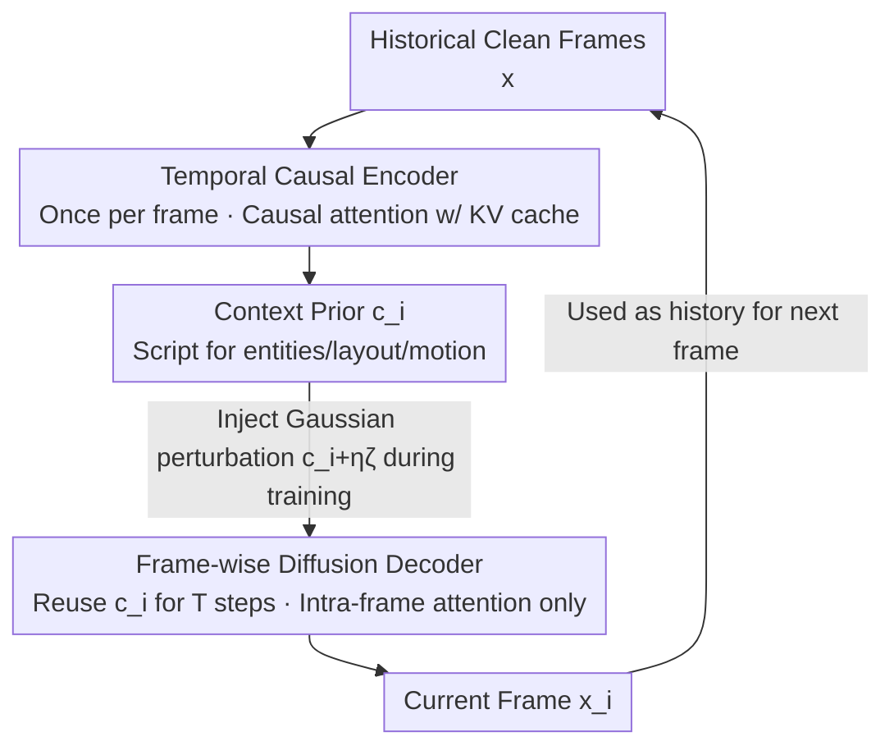

# Causality in Video Diffusers is Separable from Denoising

**Conference**: CVPR 2026  
**Paper**: [CVF Open Access](https://openaccess.thecvf.com/content/CVPR2026/html/Bai_Causality_in_Video_Diffusers_is_Separable_from_Denoising_CVPR_2026_paper.html)  
**Code**: None  
**Area**: Video Generation / Diffusion Models  
**Keywords**: Autoregressive Video Diffusion, Causal Attention, Temporal Reasoning Decoupling, Encoder-Decoder, Inference Acceleration

## TL;DR
The authors discover through probing experiments that "temporal causal reasoning" and "step-wise denoising" in autoregressive video diffusion models are separable. Shallow layers exhibit high redundancy across denoising steps, while deep layers primarily perform intra-frame rendering. Based on this, the SCD architecture is proposed: a causal Transformer encoder performing temporal reasoning once per frame, and a lightweight frame-wise diffusion decoder for multi-step rendering. This reduces per-frame latency by 2–4$\times$ while maintaining generation quality.

## Background & Motivation

**Background**: To enable autoregressive (AR) generation and real-time streaming of long videos in diffusion models, the mainstream approach replaces bidirectional attention with "causal attention"—bidirectional within frames and looking only at the past across frames (leveraging LLM paradigms). This ensures each frame depends only on historical frames and can be accelerated using KV cache.

**Limitations of Prior Work**: This approach "directly transplants" causal attention from LLMs, ignoring a key difference: **diffusion models require multi-step iterative refinement for each frame, rather than a single-pass generation**. Consequently, causal attention is applied across **all denoising steps $\times$ all layers $\times$ the entire context**. Every token must redundantly recalculate intra-frame and cross-frame attention at every step and layer.

**Key Challenge**: Temporal reasoning (determining what entities, layouts, and motions should appear in a frame) is inherently a "think once" task, but it is tightly coupled with the multi-step "iterative denoising" process. A natural question arises: **Does multi-step refinement truly require repeated temporal reasoning?** If temporal reasoning is essentially finalized in the early steps, recalculating cross-frame attention for dozens of subsequent steps is pure waste.

**Goal**: (1) Use probing experiments to locate where "causal reasoning" occurs in the network; (2) Design an efficient architecture that decouples reasoning from denoising if they are indeed separable.

**Key Insight**: The authors perform layer-wise and step-wise activation and attention visualization on a functional AR video diffuser (WAN-2.1 T2V-1.3B converted to frame-wise AR) to identify redundancy and sparsity.

**Core Idea**: Decouple "once-per-frame temporal causal reasoning" from "multi-step frame-wise rendering." The former is handled by a causal encoder to produce a context prior $c_i$, while the latter is handled by a lightweight diffusion decoder that reuses this prior for multi-step denoising.

## Method

The proposed method consists of two parts: **two probing findings** (§4, forming the empirical foundation) and the resulting **SCD architecture** (§5). Since the discoveries correspond directly to the SCD components, the findings are explained first.

### Overall Architecture

Standard causal diffusion factors the joint distribution over time: $p_\theta(x_{1:N}\mid a_{1:N})=\prod_{i=1}^{N}p_\theta\!\big(x_i\mid C_i=(x_{<i},a_{\le i})\big)$, where each conditional probability is implemented by a diffusion renderer that queries context $C_i$ throughout the denoising trajectory. The loss integrates over denoising time $t\in[0,1]$: $L(\theta)=\mathbb{E}_{x,i,t,\epsilon}\big[w(t)\,\|u(x_i^t,t\mid x_i)-v_\theta(x_i^t,t,C_i)\|^2\big]$. Thus, causal reasoning is distributed across every step and layer of the reverse trajectory, causing redundancy.

SCD splits this into a clear two-stage pipeline: **Historical Frames $\to$ Causal Encoder (runs once per frame) $\to$ Context Prior $c_i \to$ Frame-wise Diffusion Decoder (runs $T$ denoising steps per frame, reusing $c_i$) $\to$ Current Frame**. Intuitively, $c_i$ encodes the "script" for the next frame (entities, layout, motion); the decoder uses this fixed script to render the current frame from Gaussian noise without further cross-frame computation. This follows the LLM next-token prediction paradigm, but with next-frame prediction followed by continuous rendering.

### Key Designs

**1. Probing Findings: High Redundancy Across Steps in Shallow Layers, Sparse Cross-frame Attention in Deep Layers**

This is the empirical foundation. Using fixed prompts/seeds, the authors captured layer-wise and step-wise activations of WAN-2.1. First, **redundancy across denoising steps**: for the same frame across 50 denoising steps, the cosine similarity of middle-layer features (e.g., layer 15 of 30) remains consistently above 0.95. PCA visualizations show that the first step's principal components already capture global shapes, poses, and details, suggesting that content and motion are **essentially established in a single step**, with subsequent steps merely refining low-level pixels. Second, **deep cross-frame sparsity**: analyzing attention weights assigned to historical frames reveals that deeper layers assign less weight to the past, performing mostly intra-frame refinement—even though the model was trained with dense causal masks.

Two "subtraction surgeries" validated these findings: (a) Skipping layers 8–22 after initial denoising steps maintained video quality and motion, showing these layers do not shift the generation manifold. (b) Replacing the frame-causal mask with a frame-diagonal mask (cutting context access) in the last 5 layers required only 5K steps of fine-tuning to recover baseline quality.

**2. Temporal Causal Encoder: Moving "Once-per-frame" Reasoning Out of the Denoising Loop**

Addressing finding one (step-wise redundancy), the encoder $E_\phi$ is a causal Transformer that **runs once per frame outside the diffusion loop**. It performs causal attention on history (stored as KV cache) to produce a compact context $c_i=\mathrm{Encoder}(x_{<i},a_{\le i})$. $c_i$ is a sequence of latent tokens with the same spatial dimensions as the frame tokens ($H/p \times W/p$), carrying the "expected script" for the next frame. Within the encoder, intra-frame tokens use bidirectional attention, while cross-frame tokens use causal attention. This $c_i$ is **reused across all denoising steps** for that frame.

**3. Frame-wise Diffusion Decoder: Removing Cross-frame Dependencies**

Addressing finding two (deep sparsity), the decoder $D_\theta$ is a lightweight module that denoises current-frame tokens conditioned on a fixed $c_i$, predicting the velocity field $\hat{v}^t_i=\mathrm{Decoder}(x_i^t,t,c_i)$. Crucially, **$c_i$ and the noisy frame $x_i^t$ are fused via frame-wise concatenation along the sequence dimension**. The decoder performs only **intra-frame bidirectional self-attention**, as all historical information is already compressed into $c_i$. The amortized complexity per frame becomes $\underbrace{\mathcal{O}(E_\phi)}_{\text{Once per frame}}+\underbrace{T\cdot\mathcal{O}(D_\theta)}_{\text{Per denoising step}}$, where $\mathcal{O}(E_\phi) \gg \mathcal{O}(D_\theta)$.

**4. Context Perturbation: Robustifying the Decoupled Interface via Noise Injection**

Training uses clean history (Teacher Forcing), but inference uses generated, imperfect history, leading to exposure bias. SCD addresses this by **injecting Gaussian perturbation into the interface $c_i$**: $\tilde{c}_i=c_i+\eta\,\zeta,\ \zeta\sim\mathcal{N}(0,I)$. During training, this acts as data augmentation to reduce exposure bias; during inference, it can serve as a negative guidance signal. Unlike perturbing frame tokens, perturbing $c_i$ **requires no extra network passes**, making it highly efficient.

### Training Strategies

The encoder and decoder are **jointly trained end-to-end** using the next-frame prediction/Teacher Forcing paradigm. Two adaptation tricks for fine-tuning pre-trained T2V models: (1) Since standard T2V models expect a noisy current frame $x_i^t$ as input while the encoder sees the previous clean frame $x_{i-1}$, the authors feed the encoder high-noise (top 20%) current frames during training to align input distributions. (2) Layer partitioning: instead of a simple split, leave-one-out analysis showed the **first and last layers are most critical**. Thus, the first 25 layers of a 30-layer pre-trained model are designated as the causal encoder, while the first 5 + last 5 layers form the diffusion decoder (35 layers total). Small-step decoding is achieved via self-forcing distillation.

## Key Experimental Results

### Main Results: Training from Scratch (Small Datasets)

Evaluated on TECO–Minecraft 128$\times$128 and UCF-101 64$\times$64. Sec/F denotes wall-clock seconds per frame on a single H100:

| Dataset | Model | Sec/F↓ | LPIPS↓ | SSIM↑ | PSNR↑ | FVD↓ |
|--------|------|--------|--------|-------|-------|------|
| TECO-Minecraft | FAR-M-Long | 2.2 | 0.251 | 0.448 | 16.9 | 39 |
| TECO-Minecraft | Causal DiT-M | 2.4 | 0.196 | 0.512 | 18.9 | 38.7 |
| TECO-Minecraft | **SCD-M (Ours)** | **0.52** | 0.179 | 0.524 | 19.3 | 37.6 |
| UCF-101 | FAR-B | 3.2 | 0.037 | 0.818 | 25.64 | 194.1 |
| UCF-101 | Causal DiT-B | 3.9 | 0.038 | 0.827 | 25.85 | 187.6 |
| UCF-101 | **SCD-B (Ours)** | **1.1** | 0.038 | 0.824 | 25.78 | 174.7 |

SCD-M outperforms previous methods across all quality metrics on TECO while reducing latency by **>4$\times$**. SCD-B on UCF-101 achieves competitive or superior quality with a **>2$\times$** speedup.

### Main Results: Finetuning Pre-trained T2V (VBench, 1$\times$H100 80GB, bs=1)

| Model | #Params | Throughput(FPS)↑ | Latency(s)↓ | Total↑ | Quality↑ | Semantic↑ |
|------|---------|-----------|---------|--------|----------|-----------|
| Wan2.1 (Non-causal) | 1.3B | 0.78 | 103 | 84.26 | 85.30 | 80.09 |
| Pyramid Flow | 2B | 6.7 | 2.5 | 81.72 | 84.74 | 69.62 |
| Self Forcing | 1.3B | 8.9 | 0.45 | 84.26 | 85.25 | 80.30 |
| **SCD (Ours)** | 1.6B | **11.1** | **0.29** | 84.03 | 85.14 | 79.60 |

SCD is ~1.3$\times$ faster than the frame-wise Self Forcing baseline and has ~35% lower latency, while maintaining comparable VBench scores. It is **>10$\times$** faster than the non-causal Wan2.1 model.

### Ablation Study

- **Deepening the encoder (E) is nearly free**: Since the encoder runs once per frame, adding layers significantly improves quality with negligible latency impact. In contrast, deepening the decoder (D) is expensive as it scales with the number of denoising steps $T$.
- **Compute reallocation drives speedup**: Amortizing reasoning into a single-pass encoder signficantly speeds up training and inference. SCD is 20% more efficient than Self Forcing in rollout distillation.
- **Separation is not perfect**: Mid-layer feature similarity drops to ~0.8 in the final 10 denoising steps, meaning a single causal pass cannot perfectly replace dynamic evolution. Deep layers also retain minimal cross-frame attention. These residual couplings explain the slight quality gap at higher resolutions compared to full causal baselines.

## Highlights & Insights
- **Evidence-led architecture**: The design is not arbitrary but directly corresponds to quantified redundancy and sparsity found through probing and layer-stripping experiments.
- **Decoupling dividends**: The explicit interface $c_i$ allows for efficient context perturbation (noise injection) that serves as both training augmentation and inference guidance without extra forward passes.
- **Asymmetric capacity**: The finding that "deeper encoders are cheap, deeper decoders are expensive" suggests that in decoupled diffusion, capacity should be prioritized on the "once-per-frame" side.
- **Strategic layer partitioning**: Leave-one-out analysis identified that the earliest and latest layers are most vital for the decoder, providing a practical engineering heuristic for modularizing pre-trained models.

## Limitations & Future Work
- Approximation errors: The decrease in step-wise similarity at the end of trajectories and residual deep cross-frame attention lead to a slight semantic alignment gap (VBench Semantic 79.60 vs 80.30).
- Architectural mismatch: Fine-tuning monolithic T2V models into a decoupled structure involves inherent gaps. Future work may explore more complex architectures to bridge these dependencies while maintaining efficiency.
- Potential: Exploring scaling laws for next-frame denoising encoders and integrating SCD into rollout training frameworks or different latent spaces.

## Related Work & Insights
- **vs Self Forcing / Full Causal AR (Causal-DiT, FAR)**: These apply dense causal attention at every step and layer, coupling reasoning with denoising. SCD's amortized reasoning achieves 2–4$\times$ speedups, making it better suited for rollout training.
- **vs AR-Diffusion Hybrids (MarDini, VideoMAR)**: While these also use AR modules for context, SCD is grounded in empirical separability proof, uses frame-wise concatenation, and cut cross-frame attention in the decoder.
- **vs 3D Attention Sparsity**: SCD extends the idea of spatial-temporal decomposition to the autoregressive causal video diffusion setting.

## Rating
- Novelty: ⭐⭐⭐⭐⭐ The observation that causal reasoning is separable from denoising is clean, somewhat counter-intuitive, and well-supported by experiments.
- Experimental Thoroughness: ⭐⭐⭐⭐ Covers various settings and datasets; however, many critical ablations are relegated to the appendix.
- Writing Quality: ⭐⭐⭐⭐⭐ Logical flow from discovery to architectural validation is exceptional.
- Value: ⭐⭐⭐⭐⭐ Directly addresses latency bottlenecks for real-time/streaming video generation, providing significant speedups without quality loss.

<!-- RELATED:START -->

## Related Papers

- [\[CVPR 2026\] Accelerating Diffusion-based Video Editing via Heterogeneous Caching: Beyond Full Computing at Sampled Denoising Timestep](accelerating_diffusion-based_video_editing_via_heterogeneous_caching_beyond_full.md)
- [\[CVPR 2026\] Accelerating Autoregressive Video Diffusion via History-Guided Cache and Residual Correction](accelerating_autoregressive_video_diffusion_via_history-guided_cache_and_residua.md)
- [\[CVPR 2026\] RAPID: Reusing Attention Sparsity with Inter-step Adaptation for Efficient Video Diffusion](rapid_reusing_attention_sparsity_with_inter-step_adaptation_for_efficient_video_.md)
- [\[CVPR 2026\] Video-as-Answer: Predict and Generate Next Video Event with Joint-GRPO](video-as-answer_predict_and_generate_next_video_event_with_joint-grpo.md)
- [\[CVPR 2026\] PhysVid: Physics Aware Local Conditioning for Generative Video](physvid_physics_aware_local_conditioning_for_generative_video_models.md)

<!-- RELATED:END -->
