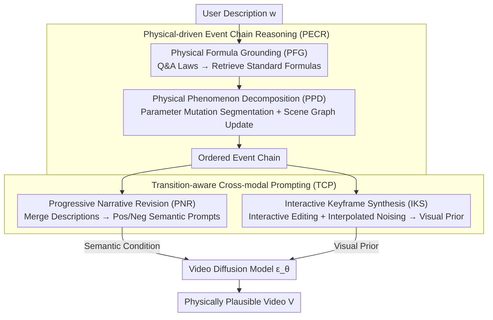

# Chain of Event-Centric Causal Thought for Physically Plausible Video Generation

**Conference**: CVPR 2026  
**arXiv**: [2603.09094](https://arxiv.org/abs/2603.09094)  
**Code**: Coming soon  
**Area**: Video Generation  
**Keywords**: Physically plausible video generation, causal reasoning, event chain, cross-modal prompting, Chain-of-Thought

## TL;DR

Models physically plausible video generation (PPVG) as a sequence of causally connected events. It decomposes complex physical phenomena into ordered event chains driven by physical formulas through physical-driven event chain reasoning, then generates semantic-visual dual conditions through transition-aware cross-modal prompting to guide video diffusion models in generating videos that follow causal evolution.

## Background & Motivation

Physically plausible video generation (PPVG) aims to ensure that generated videos follow real-world physical laws, with broad applications in film production, autonomous driving, and embodied intelligence. Current challenges include:

1.  **Lack of common-sense reasoning in video diffusion models**: Models like Kling and Sora can generate realistic scenes, but short prompts fail to convey detailed physical laws, and the models cannot implicitly infer physical common sense.
2.  **Limitations of prior PPVG work**: Methods like PhyT2V and DiffPhy use LLMs to embed physical concepts into prompts but typically **simplify physical phenomena into static descriptions** of a single moment, lacking modeling of the causal evolution process.
3.  **Key Challenge**:
    - **Causal Ambiguity**: Real-world physical phenomena unfold as causally ordered event units; simple semantic labels fail to capture their dynamic essence, necessitating structured causal decomposition.
    - **Insufficient physical consistency constraints**: Language alone cannot convey the causal continuity between events. Visual cues (e.g., reference videos) provide transitional evidence, but visual priors closely aligned with specific physical phenomena are difficult to acquire.

**Key Insight**: Treat physical phenomena as **sequences of causally connected and dynamically evolving events**, rather than static descriptions of a single scene.

## Method

### Overall Architecture

This paper addresses the issue that video diffusion models "do not understand physics"—given a short prompt, they generate realistic-looking videos that violate the physical laws of causal evolution. The **Mechanism** is to view a physical phenomenon as a **causally connected, gradually evolving sequence of events**. The entire framework $\Gamma: w \rightarrow \mathbf{V}$ is a training-free, two-stage process: first, PECR (Physical-driven Event Chain Reasoning) decomposes the complex phenomenon in the user description into an ordered set of events (PFG grounds common sense to standard formulas, while PPD segments events based on parameter mutations). Then, TCP (Transition-aware Cross-modal Prompting) translates this event chain into semantic and visual dual conditions that evolve with the physical process (PNR generates semantic prompts via progressive narrative revision, while IKS produces visual priors through interactive keyframe synthesis), which are fed into the video diffusion model $\mathbf{Z}_{\tau_z-1} = \epsilon_\theta(\mathbf{Z}_{\tau_z}; \mathbf{W})$ (where $\mathbf{Z}_{\tau_z}$ is the visual prior and $\mathbf{W}$ is the semantic embedding).

### Key Designs

**1. Physical Formula Grounding: Anchoring vague common sense to standard formulas**

Pure linguistic reasoning often leads to causal ambiguity regarding physical laws. Ours first identifies which physical law $\mathcal{L}$ (Newtonian mechanics, thermodynamics, etc.) governs the phenomenon through Q&A, infers the formula name $\mathcal{N}_\mathcal{L}$, and retrieves the specific formula from a knowledge base: $\mathcal{F}^* = \text{TopK}_{f \in \mathcal{F}_\mathcal{L}} P(f | \mathcal{N}_\mathcal{L}, \mathcal{L})$. This step elevates physical common sense from "vague semantic reasoning" to "quantitative analysis based on standard formulas," providing a calculable basis for event decomposition.

**2. Physical Phenomenon Decomposition: Segmenting event boundaries via parameter mutations**

With the formula, the phenomenon can be segmented into an ordered sequence of events $\{\mathcal{E}_t\}_{t=1}^T = \{\{\mathcal{C}_t\}, \{\mathcal{G}_t\}\}$, where each event carries physical conditions $\mathcal{C}_t$ and a dynamic scene graph $\mathcal{G}_t$. Boundaries are triggered by significant changes in physical parameters: $\mathcal{C}_t = \{(\mathbf{P}_t, \mathcal{F}^*(\mathbf{P}_t)) | \|\mathbf{P}_t - \mathbf{P}_{t-1}\| > \tau_p\}$. The scene graph is updated accordingly $\mathcal{G}_t = \Phi(\mathcal{G}_{t-1}, \mathcal{C}_t)$, recording appearance/semantic changes of nodes and interaction changes of edges. Physical continuity checks are performed between adjacent events.

**3. Progressive Narrative Revision (PNR): Synthesizing discrete events into continuous semantic prompts**

The TCP module translates the event chain into conditions usable by the diffusion model. PNR handles the semantic path. Since language alone cannot fully convey causal continuity, PNR performs minimal progressive revisions based on the preceding context: $w_t = \text{LLM}(w_{t-1} + \Delta(w_{t-1}, \mathcal{C}_t, \mathcal{G}_t))$. It then merges multiple descriptions using semantic condensation and causal conjunctions to form a positive semantic prompt and its negative counterpart. Physical conditions constrain allowed transitions (e.g., temperature rise allows "melting" but excludes "freezing"), and scene graphs ensure object identity consistency.

**4. Interactive Keyframe Synthesis (IKS): Injecting physics-aware visual priors into the diffusion process**

The IKS path of TCP synthesizes exclusive keyframes for each event. It performs interactive image editing $v_t = \text{Edit}(v_{t-1}; \mathcal{O}_t)$, where the operator $\mathcal{O}_t$ is determined by continuous physical parameter changes. Intermediate frames are generated via VAE encoding and linear interpolation $\mathbf{z}_{0,t} = \text{INTERP}(\psi_{\text{img}}(v_{t-1}), \psi_{\text{img}}(v_t); d_t)$, then noised to replace original noise as a denoising prior. This anchors cross-frame dynamics and ensures visual evolution follows physics.

### Loss & Training

This framework is a **training-free** inference-time method:
- Foundation Model: CogVideoX 5B, 161 frames, 1360×768 resolution
- Linguistic Reasoning: GPT-OSS-20B
- Keyframe Generation: Qwen-Image series (Edit model)
- Event Count: Determined as 4 through experiments (balancing temporal supervision and keyframe stability).

## Key Experimental Results

### Main Results - PhyGenBench

| Method | Mechanics | Optics | Thermal | Material | Average↑ |
|:---|:---:|:---:|:---:|:---:|:---:|
| CogVideoX-5B | 0.39 | 0.55 | 0.40 | 0.42 | 0.45 |
| + PhyT2V | 0.45 | 0.55 | 0.43 | 0.53 | 0.50 |
| + PhysHPO (Prev. SOTA) | 0.55 | 0.68 | 0.50 | 0.65 | 0.61 |
| **+ Ours** | **0.67** | **0.72** | **0.65** | **0.60** | **0.66** |

Overall performance on PhyGenBench reached 0.66, exceeding the Prev. SOTA PhysHPO by 8.19%.

Phenomenon Detection (PD) / Physical Order (PO) breakdown:

| Method | Mech PD/PO | Opt PD/PO | Therm PD/PO | Mat PD/PO |
|:---|:---:|:---:|:---:|:---:|
| DiffPhy | 0.73/0.53 | 0.83/0.66 | 0.70/0.58 | 0.73/0.43 |
| **Ours** | **0.79/0.79** | **0.84/0.85** | **0.78/0.69** | **0.75/0.58** |

The Gain in Physical Order (PO) is particularly significant, validating the effectiveness of causal event chain modeling.

### Ablation Study

| Variant | Mechanics | Optics | Thermal | Material | Average |
|:---|:---:|:---:|:---:|:---:|:---:|
| Full Method | 0.67 | 0.72 | 0.65 | 0.60 | 0.66 |
| w/o PFG (Formula Grounding) | 0.63 | 0.69 | 0.61 | 0.53 | 0.62 |
| w/o PPD (Phenom. Decomposition)| 0.58 | 0.67 | 0.61 | 0.52 | 0.59 |
| w/o PNR (Narrative Revision) | 0.65 | 0.70 | 0.64 | 0.56 | 0.64 |
| w/o IKS (Keyframe Synthesis) | 0.50 | 0.64 | 0.58 | 0.48 | 0.55 |

### Key Findings

1.  **IKS contributes most (-17%)**: Explicitly generating exclusive keyframes is crucial for anchoring cross-frame dynamics and maintaining physics-based visual evolution.
2.  **PPD contribution is significant (-11%)**: Decomposing complex processes into logically ordered event chains is indispensable for generating authentic physical evolutions.
3.  **PFG is equally important (-6%)**: Standard physical formulas provide the basis for a quantitative understanding of physical laws.
4.  **Optimal event count is 4**: Too few (1-3) provide weak temporal supervision; too many (5-6) accumulate errors during keyframe editing propagation.
5.  **Leading on VideoPhy**: Achieved an overall SA=1, PC=1 score of 49.3%, surpassing the Prev. SOTA by approximately 3.4%.

## Highlights & Insights

- **Novelty**: Shifts the paradigm from "static description of a single moment" to "causally connected event sequences," fundamentally changing the modeling of the PPVG problem.
- **Physical Formula Grounding** embeds deterministic physical constraints within CoT reasoning, resolving causal ambiguity inherent in pure linguistic reasoning.
- **Dual-modal collaborative prompting** (semantic + visual) constrains physical transition continuity better than language prompts alone.
- The framework is decoupled from the video generation model, allowing plug-and-play application to various video diffusion models.

## Limitations & Future Work

- **Failure in composite physical laws**: When a scene is governed by multiple physical laws simultaneously, the base model's insufficient composite reasoning leads to generation failure.
- Dependence on external LLMs (GPT-OSS-20B) and image editing models (Qwen-Image-Edit) results in high pipeline complexity.
- Error accumulation occurs during keyframe propagation via editing, limiting the number of supportable events.
- Physical parameter thresholds $\tau_p$ and event counts require manual tuning.
- Evaluation metrics (PCA) themselves depend on LLMs, which may introduce evaluation bias.

## Related Work & Insights

- **DiffPhy/PhyT2V**: Enhances generation via physics-aware prompts but lacks causal modeling and simplifies phenomena into single scenes.
- **PhysHPO**: Hierarchical fine-grained preference optimization; Prev. SOTA but still lacks event sequence modeling.
- **Z-Sampling/Visual-CoG**: Embeds CoT reasoning into visual generation but primarily focuses on semantic and spatial reasoning, ignoring physical causality.
- **Insight**: The strategy of Event Chain + Physical Formula Grounding can be generalized to other video generation tasks requiring causal reasoning (e.g., long-video narration, simulation).

## Rating

- **Novelty**: 8/10 — The combination of event chain modeling and physical formula grounding is novel with a clear problem definition.
- **Experimental Thoroughness**: 8/10 — Comprehensively validated on two benchmarks with complete ablations, though lacks user studies.
- **Writing Quality**: 8/10 — Clear structure with detailed modular design descriptions.
- **Value**: 7/10 — The inference pipeline is heavy, potentially limiting practical deployment, but it provides a significant research direction for PPVG.

<!-- RELATED:START -->

## Related Papers

- [\[CVPR 2026\] VideoRealBench: A Chain-of-Thought Realism Evaluation Benchmark for Generated Human-Centric Videos](videorealbench_a_chain-of-thought_realism_evaluation_benchmark_for_generated_hum.md)
- [\[CVPR 2026\] DynamicsBoost: Dynamic Plausible Video Generation via Annotation-Free Continuation Preference Optimization](dynamicsboost_dynamic_plausible_video_generation_via_annotation-free_continuatio.md)
- [\[CVPR 2026\] Physical Object Understanding with a Physically Controllable World Model](physical_object_understanding_with_a_physically_controllable_world_model.md)
- [\[CVPR 2026\] HandWorld: Hand-Centric Unified Video Action Generation](handworld_hand-centric_unified_video_action_generation.md)
- [\[CVPR 2026\] SwitchCraft: Training-Free Multi-Event Video Generation with Attention Controls](switchcraft_training-free_multi-event_video_generation_with_attention_controls.md)

<!-- RELATED:END -->
