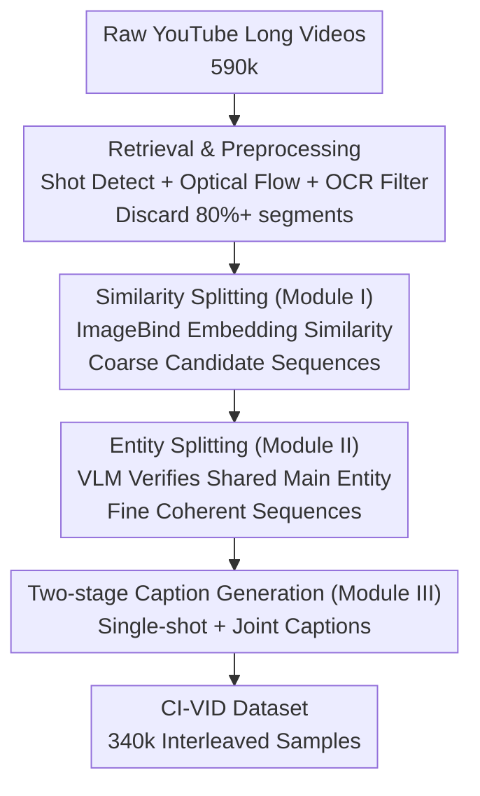

# CI-VID: A Coherent Interleaved Text-Video Dataset

**Conference**: CVPR 2026  
**Paper**: [CVF Open Access](https://openaccess.thecvf.com/content/CVPR2026/html/Ju_CI-VID_A_Coherent_Interleaved_Text-Video_Dataset_CVPR_2026_paper.html)  
**Code**: https://github.com/ymju-BAAI/CI-VID  
**Area**: Video Generation  
**Keywords**: Text-video dataset, multi-shot video generation, interleaved text-video, data construction pipeline, T&V2V

## TL;DR
CI-VID constructs an "interleaved text-video" dataset of 340,000 samples—each sample is a semantically coherent multi-shot video sequence paired with interleaved captions that describe both individual shots and the "continuation/change" between adjacent shots. This allows models to transition from "isolated text → video" to "text + preceding video → subsequent video," enabling the generation of multi-shot videos with storytelling, smooth transitions, and consistent characters and styles.

## Background & Motivation
**Background**: Text-to-video (T2V) generation has advanced rapidly through models like Sora, CogVideoX, and Emu3. Training these models relies heavily on high-quality text-video datasets, leading to resources such as OpenVid-1M, InternVid, Panda-70M, Koala-36M, and ShareGPT4Video.

**Limitations of Prior Work**: Existing public datasets consist almost entirely of "isolated text–video pairs"—videos are split at shot boundaries, and each shot is annotated with an independent caption, one-to-one and disconnected. However, real-world videos (tutorials, movies, news, stories) are rarely single-shot and are instead composed of multiple semantically connected shots forming a complete scene.

**Key Challenge**: The one-to-one pairing paradigm has two fundamental flaws. First, models trained only on isolated pairs fail to maintain character, visual style, and scene transition consistency when generating multi-shot videos, as the training data lacks supervision for inter-clip transitions. Second, it does not support "text + video → video" (T&V2V) extrapolation: video continuation using only preceding frames as conditions often leads to repetitive content and uncontrollable semantics. A structure that incorporates preceding video segments as conditions is required.

**Goal**: To create a dataset that explicitly models "inter-clip relationships," enabling models to learn both T2V and T&V2V, thereby supporting complex tasks beyond single shots, such as story generation and video continuation.

**Key Insight**: This work draws on the success of "interleaved data" in the image-text domain—Flamingo, KOSMOS-1, and others proved that training on interleaved data is more effective than on isolated pairs, with resources like MMC4, OBELICS, and CoMM scaling this approach. This path remains largely unexplored in video generation.

**Core Idea**: The "interleaved" paradigm is introduced to video generation for the first time. Using a two-stage "similarity splitting + entity splitting" pipeline, "semantically coherent but visually diverse" multi-shot sequences are filtered from raw long videos. Interleaved single-shot captions and "continuation/change" joint captions for adjacent shots are then generated, resulting in CI-VID, the first large-scale interleaved text-video dataset.

## Method
CI-VID is a dataset paper where the core method lies in the automated construction of coherent and diverse multi-shot sequences with structured interleaved captions from noisy raw YouTube videos. The pipeline consists of three steps: Similarity Splitting (Module I) for candidate sequences, Entity Splitting (Module II) via VLM for semantic coherence, and Two-stage Caption Generation (Module III) using GPT-4o.

### Overall Architecture
The input consists of 590,000 raw long videos from 4,068 curated YouTube channels; the output is 340,000 interleaved text-video samples. Each sample includes a semantically coherent sequence of shots plus interleaved "single-shot captions (orange)" and "joint captions (green)." The core challenge is that simply taking consecutive shots cannot simultaneously satisfy "semantic coherence" and "visual diversity"—consecutive shots are often redundant repetitions of the same frame (lacking diversity) or span abrupt scene cuts (lacking coherence). Thus, both similarity and entity filtering are required.

### Key Designs

**1. Retrieval and Strict Preprocessing: High Quality at the Source**

To avoid "dirty" sources, CI-VID does not reuse second-hand slices like Panda-70M. Instead, raw videos are retrieved, and quality control starts at the channel level. 4,068 high-quality channels were manually selected by 6 annotators based on resolution, color fidelity, and motion (with daily expert checks ensuring >80% consistency). Raw videos were split into shots using PySceneDetect (strict threshold of 3). Segments >10s were split, and <1s were discarded. Optical flow was calculated every 0.5s; clips with normalized flow <70 (weak motion) were discarded. PaddleOCR served to discard frames with >10% text coverage. This aggressive filtering removed >80% of candidates, prioritizing quality over quantity.

**2. Module I Similarity Splitting: Coarse Splitting via Tiled Frame Embeddings**

This step organizes scattered clips into "scene-consistent" candidates. Adjacent segments' visual similarity is measured: if similarity < $T_l$, it is marked as a scene cut (red dashed line); if > $T_h$, it is discarded for lacking diversity (red X). Notably, rather than using single frames, 3 frames from each clip are tiled into one image for ImageBind embedding, as this captures richer temporal context. Thresholds are $(T_l, T_h)=(0.6, 0.8)$. A **distance constraint** is also applied: adjacent clips must have an original video index difference ≤3 to prevent semantic drift.

**3. Module II Entity Splitting: VLM Verification of "Shared Main Entities"**

Visual similarity does not guarantee semantic coherence. Module II uses VLM reasoning: it assumes that if all shots in a sequence share the same main entity, the sequence is likely coherent despite visual jumps. Using Qwen2.5-VL-72B-Instruct and GPT-4o, processing follows four steps: ① **Main Entity Extraction**—A 3×n grid of frames is fed to Qwen to identify a single main entity appearing in >60% of images; ② **Per-segment Entity Check**—Verification that the entity appears in at least one frame of each segment; ③ **Same-Person Verification**—Ensuring visually similar different people are not misidentified; ④ **Cross-Verification**—Re-checking with GPT-4o to mitigate single-model bias.

**4. Module III Two-stage Caption Generation: Detailing Shots and Relationships**

This step creates the "interleaved" structure. Two input methods are used: **sequential frame input** for fine-grained details (background, object features) and **joint frame input** (tiled grid) for high-level relationships (transitions, view changes). Single-shot captions are generated first (covering content, camera angle/movement, background), followed by joint captions for adjacent clips covering six dimensions: content/background continuation and change, and camera angle/movement change. The final sample follows the structure `[Shot Caption #1 → Video #1 + (Shot Caption #2, Joint Caption #1) → Video #2 → ...]`.

### Key Experimental Results
- **Scale**: 341,550 samples from 63,807 raw videos, containing ~1 million T–V pairs.
- **Quality**: 98%+ at 1080p or higher. Average shot length is 4.7s.
- **Text Length**: Structured captions average >200 words; interleaved samples average 1,071.6 words.
- **Sequence Length**: Average 3.1 shots per sample, with 30%+ containing 4+ shots.

## Results
Ours (a 0.6B parameter NOVA model fine-tuned on CI-VID) was compared against a baseline (Emu3 pre-trained weights) using a 1,000-prompt test set derived from VBench.

### Main Results

Human evaluation (pairwise comparison, 3 annotators, 91% agreement):

| Metric | Win | Tie | Loss |
|------|-----|-----|------|
| Consistency | 90.0% | 6.5% | 3.6% |
| Narrativity | 80.9% | 15.0% | 4.1% |
| Correctness | 78.3% | 9.8% | 11.9% |

VLM evaluation (Qwen2.5-VL-72B-Instruct, 0–5 scale):

| Dimension | Baseline | +CI-VID |
|------|----------|---------|
| Style Consistency | 2.93 | 3.83 |
| Entity Consistency | 2.84 | 3.73 |
| Background Consistency | 2.80 | 3.75 |
| Perspective Transition | 3.02 | 3.81 |
| Prompt Alignment | 3.99 | 4.07 |
| Visual Rationality | 3.25 | 3.62 |

### Key Findings
- **Coherence improvements are most significant**: Inter-clip coherence metrics (style, entity, background, transition) jumped from 2.8–3.0 to 3.7–3.8, while prompt alignment remained stable. This confirms CI-VID enhances multi-shot coherence without sacrificing visual quality or fidelity.
- **90% Win rate in human consistency checks**: This highlights the value of joint captions in modeling inter-clip relationships, filling the gap left by isolated datasets.
- **Entity-level similarity gains exceed overall gains**: SSIM for entities rose from 0.278 to 0.391, validating the "shared main entity" design in Module II.

## Highlights & Insights
- **Interleaved Paradigm Transition**: Systematically migrates the successful interleaved data paradigm from image-text to video generation, enabling T&V2V.
- **Shared Entity as a Proxy**: Uses VLM-verified entity consistency as a computational proxy for semantic coherence, successfully filtering "similar but disconnected" cases.
- **Tiling Trick**: Observing that tiling multiple frames into one image for ImageBind/VLM processing captures temporal and scene relationships better than single keyframes.
- **Input Modality Synergy**: Using sequential frames for details and joint tiled frames for relationships maximizes VLM capabilities for structured annotation.

## Limitations & Future Work
- **Short Sequence Length**: Average of 3.1 shots and 4.7s per shot is relatively short for long-range narrative tasks (e.g., movies).
- **Small Validation Model**: Evaluated on a 0.6B NOVA model; gains on larger SOTA models (e.g., 7B+) remain to be fully explored.
- **Closed-source Model Dependence**: Heavy reliance on GPT-4o and Qwen for construction may introduce model biases.
- **Source Bias**: YouTube-centric data, though diverse, may still carry platform-specific biases.

## Related Work & Insights
- **Comparison with OpenVid-1M/InternVid**: While these provide high-quality isolated pairs, CI-VID acts as a complement by explicitly modeling transitions through interleaved sequences.
- **Comparison with MMC4/OBELICS**: CI-VID is the first large-scale instance of the interleaved paradigm specifically for video generation.
- **Purely Visual Continuation**: Unlike traditional extrapolation using only frames, CI-VID enables controllable T&V2V using text as a primary guidance signal.

## Rating
- Novelty: ⭐⭐⭐⭐⭐
- Experimental Thoroughness: ⭐⭐⭐⭐
- Writing Quality: ⭐⭐⭐⭐
- Value: ⭐⭐⭐⭐⭐

<!-- RELATED:START -->

## Related Papers

- [\[CVPR 2026\] TV2TV: A Unified Framework for Interleaved Language and Video Generation](tv2tv_a_unified_framework_for_interleaved_language_and_video_generation.md)
- [\[CVPR 2026\] OneStory: Coherent Multi-Shot Video Generation with Adaptive Memory](onestory_coherent_multi-shot_video_generation_with_adaptive_memory.md)
- [\[CVPR 2026\] CamDirector: Towards Long-Term Coherent Video Trajectory Editing](camdirector_towards_long-term_coherent_video_trajectory_editing.md)
- [\[CVPR 2026\] Scaling Instruction-Based Video Editing with a High-Quality Synthetic Dataset](scaling_instruction-based_video_editing_with_a_high-quality_synthetic_dataset.md)
- [\[CVPR 2026\] SymphoMotion: Joint Control of Camera Motion and Object Dynamics for Coherent Video Generation](symphomotion_joint_control_of_camera_motion_and_object_dynamics_for_coherent_vid.md)

<!-- RELATED:END -->
