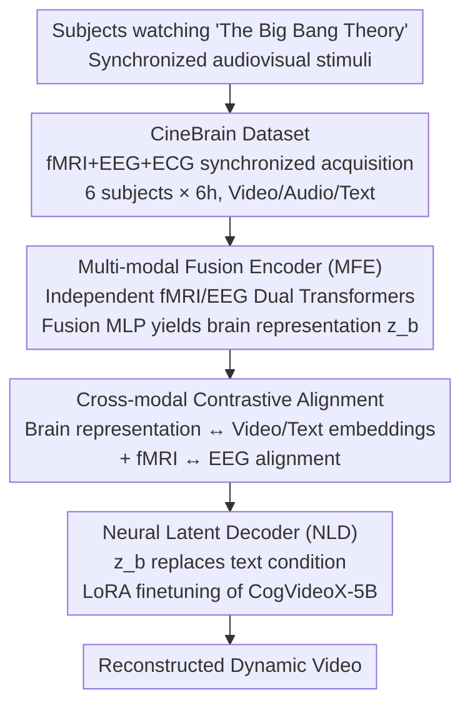

# CineBrain: A Large-Scale Multi-Modal Audiovisual Brain Dataset for Brain-Conditioned Video Generation

**Conference**: CVPR 2026  
**Paper**: [CVF Open Access](https://openaccess.thecvf.com/content/CVPR2026/html/Gao_CineBrain_A_Large-Scale_Multi-Modal_Audiovisual_Brain_Dataset_for_Brain-Conditioned_Video_CVPR_2026_paper.html)  
**Code**: https://jianxgao.github.io/CineBrain (Project Page)  
**Area**: Video Generation / Brain Signal Decoding  
**Keywords**: Brain Decoding, fMRI-EEG Fusion, Audiovisual Stimuli, Video Reconstruction, Multimodal Dataset  

## TL;DR
This paper constructs CineBrain, the first large-scale brain signal dataset with synchronized fMRI and EEG recorded under natural audiovisual conditions (watching *The Big Bang Theory*). It proposes the CineSync framework, which utilizes a dual-Transformer fusion encoder to align brain signals with visual/textual semantics, followed by a LoRA-finetuned video diffusion model to decode brain signals into dynamic videos. The method achieves SOTA performance in dynamic video reconstruction and reveals that auditory cortex activation enhances visual decoding precision.

## Background & Motivation

**Background**: Brain signal decoding (recovering images, videos, or 3D content from fMRI/EEG) has become a hot topic. A common approach is to treat neural signals as a prior to condition a generative model. However, most existing works reconstruct only **visual content** using a **single neural modality** (either fMRI or EEG) under **purely visual** stimuli.

**Limitations of Prior Work**: This setup overlooks two intrinsic characteristics of brain perception. First, the human brain naturally perceives the world **audiovisually**—sound strongly modulates visual processing (e.g., the McGurk effect, where conflicting audiovisual speech cues synthesize a third illusory perception). Ignoring auditory input misses half of the authentic perceptual experience. Second, fMRI and EEG are **complementary**: fMRI offers high spatial resolution (localization), while EEG provides high temporal resolution (millisecond-level dynamics). Relying on a single modality discards critical information.

**Key Challenge**: To study how "audition affects visual perception" and "how to fuse fMRI/EEG," there is a need for a dataset with **synchronized fMRI+EEG acquisition under natural dynamic audiovisual stimuli**—which did not exist previously (existing datasets are either fMRI-only or EEG-only, with mostly static or pure visual stimuli).

**Goal**: (1) Propose a new task: reconstructing continuous video from multimodal brain signals recorded under natural audiovisual stimuli; (2) Build a dataset to support this task; (3) Provide the first systematic framework for fusing fMRI+EEG for video reconstruction.

**Core Idea**: Use narrative long-form videos (*The Big Bang Theory*) as audiovisual stimuli to record fMRI and EEG simultaneously. First, investigate the optimal modality fusion strategy, then align fused brain representations with visual/textual semantics via contrastive learning, and finally feed these into a video diffusion model as conditions to "screen" brain activity into video.

## Method

The paper makes two main contributions: the **CineBrain Dataset** (acquisition protocol + tasks + statistics) and the **CineSync Framework** (decoding multimodal brain signals into video).

### Overall Architecture

The CineBrain acquisition logic involves 6 subjects watching *The Big Bang Theory* in a 3T MRI scanner (audiovisual synchronization) while using MRI-compatible headphones, an EEG cap, and recording ECG. This results in **synchronized** fMRI + EEG signal streams paired with video/audio stimuli and auto-generated text descriptions.

CineSync divides "brain signal $\rightarrow$ video" into two steps: The **Multi-modal Fusion Encoder (MFE)** uses two independent Transformers to encode fMRI and EEG, which are سپس combined via a fusion MLP into a unified brain representation $z_b$. During training, contrastive loss anchors the brain representation to video/text embeddings for semantic alignment. The **Neural Latent Decoder (NLD)** employs a pre-trained video diffusion model (CogVideoX-5B), replacing its original "text condition" with the brain representation $z_b$, and finetunes the DiT blocks via LoRA to generate video from brain signals.

### Key Designs

**1. CineBrain Dataset: First fMRI–EEG Synchronized Natural Audiovisual Brain Signal Library**

The bottleneck has been the lack of data for studying auditory modulation of vision or fMRI/EEG fusion. Starting from neurocinematics—where narrative content maintains attention and evokes complex dynamics—the authors chose 6 episodes (~6 hours) of *The Big Bang Theory*. 6 subjects (2M/4F, ages 21–26) watched inside a 3T MRI. Protocol: fMRI used gradient-echo EPI, whole-brain 2mm isotropic, TR=800ms; EEG used an MRI-compatible 64-channel cap at 1000Hz. fMRIPrep was used for preprocessing, and notably, **auditory ROIs were included** (8405 visual voxels, 10541 auditory voxels), unlike prior work that only used visual ROIs. EEG was processed with band-pass (0.1–30Hz), notch filters, and QRS/ICA for artifact removal. Video was segmented into 4s clips (33 frames), totaling 5400 clips per subject (4860 train / 540 test), with text descriptions generated by Qwen2.5-VL and Whisper-large-v3.

**2. Multi-modal Fusion Encoder (MFE): Proving "Separate Encoding > Early Fusion"**

Authors compared five fusion architectures: (a) Joint Transformer (concatenation), (b) Two-Stage Fusion, (c) Cross-Attention Fusion, (d) Spatial Concatenation, and (e) Dual Transformer Fusion (independent encoding). (e) performed significantly better (FVD 51.53 vs. others >100). This revealed a key finding: **Representational differences between fMRI and EEG are vast; early shared self-attention is harmful.** Consequently, MFE uses dual Transformers to produce brain representation $z_b = \psi(z_f, z_e)$. Ablations also found that keeping total tokens fixed but **increasing the EEG token count** improved reconstruction, highlighting EEG's role in capturing rapid dynamics.

**3. Cross-modal Contrastive Alignment: Anchoring Brain Features to Visual+Text Semantics**

To prevent "drifting" during generation, MFE uses contrastive learning to align class tokens with pre-trained visual/textual embeddings (SigLIP). Given a video $V$ and caption $T$, fMRI and EEG tokens $c_f, c_e$ are aligned via $\mathcal{L}_{fv}, \mathcal{L}_{ft}, \mathcal{L}_{ev}, \mathcal{L}_{et}$, plus a cross-modality fMRI↔EEG term $\mathcal{L}_{fe}$. The total objective is:

$$\mathcal{L}_{c} = \mathcal{L}_{fv} + \mathcal{L}_{ft} + \mathcal{L}_{ev} + \mathcal{L}_{et} + \mathcal{L}_{fe}.$$

**4. Neural Latent Decoder (NLD): Adapting Video Diffusion via LoRA**

NLD adapts CogVideoX-5B by replacing the text condition with the aligned $z_b$. For training, videos are encoded into latent space $x_0 = \mathcal{E}(V)$. Standard forward diffusion adds noise $x_t$. The latent $x_t$ and brain feature $z_b$ are fed into the model. Only the attention and feed-forward layers of the DiT blocks are finetuned via LoRA (rank=64, $\alpha=64$) using the standard denoising loss:

$$\mathcal{L} = \mathbb{E}_{V,\epsilon,t}\left[\left\|\epsilon - \epsilon_\theta(x_t, z_b, t)\right\|^2\right].$$.

### Loss & Training
Two-stage objective: MFE stage uses multi-level contrastive loss $\mathcal{L}_c$; NLD stage uses diffusion denoising loss $\mathcal{L}$. Optimizer: AdamW (lr $1\times10^{-4}$). fMRI/EEG Transformers have 12 layers and a hidden dimension of 2048. Each sample consists of 4s multimodal signals.

## Key Experimental Results

### Main Results: Comparison with Baselines (Subject Average)

CineSync outperforms EEG2Video, GLFA, and NeuroClips across semantic and perceptual metrics. The CineSync⋆ variant (including auditory ROIs) shows further improvement.

| Method | 2-way(video)↑ | 50-way(video)↑ | FVD↓ | SSIM↑ | PSNR↑ |
|------|------|------|------|------|------|
| EEG2Video | 0.786 | 0.162 | 146.23 | 0.109 | 6.218 |
| GLFA | 0.801 | 0.167 | 128.76 | 0.123 | 7.526 |
| NeuroClips | 0.816 | 0.183 | 116.36 | 0.087 | 6.854 |
| CineSync-fMRI | 0.893 | 0.307 | 57.47 | 0.240 | 11.92 |
| **CineSync** | **0.909** | **0.319** | **52.78** | **0.262** | **11.99** |
| **CineSync⋆ (+Auditory ROI)** | **0.926** | **0.336** | **44.77** | **0.297** | **12.18** |

### Ablation Study: Fusion Architecture Comparison

Proves that "Dual Transformer Fusion" (Late Fusion) is significantly superior to early fusion.

| Encoder Architecture | 50-way↑ | FVD↓ | SSIM↑ | PSNR↑ |
|------|------|------|------|------|
| (a) Joint Transformer | 0.274 | 128.0 | 0.232 | 9.30 |
| (c) Cross-Attn Fusion | 0.292 | 110.0 | 0.249 | 9.90 |
| **(e) Dual Trans. Fusion** | **0.324** | **51.53** | 0.249 | **12.03** |

### Key Findings
- **Early Fusion is Harmful**: Large representational gaps between fMRI/EEG mean that early interaction via shared attention causes performance drops.
- **Auditory ROIs Aid Visual Decoding**: Adding auditory cortex voxels consistently improved video reconstruction metrics (FVD 52.78 $\rightarrow$ 44.77), providing neural foundation for auditory-visual modulation.
- **EEG Token Count Matters**: Increasing the temporal capacity of EEG (more tokens) is more effective than increasing feature dimensionality.
- **Fusion > Single Modality**: CineSync consistently beats fMRI-only or EEG-only variants, confirming spatial-temporal complementarity.

## Highlights & Insights
- **Architecture Search for Brain Data**: Rather than arbitrary selection, the authors verified that reducing early interactions between modalities is better for brain decoding.
- **Integrating Audition for Vision**: Elevating a dataset paper with a neuroscientific finding—that including auditory cortex activity improves visual reconstruction—adds significant value.
- **Plug-and-Play NLD**: Replacing text conditions with brain signals via LoRA makes the method transferable to future stronger video diffusion models.
- **Engineering Difficulty of Synchronization**: The successful simultaneous acquisition of fMRI and EEG under narrative stimuli is a high-value experimental paradigm.

## Limitations & Future Work
- **Small Subject Sample**: Only 6 subjects and one specific TV show; cross-subject/cross-content generalization remains unproven.
- **Semantic vs. Pixel Precision**: Quantitative metrics like PSNR (~12) indicate that reconstruction is more about semantic/dynamic accuracy rather than per-pixel fidelity.
- **Missing Ablation Details** ⚠️: Some contrastive alignment ablations are relegated to supplementary materials, making internal validation of components like $\mathcal{L}_{fe}$ difficult via the main text.
- **Mechanism of Auditory Boost**: It is unclear if auditory ROIs help because of actual visual-auditory integration or simply because "more voxels = more capacity."

## Related Work & Insights
- **Ours vs. Visual-only fMRI (NeuroClips, GLFA)**: These work on pure visual stimuli; this paper incorporates EEG and auditory stimuli, proving the benefit of the latter.
- **Ours vs. EEG-only (EEG2Video)**: CineSync-EEG beats EEG2Video, and the full model further leverages fMRI to provide the spatial resolution that EEG lacks.

## Rating
- Novelty: ⭐⭐⭐⭐⭐ First fMRI–EEG synchronized natural audiovisual dataset + systematic fusion framework.
- Experimental Thoroughness: ⭐⭐⭐⭐ Solid comparisons and architecture search, though limited subjects.
- Writing Quality: ⭐⭐⭐⭐ Clear motivation and logical flow from data to insight.
- Value: ⭐⭐⭐⭐⭐ Triple contribution of dataset, framework, and cognitive findings.

<!-- RELATED:START -->

## Related Papers

- [\[CVPR 2026\] SemVideo: Reconstructs What You Watch from Brain Activity via Hierarchical Semantic Guidance](semvideo_reconstructs_what_you_watch_from_brain_activity_via_hierarchical_semant.md)
- [\[CVPR 2026\] UnityVideo: Unified Multi-Modal Multi-Task Learning for Enhancing World-Aware Video Generation](unityvideo_unified_multi-modal_multi-task_learning_for_enhancing_world-aware_vid.md)
- [\[CVPR 2025\] HOIGen-1M: A Large-Scale Dataset for Human-Object Interaction Video Generation](../../CVPR2025/video_generation/hoigen-1m_a_large-scale_dataset_for_human-object_interaction_video_generation.md)
- [\[ICCV 2025\] DH-FaceVid-1K: A Large-Scale High-Quality Dataset for Face Video Generation](../../ICCV2025/video_generation/dh-facevid-1k_a_large-scale_high-quality_dataset_for_face_video_generation.md)
- [\[CVPR 2026\] MoVieDrive: Urban Scene Synthesis with Multi-Modal Multi-View Video Diffusion Transformer](moviedrive_urban_scene_synthesis_with_multi-modal_multi-view_video_diffusion_tra.md)

<!-- RELATED:END -->
