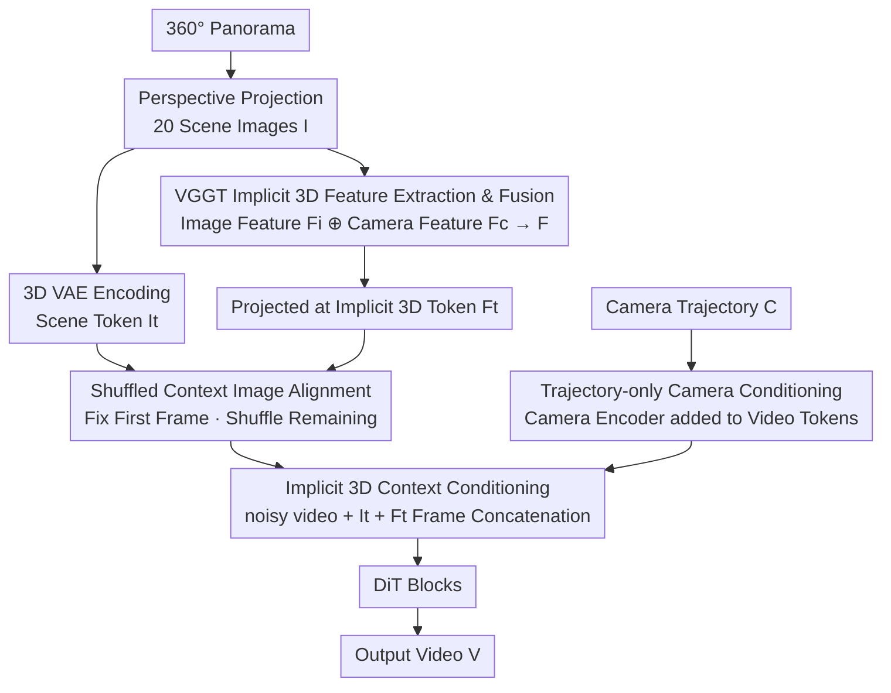

# CineScene: Implicit 3D as Effective Scene Representation for Cinematic Video Generation

**Conference**: CVPR 2026  
**Paper**: [CVF Open Access](https://openaccess.thecvf.com/content/CVPR2026/html/Huang_CineScene_Implicit_3D_as_Effective_Scene_Representation_for_Cinematic_Video_CVPR_2026_paper.html)  
**Code**: None (Project page only, not open-sourced)  
**Area**: Video Generation  
**Keywords**: Cinematic Video Generation, Implicit 3D, VGGT, Context Conditioning, Scene Consistency  

## TL;DR
Given a set of static scene images, a text prompt, and a user-specified camera trajectory, CineScene injects "implicit 3D features" extracted by VGGT as context conditions into a pre-trained T2V diffusion model. This enables the generation of scene-consistent cinematic videos with novel dynamic subjects under significant viewpoint changes, achieving SOTA in both scene consistency and camera precision.

## Background & Motivation

**Background**: Cinematic video production requires simultaneous control over "scene-subject composition" and "camera movement." However, physical set construction for real filming is costly and difficult to replicate. A natural demand arises to decouple the static scene from dynamic subjects—providing only a few scene images, "placing" a new subject within them, and filming according to a specified camera trajectory.

**Limitations of Prior Work**: Existing cinematic video generation methods face a fundamental trade-off between "generation flexibility" and "scene consistency." ① Pure 2D context methods (e.g., FramePack, Context-as-Memory) operate directly in image space; they are flexible but lack spatial understanding, causing **scene collapse during large viewpoint changes**. ② Explicit 3D methods (e.g., Gen3C using depth maps/point clouds) provide strong consistency constraints, but reconstructing accurate 3D/4D from sparse inputs is inherently difficult. Inaccurate geometric reconstruction degrades generation quality and increases inference time (Gen3C is approximately 10.17× slower than the proposed method).

**Key Challenge**: Achieving scene consistency requires 3D spatial understanding, but "explicit 3D geometric reconstruction" is both difficult and fragile. The challenge is obtaining 3D information **without explicit reconstruction**.

**Key Insight**: 3D foundation models like VGGT have demonstrated the ability to encode "3D-aware features" rich in spatial information directly from 2D images without explicit geometric reconstruction. Prior work, Geometry Forcing, used VGGT features to construct a supervisory **loss** to constrain the diffusion process. However, this loss is optimized for "static reconstruction," implicitly penalizing dynamic content and resulting in static scenes where new subjects cannot be introduced.

**Core Idea**: Convert the implicit 3D representation from a "supervisory loss" into "context conditioning" injected directly into the diffusion process. Condition injection naturally decouples the "static background (conditional input)" from the "dynamic foreground (generation target)," ensuring scene consistency while allowing for vivid dynamic subjects—a feat unattainable by loss-guided schemes.

## Method

### Overall Architecture

The input consists of a set of static scene images $I\in\mathbb{R}^{c\times h\times w}$, a prompt $P$, and a camera trajectory $C\in\mathbb{R}^{f\times3\times4}$. The output is a video $V\in\mathbb{R}^{f\times c\times h\times w}$ that contains dynamic subjects, follows the specified trajectory, and maintains consistency with $I$. The pipeline follows three steps: first, a panorama is projected into 20 perspective scene images, from which VGGT extracts implicit 3D features; second, the "scene image tokens," "implicit 3D tokens," and "noisy video tokens" are concatenated along the frame dimension as context conditions for the pre-trained T2V DiT. The camera trajectory is encoded and injected separately. During training, scene images are shuffled to force the model to learn implicit 3D rather than pixel-copying. The process **does not modify the T2V architecture**, performing condition concatenation before the transformer blocks.

### Key Designs

**1. Context Conditioning of Implicit 3D Scene Representation: Decoupling Static Background and Dynamic Foreground**

This is the core innovation addressing the "static-only" limitation of loss-guided schemes. Geometry Forcing treats VGGT features as supervisory signals to minimize the gap between "VGGT features" and "diffusion model latents." Since this objective is optimized for static reconstruction, it penalizes any deviation from the static scene, suppressing dynamic subjects and causing artifacts. CineScene instead concatenates the implicit 3D tokens $F_t$, scene image tokens $I_t$, and noisy video tokens along the **frame dimension** into a sequence for the DiT. This allows the conditions (static scene) and the generation target (dynamic content) to be jointly modeled in attention. This offers two advantages: first, condition injection structurally separates the static background (input) from the dynamic foreground (output); second, it aligns better with the diffusion paradigm—VGGT features serve as "guiding context" rather than an independent training objective.

**2. VGGT Implicit 3D Feature Extraction and Image-Camera Fusion: Integrating Spatial Layout and Viewpoint**

To enable the model to "understand" the 3D structure, 3D-aware representations are required. CineScene uses equirectangular-to-perspective projection to sample viewpoints every 18° from a 360° panorama, generating 20 perspective images $I$ with 90° FoV. The last layer features from the VGGT transformer backbone are extracted, which naturally decouple into image features $F_i\in\mathbb{R}^{20\times k\times2048}$ (containing depth, point cloud structure, and tracking cues) and camera features $F_c\in\mathbb{R}^{20\times1\times2048}$ (containing camera pose). These are fused via element-wise addition after expanding $F_c$ to match $F_i$:

$$F = F_i + \text{expand}(F_c)$$

This step merges "scene content" with "camera viewpoint" information. $F$ is then reshaped and projected to match the hidden dimension as $F_t\in\mathbb{R}^{20\times h/16\times w/16\times d}$.

**3. Trajectory-only Camera Conditioning: Bypassing Unreliable Source Camera Parameters**

Previous context-based methods often underestimate camera poses from scene images, leading to consistency errors. CineScene uses only the **target camera trajectory** $C\in\mathbb{R}^{f\times3\times4}$ (orientation and translation per frame) as input, ignoring source image intrinsics. A learnable camera encoder projects $C$ to match video tokens, which are added to the corresponding noisy video features, while using zero-placeholders for $I_t$ and $F_t$ positions. This design ensures precise camera control (RotErr 2.68 / TransErr 5.15) without relying on fragile pose estimation.

**4. Shuffled Context Image Alignment: Preventing Pixel Shifting from Fixed Primers**

Training with scene images in a fixed 18° order leads to the model becoming dominated by pixel information, specifically **copying content from the first and last images** while ignoring implicit 3D representations (attributed to position-aware priors). CineScene **fixes the position of the first context image** (corresponding to the start viewpoint) but randomly shuffles the order of the remaining images during training. This forces the model to learn the true correspondence between "pixel-level context ↔ implicit 3D scene" rather than relying on sequential correlation.

### Loss & Training

The model is fine-tuned on a Scene-Decoupled dataset based on an internal T2V diffusion model: 10K steps, batch size 16, learning rate $5\times10^{-5}$, and timestep shift 15. The training objective is the standard diffusion denoising loss without additional VGGT loss.

**Dataset (Scene-Decoupled Video Dataset)**: As real-world data lacks perfectly separated background/foreground and precise camera trajectories, the authors used Unreal Engine 5. This provides: ① Perfect pairs of "video with subject" and "video without subject" for learning decoupled representations; ② Precise, customizable trajectories (e.g., 75° pan over 77 frames). The dataset includes 35 high-quality environments and 46K video-scene-trajectory triplets.

## Key Experimental Results

### Main Results

Evaluations covered 10 metrics across scene consistency, camera precision, text alignment, and video quality.

| Method | Type | Mat.Pix.(K)↑ | CLIP-V↑ | PSNR↑ | LPIPS↓ | RotErr↓ | TransErr↓ | VBench↑ |
|------|------|------|------|------|------|------|------|------|
| FramePack | 2D Context | 4107.45 | 0.8421 | 11.89 | 0.5505 | - | - | 0.7999 |
| Context-as-Memory | 2D Context | 4581.15 | 0.8542 | 13.81 | 0.4486 | 2.7106 | 5.2194 | 0.8018 |
| Gen3C | Explicit 3D | 4541.25 | 0.8292 | 11.63 | 0.6711 | 2.9670 | 10.1578 | 0.7585 |
| RecamMaster | Camera Ctrl | - | - | - | - | 3.0854 | 7.3714 | 0.7950 |
| **Ours** | Implicit 3D | **4617.51** | **0.8633** | **14.51** | **0.4241** | **2.6825** | **5.1460** | **0.8053** |

CineScene leads in scene consistency and camera precision. FramePack suffers from poor consistency due to reliance on compressed 2D pixels. Context-as-Memory fails under large viewpoints due to pose estimation errors.

### Ablation Study

**Ablation of Implicit 3D Representation (Scene Consistency)**

| Configuration | Mat.Pix.(K)↑ | CLIP-V↑ | PSNR↑ | LPIPS↓ | Note |
|------|------|------|------|------|------|
| Loss-Guided | 4509.46 | 0.8552 | 14.00 | 0.4458 | Subject artifacts with supervision loss |
| W/o Implicit | 4527.46 | 0.8456 | 13.76 | 0.4506 | Worst consistency without 3D injection |
| **Ours ($F_i$+$F_c$)** | **4617.51** | **0.8633** | **14.51** | **0.4241** | Best content + viewpoint fusion |

**Ablation of Shuffled Context (Alignment)**

| Configuration | CLIP-V↑ | PSNR↑ | LPIPS↓ | CamMC↓ | Note |
|------|------|------|------|------|------|
| Ordered | 0.8592 | 14.02 | 0.4316 | 6.9152 | Model copies last image pixels |
| **Shuffled (Ours)** | **0.8633** | **14.51** | **0.4241** | **6.8819** | Prevents shortcutting via fixed order |

### Key Findings
- **Conditioning > Loss-Guidance**: Using implicit 3D as a context condition is superior to using it as a supervisory loss, fundamentally solving the "dynamic subject suppression" issue.
- **Image + Camera Features are Essential**: Neither $F_i$ nor $F_c$ alone matches the fused performance, proving both content and viewpoint cues are necessary.
- **Sequential Shortcuts**: Models exploit sequential correlation to "copy" pixels; shuffling forces true implicit 3D alignment.
- **Efficiency**: By bypassing explicit reconstruction, inference is ~10× faster than explicit 3D methods.

## Highlights & Insights
- **Injection Method as a Contribution**: Treating the same VGGT features as conditioning rather than loss enables dynamic subject insertion, suggesting that "how" 3D information is introduced is as critical as the information itself.
- **Bypassing Reconstruction Fragility**: Using implicit features from foundation models avoids the pitfalls of sparse-view 3D reconstruction and the computational overhead of explicit geometry.
- **Countering Positioning Bias**: The trick of "fixing the first frame and shuffling the rest" is a valuable strategy for any multi-reference generation task to prevent the model from shortcutting via position-aware priors.

## Limitations & Future Work
- **Synthetic Data Reliance**: Training data is primarily from UE5; while small-scale OOD tests were performed on real data, the sim-to-real gap remains a factor.
- **VGGT Dependency**: The quality of implicit 3D relies entirely on VGGT; extreme lighting or highly reflective surfaces may cause the spatial prior to fail.
- **Fixed Intrinsics**: Currently, the FoV relationship is fixed; varying intrinsics (e.g., zooming) have not been extensively verified.

## Related Work & Insights
- **vs Geometry Forcing**: Both use VGGT, but Geometry Forcing's loss-based approach restricts generation to static scenes. CineScene's conditioning allows for dynamic subjects.
- **vs Gen3C**: Gen3C relies on explicit 3D projection, which is slow and prone to inconsistency when reconstruction fails. CineScene is faster and more robust.
- **vs Context-as-Memory**: CaM requires source pose estimation (which often fails for sparse views); CineScene uses target trajectories, making it more robust to large viewpoint changes.

## Rating
- Novelty: ⭐⭐⭐⭐⭐ (Context conditioning for implicit 3D is a clear paradigm shift for dynamic subject support)
- Experimental Thoroughness: ⭐⭐⭐⭐ (Solid metrics and baselines, but real-world quantitative evaluation is relatively limited)
- Writing Quality: ⭐⭐⭐⭐⭐ (Excellent logical flow and clear motivation regarding conditioning vs. loss)
- Value: ⭐⭐⭐⭐ (Practical applications for virtual production; non-intrusive to pre-trained T2V architectures)

<!-- RELATED:START -->

## Related Papers

- [\[ICLR 2026\] 3D Scene Prompting for Scene-Consistent Camera-Controllable Video Generation](../../ICLR2026/video_generation/3d_scene_prompting_for_scene-consistent_camera-controllable_video_generation.md)
- [\[CVPR 2026\] 3D-Aware Implicit Motion Control for View-Adaptive Human Video Generation](3d-aware_implicit_motion_control_for_view-adaptive_human_video_generation.md)
- [\[CVPR 2026\] Geometry-as-context: Modulating Explicit 3D in Scene-consistent Video Generation to Geometry Context](geometry-as-context_modulating_explicit_3d_in_scene-consistent_video_generation_.md)
- [\[ICLR 2026\] NeRV-Diffusion: Diffuse Implicit Neural Representation for Video Synthesis](../../ICLR2026/video_generation/nerv-diffusion_diffuse_implicit_neural_representation_for_video_synthesis.md)
- [\[CVPR 2026\] STAGE: Storyboard-Anchored Generation for Cinematic Multi-shot Narrative](stage_storyboard-anchored_generation_for_cinematic_multi-shot_narrative.md)

<!-- RELATED:END -->
