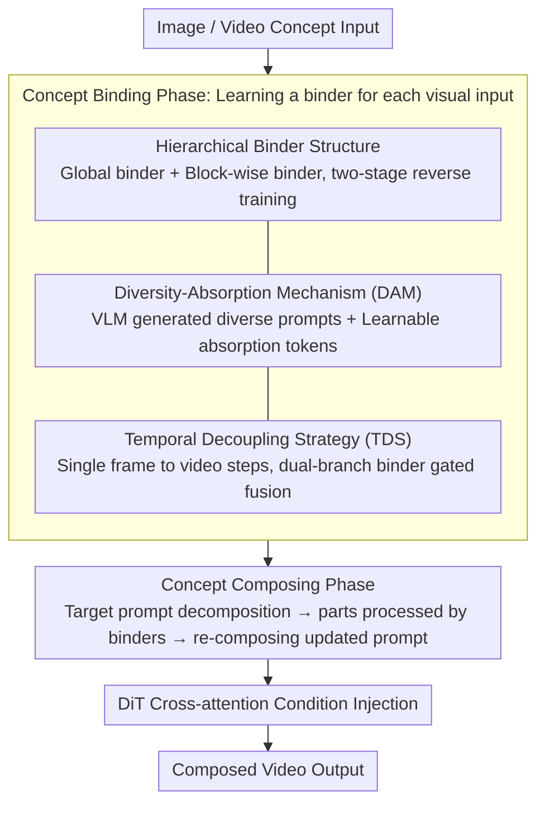

# Composing Concepts from Images and Videos via Concept-prompt Binding

**Conference**: CVPR 2026  
**arXiv**: [2512.09824](https://arxiv.org/abs/2512.09824)  
**Code**: [Project Page](https://refkxh.github.io/BiCo_Webpage)  
**Area**: Video Generation  
**Keywords**: Visual Concept Composition, Diffusion Transformer, Video Personalization, Concept Binding, Temporal Decoupling

## TL;DR
The authors propose Bind & Compose (BiCo), a one-shot method that binds visual concepts to prompt tokens via a hierarchical binder structure and achieves flexible image-video concept composition through token-level assembly. It significantly outperforms previous methods in concept consistency, prompt fidelity, and motion quality.

## Background & Motivation
**Background**: Visual concept composition aims to integrate elements from different images and videos into a coherent output, serving as a fundamental capability for visual creation and filmmaking. With the advancement of DiT-based T2V diffusion models (such as Wan2.1), the potential for concept localization and customization has increased remarkably.

**Limitations of Prior Work**: (i) Insufficient precision in concept extraction—existing methods (e.g., LoRA, learnable embeddings with masks) struggle to decouple complex concepts involving occlusions and temporal variations and cannot extract non-object concepts like style; (ii) lack of flexibility in image-video concept composition—prior works are mostly limited to combining a subject from an image with motion from a video, failing to flexibly combine arbitrary attributes such as visual style and lighting changes.

**Key Challenge**: The need to simultaneously solve two coupled challenges: precise concept decomposition (without requiring mask inputs) and cross-modal concept composition (image + video).

**Goal**: To achieve flexible extraction and composition of arbitrary visual concepts (including non-object concepts like style and motion) from both images and videos.

**Key Insight**: Leverage the concept localization capability of T2V diffusion models to bind text tokens with corresponding visual concepts (via one-shot training), and then synthesize concepts through token-level composition.

**Core Idea**: First, bind visual concepts to prompt tokens (Bind), then select and combine bound tokens from different sources to form the target prompt (Compose). The entire process is implemented through a hierarchical binder structure, a diversity-absorption mechanism, and a temporal decoupling strategy.

## Method

### Overall Architecture
The objective of BiCo is to flexibly extract arbitrary visual concepts (including non-object concepts like style and motion) from images and videos and compose them without mask inputs. Based on Wan2.1-T2V-1.3B, the framework decouples the process into two steps: a Binding phase and a Composing phase. In the Binding phase (Concept Binding), a lightweight binder module is learned for each visual input to map text tokens to corresponding visual concepts. In the Composing phase (Concept Composing), different parts of the target prompt are passed through their respective binders and assembled into an updated prompt carrying multi-source visual information. All operations are integrated into the cross-attention condition injection of the DiT:

$$\mathbf{x}_{out} = \text{cross\_attention}(\mathbf{x}_{in}, \mathbf{p}, \mathbf{p})$$

The three core designs of the binding phase—Hierarchical Binder Structure, Diversity-Absorption Mechanism (DAM), and Temporal Decoupling Strategy (TDS)—ensure that visual concepts are bound to prompt tokens stably and cleanly. The composing phase then assembles bound tokens from different sources into the updated prompt, which is injected into the DiT to generate the final video:

### Key Designs

**1. Hierarchical Binder Structure: Fitting varying behaviors across DiT blocks using global and block-wise binders**

Different blocks of the DiT exhibit significantly different behaviors during the denoising process, which a single global binder cannot accommodate. The authors design a two-layer structure consisting of a global binder $f_g(\cdot)$ and block-wise binders $f_l^i(\cdot)$. Each binder is a residual MLP with a zero-initialized scaling factor: $f(\mathbf{p}) = \mathbf{p} + \gamma \cdot \text{MLP}(\mathbf{p})$. The zero initialization ensures that the training starts without disrupting the original model. This is paired with a **two-stage reverse training** strategy: first, only the global binder is trained at high noise levels ($\geq \alpha$, $\alpha=0.875$) to capture global associations; then, all binders are jointly trained for targeted fine-tuning. Removing this reverse strategy causes the "Overall" score to plummet from 4.40 to 2.58 in ablation studies, indicating the indispensable nature of the global-to-local order.

**2. Diversity-Absorption Mechanism (DAM): Separating "concepts" from "irrelevant details" in a one-shot setting**

With only one sample available in the one-shot setting, binders tend to overfit to concept-irrelevant visual details. DAM first utilizes a VLM (Qwen2.5-VL) to extract key spatial and temporal concepts and generates a set of diverse prompts (where key concept words remain unchanged while other phrasing varies), forcing the binder to recognize only truly stable concepts. Simultaneously, a learnable **absorption token** $p_a^j$ is introduced during training to specifically absorb visual details unrelated to the concept; this token is discarded during inference to suppress unwanted detail leakage.

**3. Temporal Decoupling Strategy (TDS): Resolving temporal heterogeneity between image and video concepts**

Images are single frames, while videos involve temporal dimensions; training them together directly leads to conflicts. TDS splits video concept training into two steps: Stage 1 trains on a single frame to align with the image concept setup; Stage 2 trains on the full video and introduces a dual-branch binder:

$$\text{MLP}(\mathbf{p}) \leftarrow (1-g(\mathbf{p})) \cdot \text{MLP}_s(\mathbf{p}) + g(\mathbf{p}) \cdot \text{MLP}_t(\mathbf{p})$$

The spatial branch $\text{MLP}_s$ inherits weights directly from Stage 1. The gating $g(\cdot)$ is zero-initialized to ensure a good starting state, while the temporal branch $\text{MLP}_t$ progressively incorporates video-specific motion information. This allows image and video concepts to be compatibly composed within the same framework.

### Loss & Training
The binder is trained using the standard diffusion model denoising loss. Each stage consists of 2400 iterations with a learning rate of $1.0 \times 10^{-4}$. During inference, an 81-frame video is generated. Experiments were conducted on NVIDIA RTX 4090 GPUs.

## Key Experimental Results

### Main Results: Quantitative Comparison with Prior Work

| Method | CLIP-T↑ | DINO-I↑ | Concept↑ | Prompt↑ | Motion↑ | Overall↑ |
|------|---------|---------|----------|---------|---------|----------|
| Textual Inversion† | 25.96 | 20.47 | 2.14 | 2.17 | 2.94 | 2.42 |
| DB-LoRA† | 30.25 | 27.74 | 2.76 | 2.76 | 2.51 | 2.68 |
| DreamVideo | 27.43 | 24.15 | 1.90 | 1.82 | 1.66 | 1.79 |
| DualReal | 31.60 | 32.78 | 3.10 | 3.11 | 2.78 | 3.00 |
| **BiCo (Ours)** | **32.66** | **38.04** | **4.71** | **4.76** | **4.46** | **4.64** |

BiCo shows a **+54.67%** improvement (3.00→4.64) in subjective Overall Quality compared to the previous state-of-the-art, DualReal.

### Ablation Study: Contribution of Components (5-point User Study)

| Configuration | Concept↑ | Prompt↑ | Motion↑ | Overall↑ |
|------|----------|---------|---------|----------|
| Baseline (Global binder only) | 2.16 | 2.60 | 2.26 | 2.34 |
| + Hierarchical Binder | 2.63 | 2.88 | 2.93 | 2.81 |
| + Prompt Diversity | 3.40 | 3.34 | 3.04 | 3.26 |
| + Absorption Token | 3.55 | 3.43 | 3.43 | 3.47 |
| + TDS (without absorption) | 3.80 | 3.97 | 3.70 | 3.82 |
| ▲ w/o Reverse Training Strategy | 2.60 | 2.70 | 2.43 | 2.58 |
| **Full Model** | **4.43** | **4.47** | **4.32** | **4.40** |

### Key Findings
- Hierarchical binders significantly improve concept preservation and motion quality (Motion increased from 2.26 to 2.93).
- The absorption token effectively suppresses unwanted details (ablation visualizations show irrelevant elements appearing when removed).
- TDS is crucial for image-video compatibility (Overall score increased from 3.47 to 3.82).
- Two-stage reverse training is indispensable—removing it caused the Overall score to drop from 4.40 to 2.58.

## Highlights & Insights
- **Unified Framework**: Achieves flexible composition of arbitrary image and video concepts for the first time, supporting non-object concepts such as style and motion.
- **Mask-free**: Achieves implicit decomposition via text-conditioned concept composition, lowering the barrier for users.
- **Scalable Design**: Binders are lightweight modules; binders from different concept sources are trained independently and can be combined as needed.
- **Rich Downstream Applications**: Supports image/video decomposition (retaining only specific tokens) and text-guided editing.

## Limitations & Future Work
- All tokens are treated equally, but the importance of tokens for T2V generation is non-uniformly distributed—tokens representing subjects/motion are far more important than functional words.
- Based on a 1.3B model, effectiveness when scaling to larger T2V models (e.g., CogVideoX, Sora-level) has not been verified.
- The consistency between automated metrics (CLIP-T, DINO-I) and human evaluation in quantitative assessments requires further confirmation.
- Computational overhead: Training a binder for each concept source independently (2400 iterations x 2 stages).

## Related Work & Insights
- Textual Inversion and DreamBooth-LoRA are foundational for video personalization but offer coarse control granularity.
- DreamVideo and DualReal support subject + motion composition but limit the type and number of inputs.
- TokenVerse achieves image concept composition via prompt control but relies on text-conditional modulation architectures, which are not applicable to modern T2V models.
- Break-A-Scene relies on explicit mask inputs and cannot extract non-object concepts.
- BiCo unifies concept decomposition and composition through the binder + token composition paradigm.
- Set-and-Sequence and Grid-LoRA learn appearance/motion in LoRA space but cannot precisely specify concepts and composition methods.

## Method Details
- **Concept Extraction via VLM**: Qwen2.5-VL is used to extract spatial concepts (objects, style, lighting, etc.) and temporal concepts (motion patterns, speed changes, etc.), which are then combined into spatial-only and spatiotemporal prompts.
- **Inference Process**: The target prompt $\mathbf{p}_d$ is decomposed according to concept correspondences; each part is updated via its respective binder and re-composed into $\mathbf{p}_u^i$.
- **Downstream Applications**: Image/video decomposition (e.g., keeping "dog" tokens while discarding "cat" tokens); text-guided editing (passing unchanged parts through binders while using original tokens for edited parts).

## Rating ⭐
- Novelty: ⭐⭐⭐⭐⭐ — First to achieve unified and flexible composition of arbitrary image and video concepts.
- Experimental Thoroughness: ⭐⭐⭐⭐⭐ — Comprehensive automated metrics, human evaluation, detailed ablations, and visual cases.
- Writing Quality: ⭐⭐⭐⭐ — Clear concepts with well-explained design motivations for DAM/TDS.
- Value: ⭐⭐⭐⭐⭐ — Directly and significantly benefits visual content creation prospectively.

<!-- RELATED:START -->

## Related Papers

- [\[ICML 2026\] Where Concept Erasure Should Occur: Concept-Layer Alignment in Text-to-Video Diffusion Models](../../ICML2026/video_generation/where_concept_erasure_should_occur_concept-layer_alignment_in_text-to-video_diff.md)
- [\[CVPR 2026\] I'm a Map! Interpretable Motion-Attentive Maps: Spatio-Temporally Localizing Concepts in Video Diffusion Transformers](interpretable_motion-attentive_maps_spatio-temporally_localizing_concepts_in_vid.md)
- [\[CVPR 2026\] ActivityForensics: A Comprehensive Benchmark for Localizing Manipulated Activity in Videos](activityforensics_a_comprehensive_benchmark_for_localizing_manipulated_activity_.md)
- [\[CVPR 2026\] Generating Humanless Environment Walkthroughs from Egocentric Walking Tour Videos](generating_humanless_environment_walkthroughs_from_egocentric_walking_tour_video.md)
- [\[ICCV 2025\] Prompt-A-Video: Prompt Your Video Diffusion Model via Preference-Aligned LLM](../../ICCV2025/video_generation/prompt-a-video_prompt_your_video_diffusion_model_via_preference-aligned_llm.md)

<!-- RELATED:END -->
