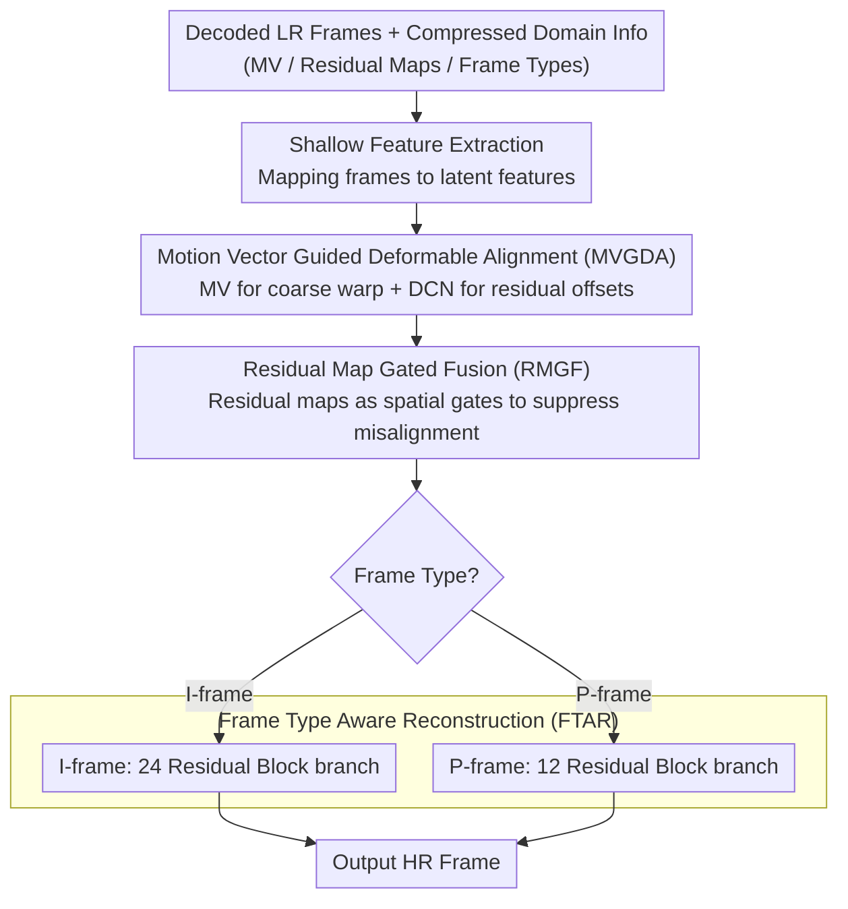

# Compressed-Domain-Aware Online Video Super-Resolution

**Conference**: CVPR 2026  
**arXiv**: [2603.07694](https://arxiv.org/abs/2603.07694)  
**Code**: [https://github.com/sspBIT/CDA-VSR](https://github.com/sspBIT/CDA-VSR)  
**Area**: Video Generation  
**Keywords**: Online Video Super-Resolution, Compressed Domain Information, Motion Vectors, Deformable Alignment, Frame-Type Awareness

## TL;DR
CDA-VSR proposes leveraging video compressed domain information (motion vectors, residual maps, and frame types) to guide three key stages of online video super-resolution: motion-vector-guided deformable alignment for efficient and precise registration, residual-map-gated fusion to suppress misaligned regions, and frame-type-aware reconstruction for adaptive computational resource allocation. It achieves optimal PSNR on REDS4 at 93 FPS (>2x the speed of SOTA).

## Background & Motivation

1. **Background**: Online Video Super-Resolution (Online VSR) requires real-time reconstruction of the current frame during video playback using only historical and current frame information. Recent methods (e.g., TMP, DAP, MMVSR) have improved performance through enhanced alignment and fusion modules, but still struggle to meet real-time requirements at higher resolutions (e.g., 2K).

2. **Limitations of Prior Work**: (1) **Computationally intensive motion estimation**: Optical flow-based alignment (e.g., BasicVSR) is accurate but computationally expensive; implicit alignment (e.g., RRN) is efficient but degrades under large motion. (2) **Redundant processing of sequential frames**: Existing methods apply the same computational budget to all frames, leading to unnecessary redundancy for frequently occurring P-frames. (3) **Information waste**: Compressed domain information obtained during decoding (motion vectors, residual maps, frame types) is discarded rather than utilized.

3. **Key Challenge**: In bandwidth-constrained online video streaming, videos are downsampled and compressed for transmission. The decoder side has access to rich compressed domain priors for "free," yet existing methods only use decoded low-resolution frames, ignoring these valuable auxiliary cues.

4. **Goal**: How to customize dedicated modules for motion vectors, residual maps, and frame types—each with distinct characteristics—to significantly accelerate inference speed while enhancing super-resolution quality.

5. **Key Insight**: Within the video codec bitstream, motion vectors describe block-level inter-frame motion (serving as coarse registration to replace optical flow), residual maps reflect regions where motion compensation failed (naturally marking unreliable areas), and frame types determine inter-frame reference relationships (I-frames require high-quality reconstruction, while P-frames can be handled lightly). Each has a unique utility.

6. **Core Idea**: Utilizing the three types of compressed domain information (motion vectors for coarse alignment → residual maps for quality gating → frame types for computation allocation) as natural priors for online VSR, allowing "free" information to deliver dual improvements in both quality and speed.

## Method

### Overall Architecture
CDA-VSR adopts a recurrent structure that takes decoded low-resolution frames and compressed domain information (MV, residual maps, frame types) as input to output high-resolution frames. The workflow consists of: (1) A shallow feature extraction network mapping each frame to latent features; (2) The **MVGDA module**, which uses motion vectors to guide deformable convolution for inter-frame alignment; (3) The **RMGF module**, which uses residual maps to generate spatial weights for selective fusion; (4) The **FTAR module**, which selects reconstruction branches of different depths based on frame type. The entire pipeline maintains causal constraints (using only past and current frames) and meets real-time processing requirements. The three types of compressed domain information are fed into dedicated modules: MV to MVGDA, residual maps to RMGF, and frame types to FTAR.

### Key Designs

**1. Motion Vector Guided Deformable Alignment (MVGDA): Using MV for rough drafts and DCN for detail refinement, eliminating expensive optical flow estimation.**

Alignment is the bottleneck for VSR speed: optical flow is accurate but slow, while implicit alignment is fast but fails under large motion. MVGDA's advantage lies in treating the motion vectors already available at decoding as a "free rough draft." In the first step, it uses MVs to warp previous frame features for coarse registration $\bar{h}_{t-1} = \mathcal{W}(h_{t-1}; MV_{t-1 \to t})$, compensating for large-scale inter-frame displacement. However, MVs are block-based—all pixels within a coding block share one vector—leading to inaccuracies at object boundaries and complex motion. Thus, the second step uses the MV as the initial value $o_{MV}$ for deformable convolution offsets, employing a lightweight convolution network to predict **local residual offsets** $\Delta o$ and a modulation mask $m$. The final alignment is:

$$\hat{h}_{t-1} = \mathcal{D}(h_{t-1}; o_{MV} + \Delta o, m)$$

The key lies in "residual": DCN does not need to estimate full motion from scratch but only fine-tunes the initial value provided by the MV, making offset learning significantly simpler and more stable. Alignment is applied to two complementary features—encoder coarse features $h^L$ for structural priors and reconstruction fine features $h^H$ for texture details—both sharing the same MV guidance. Ablations show the value of this division: using only MV (OnlyMV) outperforms using only DCN (OnlyDCN) by 0.24dB, indicating the strength of compressed domain motion priors. Combining both adds another 0.17dB, as residual offsets correct the block-level granularity of MVs.

**2. Residual Map Gated Fusion (RMGF): Using codec-calculated residual maps as masks for "untrustworthy" regions.**

Even with accurate alignment, failures occur due to occlusion, rotation, or complex motion. RMGF observes that the residual map $Res_t$ calculated by the encoder is exactly this "unreliability map." It represents the pixel-level difference between the current frame and its motion-compensated prediction; high residuals correspond to areas where motion compensation failed. The method uses a lightweight network to compress the residual map into a $[0,1]$ spatial gate map $M_t = \sigma(\mathcal{F}_{res}(Res_t))$, which weights the aligned previous features—allowing reliable regions and suppressing misaligned ones:

$$h_t^f = \mathcal{C}^f([M_t \odot \hat{h}_{t-1}^L,\; M_t \odot \hat{h}_{t-1}^H,\; h_t^L])$$

The gating heatmap clearly illustrates this: stable car bodies receive high weights, while rotating wheels are suppressed. The cost is negligible—adding only 0.02M parameters—while consistently improving stability by 0.13dB over the ungated version (NoGate).

**3. Frame-Type Aware Reconstruction (FTAR): Routing the 97% of P-frames through a lightweight branch, saving computation for critical I-frames.**

Applying equal computation to every frame in online VSR is wasteful: P-frames only store incremental updates and appear frequently, while I-frames carry complete spatial information and serve as references for subsequent sequences. FTAR diverts traffic based on frame type—I-frames are processed by a high-capacity branch $\mathcal{R}_I$ (24 residual blocks), and P-frames by a lightweight branch $\mathcal{R}_P$ (12 residual blocks). Only the branch corresponding to the current frame type is activated. Ablations verify this: a fully lightweight configuration (I=P=12) is 0.16dB lower than FTAR with almost no time savings (10.7ms vs 10.8ms), while a fully heavy configuration (I=P=24) only gains 0.04dB but increases latency by 57% (16.8ms). FTAR's I=24/P=12 configuration hits the "sweet spot," capturing ~80% of the quality gains of the heavy solution for only 0.1ms extra.

### Loss & Training
The Charbonnier Loss is used: $\mathcal{L} = \frac{1}{T}\sum_{t=1}^T \sqrt{(I_t^{SR} - I_t^{GT})^2 + \epsilon^2}$. Inputs are H.264 encoded low-resolution video frames (CRF 18/23/28) with 4x upsampling. Training involved 300K iterations, batch size 8, 15-frame clips, and 64×64 random crops. Adam optimizer was used with an initial learning rate of $2 \times 10^{-4}$ and cosine annealing. Training was performed on a single RTX 3090.

## Key Experimental Results

### Main Results

| Dataset/Method | PSNR(CRF18) | PSNR(CRF28) | FPS | MACs(G) | Real-time |
| :--- | :--- | :--- | :--- | :--- | :--- |
| **Ours** | **27.76** | **25.30** | **93** | **78** | Gaming Real-time ✓ |
| TMP | 27.68 | 25.17 | 45 | 176 | Cinema Real-time ✓ |
| BasicVSR* | 27.63 | 25.13 | 29 | 254 | Cinema Real-time ✓ |
| KSNet-uni | 27.58 | 25.12 | 34 | 148 | Cinema Real-time ✓ |
| RRN | 27.10 | 24.96 | 59 | 193 | Cinema Real-time ✓ |

Inter4K 2K resolution: **Ours** 29.98dB / 25.1 FPS (the only method exceeding 24 FPS), TMP 29.76dB / 11.4 FPS.

### Ablation Study

| Configuration | PSNR(CRF18) | Runtime(ms) | Description |
| :--- | :--- | :--- | :--- |
| OnlyMV | 27.59 | 10.2 | MV coarse registration only |
| OnlyDCN | 27.35 | 10.6 | Deformable convolution only |
| OnlyGL (Flow) | 27.73 | 15.5 | Optical flow alignment, 1.4x latency |
| **MVGDA** | **27.76** | **10.8** | Best quality and efficiency |
| NoGate | 27.63 | 10.8 | Without residual map gating |
| **RMGF** | **27.76** | **10.8** | Gated fusion Gain 0.13dB |
| I=12, P=12 | 27.60 | 10.7 | Uniform lightweight reconstruction |
| I=24, P=24 | 27.80 | 16.8 | Uniform heavy reconstruction |
| **I=24, P=12 (FTAR)** | **27.76** | **10.8** | Adaptive allocation |

### Key Findings
- **MV guidance far outperforms pure DCN**: OnlyMV is 0.24dB higher than OnlyDCN, proving compressed domain MVs provide a strong motion prior, especially for large motion. MVGDA combines both for a further 0.17dB Gain, correcting MV's block-level imprecision.
- **Residual maps are natural reliability indicators**: RMGF consistently improves by 0.08-0.13dB across all CRF levels with almost zero overhead.
- **FTAR is key to efficiency**: The I=24, P=12 configuration achieves ~80% of the heavy scheme's quality gain with nearly zero latency cost (+0.1ms), proving redundant computation on P-frames can be safely removed.
- **Advantage scales with resolution**: **Ours** is the only method to achieve cinema real-time (>24 FPS) at 2K on Inter4K (25.1 vs TMP 11.4), with the efficiency gap widening at higher resolutions.
- **Compression sensitivity**: **Ours** remains optimal across all CRF levels (18/23/28), but the absolute gain is larger at high compression (CRF28, +0.13dB vs TMP), suggesting compressed domain info is more valuable at lower bitrates.

## Highlights & Insights
- **The "Free Lunch" Philosophy**: Motion vectors, residual maps, and frame types are "by-products" of the decoding process, obtainable with zero extra computation. Reusing rather than discarding them is an elegant system-level approach transferable to other tasks like video editing or analysis.
- **Complementary MV+DCN Design**: Using MV for large-scale global motion (coarse registration) and DCN for local residual refinement simplifies and stabilizes offset learning.
- **Differentiated Processing via Frame Types**: Allocating different computational budgets for I/P frames is a simple yet effective idea. Routing 97% of frames through a light path yields significant speedups, while the 3% of I-frames ensure reference quality.

## Limitations & Future Work
- **H.264 Specific**: Only validated on H.264; quality differences for MV in H.265/VVC/AV1 are untested.
- **Fixed GOP Structure**: Assumes standard I-P structures; B-frame processing is not addressed (though B-frames are typically avoid in online scenarios).
- **MV Quality Dependency**: MV accuracy drops at low bitrates, potentially affecting alignment.
- **Unused Quantization Parameters (QP)**: QP maps in the bitstream could serve as additional compression quality priors.
- **Parameter Count**: The dual-branch structure increases total parameters (3.3M), though only one branch is active at inference.

## Related Work & Insights
- **vs TMP**: TMP uses inter-frame motion continuity to propagate offsets but still estimates motion from LR frames. **Ours** uses bitstream MVs as coarse priors, reducing computation and consistently outperforming TMP across all CRF levels.
- **vs CDVSR/CIAF**: Previous compressed domain VSR methods use MVs/residuals but are not designed for online scenarios, failing real-time requirements. **Ours** introduces frame-type-aware differentiation.
- **vs BasicVSR***: BasicVSR* (BasicVSR without the backward branch) satisfies causal constraints but remains slow (29 FPS). **Ours** is >3x faster with a 0.13dB higher PSNR.

## Rating
- Novelty: ⭐⭐⭐ Utilizing compressed domain info is not entirely new, but the customized modular design is an engineering innovation.
- Experimental Thoroughness: ⭐⭐⭐⭐ Complete across CRF levels, resolutions, and methods; ablation and visualization are thorough.
- Writing Quality: ⭐⭐⭐⭐ Clear structure with good mapping between motivation and method.
- Value: ⭐⭐⭐⭐ High engineering value for practical online VSR; 2K real-time is a significant breakthrough.

<!-- RELATED:START -->

## Related Papers

- [\[CVPR 2026\] STCDiT: Spatio-Temporally Consistent Diffusion Transformer for High-Quality Video Super-Resolution](stcdit_spatio-temporally_consistent_diffusion_transformer_for_high-quality_video.md)
- [\[ICCV 2025\] VSRM: A Robust Mamba-Based Framework for Video Super-Resolution](../../ICCV2025/video_generation/vsrm_a_robust_mamba-based_framework_for_video_super-resolution.md)
- [\[CVPR 2026\] Latent-Compressed Variational Autoencoder for Video Diffusion Models](latent-compressed_variational_autoencoder_for_video_diffusion_models.md)
- [\[CVPR 2025\] VideoGigaGAN: Towards Detail-rich Video Super-Resolution](../../CVPR2025/video_generation/videogigagan_towards_detail-rich_video_super-resolution.md)
- [\[CVPR 2025\] PatchVSR: Breaking Video Diffusion Resolution Limits with Patch-Wise Video Super-Resolution](../../CVPR2025/video_generation/patchvsr_breaking_video_diffusion_resolution_limits_with_patch-wise_video_super-.md)

<!-- RELATED:END -->
