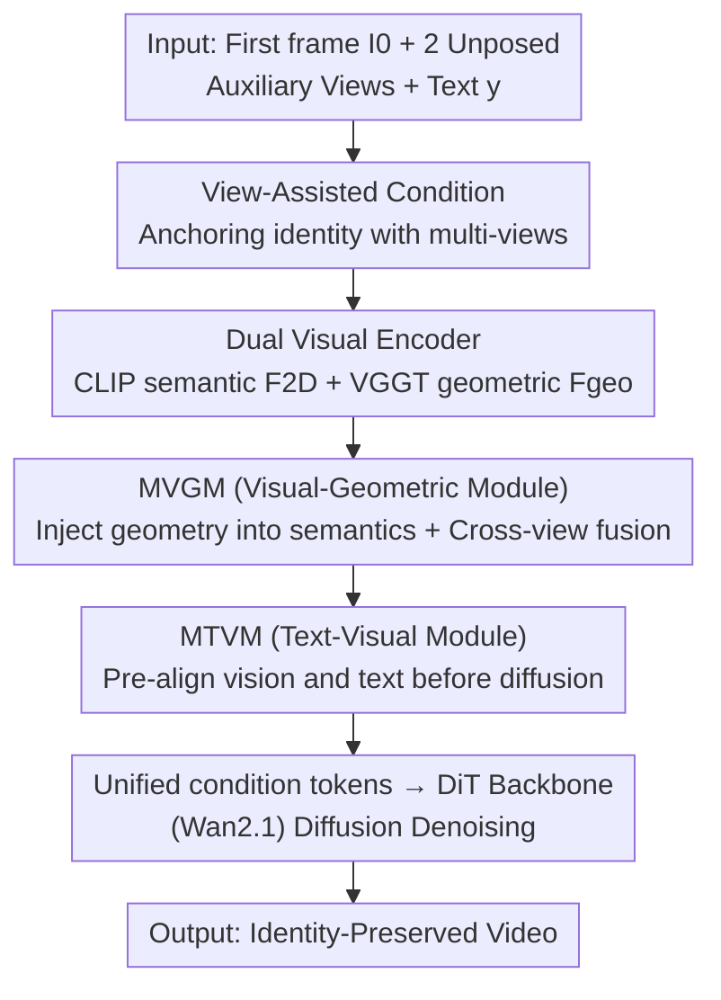

# ConsID-Gen: View-Consistent and Identity-Preserving Image-to-Video Generation

**Conference**: CVPR 2026  
**Paper**: [CVF Open Access](https://openaccess.thecvf.com/content/CVPR2026/html/Wu_ConsID-Gen_View-Consistent_and_Identity-Preserving_Image-to-Video_Generation_CVPR_2026_paper.html)  
**Code**: https://myangwu.github.io/ConsID-Gen (Project Page)  
**Area**: Image-to-Video Generation / Diffusion Models  
**Keywords**: Image-to-Video Generation, Identity Preservation, Multi-view Consistency, Geometric Encoding, Diffusion Transformer  

## TL;DR
Addressing appearance drift and geometric distortion of rigid objects under viewpoint changes in Image-to-Video (I2V) generation, ConsID-Gen intervenes at both data and model levels: constructing a large-scale object-centric dataset ConsIDVid and a multi-view consistency benchmark ConsIDVid-Bench, and proposing a "view-assisted" framework. By supplementing the first frame with two unposed auxiliary views, using a dual-stream encoding of 2D semantics + VGGT geometry, and pre-aligning vision and text before diffusion, it surpasses Wan2.1/Wan2.2/HunyuanVideo in identity fidelity and geometric stability.

## Background & Motivation
**Background**: Video generation based on Diffusion Transformers (DiT) can synthesize high-resolution, temporally coherent videos from text, images, or both. Specifically, I2V (animating a static frame given a reference image + text instruction) is highly valuable for e-commerce and product advertising—converting a catalog photo into multiple showcase videos, provided the identity remains "identical."

**Limitations of Prior Work**: Existing I2V systems (Wan2.1, ConsistI2V, CogVideoX-I2V, etc.) frequently exhibit appearance drift and geometric distortion under viewpoint changes: identity shifts, shape warping, merging or disappearance of parts, and frame-by-frame texture changes. In Figure 1 of the paper, glass products gradually lose rigidity and "blur" together; such collapse of instance-level consistency is fatal in high-stakes scenarios like e-commerce.

**Key Challenge**: The authors attribute the root cause to two factors: **Sparse 2D observations from a single view** (2D encoders like CLIP excel at high-level recognition but under-express fine-grained structure; during temporal synthesis, the model must "hallucinate" missing spatial details, leading to accumulated errors); and **Weak cross-modal alignment** (mainstream pipelines encode text and images separately and only perform simple concatenation or fusion late in the network). A supporting piece of evidence: T2V models actually outperform I2V in identity preservation (Wan2.1 T2V-to-I2V identity score drops from 96.72 to 91.84), as T2V does not require alignment between sparse visual and text representations.

**Goal**: To preserve both the geometry and appearance texture of objects under viewpoint/object motion, while providing a benchmark to quantify "subtle geometric drift."

**Key Insight**: Since a single view is under-constrained, use **unposed multi-views** of the same object to anchor shape and appearance; since late fusion yields weak alignment, perform fine-grained interaction for **pre-alignment of text-vision** before the diffusion stage.

**Core Idea**: Replace "single view + late concatenation" with "multi-view geometric priors + unified pre-aligned conditional representation" to treat appearance drift from both data and modeling perspectives.

## Method

### Overall Architecture
The input to ConsID-Gen consists of three components: the first frame $I_0$, two unposed auxiliary views $V=\{V_1,V_2\}$ of the same object, and a text instruction $y$. The output is a temporally coherent, identity-preserving video $X=\{X_t\}_{t=1}^{T}$. Built upon Wan2.1-Fun-1.3B-InP, the core strategy "enriches" and "aligns" the visual conditions: a **dual visual encoder** extracts 2D semantics and multi-view geometry, followed by a **unified text-visual interaction projector** (containing MVGM and MTVM modules) to inject geometry into semantics and align vision with text, producing unified conditional tokens for the DiT backbone. Data support is provided by the ConsIDVid dataset and ConsIDVid-Bench.

### Key Designs

**1. View-Assisted Condition: Enriching Single Frames with Unposed Multi-views**

To address the root cause of sparse 2D observations, ConsID-Gen provides two additional **unposed auxiliary views** $V=\{V_1,V_2\}$ of the same object. These views require no camera pose annotations but provide side/back structural clues invisible in the first frame, allowing the model to build a more stable "identity representation" and constraining subsequent frames from drifting. This step is the source of geometric stability—ablation shows that adding a geometric encoder alone is ineffective (see below), but **layering multi-view auxiliary images significantly boosts identity scores**, indicating that the true constraint comes from "multi-view structural priors" rather than the encoder itself. This is enabled by the ConsIDVid dataset, which includes numerous e-commerce UGC and MVImgNet2.0 synthetic sequences with unposed views.

**2. Dual Visual Encoder: Parallel 2D Semantic and VGGT Geometric Streams**

The other side of appearance drift is the under-representation of structure in 2D features. ConsID-Gen employs two complementary visual streams: the semantic stream uses a CLIP-style 2D encoder $E_{2D}$ to extract appearance tokens from $I_0$:

$$F_{2D}=E_{2D}(I_0),\quad F_{2D}\in\mathbb{R}^{\lfloor H/p_{2D}\rfloor\times\lfloor W/p_{2D}\rfloor\times d_{2D}}$$

providing high-level appearance priors. The geometric stream uses a pre-trained VGGT as the geometric backbone $E_{geo}$, alternating between per-frame and global self-attention on the view set $\tilde V=\{I_0,V_1,V_2\}$ to extract dense geometric-aware tokens:

$$F_{geo}=E_{geo}(\tilde V),\quad F_{geo}\in\mathbb{R}^{3\times\lfloor H/p_{geo}\rfloor\times\lfloor W/p_{geo}\rfloor\times d_{geo}}$$

Note that the geometric stream processes 3 images, so $F_{geo}$ naturally carries cross-view structural information. Both streams retain dense formats for downstream fusion.

**3. Unified Text-Visual Interaction Projector: Pre-alignment Before Diffusion**

To address weak late-stage cross-modal alignment, connector $g_\phi$ uses two MMDiT-style dual-stream attention modules. First, the **Multi-Modal Visual–Geometric Module (MVGM)**: it migrates the MMDiT paradigm to the "visual-geometric" domain, allowing appearance tokens $F_{2D}$ and geometric tokens $F_{geo}$ to interact bidirectionally, while auxiliary view features are merged via **cross-attention** to reinforce spatial consistency. Subsequently, the **Multi-Modal Text–Visual Module (MTVM)**: on top of the fused visual-geometric representation, it performs fine-grained alignment with language via dual-stream attention. Text features dynamically modulate the visual stream (controlling dynamics/camera motion), while visual representations provide clues back to the text. This "pre-alignment before projection" creates the "Hybrid representation" that produces unified condition tokens for the DiT backbone $f_\theta$.

**4. ConsIDVid Dataset + ConsIDVid-Bench: Quantifying Identity Drift**

The project introduces ConsIDVid, aggregated from object-centric datasets (Co3D/OmniObject3D), 80+ hours of e-commerce UGC, and MVImgNet2.0 synthetic sequences. It uses an automated pipeline for filtering (duration $\ge 81$ frames, resolution $\ge 320p$, aesthetic/blur filtering) and **hierarchical captioning** using Qwen2.5-VL to describe both object attributes and camera dynamics. **ConsIDVid-Bench** reformulates video evaluation as a multi-view consistency problem using four metrics: Chamfer Distance (between 3D points reconstructed from input/synthetic views), MEt3R (dense pairwise reconstruction similarity via DUSt3R), Video Similarity (CLIP), and Object Similarity (DINO features on segmented objects).

### Loss & Training
Base model: Wan2.1-Fun-1.3B-InP (81 frames, 832×480). AdamW, learning rate $10^{-4}$, per-GPU batch size=1, gradient accumulation=4, trained for 33K steps on NVIDIA A100(80GB). Inference uses 50-step sampling with CFG=5.

## Key Experimental Results

### Main Results
Evaluated on ConsIDVid-Bench (proprietary and public subsets). The following table shows results for the proprietary subset (CD and MEt3R: lower is better):

| Method | Subject Cons. | Background Cons. | Video Sim. | Object Sim. | Chamfer Dist.↓ | MEt3R↓ |
|------|------|------|------|------|------|------|
| Wan2.1-1.3B | 91.03 | 94.57 | 87.15 | 66.9 | 0.1064 | 0.1401 |
| Wan2.2-5B | 91.99 | 94.82 | **88.69** | 68.6 | 0.0921 | 0.1826 |
| HunyuanVideo | 90.40 | 93.27 | 86.59 | 64.3 | 0.1017 | 0.2270 |
| Wan2.1-14B | 90.37 | 94.14 | 87.33 | 67.9 | **0.0866** | 0.1572 |
| **Ours (1.3B)** | **95.30** | **96.10** | 88.65 | **69.2** | 0.0996 | **0.0978** |

ConsID-Gen leads in identity/geometric metrics: Subject Consistency is ~3.6% higher than Wan2.2, and MEt3R is significantly lower (relative +30.2% gain), despite having only 1.3B parameters.

### Ablation Study
Performed with 50% training data and evaluated on a 60-video subset:

| Configuration | I2V-Subj | I2V-Back | Subj-Cons. | Back-Cons. | Video-Sim. |
|------|------|------|------|------|------|
| Baseline | 96.30 | 97.16 | 90.83 | 94.97 | 87.75 |
| + Geo Enc. | 96.29 | 97.37 | 89.65 | 93.44 | 86.19 |
| + View-Asst. | 96.97 | 97.85 | 91.87 | 94.33 | 87.35 |
| Ours (full) | **98.48** | **98.85** | **95.13** | **96.20** | **88.25** |

### Key Findings
- **Geometric Encoders alone are ineffective**: `+ Geo Enc.` saw a slight drop in most metrics compared to Baseline, indicating the backbone isn't a silver bullet.
- **Auxiliary views are the turning point**: Adding `+ View-Asst.` led to significant recovery across metrics, confirming that structural priors from multi-views provide the necessary constraints.
- **Text-visual fusion maintains long-range identity**: MTVM ensures that identity remains consistent even at the 60th frame, whereas standard fine-tuning drifts earlier.

## Highlights & Insights
- **Diagnostic through T2V vs I2V Gap**: The observation that T2V identity scores exceed I2V scores identifies alignment as the bottleneck, logically leading to the "pre-alignment" solution.
- **Unposed Multi-views as Low-cost Priors**: Using unposed views avoids the need for camera pose annotations while satisfying the need for structural constraints, creating a closed loop between data availability and methodology.
- **Reformulating Video Quality as Multi-view Consistency**: Using Chamfer/MEt3R metrics better captures "subtle geometric drift" than semantic scores, a transferable approach for any instance-level consistency task.
- **Geometric encoders require multi-view contexts**: Ablation reveals that adding VGGT without providing multiple views yields zero gain.

## Limitations & Future Work
- **Vulnerability to interference structures**: Backgrounds with grids or high-frequency patterns can cause generation collapse or degradation.
- **Rigid object focus**: The method is optimized for rigid objects; its efficacy on deformable objects (cloth, human motion) remains unverified.
- **Dependency on auxiliary views**: Requires two additional views at inference; pure single-image scenarios might require a view-synthesis model as a pre-processor.

## Related Work & Insights
- **vs. Wan2.1 / Wan2.2**: These use mask-guided conditions and late fusion of text/image; ConsID-Gen improves geometric consistency (MEt3R) significantly by using dual encoders and pre-alignment, outperforming larger models.
- **vs. ConsistI2V**: While ConsistI2V uses spatio-temporal attention for continuity, it remains a 2D-single-view approach. ConsID-Gen explicitly addresses viewpoint changes with 3D-aware geometric priors.

## Rating
- Novelty: ⭐⭐⭐⭐ Combination of multi-view priors and pre-alignment directly hits the I2V identity drift pain point.
- Experimental Thoroughness: ⭐⭐⭐⭐ Comprehensive evaluation across benchmarks and metrics, though ablation used a data subset.
- Writing Quality: ⭐⭐⭐⭐ Clear diagnostic reasoning and systematic framework presentation.
- Value: ⭐⭐⭐⭐ Strong industrial potential for e-commerce where identity preservation is a hard requirement.

<!-- RELATED:START -->

## Related Papers

- [\[CVPR 2026\] EvoID: Reinforced Evolution for Identity-Preserving Video Generation](evoid_reinforced_evolution_for_identity-preserving_video_generation.md)
- [\[CVPR 2026\] AnyID: Ultra-Fidelity Universal Identity-Preserving Video Generation from Any Visual References](anyid_ultra-fidelity_universal_identity-preserving_video_generation_from_any_vis.md)
- [\[CVPR 2026\] PLACID: Identity-Preserving Multi-Object Compositing via Video Diffusion with Synthetic Trajectories](placid_identity-preserving_multi-object_compositing_via_video_diffusion_with_syn.md)
- [\[CVPR 2026\] Stand-In: A Lightweight and Plug-and-Play Identity Control for Video Generation](stand-in_a_lightweight_and_plug-and-play_identity_control_for_video_generation.md)
- [\[CVPR 2025\] Identity-Preserving Text-to-Video Generation by Frequency Decomposition](../../CVPR2025/video_generation/identity-preserving_text-to-video_generation_by_frequency_decomposition.md)

<!-- RELATED:END -->
## Related Papers

- [\[CVPR 2026\] Identity-Preserving Image-to-Video Generation via Reward-Guided Optimization](identity-preserving_image-to-video_generation_via_reward-guided_optimization.md)
- [\[CVPR 2026\] EvoID: Reinforced Evolution for Identity-Preserving Video Generation](evoid_reinforced_evolution_for_identity-preserving_video_generation.md)
- [\[CVPR 2026\] PLACID: Identity-Preserving Multi-Object Compositing via Video Diffusion with Synthetic Trajectories](placid_identity-preserving_multi-object_compositing_via_video_diffusion_with_syn.md)
- [\[CVPR 2026\] Stand-In: A Lightweight and Plug-and-Play Identity Control for Video Generation](stand-in_a_lightweight_and_plug-and-play_identity_control_for_video_generation.md)
- [\[CVPR 2026\] Towards Realistic and Consistent Orbital Video Generation via 3D Foundation Priors](orbital_video_3d_foundation_priors.md)

<!-- RELATED:END -->
