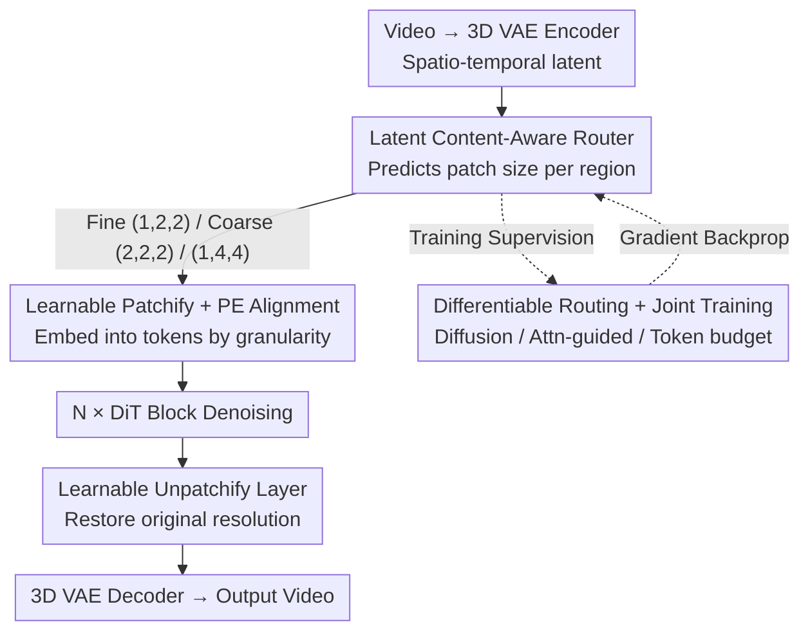

# Content-Aware Dynamic Patchification for Efficient Video Diffusion

**Conference**: CVPR 2026  
**Paper**: [CVF Open Access](https://openaccess.thecvf.com/content/CVPR2026/html/Li_Content-Aware_Dynamic_Patchification_for_Efficient_Video_Diffusion_CVPR_2026_paper.html)  
**Code**: https://shengli99.github.io/DynaPatch/ (Project Page)  
**Area**: Video Generation / Diffusion Model Efficiency  
**Keywords**: Dynamic Patchification, Video Diffusion, DiT Acceleration, Router, Token Reduction

## TL;DR
DynaPatch employs a lightweight router within the 3D VAE latent space to **adaptively select patch sizes** for each spatio-temporal region (fine patches for detailed areas and coarse patches for static areas). By jointly training the router with the diffusion model end-to-end, it eliminates redundant computation during the token creation stage. On VBench, it achieves a total score of 83.42 with a 30% token reduction, realizing a 1.3–1.8× speedup with near-lossless visual quality.

## Background & Motivation
**Background**: Video generation models based on Diffusion Transformers (DiT) (e.g., HunyuanVideo) demonstrate strong performance but require partitioning spatio-temporal latents encoded by 3D VAEs into tokens for DiT processing. The dominant approach is **uniform patchification**, where a fixed patch size (e.g., (1,2,2)) is applied across all frames and regions regardless of content, resulting in uniform token density.

**Limitations of Prior Work**: In real-world videos, static backgrounds, smooth regions, and low-motion areas are treated identically to high-dynamic, semantically rich regions, creating significant token redundancy. Since DiT self-attention exhibits quadratic complexity relative to token count, generating a 5-second 720p video can take over 300 seconds on 8×A100; token redundancy translates directly into wasted computational power.

**Key Challenge**: Small patches preserve detail but increase token count and cost; large patches save computation but sacrifice detail—a clear trade-off exists between detail and efficiency. Existing token reduction methods typically perform **merging or pruning after token creation**, whereas the root cause—patchification itself—remains content-agnostic.

**Shortcomings of Existing Adaptive Methods**: Lumina-Video and FlexiDiT adjust patch size based on **diffusion timesteps**; CAT uses LLMs to estimate prompt complexity to set a global patch size for the **entire video**. These assign a single patch size to a whole frame or timestep, ignoring fine-grained spatial and temporal differences. APT and D2iT reach the region level but rely on heuristic signals like image-space **entropy**. While D2iT trains a router, it uses entropy maps as labels and **lacks joint optimization with the generation objective**, meaning routing decisions may not favor the diffusion process.

**Core Idea**: Perform **fine-grained, content-aware** region-wise dynamic patchification directly on the 3D VAE spatio-temporal latent. A lightweight router predicts the patch size for each block, and the system is **jointly trained end-to-end** with the diffusion model (supervised by diffusion loss). This allows the generation quality itself to determine where to save or allocate tokens, rather than relying on proxy signals like entropy.

## Method

### Overall Architecture
DynaPatch inserts a "routing + learnable patchification" bypass into the standard DiT video generation pipeline. The input is the noisy spatio-temporal latent from a 3D VAE, and the output is the DiT-denoised latent restored to the original resolution, without altering the DiT backbone structure.

The inference data flow is as follows: The 3D VAE encoder compresses the video into a spatio-temporal latent $\rightarrow$ The router divides the latent into fixed-size regions and predicts a patch size (one of three options) for each $\rightarrow$ The corresponding **patchify layer** embeds each region into tokens of varying granularity based on the routing result $\rightarrow$ The token sequence enters $N$ DiT blocks for denoising $\rightarrow$ The corresponding **unpatchify layer** restores the tokens to the original spatio-temporal resolution latent $\rightarrow$ The 3D VAE decoder reconstructs the video. Crucially, complex/moving regions use fine patches (1,2,2) for resolution, while redundant/static regions use coarse patches (2,2,2) or (1,4,4) to save tokens. The final latent resolution must be restored for the VAE decoder to function correctly.

During training, three losses (Diffusion loss + Attention-guided loss + Token budget loss) are applied to optimize the router, patchify/unpatchify layers, and the DiT backbone together.

### Key Designs

**1. Latent Content-Aware Router: Letting Generation Goals Dictate Savings**

To address the disconnect between entropy-based supervision and diffusion objectives, DynaPatch uses a **three-layer MLP (1024 hidden dims)** as a router that directly processes the 3D VAE latent. An MLP is chosen over a single linear layer for sufficient semantic capacity, and it is more efficient than attention-based routers. The router partitions the latent map into fixed spatio-temporal regions defined by the **coarsest candidate patch**—for example, with candidates $\{(1,2,2),(2,2,2),(1,4,4)\}$, the region shape is $(2,4,4)$ to ensure every region can be flexibly routed.

Notably, the router **does not explicitly take the timestep** as input: since it processes noisy latents, the noise level inherently correlates with the timestep. Consequently, the router naturally selects coarse patches in high-noise early stages and shifts to fine patches as denoising progresses (as shown in Fig. 3 where token reduction decreases over steps). The output space is restricted to three patch sizes; larger ones like (2,8,8) were found to be too coarse and damaged temporal consistency.

**2. Learnable Patchify/Unpatchify + PE Averaging: Preserving Spatio-Temporal Relations**

Varying patch sizes across regions mean different tokens correspond to different numbers of latent pixels. Applying fixed patch embeddings would break spatio-temporal correspondence. DynaPatch assigns a pair of **single-layer linear patchify/unpatchify layers** to each candidate patch size. The patchify layer embeddings the latent region based on the routing, and the unpatchify layer projects tokens back to the latent space at original resolution. These layers are fully learnable and trained with the backbone, allowing the system to integrate with existing DiTs.

Positional Encoding (PE) is handled by generating a grid at the **finest granularity (1,2,2)**. The PE for a coarse patch is the **average** of the PEs of all fine patches contained within it:

$$\text{PE}_{\text{coarse}} = \frac{1}{N}\sum_{i=1}^{N}\text{PE}_{\text{fine},i}$$

where $N$ is the number of finest patches within the coarse patch. This ensures tokens of different granularities share a consistent positional space while retaining relative offsets.

**3. Straight-Through Gumbel-Softmax: Differentiable Routing for Diffusion Loss**

Because routing decisions are discrete (one-of-three) and non-differentiable, the diffusion loss cannot propagate to the router directly. DynaPatch uses **Straight-Through Gumbel-Softmax** for a differentiable relaxation. The router outputs logits $S\in\mathbb{R}^K$ for $K$ patch candidates, adds Gumbel noise, and applies softmax with temperature $\tau$ for soft probabilities:

$$y_{\text{soft}} = \text{Softmax}\!\left(\frac{S+g}{\tau}\right)$$

During the forward pass, a hard one-hot decision $y_{\text{hard}}$ is taken via $\text{argmax}(y_{\text{soft}})$. The Straight-Through Estimator (STE) allows gradients to bypass the discrete operation:

$$y_{\text{STE}} = y_{\text{hard}} - (y_{\text{soft}})_{\text{detached}} + y_{\text{soft}}$$

The temperature $\tau$ is linearly annealed: $\tau_{\text{current}} = \max(\tau_{\min}, \tau_{\text{initial}}\times(1-\frac{\text{step}}{\text{total steps}}))$, with $\tau_{\text{initial}}=1$ and $\tau_{\min}=0.2$, enabling exploration early on and deterministic decisions later.

**4. Three-Loss Joint Training: Diffusion, Attention, and Budget**

The router is trained using a weighted sum of three losses:

$$\mathcal{L}_{\text{total}} = \mathcal{L}_{\text{diffusion}} + \lambda_{\text{attn}}\mathcal{L}_{\text{attn-guided}} + \lambda_{\text{budget}}\mathcal{L}_{\text{budget}}$$

**Diffusion loss** aligns routing with generation quality. **Attention-guided loss** injects semantic priors by aligning the soft probability of selecting the finest patch (1,2,2) with a region-level saliency map aggregated from DiT attention maps: $\mathcal{L}_{\text{attn-guided}} = 1 - \text{Cosine}(y^{(1,2,2)}_{\text{soft}}, \text{attention map})$. This encourages fine patches in high-saliency areas. Key details: ① This loss **only updates the router, not the DiT**, to avoid distorting native attention. ② Top-4 layers and top-4 heads are selected using a U2-Net saliency detector on 100 videos for more reliable supervision. ③ This guidance is only used at low timesteps (e.g., $t<500$) where attention is more reliable. The **token budget loss** prevents the router from collapsing into only coarse or only fine patches, using soft probabilities to approximate token counts:

$$\mathcal{L}_{\text{budget}} = \left(\frac{1}{N}\sum_{i=1}^{N}\sum_{k}\big(y^{(k)}_{\text{soft},i}\cdot C_k\big) - r_{\text{target}}\right)^2$$, 

where $C_k$ is the relative cost of patch size $k$ compared to baseline (1,2,2). This is a **soft constraint**, allowing the router flexibility based on content complexity.

## Key Experimental Results

### Main Results
The base model is an internal 2B-parameter, 28-layer DiT video model (50-step sampling) trained on 19M video-text pairs at 360p resolution. Baseline uses uniform (1,2,2) patches. Compared against FlexiDiT (timestep-level), D2iT (entropy-based), and SPViT (attention-based pruning).

| Token Reduction | Method | Total Score ↑ | Quality ↑ | Semantic ↑ | Acceleration ↑ |
|------|------|------|------|------|------|
| — | Baseline | 83.61 | 84.87 | 78.59 | 1.0× |
| 20% | FlexiDiT | 81.80 | 83.22 | 76.10 | 1.3× |
| 20% | D2iT | 81.84 | 83.42 | 75.51 | 1.2× |
| 20% | SPViT | 81.23 | 82.95 | 74.36 | 1.3× |
| 20% | **DynaPatch** | **83.56** | **84.79** | **78.62** | 1.3× |
| 30% | FlexiDiT | 80.25 | 82.02 | 73.19 | 1.5× |
| 30% | D2iT | 81.08 | 82.85 | 74.02 | 1.4× |
| 30% | SPViT | 79.20 | 81.21 | 71.18 | 1.5× |
| 30% | **DynaPatch** | **83.42** | **84.68** | **78.36** | 1.5× |
| 40% | FlexiDiT | 79.67 | 81.94 | 70.60 | 1.8× |
| 40% | D2iT | 78.38 | 80.12 | 71.44 | 1.7× |
| 40% | SPViT | 78.34 | 80.30 | 70.51 | 1.7× |
| 40% | **DynaPatch** | **82.19** | **83.92** | **75.29** | 1.8× |

Across all reduction rates, DynaPatch leads the competition, with the gap widening as reduction increases. At 40% reduction, DynaPatch scores 82.19, nearly 4 points higher than the runner-up D2iT (78.38).

### Ablation Study

| Token Reduction | Configuration | Total Score ↑ | Acceleration ↑ |
|------|------|------|------|
| — | Baseline | 83.61 | 1.0× |
| 20% | w/o Attn-guide | 82.28 | 1.3× |
| 20% | w/ Attn-guide | **83.56** | 1.3× |
| 30% | w/o Attn-guide | 82.05 | 1.5× |
| 30% | w/ Attn-guide | **83.42** | 1.5× |
| 40% | w/o Attn-guide | 80.54 | 1.8× |
| 40% | w/ Attn-guide | **82.19** | 1.8× |

### Key Findings
- **Attention guidance impact grows with reduction rates**: Removing it causes a 1.28 drop at 20% reduction but a 1.65 drop at 40% (82.19 to 80.54). Aggressive reduction requires semantic signals to protect crucial areas.
- **Router captures temporal dynamics**: Visualizations show DynaPatch reliably assigns fine patches to moving foregrounds; as the subject moves, the fine patch region follows, indicating response to cross-frame motion.
- **Superiority over competitors**: Unlike FlexiDiT (no spatial awareness), D2iT (static entropy map), or SPViT (frame-independent pruning), DynaPatch's fine-grained, spatio-temporal joint training maintains consistency and relevance.

## Highlights & Insights
- **Savings at the source**: Most efficiency methods act after tokenization; DynaPatch optimizes patchification itself, leading to more thorough reduction.
- **Implicit Timestep Awareness**: Handing the noisy latent directly to the router allows it to learn "coarse early, fine late" without explicit embedding—a smart delegation of priors to data.
- **Differentiable Routing + Soft Budget**: ST Gumbel-Softmax paired with soft budget constraints provides a practical recipe for end-to-end training of discrete controllers.
- **Data-Driven Supervision for Saliency**: Selecting specific attention layers/heads via external saliency detectors (U2-Net) is a clever technique for calibrating internal signals as supervision.

## Limitations & Future Work
- The main experiments are based on a **proprietary 2B Adobe model and 19M dataset**, limiting reproducibility. While supplements mention validations on Wan2.1, the core results are hard to verify independently.
- Evaluations are primarily at **360p**. The performance of acceleration and quality at higher resolutions (where token redundancy is more severe) remains under-explored in the main text.
- The candidate patch set is limited to 3 manually chosen sizes. The trade-off between broader candidate sets and stability was not fully detailed.
- Requires **retraining the router and layers for 20,000 steps** with the DiT; it is not a plug-and-play solution for pre-trained models.

## Related Work & Insights
- **vs. FlexiDiT / Lumina-Video**: These use timestep-level routing. DynaPatch adds spatial granularity at the cost of requiring a router.
- **vs. CAT**: CAT uses LLMs to set global patch sizes for whole videos. DynaPatch is region-level and content-driven rather than prompt-driven.
- **vs. D2iT / APT**: These use entropy-based routing. DynaPatch provides better alignment with the generation objective via diffusion loss.
- **vs. SPViT**: SPViT prunes tokens frame-by-frame, which can hurt temporal consistency. DynaPatch’s spatio-temporal regions are inherently more coherent.

## Rating
- Novelty: ⭐⭐⭐⭐ Advances dynamic patchification from heuristic-based to spatio-temporal region-level joint training.
- Experimental Thoroughness: ⭐⭐⭐⭐ Extensive comparison and ablation, though restricted by proprietary resources.
- Writing Quality: ⭐⭐⭐⭐ Clear progression of motivation and well-defined loss functions.
- Value: ⭐⭐⭐⭐ Directly addresses the DiT efficiency bottleneck with a generalizable approach.

<!-- RELATED:START -->

## Related Papers

- [\[CVPR 2026\] Diff4Splat: Repurposing Video Diffusion Models for Dynamic Scene Generation](diff4splat_controllable_4d_scene_generation_with_latent_dynamic_reconstruction_m.md)
- [\[CVPR 2026\] Pantheon360: Taming Digital Twin Generation via 3D-Aware 360° Video Diffusion](pantheon360_taming_digital_twin_generation_via_3d-aware_360_video_diffusion.md)
- [\[CVPR 2026\] RAPID: Reusing Attention Sparsity with Inter-step Adaptation for Efficient Video Diffusion](rapid_reusing_attention_sparsity_with_inter-step_adaptation_for_efficient_video_.md)
- [\[CVPR 2026\] VMonarch: Efficient Video Diffusion Transformers with Structured Attention](vmonarch_efficient_video_diffusion_transformers_with_structured_attention.md)
- [\[ICML 2026\] DFSAttn: Dynamic Fine-Grained Sparse Attention for Efficient Video Generation](../../ICML2026/video_generation/dfsattn_dynamic_fine-grained_sparse_attention_for_efficient_video_generation.md)

<!-- RELATED:END -->
