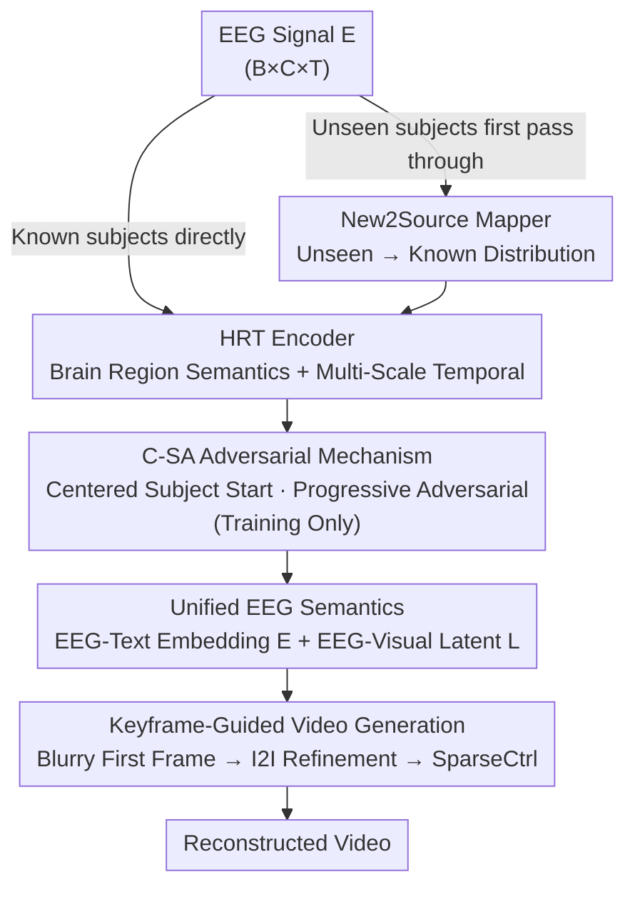

# Cross-Subject EEG-to-Video Reconstruction and Beyond

**Conference**: CVPR 2026  
**Paper**: [CVF Open Access](https://openaccess.thecvf.com/content/CVPR2026/html/Han_Cross-Subject_EEG-to-Video_Reconstruction_and_Beyond_CVPR_2026_paper.html)  
**Code**: None  
**Area**: Video Generation / Brain Signal Decoding (EEG-to-Video)  
**Keywords**: EEG-to-Video, Cross-Subject, Adversarial Domain Alignment, Brain Region Temporal Encoding, New Subject Generalization

## TL;DR
To tackle the issue of cross-subject video reconstruction collapse caused by the inherent semantic inconsistency of EEG distributions across different subjects, this paper proposes SAM-Net. It extracts semantics using a Hybrid Region-Temporal (HRT) encoder modeling both brain regions and multi-scale temporal dynamics. It aligns all subjects into a unified representation space via Centered Subject-guided Progressive Adversarial (C-SA) training, which starts from a centralized subject and incrementally incorporates other subjects. An adversarial New2Source Mapper is then employed to map the EEG of unseen subjects to the distribution of known subjects. Finally, a keyframe-guided SparseCtrl generates coherent videos. SAM-Net outperforms EEG2Video and DynaMind in both cross-subject and unseen-subject scenarios on the SEED-DV dataset.

## Background & Motivation
**Background**: Reconstructing visual content from brain signals primarily proceeds along two pathways: fMRI and EEG. Due to its portability, low cost, and high temporal resolution, EEG is more suitable for reconstructing "dynamic" visual content. Prior work EEG2Video established the SEED-DV dataset and pioneered the EEG-to-video pipeline, while DynaMind further enhanced temporal consistency by explicitly modeling brain region interactions and temporal dynamics.

**Limitations of Prior Work**: Existing approaches are almost exclusively trained and evaluated under the **single-subject** setting—training a specific model for each subject, which fails when applied to a new individual. The fundamental barrier lies in the severe **inter-subject variability** of EEG signals. For the same visual stimulus, EEG semantic distributions vary drastically across subjects due to biological differences, electrode placement, equipment variations, and stray noise (as shown by distinct clustering of individual subjects in the t-SNE plot of Fig. 1-a). Furthermore, existing methods often lack explicit modeling of brain priors (e.g., functional specialization of brain regions, multi-scale neurological dynamics), failing to capture fine-grained neural patterns distributed across specific brain regions and timescales.

**Key Challenge**: To achieve cross-subject transfer, a **unified EEG semantic representation that generalizes to completely unseen subjects** is required. However, the direct alignment is hindered by massive domain shifts among subjects, and unseen subjects present the dual challenge of unfamiliar distributions and extremely scarce data (as EEG collection is expensive and time-consuming). Existing cross-subject methods either allocate specialized encoding branches to each subject (unscalable as subject count grows), rely on multi-expert/memory banks for heterogeneous information (introducing massive storage and computational overhead, mostly designed for fMRI while ignoring EEG temporal profiles), or force all subjects to align with a "target subject" as in emotion recognition (where selecting an ambiguous target subject arbitrarily can derail the entire alignment).

**Goal**: The objective is split into three sub-problems: (1) extracting robust spatio-temporal semantics utilizing brain priors from EEG; (2) unifying multiple known subjects into a stable representation without relying on an arbitrarily designated target subject; (3) rapidly adapting the model to unseen subjects under data scarcity without disrupting the representations already learned from known subjects.

**Key Insight + Core Idea**: Instead of randomly designating an alignment target, the authors **first compute a "centered subject" most representative of the entire cohort, and then incrementally perform adversarial training by pulling other subjects in from near to far** (C-SA). Rather than fine-tuning the entire model for unseen subjects (which would disturb representations of known subjects), the model **only performs semantic mutual mapping between unseen and known subjects at the encoding stage** (New2Source). On the generation end, the EEG semantics are plugged into the keyframe-controlled SparseCtrl to bridge the modality gap between EEG and text/visual domains.

## Method

### Overall Architecture
The input to SAM-Net is the EEG signal $E \in \mathbb{R}^{B \times C \times T}$ (batch size, electrode channel count, time steps), and the outputs are two aligned targets: aligned EEG-Text embeddings $\mathcal{E} \in \mathbb{R}^{B \times 77 \times 768}$ and aligned EEG-Visual latents $L$. Supervision signals are obtained by encoding video frames into latents using a VAE, and video descriptions generated by BLIP into embeddings using a CLIP text encoder. The HRT encoder is trained to align with both. The overall pipeline is: EEG (for unseen subjects, first mapped via the New2Source Mapper) $\rightarrow$ HRT encoder to extract brain region and multi-scale temporal semantics (with C-SA adversarial loss during training) $\rightarrow$ obtain EEG-Text embeddings and EEG-Visual latents $\rightarrow$ decode a blurry first frame from the latent, refined via I2I into a keyframe $\rightarrow$ feed keyframe, latent, and embeddings into a T2V model like SparseCtrl to generate the final video.

### Key Designs

**1. HRT Encoder: Explicitly Injecting Brain Priors into EEG Representations with Brain Region Partitioning and Multi-Scale Temporals**

To address the limitation that existing methods do not model functional brain regions and multi-scale temporal dynamics, the Hybrid Region-Temporal (HRT) encoder operates in three stages. First, **EEG Enhancement** is applied to suppress subject-specific interference: adding Gaussian noise to simulate inter-subject variations, forcing the model to ignore individual-specific traits and capture cross-subject invariant stimulus responses, followed by random dropout on electrode channels, formalized as $E_{Augment} = \text{RD}(E + N(\mu, \sigma^2))$. Second, **Region-guided Semantic Perception**: neuroscience indicates that different brain regions respond differently to varied visual stimuli (e.g., natural landscapes vs. architecture vs. fast-moving objects), and region-based representations are more robust than single-electrode ones. It first weighs electrodes via electrode channel attention $W_{Electrode} = \sigma(\mathbb{L}(\text{ReLU}(\mathbb{L}(\mathcal{AP}(\mathcal{E}_{Augment})))))$, and then divides electrodes anatomically into **five brain regions: Frontal, Parietal, Central, Temporal, and Occipital**. Each region features a dedicated convolutional extractor (Conv1D+GELU+BN+Dropout) to extract local features, which are then concatenated and passed through a linear layer to obtain $\mathcal{E}_{Spatial}$. Third, **Multi-scale Temporal Dependency Perception**: "slowly walking people" and "fast-moving cars" in EEG span wildly different temporal scales. Thus, a learnable Query is used, and a multi-scale 1D CNN is applied along the temporal dimension for the Key: $K_{tem} = \|_{i \in \{5,11,21\}}[\text{Conv}_i(K)]$. Attention is then computed as $\mathcal{E}_{temporal} = \bigcirc_{l=1}^{L}\text{Transformer}[\text{Softmax}(\frac{Q^T \cdot K_{tem}}{\sqrt{d}}) \cdot V]$ to capture semantic dependencies across time steps. Ablation studies confirm that the occipital lobe (controlling vision) has the highest impact, followed by the temporal lobe (controlling language), aligning with neurological priors.

**2. Centered Subject-guided Progressive Subject Adversarial (C-SA): Finding the "Centered Subject" First, then Aligning Others Progressively**

This is the core cross-subject unification mechanism in this paper, addressing the pain point of misalignment caused by arbitrary targets. Step 1: **Find the Centered Subject**. Calculate the mean feature vector of EEG samples for each subject: $f_i = \frac{1}{n}\sum_{j=1}^n x_{ij}$. Use cosine distance $d(i,j) = 1 - \frac{f_i \cdot f_j}{\|f_i\|\|f_j\|}$ to measure physical-space distance between subjects, and select the one with the highest average similarity to all other subjects as the centered subject: $c^* = \arg\max_{i \in S}\{\frac{1}{|S|-1}\sum_{j \neq i}\text{sim}(i,j)\}$. Its distribution represents the group commonality best and is far more stable than a random start. Step 2: **Progressive Integration**. Initialize the active set $C_0 = \{c^*\}$, and in each epoch, select the subject from the remaining pool $R_t$ closest to the current active set: $r_t^* = \arg\min_{r \in R_t} d_{\min}(r, C_t)$ (from easy to hard). Each added subject is funneled into $C_t$ for joint HRT training until all subjects are integrated. Step 3: **Adversarial Alignment**. To further eliminate individual differences, a **Gradient Reversal Layer (GRL) + Subject Classifier** is appended for domain adversarial training. The classifier minimizes cross-entropy loss $\mathcal{L}_{subject} = -\sum_{k=1}^K y_{ik}\log(\hat{y}_{ik})$ to predict the subject source, while the GRL multiplies the gradient by $-\lambda$ during backpropagation ($\frac{\partial \text{GRL}(f)}{\partial f} = -\lambda I$). This forces the HRT encoder to **maximize** subject classification loss, thereby learning **subject-invariant representations** that deceive the subject classifier and flatten inter-subject distribution differences in the latent space. Ablation shows that removing C-SA causes the steepest drop in performance (40-class video 2-way drops from 0.841 to 0.799); replacing the centered subject with a fixed subject or training on all subjects simultaneously (no progressive strategy) also degrades performance significantly.

**3. New2Source Mapper: Mapping Unseen Subjects to Known Subject Distributions at the Encoding Stage, Enabling Generalization with Scarce Data**

To address the issue where unseen subjects introduce significant domain shifts and direct fine-tuning degrades known subjects' performance due to data scarcity, the authors freeze the main model and train only a lightweight mapping network. The core idea is to **simulate** unseen subjects using multiple known subjects and combine them with sparse real data from the target unseen subject. Step 1: Train a Source2New mapper using known subjects to project known subjects $\mathcal{S}^p$ to simulate unseen subjects, optimized via $\mathcal{L}_{S2N} = \text{MSE}(\mathcal{S}^p_{new}, \mathcal{S}^{p*}_{new})$, where $p$ is the ratio of actual unseen subject data available (set to 15% in experiments). Step 2: Apply the trained Source2New mapping to the remaining $(1-p)\%$ of known subject data to generate more simulated unseen subject EEGs $\mathcal{S}^{(1-p)*}_{new}$. Step 3: Train the **New2Source Mapper** (mapping unseen subjects back to the known subject distribution) on the combined "simulated + real" unseen subject data registry, optimized via $\mathcal{L}_{N2S} = \text{MSE}(\mathcal{S}, \mathcal{S}^*)$. During inference, the EEG of an unseen subject passes through the New2Source Mapper first to align with the known subject distribution before entering HRT. This "borrows" the known subject cohort to complete mapping with minimal real data, avoiding large-scale retraining. Removing New2Source causes unseen subject metrics to plunge (e.g., 40-class video 40-way accuracy drops from 0.162 to 0.118, and SSIM drops from 0.257 to 0.199).

**4. Keyframe-Guided Coherent Semantic Video Generation: Grafting EEG Semantics to SparseCtrl to Bridge the E2V and T2V Modality Gap**

To address the modality gap where EEG and text/visual embeddings cannot directly drive standard Text-to-Video (T2V) pipelines, the authors leverage SparseCtrl (which utilizes sparse keyframe control for T2V) with two adaptations. First, **Self-Generated Keyframes**: The HRT encoder outputs the first frame's latent $L_0$, and the VAE decodes a **blurry first frame** $BF = \text{VAE}(L_0)$ as a structural anchor (retaining global composition and spatial layouts decoded directly from the EEG). Subsequently, the EEG-Text embedding $\mathcal{E}$ and $BF$ are fed into an Image-to-Image (I2I) refiner to yield a sharp, semantically consistent keyframe $KF = \text{I2I}(\mathcal{E}, \text{VAE}(L_0))$, effectively defining the layout first before filling in detailed textures. Second, **Substituting Noise Inputs**: Traditional T2V models start from random noise, but there is a task gap between E2V and T2V. The authors substitute the random noise with the EEG-Visual latent $L$ (providing prior layout and color information) and use $\mathcal{E}$ as semantic guidance, leading to the final output $Video = \text{T2V}(\mathcal{E}, L, KF)$. Ablation indicates that removing the embedding (`w/o Embedding`) is fatal (causing a dramatic drop in 40-class classification due to the loss of semantic guidance), omitting the latent mostly degrades SSIM (losing color/structure), and omitting keyframes hurts both classification and visual similarity metrics.

### Loss & Training
Two-stage training. **Stage One**: Train the HRT encoder to learn cross-subject invariant semantics and align with text/visual modalities: $\mathcal{L}_1 = \mathcal{L}_{task} + \lambda \mathcal{L}_{subject}$, where $\mathcal{L}_{task} = \text{MSE}(\mathcal{E}, \text{HRT}(E)) + \text{MSE}(L, \text{HRT}(E))$ aligns EEG semantics with BLIP text embedding and VAE video latent, and $\mathcal{L}_{subject}$ is the C-SA subject adversarial term. **Stage Two**: Train the New2Source Mapper. First, train the Source2New mapping with $\mathcal{L}_{S2N}$, and then train the New2Source mapping with $\mathcal{L}_{N2S}$ to perform cross-subject interactive semantic alignment for unseen subject generalization.

## Key Experimental Results

The dataset is SEED-DV (20 subjects watching video clips of 40 visual concept categories). Cross-subject setup: first 15 as known source subjects, last 5 as unseen target subjects. Evaluated on 10/20/30/40-class subsets using video-based/frame-based semantic metrics (2-way, 40-way classification accuracy) and pixel-level SSIM.

### Main Results (Cross-Subject vs. Single-Subject SOTA, 40 Classes)

| Setting | Method | Video 2-way↑ | Video 40-way↑ | Frame 2-way↑ | Frame 40-way↑ | SSIM↑ |
|------|------|------|------|------|------|------|
| SS | DynaMind | 0.828 | 0.284 | 0.807 | 0.241 | 0.280 |
| SS | EEG2Video | 0.798 | 0.159 | 0.774 | 0.138 | 0.256 |
| SS | **Ours** | **0.870** | **0.300** | **0.833** | **0.303** | **0.290** |
| CS | Ours (Best) | 0.860 | 0.291 | 0.834 | 0.301 | 0.279 |
| CS | Ours (Average) | 0.841 | 0.228 | 0.810 | 0.262 | 0.280 |

In the single-subject setting, SAM-Net comprehensively outperforms EEG2Video and DynaMind. More importantly, under the harder **cross-subject (CS)** setting, its Best performance is close to or even matches the single-subject performance of previous SOTAs (e.g., CS Best's frame 40-way of 0.301 is superior to both baselines' SS of 0.241/0.138).

### Unseen Subject Reconstruction (New2Source, on the 5 unseen subjects only)

| No. of Classes | Video 2-way↑ | Video 40-way↑ | Frame 2-way↑ | Frame 40-way↑ | SSIM↑ |
|------|------|------|------|------|------|
| 10 (Best) | 0.833 | 0.143 | 0.820 | 0.225 | 0.300 |
| 40 (Best) | 0.826 | 0.162 | 0.745 | 0.136 | 0.257 |
| 40 (Average) | 0.812 | 0.142 | 0.735 | 0.137 | 0.254 |

Even on completely unseen subjects, the model yields acceptable reconstructions (40-class SSIM 0.254), attributed to the New2Source alignment projecting unseen subjects back to the known subject distribution.

### Ablation Study

| Configuration | Video 2-way↑ | Video 40-way↑ | Frame 40-way↑ | SSIM↑ | Note |
|------|------|------|------|------|------|
| Ours (40-class CS) | 0.860 | 0.291 | 0.301 | 0.279 | Full model |
| w/o HRT | 0.796 | 0.179 | 0.140 | 0.222 | Without brain region + temporal encoding, complete performance drop |
| w/o Occipital | 0.820 | 0.261 | 0.261 | 0.245 | Without occipital lobe (visual control), drops the most |
| w/o Temporal | 0.824 | 0.269 | 0.255 | 0.243 | Without temporal lobe (language control), second largest drop |
| w/o Embedding | 0.774 | 0.090 | 0.092 | 0.239 | Missing semantic guidance, 40-way drops sharply |
| w/o Latent | 0.845 | 0.273 | 0.282 | 0.189 | Missing color/structure, SSIM drops sharply |
| w/o KeyFrame | 0.839 | 0.262 | 0.276 | 0.231 | Both classification and visual metrics decrease |

C-SA and New2Source Ablations (Table 4, Average setting): Removing C-SA drops metrics from 0.841/0.228 to 0.799/0.186. Substituting the centered subject with a fixed subject or omitting progressive incorporation also degrades scores. On unseen subjects, omitting New2Source causes metrics to drop from 0.162/0.257 to 0.118/0.199.

### Key Findings
- **C-SA provides the largest contribution**: Removing it leads to significant degradation across all metrics. The "centered subject starting point" and "progressive incorporation from near-to-far" both show positive contributions, validating the strategy of avoiding randomly designated targets.
- **Brain region priors align with biological intuition**: The importance hierarchy of Occipital (visual) > Temporal (language) suggests that the brain region semantics learned by HRT are anatomically grounded, rather than mere artifact fitting.
- **The three generation conditions are complementary**: Embeddings govern semantics (without which classification collapses), latents handle color and structure (without which SSIM collapses), and keyframes provide structural anchors (without which both suffer).

## Highlights & Insights
- **"Centered Subject + Progressive Adversarial" introduces curriculum learning into domain adversarial training**: By choosing the geometric center of the group as an anchor and progressively pulling other subjects in, this method avoids training instabilities caused by forcing highly discrepant subjects into joint adversarial training from the beginning. This curriculum-style domain alignment can readily transfer to any scenario with massive domain shifts across multiple source domains (e.g., multi-device medical signals or multi-sensor time-series).
- **Unseen subject adaptation without backbone retraining**: Adapting unseen subjects without fine-tuning the backbone solves both the scarcity of target data and catastrophic forgetting of known subjects' representations. It represents an elegant "frozen backbone + plug-in adapter" paradigm.
- **Replacing random noise with EEG latents in T2V**: An ingenious bridging strategy. It exploits the control capability of SparseCtrl while directly injecting prior layout/color from EEG on initialization, avoiding the strict modality gap of EEG-to-Text representation translation.

## Limitations & Future Work
- **Reliance on a single dataset**: All evaluations rely on SEED-DV. Generalization across datasets or acquisition hardwares (varying electrode configurations, sampling rates) is yet to be assessed, which is crucial for proving commercial cross-subject viability.
- **Absolute performance remains low**: The 40-way semantic accuracy at 0.3 for cross-subject and 0.14 for unseen subjects suggests we are far from arbitrary robust visual reconstruction, hindered by the low signal-to-noise ratio and information bottleneck of EEG.
- **Centered subject relies on simple mean statistics**: Identifying the center using cosine distances of mean EEG features is sensitive to outlier noise and intra-subject variance. If the population naturally forms multiple clusters, a single center is insufficient, suggesting future exploration in multi-center/clustered progressive alignment.
- **Generation quality bounded by SparseCtrl**: Frame consistency and resolution are inherited from the pre-trained T2V model. The contribution of EEG is mostly limited to semantic layout guidance, with complex motions or long videos remaining challenging.

## Related Work & Insights
- **vs. EEG2Video**: EEG2Video pioneered EEG-to-video reconstruction on SEED-DV, but restricted evaluation to single-subject settings. This work inherits its data and generation blueprint, with its core contributions being the unified representation (C-SA) and generalization to unseen subjects (New2Source).
- **vs. DynaMind**: DynaMind also models brain interactions and temporal dynamics for temporal consistency but ignores cross-subject challenges. Our HRT encoder builds upon brain region partitions and multi-scale temporal modeling while introducing domain-adversarial loss to enforce subject-invariant features.
- **vs. Emotion recognition methods that align towards target subjects (e.g., [27])**: These address cross-subject discrepancies by closing the distance of all subjects to a specified target subject. However, random target selection is prone to drifting, and fine-tuning causes representation degradation in known subjects. We address this by replacing the target with a "cohort center" and leveraging an encoder-only mapping strategy.
- **vs. Multi-individual encoders / Multi-expert memory banks (fMRI cross-subject methods)**: These models create unique encoding branches or heterogeneous memory slots, demanding high storage/compute overhead, and are mostly designed for static components of fMRI instead of temporal EEG. Our unified encoder with a lightweight mapper scales significantly better.

## Rating
- Novelty: ⭐⭐⭐⭐ It systematically introduces the "centered progressive subject adversarial + parameter-free mapper for unseen subjects" into cross-subject EEG-to-Video generation; the block combinations are solid.
- Experimental Thoroughness: ⭐⭐⭐⭐ Ablations covering cross-subject, unseen-subject, component-wise brain regions, and generating conditions are complete, though limited to the single SEED-DV dataset.
- Writing Quality: ⭐⭐⭐⭐ Motivations strictly address each of the limitations in a logically cohesive way; some formulas in OCR texts were cluttered but well-structured here.
- Value: ⭐⭐⭐⭐ Resolving the cross-subject bottleneck is essential to real-world neural visual decoding. This study proposes an extensible and retraining-free solution, carrying high research value.

<!-- RELATED:START -->

## Related Papers

- [\[ICLR 2026\] BindWeave: Subject-Consistent Video Generation via Cross-Modal Integration](../../ICLR2026/video_generation/bindweave_subject-consistent_video_generation_via_cross-modal_integration.md)
- [\[CVPR 2026\] UniAVGen: Unified Audio and Video Generation with Asymmetric Cross-Modal Interactions](uniavgen_unified_audio_and_video_generation_with_asymmetric_cross-modal_interact.md)
- [\[CVPR 2026\] Accelerating Diffusion-based Video Editing via Heterogeneous Caching: Beyond Full Computing at Sampled Denoising Timestep](accelerating_diffusion-based_video_editing_via_heterogeneous_caching_beyond_full.md)
- [\[CVPR 2026\] SMRABooth: Subject and Motion Representation Alignment for Customized Video Generation](smrabooth_subject_and_motion_representation_alignment_for_customized_video_gener.md)
- [\[CVPR 2026\] RecEdit-Drive: 3D Reconstruction-Guided Spatiotemporal Video Editing for Autonomous Driving Scenes](recedit-drive_3d_reconstruction-guided_spatiotemporal_video_editing_for_autonomo.md)

<!-- RELATED:END -->
