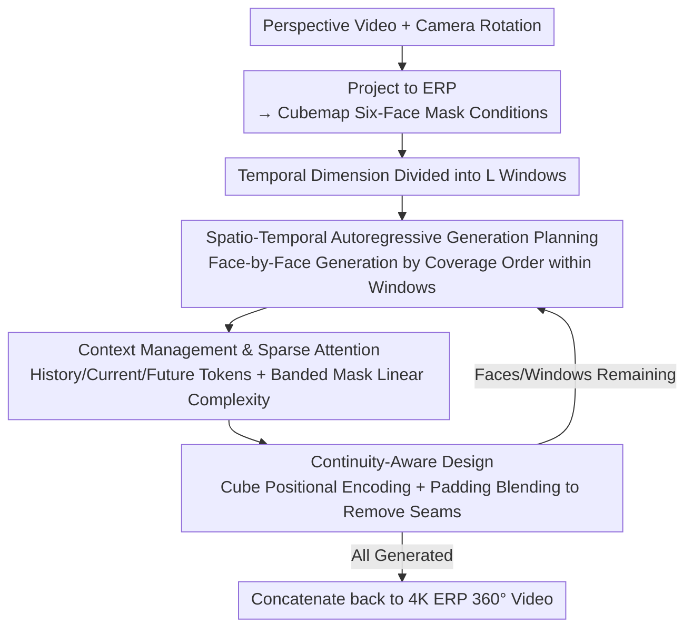

# CubeComposer: Spatio-Temporal Autoregressive 4K 360° Video Generation from Perspective Video

**Conference**: CVPR 2026  
**arXiv**: [2603.04291](https://arxiv.org/abs/2603.04291)  
**Code**: [Project Page](https://lg-li.github.io/project/cubecomposer)  
**Area**: Video Generation / 360° Panoramic Video  
**Keywords**: 360° Video Generation, Cube Mapping, Spatio-Temporal Autoregressive, Diffusion Model, 4K Native Generation

## TL;DR

Ours proposes CubeComposer, which decomposes 360° video into a cubemap six-face representation and generates it in a spatio-temporal autoregressive manner. It achieves native 4K (3840×1920) 360° panoramic video generation from perspective video for the first time, eliminating the need for post-processing super-resolution.

## Background & Motivation

Immersive VR applications require high-quality 360° panoramic videos, but existing 360° video generation methods are limited by the computational overhead of vanilla diffusion models:
- Existing methods reach a maximum native resolution of $\leq$1K (approx. 1024×512), relying on external super-resolution modules to increase resolution.
- External upsampling lacks intrinsic generative reasoning capability, often introducing error cascades that result in high resolution but insufficient detail.
- The VRAM and computational overhead of full-attention diffusion models make native high-resolution generation unfeasible.

**Core Problem**: How to achieve native 4K resolution 360° video generation under controllable VRAM overhead?

## Method

### Overall Architecture

The **Key Challenge** addressed by CubeComposer is that full-attention diffusion models cannot handle the VRAM required for native 4K 360° video, while external super-resolution loses details and causes cascading errors. The **Core Idea** is to decompose 360° video into six cubemap faces (F/R/B/L/U/D) and solve it as a **spatio-temporal autoregressive** problem by generating face-by-face and window-by-window. The input perspective video $\{I_t^{\mathrm{pers}}\}_{t=1}^N$ (with camera rotation) is first projected to Equirectangular Projection (ERP) and then converted to a cubemap six-face representation to obtain mask conditions. The temporal dimension is divided into $L$ windows (each of length $T_{\mathrm{win}}$). Within each window, faces are generated in descending order of coverage. Each step generates a video segment for a single face, which are finally concatenated back into a 4K ERP. The system is trained based on Wan 2.2 5B.

### Key Designs

**1. Spatio-Temporal Autoregressive Generation Order Planning: Prioritize Information-Rich Faces**

Face-by-face generation risks error accumulation if early faces lack conditional information. Ours generates the temporal dimension in causal order, while the spatial dimension is sorted by the coverage rate of the perspective video on each face: $c_{f,w} = \frac{1}{T_{\mathrm{win}}} \sum_{t=s_w}^{e_w-1} \langle M_{f,t} \rangle_{(i,j)}$. Higher coverage implies more sufficient conditions from the perspective video. By determining faces with the highest certainty first, geometric, appearance, and motion cues naturally propagate to subsequent uncertain faces, avoiding errors caused by uninformed generation.

**2. Context Management & Sparse Attention: Dynamic Context Selection with Linear Complexity**

The context $\mathbf{u}_{w,f}$ for generating a face consists of three parts: (a) History tokens—generated content from previous $H$ windows; (b) Current window tokens—perspective conditions of generated and ungenerated faces; (c) Future segment tokens—dynamically selected nearest temporal segments from spatially adjacent future faces with coverage exceeding threshold $r$. To mitigate the cost of full self-attention, a sparse context attention is designed: the generation sequence (length $G$) uses full self-attention, while the context sequence (length $C$) is fully attended by the generation sequence but uses a diagonal banded local mask with bandwidth $K$ for its own attention. This reduces context self-attention complexity from $O(C^2)$ to $O(C \cdot K)$ linear complexity. Ablations show selective context performs better (FVD 4.26 vs 5.23) than full token context.

**3. Continuity-Aware Design: Eliminating Seams Between Cubemap Faces**

Independent autoregressive generation of faces easily leads to seam artifacts. Ours employs two designs: first, **Cube-Aware Positional Encoding**, which remaps spatial indices for RoPE based on the unfolded cubemap topology (e.g., Top of U-face starts at 0, F-face at $R$, D-face at $2R$), allowing the model to explicitly perceive face topology; second, **Cube-Aware Padding & Blending**, which uses strips from adjacent faces to perform topologically aligned padding on current face latents during generation, followed by weighted average blending in pixel space for overlapping regions.

### Loss & Training

- Flow-matching objective to predict the velocity field: $\mathcal{L} = \mathbb{E}_{t,\mathbf{z}_0}\left[\|\mathbf{v}_\theta(\mathbf{z}_t, t; \mathbf{u}_{w,f}, y) - \mathbf{v}_t\|^2\right]$
- Autoregressive processes are simulated on ground-truth 360° videos by randomly sampling windows and faces during training.
- Supports global prompts and optional face-wise prompt conditions; face-wise captions are used randomly during training.
- 4K360Vid dataset contains 11,832 high-quality 4K 360° video clips, with captions generated by Qwen3-VL and low-quality content filtered.

## Key Experimental Results

### Main Results

| Method | Resolution | LPIPS↓ | CLIP↑ | FID↓ | FVD↓ | Aesthetic↑ | Imaging Quality↑ |
|------|--------|--------|-------|------|------|----------|----------|
| Argus | 1K | 0.407 | 0.886 | 141.2 | 4.08 | 0.372 | 0.427 |
| Argus+VEnhancer | 2K | 0.469 | 0.858 | 169.0 | 6.13 | 0.360 | 0.429 |
| CubeComposer | 2K | **0.370** | **0.923** | **119.1** | 3.90 | 0.398 | **0.521** |
| CubeComposer | 4K | 0.383 | 0.911 | 130.9 | **2.22** | **0.405** | **0.562** |

Ours significantly outperforms all baseline methods on both 4K360Vid and ODV360 datasets without relying on super-resolution post-processing.

### Ablation Study

| Config | FVD↓ | FID↓ | LPIPS↓ | CLIP↑ |
|------|------|------|--------|-------|
| Full Model | **4.26** | **125.6** | **0.425** | **0.891** |
| w/o Future tokens | 6.04 | 128.3 | 0.452 | 0.888 |
| Full token context | 5.23 | 116.6 | 0.416 | 0.896 |
| w/o Cube Pos. Enc. | 4.47 | 201.4 | 0.550 | 0.855 |
| w/o Padding Blending | 4.37 | 190.3 | 0.560 | 0.841 |

### Key Findings

- Future segment tokens are critical for temporal consistency (FVD drops from 4.26 to 6.04 without them).
- The full model outperforms the full-token model in FVD (4.26 vs 5.23), indicating selective context is more effective than full context.
- Both continuity designs are essential; removing either leads to severe seam artifacts.

## Highlights & Insights

- Ingeniously models 360° video generation as a spatio-temporal autoregressive problem on cubemap faces, resolving the VRAM bottleneck for native high-resolution generation.
- Coverage-guided spatial order planning is a core innovation—generating the most certain faces first naturally propagates information to subsequent faces.
- The sparse context attention design is simple and efficient; its linear complexity makes long context feasible.
- The 4K360Vid dataset itself is a significant contribution (11K+ videos with captions).

## Limitations & Future Work

- Inference latency for autoregressive face-by-face generation is relatively high; reducing diffusion steps or exploring streaming generation is possible.
- Cubemap representation still exhibits some distortion near the poles.
- Temporal consistency in fast-moving scenes may be suboptimal.
- Currently relies on known camera rotations; scenes without rotation estimation require additional processing.

## Related Work & Insights

- Compared to 360° video generation methods like Argus/Imagine360/ViewPoint, CubeComposer is the first to break the 1K resolution limit.
- Adds spatial-dimension autoregressive design compared to temporal-only autoregressive models (e.g., StreamDiffusion).
- The sparse attention design can be transferred to other video generation tasks requiring long contexts.

## Rating

- Novelty: ⭐⭐⭐⭐ The cubemap spatio-temporal autoregressive framework is novel; coverage-guided ordering and sparse attention are cleverly designed.
- Experimental Thoroughness: ⭐⭐⭐⭐ Two datasets, detailed ablations, and comparison with multiple baselines.
- Writing Quality: ⭐⭐⭐⭐ Clear diagrams, systematic and formalized method description.
- Value: ⭐⭐⭐⭐ First native 4K 360° video generation, offering practical value for VR content creation.

<!-- RELATED:START -->

## Related Papers

- [\[ICLR 2026\] Lumos-1: On Autoregressive Video Generation with Discrete Diffusion from a Unified Model Perspective](../../ICLR2026/video_generation/lumos-1_on_autoregressive_video_generation_with_discrete_diffusion_from_a_unifie.md)
- [\[CVPR 2026\] Pantheon360: Taming Digital Twin Generation via 3D-Aware 360° Video Diffusion](pantheon360_taming_digital_twin_generation_via_3d-aware_360_video_diffusion.md)
- [\[ICLR 2026\] JavisDiT: Joint Audio-Video Diffusion Transformer with Hierarchical Spatio-Temporal Prior Synchronization](../../ICLR2026/video_generation/javisdit_joint_audio-video_diffusion_transformer_with_hierarchical_spatio-tempor.md)
- [\[CVPR 2026\] I'm a Map! Interpretable Motion-Attentive Maps: Spatio-Temporally Localizing Concepts in Video Diffusion Transformers](interpretable_motion-attentive_maps_spatio-temporally_localizing_concepts_in_vid.md)
- [\[CVPR 2026\] LottieGPT: Tokenizing Vector Animation for Autoregressive Generation](lottiegpt_vector_animation_generation.md)

<!-- RELATED:END -->
