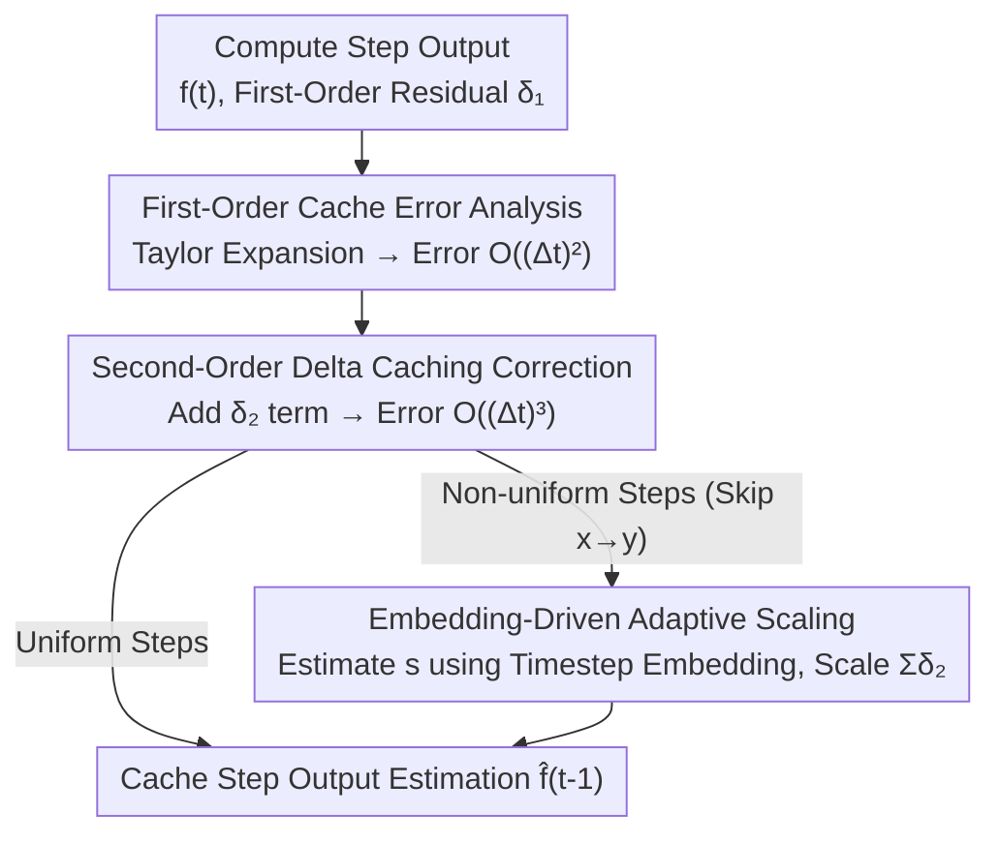

# D2Cache: Second-Order Delta Caching for Higher Video Diffusion Acceleration

**Conference**: CVPR 2026  
**Paper**: [CVF Open Access](https://openaccess.thecvf.com/content/CVPR2026/html/Liu_D2Cache_Second-Order_Delta_Caching_for_Higher_Video_Diffusion_Acceleration_CVPR_2026_paper.html)  
**Code**: https://github.com/VG-Huai/D2Cache  
**Area**: Video Diffusion Acceleration  
**Keywords**: Video Diffusion, Cache Acceleration, Second-Order Residual, Training-Free, DiT  

## TL;DR
D2Cache is a training-free, plug-and-play video diffusion cache acceleration method. It identifies that the "second-order difference" (residual of the first-order residuals) between outputs of adjacent timesteps is significantly smoother than the first-order residual. By adding a second-order correction term to the first-order residual reuse, the method reduces cache prediction error from $O((\Delta t)^2)$ to $O((\Delta t)^3)$. Furthermore, it utilizes scaling factors estimated from timestep embeddings to adapt to non-uniform skipping. At the same acceleration ratio, its VBench score is 0.4%–2.5% higher than the SOTA method, TeaCache.

## Background & Motivation
**Background**: DiT-based video diffusion models (such as Latte, Open-Sora, LTX-video, Wan2.1) exhibit impressive visual quality. However, they require dozens or hundreds of sequential denoising steps, often taking minutes per video on a single GPU, which precludes real-time generation. Training-free caching acceleration has become a popular direction; it leverages the high similarity of model outputs across adjacent timesteps to reuse intermediate results and skip redundant computations, typically achieving 1.5×–4× speedups.

**Limitations of Prior Work**: Currently, nearly all caching methods (TeaCache, DiCache, FasterCache, PAB, EasyCache, etc.) are essentially **first-order residual reuse**—they directly use the first-order residual $\delta_1$ calculated from the previous computation step to estimate the next output. The error of such methods is of the order $O((\Delta t)^2)$, which **accumulates** when crossing multiple cache steps. More skips lead to larger errors, forcing a trade-off between speed and quality: higher speed requires more caching, but visual quality (VBench) drops, resulting in blurred details and incoherent motion. The paper notes that first-order error modeling has approached its theoretical limit, and further threshold optimization cannot break this ceiling.

**Key Challenge**: First-order caching only utilizes "first-order derivative" information (the difference between adjacent outputs) and ignores curvature (second-order terms). This leads to a second-order error of $\frac{1}{2}f''(t)$ being discarded at every skip, which is further amplified by spatio-temporal dependencies in long sequences or complex dynamic scenes.

**Key Insight**: The authors treat the discrete denoising process as a continuous function $f(t)=\epsilon_\theta(x_t,t)$. Taylor expansion reveals that while first-order residuals $\delta_1$ are highly similar, the **second-order difference** $\delta_2$ (the difference between adjacent first-order residuals) is much smoother: it has smaller magnitudes and flatter fluctuations, with a variance approximately 90% lower than the first-order in experiments. This smoothness persists across different skipping intervals, meaning $\delta_2$ can be stably predicted and reused to compensate for the curvature term lost in first-order methods.

**Core Idea**: Building upon first-order residual reuse, a "second-order delta caching" correction term is added to increase the prediction error order by one ($O((\Delta t)^2)\to O((\Delta t)^3)$). An adaptive scaling factor derived from timestep embeddings is used to adapt this correction to real-world non-uniform skipping. This results in a plug-and-play plugin that requires no model modification, no training, and incurs nearly zero additional overhead.

## Method

### Overall Architecture
D2Cache sits on top of existing caching strategies (e.g., TeaCache, EasyCache). The original first-order branch calculates the ground-truth output and caches the first-order residual $\delta_1$ during "compute steps," then extrapolates using $\delta_1$ during "cache steps." D2Cache adds a "second-order branch" to maintain a cache of the second-order difference $\delta_2$. During extrapolation, the accumulated $\delta_2$ (adjusted by a scaling factor $s$) is added for curvature correction. The method does not alter the underlying compute/cache scheduling strategy but replaces the estimation formula with a second-order version, resulting in a speedup ratio nearly identical to the original method but with lower error.

The pipeline comprises three stages: Taylor analysis of first-order caching errors, second-order delta caching correction for continuous steps, and embedding-driven scaling for non-uniform skipping.

### Key Designs

**1. Taylor Error Analysis of First-Order Caching: Formalizing the $O((\Delta t)^2)$ Drop**

This step provides the theoretical foundation for the improvement by answering what first-order caching misses. Denoting the model output as a continuous function $f(t)=\epsilon_\theta(x_t,t)$ and defining the first-order backward difference as $\delta_1(t)=f(t)-f(t+1)$, first-order caching assumes $\delta_1$ is smooth ($\delta_1(t)\approx\delta_1(t-1)$) and extrapolates via $\hat f^{(1)}(t-1)=f(t)+\delta_1(t)$. Expanding $f(t-1)$ and $f(t+1)$ at $t$ via Taylor series:

$$f(t-1)=f(t)-f'(t)+\tfrac{1}{2}f''(t)+O((\Delta t)^3),\quad f(t+1)=f(t)+f'(t)+\tfrac{1}{2}f''(t)+O((\Delta t)^3)$$

Substituting these yields $\delta_1(t)=-f'(t)-\tfrac{1}{2}f''(t)+O((\Delta t)^3)$. The local error of the first-order prediction is:

$$e_1(t)=f(t-1)-\hat f^{(1)}(t-1)=f''(t)+O((\Delta t)^3)=O((\Delta t)^2)$$

Thus, first-order caching loses a second-order curvature term $f''(t)$ at each step. This explicit form makes the path of "adding a second-order term to eliminate it" logically straightforward—representing the first theoretical analysis of delta caching for diffusion.

**2. Second-Order Delta Caching: Recovering Curvature to Reduce Error to $O((\Delta t)^3)$**

Since the second-order term is missing, it should be estimated and added. The authors define the **second-order difference** as $\delta_2(t)=\delta_1(t)-\delta_1(t+1)$, which measures the change in the first-order residual itself. A key observation (Figure 3) is that the magnitude of $\delta_2$ is significantly smaller than $\delta_1$ and its fluctuations are smoother (variance ~90% lower). Thus, the assumption that "$\delta_2$ changes slowly over timesteps" ($\delta_2(t)\approx\delta_2(t-1)$) is more reliable than the first-order counterpart. Based on this, a second-order predictor is proposed:

$$\hat f^{(2)}(t-1)=f(t)+\delta_1(t)+\delta_2(t)$$

Theorem 1 in the paper proves that under the second-order smoothness assumption, the local truncation error $e_2(t)=f(t-1)-\hat f^{(2)}(t-1)=O((\Delta t)^3)$ is one order higher than the first-order's $O((\Delta t)^2)$, and $\|e_2(t)\|\le c\,\Delta t\,\|e_1(t)\|$ for sufficiently small $\Delta t$. Intuitively, while first-order caching only aligns the slope of the curve, second-order caching also aligns the curvature, allowing the extrapolated trajectory (L2 trajectory in Figure 5) to more closely follow the ground-truth denoising path.

**3. Embedding-Driven Adaptive Scaling: Validating Second-Order Correction for Non-Uniform Skipping**

The previous points assume continuous single-step extrapolation, but real acceleration involves **irregular intervals** between computation steps. If computation steps are at $t$ and $t-x$, and the cache step is at $t-y$ ($x<y$), the known accumulated sum $\sum_{k=1}^{x}\delta_2(t-k)$ must be used to estimate the unknown $\sum_{k=1}^{y-x}\delta_2(t-x-k)$. Although $\delta_2$ is generally smooth, local jitter exists and is amplified over longer skips. Directly using the accumulated sum causes distortion, necessitating a scaling mechanism to compensate for interval differences.

The authors follow the intuition from TeaCache, observing that the magnitude of the second-order delta is also strongly correlated with timestep embeddings (verified in Figure 4). Defining modulated inputs $F_t=\mathrm{Modulate}(x_t,t)$, the relative L1 distance $\mathrm{L1rel}(F,t)=\|F_t-F_{t+1}\|_1/\|F_{t+1}\|_1$ serves as a raw proxy for the scale of $\delta_2(t)$. This is mapped through a polynomial fit $p(\cdot)$ to obtain an error proxy $e_t=p(\mathrm{L1rel}(F,t))$. The scaling factor is the ratio of the accumulated sums of $e_t$ over the two intervals:

$$s=\frac{\sum_{k=1}^{y-x}e_{t-x-k}}{\sum_{k=1}^{x}e_{t-k}}$$

The final non-uniform step estimation is:

$$\hat f(t-y)=f(t-y+1)+\delta_1(t-x)+s\cdot\sum_{k=1}^{x}\delta_2(t-k)$$

This uses $s$ to scale the "second-order quantity accumulated in the known interval" to the magnitude expected in the "target interval," preserving second-order accuracy at any skip length. Ablation shows $s$ is critical for maintaining quality at high acceleration; removing it results in a 1.72% drop in VBench.

### Loss & Training
Training-free. D2Cache is purely an inference-time plugin: no change to model weights, training pipeline, or underlying cache scheduling (thresholds and compute/cache decisions follow the enhanced baseline, e.g., TeaCache's slow/fast/superfast thresholds). It only replaces the output estimation formula and maintains a $\delta_2$ cache, with an additional overhead of < 0.3s.

## Key Experimental Results

### Main Results
Testing on 4 video diffusion models using the same strategy and thresholds as TeaCache (with D2Cache only replacing the estimation formula), the table below highlights the "superfast" setting (where error accumulation is most severe). VBench: higher is better; speedups and latency are nearly identical.

| Model (superfast) | Speedup | Latency(s) | VBench | Quality | Image | Aesthetic |
|------------------|--------|---------|--------|---------|-------|-----------|
| Latte / TeaCache | 3.62× | 9.33 | 75.61% | 77.88% | 54.97% | 57.36% |
| Latte / **D2Cache** | 3.61× | 9.35 | **76.03%** | **78.26%** | **58.64%** | **59.15%** |
| Open-Sora 1.2 / TeaCache | 2.86× | 20.55 | 77.07% | 77.88% | 54.16% | 54.48% |
| Open-Sora 1.2 / **D2Cache** | 2.82× | 20.85 | **77.47%** | **78.26%** | **58.26%** | **54.85%** |
| LTX-video / TeaCache | 3.54× | 23.45 | 70.92% | 76.50% | 43.79% | 47.40% |
| LTX-video / **D2Cache** | 3.52× | 23.58 | **73.42%** | **78.85%** | **50.83%** | **50.06%** |
| Wan2.1 / TeaCache | 3.63× | 73.71 | 79.70% | 83.35% | 67.18% | 62.00% |
| Wan2.1 / **D2Cache** | 3.63× | 73.75 | **80.12%** | **83.93%** | **67.62%** | **63.18%** |

Under nearly identical speedup ratios and latencies (extra overhead < 0.3s), D2Cache consistently outperforms in VBench, with gains of 0.4%–2.5%. LTX-video (161-frame long sequence) shows the largest gain (+2.5%), confirming that second-order correction is most beneficial when sequences are long and error accumulation is severe. Gains mainly come from Image (+1.7%–7.04%) and Aesthetic (+0.77%–2.66%), indicating that the correction recovers details blurred by first-order caching.

### Ablation Study
Ablation of scaling factor $s$ on Latte / superfast:

| Config | Latency(s) | VBench | Quality | Semantic | Note |
|------|---------|--------|---------|----------|------|
| D2Cache (Full) | 9.35 | 76.03% | 78.26% | 67.10% | Full method |
| D2Cache (w/o $s$) | 9.35 | 74.31% | 76.93% | 63.84% | No adaptive scaling |
| First-order (≈TeaCache) | 9.33 | 75.61% | 77.88% | — | No second-order correction |

### Key Findings
- **Scaling factor $s$ is vital for high acceleration**: Without $s$, VBench drops by 1.72% (76.03%→74.31%) and Semantic by 3.26%. Without scaling, the second-order sum amplifies jitter in non-uniform steps, performing worse than first-order (75.61%), proving that second-order correction requires interval compensation.
- **Higher speedup leads to more significant advantages**: At the "slow" setting, D2Cache and TeaCache are nearly equal. At "superfast," the gap widens, aligning with the premise that second-order terms address long-interval cumulative errors.
- **VBench underestimates real differences**: The authors tested 50 complex prompts on Wan2.1 using sharpness metrics (Laplacian variance / Tenengrad / Brenner). D2Cache's LV is 746.39 (only +1.7% difference from no-cache 734.21), whereas TeaCache-superfast drops 15.4% in LV, 33.3% in Tenengrad, and 22.5% in Brenner. This quantifies the "blurring" artifacts visible to the naked eye.

## Highlights & Insights
- **"Residue of residue is smoother" is a clean, transferable observation**: Moving from first-order to second-order cache draws on the intuition that high-order differences are smoother and uses Taylor expansion to clarify error orders. This could theoretically extend to third-order or higher.
- **Theoretical and Engineering Alignment**: The paper formalizes the first-order error as $O((\Delta t)^2)$, identifies the missing $f''(t)$ term, and accurately compensates with $\delta_2$.
- **Reusing TeaCache's Embedding Proxy**: Instead of creating a new mechanism for scaling $\delta_2$, the authors leverage the existing L1rel + polynomial fitting from TeaCache, making integration nearly zero-cost.
- **Truly Plug-and-Play**: No changes to scheduling, weights, or training. With < 0.3s overhead, it acts as a "quality patch" for existing methods like TeaCache and EasyCache, making it highly adoptable.

## Limitations & Future Work
- **Quality Ceiling Constrained by Baseline**: Since D2Cache only modifies the estimation formula and not the scheduling, its speedup ceiling is still defined by the baseline. It provides better quality at a given speed rather than higher speed itself.
- **Boundary of Second-Order Smoothness**: While $\delta_2$ variance is 90% lower in tested tasks, its performance under extreme motion, scene cuts, or extreme prompts remains to be fully explored. ⚠️ Gains are primarily visible at high acceleration (superfast); in low-acceleration scenarios (slow), its marginal value is limited.
- **Reliance on Polynomial Proxy**: The reliability of $s$ depends on the correlation between $\delta_2$ and embeddings. Whether this proxy needs re-fitting for different models is not extensively discussed.
- **Metrics for Complex Scenes**: VBench is insensitive to blur; the authors used sharpness proxies, but these are no-reference metrics that do not fully capture semantic or motion accuracy.

## Related Work & Insights
- **vs TeaCache**: TeaCache uses embeddings for non-uniform first-order estimation. D2Cache acts as an enhancement rather than a replacement by adding second-order correction on top of it.
- **vs ∆-DiT / PAB / EasyCache**: These focus on structural or block-level caching at a first-order level ($O((\Delta t)^2)$). D2Cache is the first to address **residual order**, reaching $O((\Delta t)^3)$.
- **vs Step Reduction / Distillation / Sparse Attention**: DDIM-like methods introduce artifacts at low step counts; distillation (e.g., AccVideo) requires training resources; sparse attention is an orthogonal optimization. D2Cache is training-free and complementary to these approaches.

## Rating
- Novelty: ⭐⭐⭐⭐⭐ First to push diffusion caching to second-order residuals with theoretical proofs of error order.
- Experimental Thoroughness: ⭐⭐⭐⭐ Covered 4 models, 3 acceleration levels, and multiple metrics; however, more boundary testing on the smoothness assumption would be beneficial.
- Writing Quality: ⭐⭐⭐⭐⭐ Logical flow from Taylor analysis to correction and scaling; formulas and figures are well-integrated.
- Value: ⭐⭐⭐⭐⭐ Training-free, plug-and-play, and near-zero overhead "quality patch" with direct practical value for real-time video diffusion.

<!-- RELATED:START -->

## Related Papers

- [\[ICCV 2025\] D3: Training-Free AI-Generated Video Detection Using Second-Order Features](../../ICCV2025/video_generation/d3_training-free_ai-generated_video_detection_using_second-order_features.md)
- [\[CVPR 2026\] DisCa: Accelerating Video Diffusion Transformers with Distillation-Compatible Learnable Feature Caching](disca_accelerating_video_diffusion_transformers_wi.md)
- [\[CVPR 2026\] A Frame is Worth One Token: Efficient Generative World Modeling with Delta Tokens](a_frame_is_worth_one_token_efficient_generative_world_modeling_with_delta_tokens.md)
- [\[CVPR 2026\] Accelerating Diffusion-based Video Editing via Heterogeneous Caching: Beyond Full Computing at Sampled Denoising Timestep](accelerating_diffusion-based_video_editing_via_heterogeneous_caching_beyond_full.md)
- [\[ICLR 2026\] Astraea: A Token-wise Acceleration Framework for Video Diffusion Transformers](../../ICLR2026/video_generation/astraea_a_token-wise_acceleration_framework_for_video_diffusion_transformers.md)

<!-- RELATED:END -->
