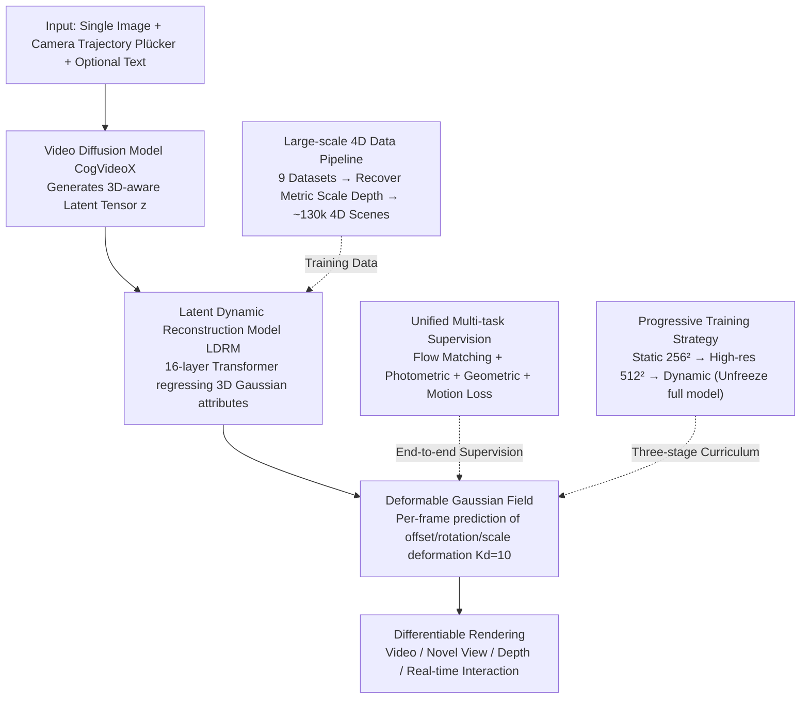

# Diff4Splat: Repurposing Video Diffusion Models for Dynamic Scene Generation

**Conference**: CVPR 2026  
**arXiv**: [2511.00503](https://arxiv.org/abs/2511.00503)  
**Code**: [Project Page](https://paulpanwang.github.io/Diff4Splat)  
**Area**: Video Generation  
**Keywords**: 4D Generation, 3D Gaussian Splatting, Video Diffusion Models, Deformable Gaussian Fields, Feed-forward Generation

## TL;DR

Diff4Splat is proposed as a feed-forward framework that unifies video diffusion models and deformable 3D Gaussian fields into an end-to-end trainable model. it directly generates dynamic 4D scene representations from a single image in approximately 30 seconds, which is 60 times faster than optimization-based methods.

## Background & Motivation

Dynamic 3D scene generation (4D generation) is a core challenge in computer vision with wide applications in immersive content creation, robotics, and simulation. Current methods face a fundamental dilemma:

**Multi-stage pipeline methods**: Generate video with a video diffusion model first, then perform 3D reconstruction. These methods are slow, error-prone, and lack end-to-end control. For example, DimensionX requires several GPU hours, and Mosca requires half an hour.

**Feed-forward generation methods**: While efficient, most are limited to generating 2D video frames or static 3D scenes, failing to capture explicit dynamic 3D geometry.

**Key Challenge**: Lack of a unified framework capable of direct and efficient synthesis of explicit, controllable scene representations.

The motivation for Diff4Splat is to fill this gap—unifying generation and representation into a single forward pass to achieve both feed-forward efficiency and explicit 3D representation.

## Method

### Overall Architecture

The gap Diff4Splat addresses is that multi-stage pipelines (generate video then reconstruct) are slow and error-prone, lacking end-to-end control, while existing feed-forward methods only output 2D frames or static 3D without capturing explicit dynamic geometry. The approach compresses "generation" and "explicit 3D representation" into a single forward pass: given an input image $\mathbf{I}_0$, camera trajectory $\mathcal{P}$ (Plücker coordinates), and an optional text prompt $\mathbf{C}_{ctx}$, it directly predicts a deformable 3D Gaussian field. Inference involves four serial steps—a video diffusion model (CogVideoX) first generates 3D-aware latent tensors, a Latent Dynamic Reconstruction Model (LDRM) decodes latent features into 3D Gaussian attributes, the deformable Gaussian field expresses dynamics using frame-wise deformation, and finally, differentiable rendering outputs video, novel views, or depth. To train this pipeline, three training-side pillars are utilized: a large-scale 4D data pipeline to synthesize training data with metric scale, unified multi-task supervision (Flow Matching + photometric + geometric + motion losses) for end-to-end constraints, and a progressive training strategy (static → high-resolution → dynamic) to stabilize convergence.

### Key Designs

**1. Large-scale 4D Data Pipeline: Addressing the lack of metric scale labels in real-world data**

The primary shortage in 4D training is dynamic data with metric scales. The authors integrate 7 synthetic datasets (TartanAir, MatrixCity, PointOdyssey, etc.) and 2 real-world datasets (RealEstate10K, Stereo4D) to compile approximately 130,000 high-quality 4D scenes. Since real-world data lacks metric scale labels, VideoDepthAnything and MegaSaM are used to recover metric depth, which is then aligned via least squares to resolve scale inconsistencies in real-world training data.

**2. Latent Dynamic Reconstruction Model (LDRM): Direct Gaussian regression via diffusion priors to bypass per-scene optimization**

Per-scene optimization is the root cause of slow speeds. The precursor video diffusion model (CogVideoX) generates 3D-aware latent tensors $\mathbf{z} \in \mathbb{R}^{n \times h \times w \times c}$; the LDRM itself consists of 16 standard Transformer blocks that process concatenated latent tokens and camera pose tokens, followed by a lightweight decoder to regress 3D Gaussian attributes (with a final 3D deconvolution layer mapping attributes back to source video pixels). This leverages the generative priors of the diffusion model to predict 3D structures in a single pass rather than optimizing from scratch for each scene.

**3. Deformable Gaussian Field: Adding inter-frame deformation to static 3DGS for dynamics**

Static 3DGS cannot represent motion. Therefore, an inter-frame deformation model is introduced: for each Gaussian at time step $t$, it predicts displacement $\Delta\boldsymbol{\mu}_p^t$, rotation adjustment $\Delta\mathbf{q}_p^t$, and scale modification $\Delta\mathbf{s}_p^t$, with a deformation parameter dimension of $K_d=10$. LDRM outputs both Gaussian feature maps and deformation maps simultaneously. Both training and inference use an opacity threshold ($\tau=0.005$) for pruning. Ablations show this deformable field is crucial for eliminating ghosting artifacts in dynamic scenes.

**4. Progressive Training Strategy: Gradually unfreezing from static low-resolution to dynamic full models**

Directly training a full dynamic model is expensive and difficult to converge. The authors adopt a three-stage progression: Stage 1 (40K iterations) freezes the deformation module and pre-trains LDRM on static scenes at low resolution (256×256) using only photometric and geometric losses; Stage 2 (40K iterations) continues with the frozen deformation module at high resolution (512×512) to refine reconstruction fidelity; Stage 3 (20K iterations) unfreezes the full model to fine-tune on dynamic datasets using the complete loss suite including motion loss. This "static → high-resolution → dynamic" sequence reduces training time by approximately 3x compared to direct dynamic training and yields better results.

### Loss & Training

The total loss is a weighted sum of four terms:

$$\mathcal{L} = \mathcal{L}_{FM} + \lambda_{photo}\mathcal{L}_{photo} + \lambda_{geo}\mathcal{L}_{geo} + \lambda_{motion}\mathcal{L}_{motion}$$

- **Flow Matching Loss** $\mathcal{L}_{FM}$: Applied only to video diffusion model parameters, fine-tuning on 4D annotated data for latent space alignment.
- **Photometric Loss** $\mathcal{L}_{photo}$: MSE + LPIPS ($\lambda_p=0.5$), optimizing appearance consistency between rendered and ground truth images.
- **Geometric Loss** $\mathcal{L}_{geo}$: Pearson correlation loss for depth + Total Variation smoothing loss, weighted by $\lambda_{geo}=0.5$.
- **Motion Loss** $\mathcal{L}_{motion}$: Based on 3D point tracking data (directly available for synthetic data, obtained via CoTracker for real data), using L2 + L1 regularization, weighted by $\lambda_{motion}=2.0$.

Training utilizes AdamW with a learning rate of $10^{-5}$, taking about 7 days on 32 A100 GPUs.

## Key Experimental Results

### Main Results

| Method | FVD↓ | KVD↓ | CLIP-Score↑ | Reconstruction Time |
|------|------|------|-------------|----------|
| CameraCtrl | 478.2 | 8.11 | 19.37 | 20s |
| AC3D | 339.4 | 6.34 | 20.67 | 28s |
| AC3D + Mosca† | 236.0 | 2.01 | 20.21 | **45min** |
| **Diff4Splat** | **210.2** | **2.32** | **23.12** | **30s** |

| Method | Avg Matches↑ | Subj. Consist.↑ | Bg. Consist.↑ | Time↓ |
|------|-------------|----------------|---------------|-------|
| AC3D + Mosca† | 4500.7 | 86.23 | 90.43 | 45min |
| **Diff4Splat** | **5114.2** | **88.32** | **89.89** | **30s** |

| Method | RPE(Translation)↓ | RPE(Rotation)↓ | NVS | Depth | Real-time Interaction |
|------|-------------------|----------------|-----|------|----------|
| AC3D | 3.001 | 0.810 | ✓ | ✗ | ✗ |
| **Ours** | **0.012** | **0.008** | ✓ | ✓ | ✓ |

### Ablation Study

| Configuration | FVD↓ | KVD↓ | Avg Matches↑ | Description |
|------|------|------|-------------|------|
| w/o motion loss | 351.4 | 3.35 | 4821.6 | Significant performance drop without motion loss |
| Full model | **210.2** | **2.32** | **5114.2** | Complete model is optimal |

### Key Findings

1. Feed-forward generation takes only 30 seconds, approximately **90x faster** than optimization methods (Mosca 45 minutes).
2. Outperforms optimization methods in both video quality (FVD) and geometric consistency (Avg Matches).
3. Explicit 3DGS representation reduces camera pose error by 250x (RPE Translation: 3.001 → 0.012).
4. The deformable Gaussian field is essential for eliminating ghosting artifacts in dynamic scenes.
5. The progressive training strategy saves 3x training time and achieves superior effects compared to direct dynamic training.

## Highlights & Insights

- **Novelty**: First to unify video diffusion models and deformable 3DGS into a feed-forward framework, completely eliminating per-scene optimization.
- **Efficiency**: 30 seconds vs. 45 minutes brings dynamic 3D scene generation to a practical level for the first time.
- **Data Pipeline**: Constructed a large-scale 4D dataset of 130k scenes with metric scale annotations, planned for open source.
- **Function**: A single model supports video generation, novel view synthesis, depth extraction, and real-time interaction simultaneously.
- **Mechanism**: The spatial relationship head mimics molecular gradients in embryonic development guiding cell differentiation.

## Limitations & Future Work

1. Training cost remains high (32×A100, 7 days), hindering rapid iteration.
2. Sensitivity to CogVideoX latent space design; scalability to higher resolutions or longer sequences is unverified.
3. Metric depth for real data depends on VideoDepthAnything and MegaSaM accuracy, posing risks of error propagation.
4. Currently only supports generation from a single image; extending to multi-view input conditions is worth exploring.
5. The motion representation is limited to simple displacement + rotation + scale deformation, which may be insufficient for topological changes (e.g., objects appearing/disappearing).

## Related Work & Insights

- CogVideoX as a video diffusion backbone demonstrates the potential of video generation priors for 3D understanding.
- The combination of 3DGS + deformation fields provides high-quality real-time rendering for dynamic scenes.
- Progressive training strategies (static → high-resolution → dynamic) are effective engineering practices for handling complex tasks.
- Scalable to downstream applications such as robotics simulation and VR/AR content creation.

## Rating

- Novelty: ⭐⭐⭐⭐⭐ — First feed-forward 4D generation unifying diffusion and deformable 3DGS.
- Experimental Thoroughness: ⭐⭐⭐⭐ — Comprehensive multi-dimensional evaluation, though comparison with more feed-forward 4D methods is missing.
- Writing Quality: ⭐⭐⭐⭐ — Clear structure and detailed method description.
- Value: ⭐⭐⭐⭐⭐ — Significant efficiency gains with strong practical utility.

<!-- RELATED:START -->

## Related Papers

- [\[CVPR 2026\] Content-Aware Dynamic Patchification for Efficient Video Diffusion](content-aware_dynamic_patchification_for_efficient_video_diffusion.md)
- [\[CVPR 2026\] PerpetualWonder: Long-horizon Action-conditioned 4D Scene Generation](perpetualwonder_long-horizon_action-conditioned_4d_scene_generation.md)
- [\[CVPR 2026\] CineScene: Implicit 3D as Effective Scene Representation for Cinematic Video Generation](cinescene_implicit_3d_as_effective_scene_representation_for_cinematic_video_gene.md)
- [\[CVPR 2026\] Goal-Driven Reward by Video Diffusion Models for Reinforcement Learning](goal-driven_reward_by_video_diffusion_models_for_reinforcement_learning.md)
- [\[CVPR 2026\] Geometry-as-context: Modulating Explicit 3D in Scene-consistent Video Generation to Geometry Context](geometry-as-context_modulating_explicit_3d_in_scene-consistent_video_generation_.md)

<!-- RELATED:END -->
