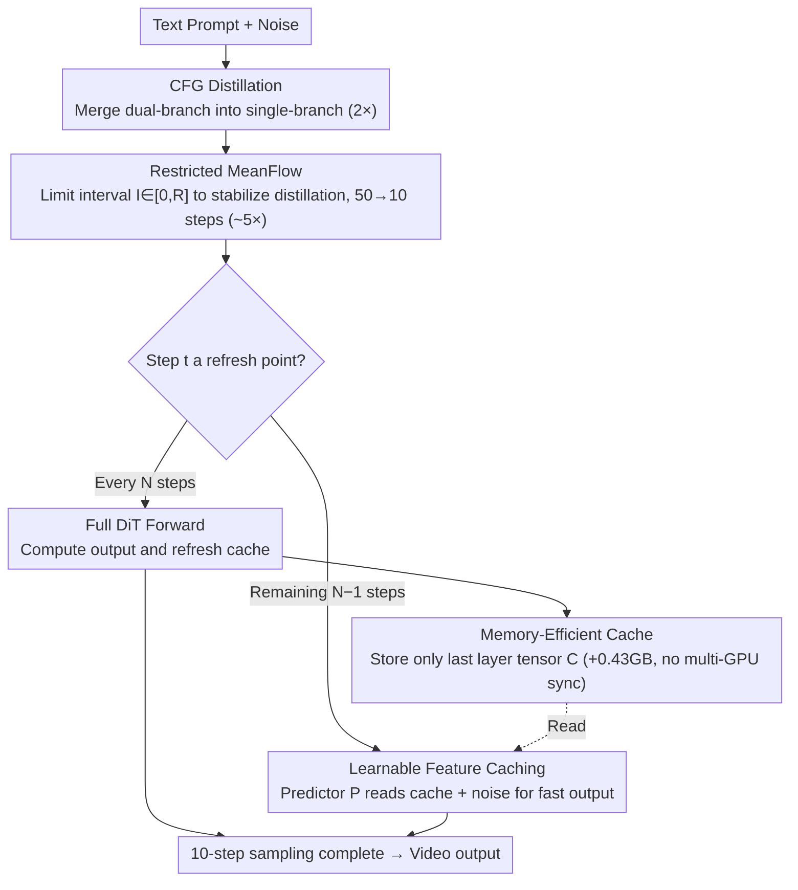

# DisCa: Accelerating Video Diffusion Transformers with Distillation-Compatible Learnable Feature Caching

**Conference**: CVPR 2026  
**arXiv**: [2602.05449](https://arxiv.org/abs/2602.05449)  
**Code**: Coming soon  
**Area**: Video Generation / Diffusion Model Acceleration  
**Keywords**: Feature Caching, Step Distillation, MeanFlow, Learnable Predictor, HunyuanVideo

## TL;DR

DisCa for the first time unifies learnable feature caching and step distillation into a compatible framework, replacing manual caching strategies with a lightweight neural predictor (<4% model parameters). Accompanied by Restricted MeanFlow to stabilize the distillation of large-scale video DiTs, it achieves 11.8× near-lossless acceleration on HunyuanVideo.

## Background & Motivation

**Background**: The generation quality of video diffusion models (e.g., HunyuanVideo) has reached SOTA levels, but inference remains extremely slow. For HunyuanVideo, a 50-step CFG inference to generate a 5-second 704×704 video takes 1155 seconds. Existing acceleration methods mainly follow two paths: **step distillation** to reduce sampling steps (e.g., MeanFlow), and **feature caching** to skip redundant computations (e.g., TaylorSeer, TeaCache).

**Limitations of Prior Work**: Regarding step distillation, MeanFlow performs excellently in image generation, but its original aggressive design (aiming for single-step generation) combined with JVP numerical errors leads to training divergence and severe artifacts when applied to large-scale video DiTs—resulting in a 17.1% drop in semantic scores for 10-step generation. Regarding feature caching, traditional methods rely on inter-step feature similarity for reuse or Taylor expansion prediction. However, distilled sparse trajectories significantly increase feature differences between adjacent steps, causing simple manual strategies to fail completely—TaylorSeer suffers a 13.3% semantic score decrease in high acceleration scenarios.

**Key Challenge**: These two acceleration paths have individual limitations and are difficult to make compatible. The sparse trajectories from distillation break the inter-step redundancy assumptions relied upon by caching methods; simply stacking the two strategies results in worse performance than using either alone.

**Goal**: How to make step distillation and feature caching truly compatible and complementary to achieve extreme acceleration on large-scale video DiTs without sacrificing quality.

**Key Insight**: Replace manual caching formulas with a learnable neural predictor to capture high-dimensional feature evolution; meanwhile, stabilize the distillation process by restricting the compression range of MeanFlow.

**Core Idea**: Although the feature evolution after distillation exceeds the modeling capacity of manual methods like Taylor expansion, a lightweight neural network can still accurately learn these high-dimensional evolution patterns.

## Method

### Overall Architecture

DisCa aims to solve a seemingly contradictory problem: step distillation and feature caching are individually effective but perform poorly when combined, as distillation sparsifies the sampling trajectory and destroys the "inter-step redundancy" assumption. DisCa reorganizes these into a three-stage cascaded pipeline where they complement each other.

At the input, **CFG Distillation** is first used to merge conditional/unconditional dual-branch inference into a single branch (2× acceleration). In the middle, **Restricted MeanFlow** performs step distillation to compress 50-step sampling down to 10 steps (~5× acceleration). Finally, **Learnable Feature Caching** employs a lightweight predictor to handle the sparse distilled trajectory—performing a full forward pass only every $N$ steps to "refresh" the cache, while the intermediate $N-1$ steps are handled by the fast predictor. The synergy of these three levels finally achieves 11.8× near-lossless acceleration on HunyuanVideo.

### Key Designs

**1. Restricted MeanFlow: Stabilizing Aggressive Step Distillation with Interval Constraints**

Directly applying MeanFlow to large-scale video DiTs leads to training divergence, with semantic scores plummeting by 17.1% at 10 steps. The issue is that MeanFlow samples the average velocity interval $\mathcal{I}=(t-r)$ all the way to $[0,1]$ for single-step generation. The high complexity of video DiTs amplifies JVP numerical errors, and excessive time intervals (high compression ratios) allow errors to accumulate. Restricted MeanFlow's fix is simply changing the sampling range: it introduces a restriction factor $\mathcal{R}\in(0,1)$ to constrain the interval to $\mathcal{I}\in[0, \mathcal{R}]$, effectively discarding training samples with excessive compression ratios ($\mathcal{R}=0.2$ is optimal). Instead of forcing the model to learn global average velocity, it focus on learning local average velocity stably and concatenating results across multiple steps—resulting in a 12.0% recovery in semantic score for 10-step scenarios.

**2. Learnable Feature Caching: Neural Predictors for Complex Feature Evolution**

After distillation, inter-step feature differences exceed the modeling limits of manual formulas like Taylor expansion, which explains TaylorSeer's 13.3% semantic score drop. DisCa posits that while these high-dimensional non-linear evolutions cannot be manually calculated, data-driven networks can learn them. It trains a lightweight predictor $\mathcal{P}$ with only 2 DiT Blocks (<4% of the main model parameters). It takes the cache $\mathcal{C}$ from the previous full computation and current noise $x_{t'}$ as input to predict the current average velocity output. A key difference: while TaylorSeer maintains multi-order derivative caches for every layer (consuming an additional 33.5GB VRAM), DisCa replaces "complex cache structures" with the "learning capacity of the predictor," requiring only a single cache tensor from the last layer (only +0.43GB).

**3. Memory-Efficient Caching: Avoiding Communication Bottlenecks in Distributed Parallelism**

Beyond VRAM, there are hidden costs in distributed deployment. In a sequence parallel environment (degree 4), maintaining multi-tensor caches for every layer requires cross-GPU synchronization at every step, which can negate any computational savings. DisCa avoids caching every layer and only retains the model's final output tensor as a cache for the predictor. This reduces extra VRAM to 0.43GB and completely eliminates cross-card synchronization, making it the only solution that satisfies both VRAM and latency constraints in real-world deployment.

### A Functional Example: Generating a Video with N=4

Suppose 10-step sampling after distillation and a cache interval $N=4$. Step 1 performs a full DiT forward pass and stores the last layer tensor in cache $\mathcal{C}$. Steps 2, 3, and 4 skip the base model entirely; the lightweight predictor $\mathcal{P}$ reads $\mathcal{C}$ and current noise $x_{t'}$ to produce results quickly. At step 5, another full forward pass is performed to refresh $\mathcal{C}$, and the cycle repeats. Only 3 full DiT passes occur (steps 1/5/9) out of 10, with the predictor handling the other 7—this is the source of the additional acceleration stacked on top of the 5× from distillation.

### Loss & Training

Predictor training uses a two-stage MSE + GAN strategy:

- **MSE Stage** (500 iter): Minimize the L2 distance between predictor output and the base model's ground truth output.
  $$\mathcal{L}_\mathcal{P} = \mathbb{E}\|\mathcal{M}_{\theta_M}(x_{t'}, r', t') - \mathcal{P}_{\theta_p}(\mathcal{C}, x_{t'}, r', t')\|_2^2$$
- **GAN Stage** (1000 iter): Introduce a multi-scale spectral-normalized discriminator $\mathcal{D}$ for adversarial training using Hinge Loss to ensure predictor outputs retain high-frequency details and visual fidelity. The base model itself acts as a feature extractor $\mathcal{F}$ for adversarial training in feature space.
- Hyperparameters: Predictor LR $10^{-4}$, Discriminator LR $10^{-2}$, Adversarial weight $\lambda=1.0$.

## Key Experimental Results

### Main Results

Experiments were conducted on HunyuanVideo, generating 5-second videos at 704×704 resolution with 129 frames, evaluated via VBench.

**Restricted MeanFlow Comparison** (vs. original MeanFlow baseline):

| Method | Steps | Gain | Semantic↑ | Quality↑ | Total↑ |
|------|------|--------|---------|---------|-------|
| Original 50 steps | 50×2 | 1.0× | 73.5% | 81.5% | 79.9% |
| MeanFlow 20 steps | 20 | 4.96× | 66.6% | 81.8% | 78.8% |
| Restricted MeanFlow (R=0.2) 20 steps | 20 | 4.97× | **70.4% (+5.7%)** | 81.8% | 79.5% |
| MeanFlow 10 steps | 10 | 9.68× | 60.9% | 80.6% | 76.7% |
| Restricted MeanFlow (R=0.2) 10 steps | 10 | 9.68× | **68.2% (+12.0%)** | 81.3% | 78.7% |

**Full Comparison of DisCa and Existing Acceleration Methods**:

| Method | Gain | Peak VRAM | Semantic↑ | Quality↑ | Total↑ |
|------|--------|-----------|---------|---------|-------|
| Original 50 steps | 1.0× | 99.23GB | 73.5% | 81.5% | 79.9% |
| Δ-DiT (N=8) | 4.55× | 97.68GB | 42.7% (-41.9%) | 70.9% | 65.2% |
| PAB (N=8) | 6.46× | 121.3GB | 56.3% (-23.4%) | 76.1% | 72.1% |
| TeaCache (l=0.4) | 9.22× | 97.70GB | 62.1% (-15.5%) | 78.7% | 75.4% |
| TaylorSeer (N=6) | 6.96× | 130.7GB | 63.7% (-13.3%) | 79.9% | 76.7% |
| FORA (N=6) | 8.01× | 124.6GB | 57.5% (-21.8%) | 76.4% | 72.6% |
| **Ours (R=0.2, N=2)** | **7.56×** | **97.64GB** | **70.8% (-3.7%)** | **81.9%** | **79.7%** |
| **Ours (R=0.2, N=3)** | **8.84×** | **97.64GB** | **70.3% (-4.4%)** | **81.8%** | **79.5%** |
| **Ours (R=0.2, N=4)** | **11.8×** | **97.64GB** | **69.3% (-5.7%)** | **81.1%** | **78.8%** |

### Ablation Study

| Restricted MeanFlow | Learnable Predictor | GAN Training | Semantic↑ | Quality↑ | Total↑ |
|:---:|:---:|:---:|---------|---------|-------|
| ✔ | ✔ | ✔ | 69.3% (+0.0%) | 81.1% (+0.0%) | 78.7% |
| ✘ | ✔ | ✔ | 65.2% (-5.9%) | 80.3% (-1.0%) | 77.3% |
| ✔ | ✘ | — | 67.3% (-2.9%) | 80.5% (-0.7%) | 77.9% |
| ✔ | ✔ | ✘ | 68.5% (-1.2%) | 81.0% (-0.1%) | 78.5% |

### Key Findings

- **Restricted MeanFlow is the Cornerstone**: Training the cache without Restricted MeanFlow on base MeanFlow leads to a 5.9% semantic score drop and "completely unacceptable distortions."
- **Learnable Predictor vs. Training-free Caching**: Even with Restricted MeanFlow, training-free caching still loses 2.9% semantic and 0.7% quality scores—high-dimensional feature evolution requires learning.
- **GAN Training is Indispensable**: Removing adversarial training results in a 1.2% semantic score drop, showing that the combination of MSE and adversarial loss is crucial for semantic fidelity.
- **Superior VRAM Efficiency**: DisCa requires only 97.64GB (+0.43GB extra), vs. 130.7GB (+33.5GB) for TaylorSeer and 124.6GB (+27.4GB) for FORA.

## Highlights & Insights

- DisCa for the first time proves that step distillation and feature caching can be complementary rather than conflicting: the key is to use a learnable predictor to replace the rigid reliance on inter-step redundancy, thereby enabling effective acceleration even on sparse trajectories. This establishes a new route for "training-free + training-aware" synergy in diffusion acceleration.
- The design of Restricted MeanFlow is extremely simple—merely limiting the range of time interval sampling during training—yet it yields a 12.0% increase in semantic score in 10-step scenarios. This reveals an important intuition: for the distillation of large-scale complex models, abandoning extreme compression targets leads to a better global quality-speed trade-off.
- The single-tensor cache design not only saves VRAM but also avoids cross-GPU communication bottlenecks in distributed environments, making DisCa the only solution to meet both VRAM and latency constraints in real-world deployment scenarios.

## Limitations & Future Work

- Requires additional training of the predictor and discriminator (approx. 1500 iter), making it no longer a completely training-free solution; retraining is needed for each base model or resolution change.
- Validation has only been performed on HunyuanVideo; the transferability to other video DiTs (CogVideoX, Wan, etc.) is unknown.
- The restriction factor $\mathcal{R}$ requires manual tuning (0.2 was found optimal), and an adaptive selection strategy is currently lacking.

## Related Work & Insights

- **vs. TaylorSeer**: TaylorSeer uses Taylor expansion to predict cached features, but its performance drops significantly on the sparse trajectories of distilled models (-13.3% semantic score) and has huge VRAM costs (+33.5GB). DisCa solves both modeling capacity and VRAM bottlenecks with a learnable predictor.
- **vs. TeaCache**: TeaCache uses timestep embedding for adaptive caching decisions but still loses 15.5% semantic score at high acceleration ratios. DisCa loses only 5.7% at even higher ratios (11.8× vs 9.22×).
- **vs. MeanFlow**: Original MeanFlow is designed for single-step generation, which is too aggressive for large-scale video models. Restricted MeanFlow achieves stable distillation through a minimalistic interval restriction strategy.

## Rating

- Novelty: ⭐⭐⭐⭐⭐ Proposes the first distillation-compatible learnable caching framework, unifying two major acceleration paths.
- Experimental Thoroughness: ⭐⭐⭐⭐⭐ Comprehensive comparison with 6 methods on HunyuanVideo, clear ablation, and thorough VRAM/latency analysis.
- Writing Quality: ⭐⭐⭐⭐ Clear structure, strong motivation, though notation is dense, the derivation is complete.
- Value: ⭐⭐⭐⭐⭐ 11.8× near-lossless acceleration carries immense value for actual video generation deployment.

<!-- RELATED:START -->

## Related Papers

- [\[ICLR 2026\] BWCache: Accelerating Video Diffusion Transformers through Block-Wise Caching](../../ICLR2026/video_generation/bwcache_accelerating_video_diffusion_transformers_through_block-wise_caching.md)
- [\[CVPR 2026\] Accelerating Diffusion-based Video Editing via Heterogeneous Caching: Beyond Full Computing at Sampled Denoising Timestep](accelerating_diffusion-based_video_editing_via_heterogeneous_caching_beyond_full.md)
- [\[CVPR 2026\] Accelerating Autoregressive Video Diffusion via History-Guided Cache and Residual Correction](accelerating_autoregressive_video_diffusion_via_history-guided_cache_and_residua.md)
- [\[ICLR 2026\] PreciseCache: Precise Feature Caching for Efficient and High-fidelity Video Generation](../../ICLR2026/video_generation/precisecache_precise_feature_caching_for_efficient_and_high-fidelity_video_gener.md)
- [\[ICML 2026\] WorldCache: Accelerating World Models for Free via Heterogeneous Token Caching](../../ICML2026/video_generation/worldcache_accelerating_world_models_for_free_via_heterogeneous_token_caching.md)

<!-- RELATED:END -->
