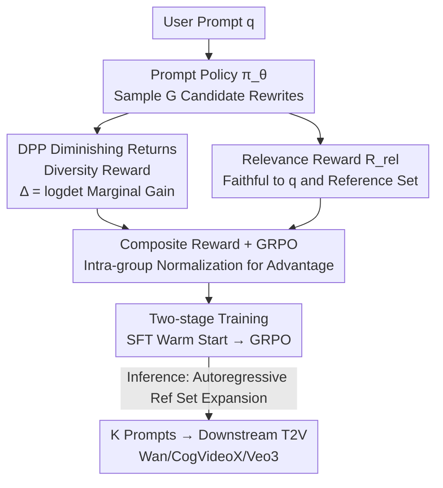

# Diverse Video Generation with Determinantal Point Process-Guided Policy Optimization

**Conference**: CVPR 2026  
**Paper**: [CVF Open Access](https://openaccess.thecvf.com/content/CVPR2026/html/Kazimi_Diverse_Video_Generation_with_Determinantal_Point_Process-Guided_Policy_Optimization_CVPR_2026_paper.html)  
**Code**: https://diverse-video.github.io (Project page, authors declared open-source code + 30K prompt benchmark)  
**Area**: Video Generation / Diffusion Models / Reinforcement Learning Alignment  
**Keywords**: Text-to-Video, Diverse Generation, Determinantal Point Process (DPP), GRPO, set-level policy optimization  

## TL;DR
To address the diversity collapse issue where Text-to-Video (T2V) models produce highly similar results for the same prompt, this paper models "generating a set of diverse videos" as a set-level policy optimization. It uses the marginal gain of a Determinantal Point Process (DPP) to provide a "diminishing returns" diversity reward for each new sample, combined with a relevance reward. A **prompt-rewriting policy model** (rather than the video generator itself) is trained using GRPO, providing a plug-and-play enhancement for Wan2.1 / CogVideoX / Veo3 that significantly improves diversity in camera movement, scenes, and motion without sacrificing fidelity.

## Background & Motivation
**Background**: Text-to-Video (T2V) diffusion models have made rapid progress in image quality and prompt alignment. However, when users sample multiple times for the same prompt to get "a batch of different results," models often repeatedly output videos with highly similar styles, camera movements, and scenes, falling into a narrow distribution.

**Limitations of Prior Work**: Diversity collapse has been studied in image generation, but existing solutions largely fail when transferred to video. Methods based on entropy sampling or noise injection (e.g., SPARKE) rely on **test-time iterative optimization** and caching historical latents, which is too costly for high-dimensional long video sequences. Methods requiring access to the full training set for coverage optimization or modifications to model architecture (group sampling) involve unacceptable computational overhead. More critically, these methods are designed for static images and **ignore video-specific diversity dimensions**—object motion, camera movement, and scene structure—which are essential "cinematic" factors.

**Key Challenge**: Quality rewards (CFG, alignment rewards, standard GRPO) naturally favor "high-reward samples." Advantage normalization pushes probability mass toward a single optimal answer, leading to a **conflict between fidelity and diversity**: higher alignment often results in collapse into a few modes. Users are forced to rely on trial-and-error via prompt engineering or brute-force seed/guidance sweeping, which is time-consuming, computationally expensive, and yields unstable returns.

**Goal**: Given a prompt and a target set size $K$, generate a set of $K$ videos that cover various cinematic variations in motion, composition, and perspective while remaining faithful to the original intent.

**Key Insight**: Instead of backpropagating gradients through the video generator to force diversity (which involves backprop through the entire video sampling process, making it expensive and requiring model modifications), it is better to **optimize only a language policy for prompt rewriting**. Since factors like camera movement and scenes can be naturally controlled via prompt tokens, a prompt-rewriting policy is plug-and-play for any downstream T2V model (open-source or black-box APIs).

**Core Idea**: Transform diversity into an **explicit reward signal**. Use the log-determinant of a DPP to measure the "semantic volume" spanned by a set of samples. The larger the marginal gain of a new sample, the more it fills dimensions not covered by the existing set (diminishing returns: the first "dolly shot" gives a high reward, while subsequent similar variants yield decreasing returns). Use GRPO for intra-group relative feedback, pushing the policy toward "jointly most diverse set" rather than "individually highest reward."

## Method

### Overall Architecture
The method is named **DPP-GRPO**. Given a user prompt $q$, a T2V generator $G$, and a target output count $K$, the goal is to produce a set of prompts $P_q=\{p_1,\dots,p_K\}$ such that the corresponding videos $\{G(p_i)\}$ are both diverse and faithful. The pipeline optimizes a **language policy $\pi_\theta$ for prompt rewriting/expansion** (implemented using Qwen2-7B-Instruct) rather than the video generator.

During training, $G$ candidate rewrites $C_1,\dots,C_G$ are sampled for each prompt. Each candidate is scored by a **composite reward**—DPP marginal diversity gain $\Delta(S\cup C_i)$ plus relevance $R_\text{rel}(C_i)$. Intra-group normalization yields the advantage $A_i$, and the policy is updated using the DPP-GRPO objective. The overall process follows a two-stage "SFT warm start → GRPO reinforcement" approach. During inference, prompts are generated **autoregressively**, with each new prompt added to a reference set to force subsequent candidates to fill uncovered modes.

### Key Designs

**1. Set-level policy optimization in prompt space, not video space**

Instead of modifying the T2V model, only a prompt-rewriting language policy is trained. This directly addresses the cost issue of video diversity: optimizing in prompt space means **no need to backpropagate gradients through video sampling**, significantly reducing training time. Cinematic factors like camera movement, composition, and perspective are naturally controlled by prompt tokens, making prompt perturbation the most natural way to express these dimensions. Furthermore, the output is pure text, compatible with any open-source (Wan, CogVideoX) or black-box (Veo3) model without architectural changes or access to latents/gradients. The efficiency cost is negligible—adding only 0.58s (+0.67% overhead) per video, whereas test-time optimization methods (SPARKE) add +12% and API-based methods (GPT-5) add +26%.

**2. DPP diminishing returns diversity reward: log-det marginal gain for "novelty"**

The core involves using a Determinantal Point Process (DPP) to measure the diversity of a prompt set. Based on L-ensemble definitions, a similarity kernel matrix $L_\phi[p_i,p_j]=f(\phi(p_i),\phi(p_j))$ is constructed, where $\phi(\cdot)$ is a semantic embedding and $f$ is the normalized cosine similarity, with $L_\phi+I$ regularization to avoid singularity. Set diversity is defined as the log-determinant:

$$\text{Div}(p_{1:k})=\log\det\big(L_\phi(p_{1:k})+I\big)$$

This measures the "log-volume" spanned by embedding vectors: more linearly independent (diverse) vectors yield larger volumes. The "diminishing returns" mechanism comes from **marginal gain**—the diversity reward for a candidate $p_i$ relative to a reference set $R_q$ is the volume increment after its addition:

$$\Delta(p_i\mid R_q)=\log\det L_\phi(R_q\cup\{p_i\})-\log\det L_\phi(R_q)$$

If $p_i$ explores dimensions not yet covered by $R_q$, the volume increment and reward are high; if it is redundant, the increment nears zero. Consequently, the first "dolly shot" receives a high reward, while subsequent similar variations see diminishing returns, effectively suppressing redundancy. Here, $R_q$ represents curated ground-truth variants for $q$ that are both faithful and mutually diverse (covering subject changes, camera work, layouts, etc.), teaching the policy to spread candidates across these modes.

**3. Relevance reward: Dual constraints to prevent "divergent diversity"**

Rewarding only diversity could lead the policy to generate varied but irrelevant prompts. The relevance term $R_\text{rel}$ constrains the candidate $p_i$ to be similar to both the original query $q$ and the elements of the reference set $g$:

$$R_\text{rel}=\frac{1}{|R_q|}\sum_{g\in R_q}\cos(\phi(p_i),\phi(q))\cdot\cos(\phi(p_i),\phi(g))$$

The product of two cosines forms a **joint constraint**—high scores require similarity to both the original query and valid variants. For "a dog playing with a ball at the beach," a variant like "a dolly shot of a poodle playing with a red ball at the beach" scores high, while trivial copies or irrelevant variations are penalized. The final composite reward weights both terms:

$$R(p\mid q,g)=\lambda_\text{div}\,\Delta(p_i\mid R_q)+\lambda_\text{rel}\,R_\text{rel}$$

By default, $\lambda_\text{div}=\lambda_\text{rel}=0.5$. These terms handle different failure modes: $\Delta$ prevents diversity collapse, while $R_\text{rel}$ maintains semantic fidelity.

**4. Two-stage training + Autoregressive inference: Feeding rewards into GRPO**

Training begins with an SFT warm start (max 50 iter): the corpus $D=\{(x,y)\}$ consists of "user prompt + diverse variants generated via chain-of-thought" pairs to provide an initial expansion capability. This is followed by GRPO reinforcement (approx. 1200 iter): $G$ rewrites are sampled for a query, scored using the composite reward, and intra-group normalized to find the advantage:

$$A_i=\frac{r_i-\text{mean}(r_{1:G})}{\text{std}(r_{1:G})}$$

This is substituted into the GRPO objective with clipping and KL regularization to update $\pi_\theta$. The policy thus learns a **transferable rule**: how to propose candidates that expand semantic coverage while remaining faithful. Inference mirrors the training structure—initializing an empty reference set $R_q=\varnothing$, generating the first $p_1$ conditioned on $(s,q)$, then **autoregressively** generating $p_2,p_3,\dots$ conditioned on $(s,q,R_q)$, expanding $R_q$ with each step until $K$ prompts are produced.

### Loss & Training
- **Reward**: Composite reward $R=\lambda_\text{div}\Delta+\lambda_\text{rel}R_\text{rel}$, default weights 0.5 each.
- **Objective**: Standard GRPO objective (with importance ratio clip and $\beta\,D_\text{KL}(\pi_\theta\Vert\pi_\text{ref})$).
- **Hyperparameters**: SFT learning rate $2\times10^{-5}$ (50 iter), GRPO learning rate $2\times10^{-7}$ (1200 iter); video guidance scale 6, 40 steps, 81 frames; 4× NVIDIA L40S.
- **Dataset**: 3K base prompts generated via GPT-5-nano, with 10 diverse variants each using an architect+critic agentic pipeline (critic scores via TIE/TCE/CLIP), totaling 30K samples as a first benchmark for this problem.

## Key Experimental Results

Backbones: Wan2.1, CogVideoX (open-source) + Veo3 (black-box). Alignment model: Qwen2-7B-Instruct. Evaluation: 200 prompts from VBench, 20 videos per prompt (4000 total per method). Diversity metrics: TCE (Truncated CLIP Entropy, semantic), TIE (Truncated Inception Entropy, perceptual), VENDI (Eigenvalue entropy for distribution diversity); Quality: VideoScore, VBench. Baselines: Promptist, Prompt-A-Video, GPT-5.

### Main Results (Wan2.1, Diversity + CLIP Alignment)

| Method | TCE↑ | TIE↑ | VENDI↑ | CLIP↑ |
|------|------|------|--------|-------|
| Original prompts | 19.76 | 39.70 | 9.20 | 0.280 |
| Promptist | 19.79 | 37.58 | 8.26 | 0.290 |
| GPT-5 | 16.71 | 29.27 | 8.15 | 0.305 |
| Prompt-A-Video | 15.72 | 24.10 | 8.45 | 0.304 |
| **Ours (DPP-GRPO)** | **31.95** | **49.09** | **11.29** | **0.311** |

Ours leads significantly across all diversity metrics (TCE/TIE/VENDI). Notably, prompt optimization baselines (GPT-5, Prompt-A-Video) actually show lower diversity than the original prompts (higher alignment causing more collapse). This work achieves the highest CLIP alignment while significantly improving diversity, proving no sacrifice in fidelity. CogVideoX shows similar trends (TCE 22.21→27.59, VENDI 8.10→10.30), with the strongest VideoScore.

### Ablation Study (Wan2.1, Reward Decomposition, Table 3)

| Configuration | TCE↑ | TIE↑ | VENDI↑ | CLIP↑ | Description |
|------|------|------|--------|-------|------|
| Ours (SFT only) | 14.05 | 17.13 | 11.05 | 0.251 | Warm start only; weak diversity and alignment |
| Ours (only relevance) | 20.06 | 35.66 | 8.87 | 0.283 | Only relevance → collapses back to repetitive output |
| Ours (only DPP) | 27.05 | 45.21 | 11.72 | 0.255 | Only DPP → high diversity but drop in fidelity |
| **Ours (full)** | **31.95** | **49.09** | 11.29 | **0.311** | Balanced; optimal diversity and fidelity |

### Key Findings
- **Dual rewards are indispensable**: Using only relevance results in collapse (TIE 35.66); using only DPP peaks diversity but drops CLIP to 0.255. The full model succeeds on both dimensions.
- **Virtually free efficiency**: +0.58s (+0.67% overhead) per video, ranking second only to Promptist (+0.51s) and far lower than SPARKE(+12%), Prompt-A-Video(+12%), or GPT-5(+26%).
- **Continuous mode discovery**: While Wan baselines plateau early in diversity, DPP-GRPO shows higher and continuously rising TCE/TIE scores as set size increases, with stable CLIP alignment.
- **Model Agnostic**: Gains observed across Wan / CogVideoX / Veo3; diversity modeling is not tied to a specific diffusion model.
- **Human Evaluation** (10 prompts, 4 clips per set, 5-point Likert): Diversity 4.07, Alignment 4.28, both significantly higher than all baselines.

## Highlights & Insights
- **Explicit "Diminishing Returns" Reward**: The log-det marginal gain of DPP naturally rewards the first new mode and penalizes redundant variants. This characterizes set-level diversity better than pairwise distances and translates "diversity" into a scalar optimized by GRPO.
- **Optimization in Prompt Space**: Simultaneously achieves efficiency (no video backprop), controllability (cinematic tokens), and universality (black-box API support) by "moving the problem."
- **Autoregressive Inference**: Aligned with the training objective where each new sample evaluates marginal gain relative to the "already generated set," allowing the policy to work without curated reference sets at inference.
- **Dual Cosine Joint Constraint**: Use of two-cosine multiplication as a relevance metric effectively suppresses "off-topic" variations while maintaining diversity.

## Limitations & Future Work
- **Temporal Dynamics**: Inherits the limitations of the base model regarding complex temporal dynamics—motion is determined by the generator’s temporal attention, while this method only modifies the prompt.
- **Cinematic vs. Kinematic Diversity**: Diversity stems primarily from semantic/cinematic perturbations. Whether it achieves fine-grained kinematic diversity (different physical movements for the same action) needs further analysis.
- **Dependency on Reference Set $R_q$**: The quality of the curated set (built via GPT-5-nano + agentic pipeline) directly affects learned mode distributions; sensitivity analysis is limited.
- **Metric-Human Alignment**: Evaluation metrics (TCE/TIE/VENDI) lean toward frame-level feature entropy, which may not always perfectly match human-perceived "meaningful diversity."

## Related Work & Insights
- **vs. Image Diversity (SPARKE / Low-density sampling)**: These rely on test-time iteration or model access, incurring high costs and ignoring video-specific dimensions. This work uses prompt-level DPP with near-zero cost.
- **vs. RL-based Video Generation (VideoDPO / Flow-DPO)**: These use RL to improve **individual** video quality or smoothness ("better"). This work optimizes for "more different" sets, marking the first direct attempt at T2V **diversity**.
- **vs. DisCo**: Also uses GRPO + composite rewards but focuses on person-ID repetition. This work addresses general T2V set-level collapse via DPP.

## Rating
- Novelty: ⭐⭐⭐⭐⭐ First work to directly target T2V diversity; clean set-level formulation with DPP marginal gain × GRPO.
- Experimental Thoroughness: ⭐⭐⭐⭐ Coverage across three backbones, human studies, and efficiency; temporal diversity and $R_q$ dependency analysis are slightly thinner.
- Writing Quality: ⭐⭐⭐⭐ Clear chain of logic (motivation-formula-mechanism).
- Value: ⭐⭐⭐⭐⭐ High practical value due to plug-and-play nature, zero cost, and compatibility with black-box APIs, plus a 30K prompt benchmark.

<!-- RELATED:START -->

## Related Papers

- [\[CVPR 2026\] VIVA: VLM-Guided Instruction-Based Video Editing with Reward Optimization](viva_vlm-guided_instruction-based_video_editing_with_reward_optimization.md)
- [\[CVPR 2026\] FlexTraj: Image-to-Video Generation with Flexible Point Trajectory Control](flextraj_image-to-video_generation_with_flexible_point_trajectory_control.md)
- [\[CVPR 2026\] Generative Video Motion Editing with 3D Point Tracks](generative_video_motion_editing_with_3d_point_tracks.md)
- [\[CVPR 2025\] Optical-Flow Guided Prompt Optimization for Coherent Video Generation](../../CVPR2025/video_generation/optical-flow_guided_prompt_optimization_for_coherent_video_generation.md)
- [\[CVPR 2026\] DynamicsBoost: Dynamic Plausible Video Generation via Annotation-Free Continuation Preference Optimization](dynamicsboost_dynamic_plausible_video_generation_via_annotation-free_continuatio.md)

<!-- RELATED:END -->
## Related Papers

- [\[CVPR 2026\] VIVA: VLM-Guided Instruction-Based Video Editing with Reward Optimization](viva_vlm-guided_instruction-based_video_editing_with_reward_optimization.md)
- [\[CVPR 2026\] Identity-Preserving Image-to-Video Generation via Reward-Guided Optimization](identity-preserving_image-to-video_generation_via_reward-guided_optimization.md)
- [\[CVPR 2026\] Generative Video Motion Editing with 3D Point Tracks](generative_video_motion_editing_with_3d_point_tracks.md)
- [\[CVPR 2025\] Optical-Flow Guided Prompt Optimization for Coherent Video Generation](../../CVPR2025/video_generation/optical-flow_guided_prompt_optimization_for_coherent_video_generation.md)
- [\[CVPR 2026\] DynamicsBoost: Dynamic Plausible Video Generation via Annotation-Free Continuation Preference Optimization](dynamicsboost_dynamic_plausible_video_generation_via_annotation-free_continuatio.md)

<!-- RELATED:END -->
