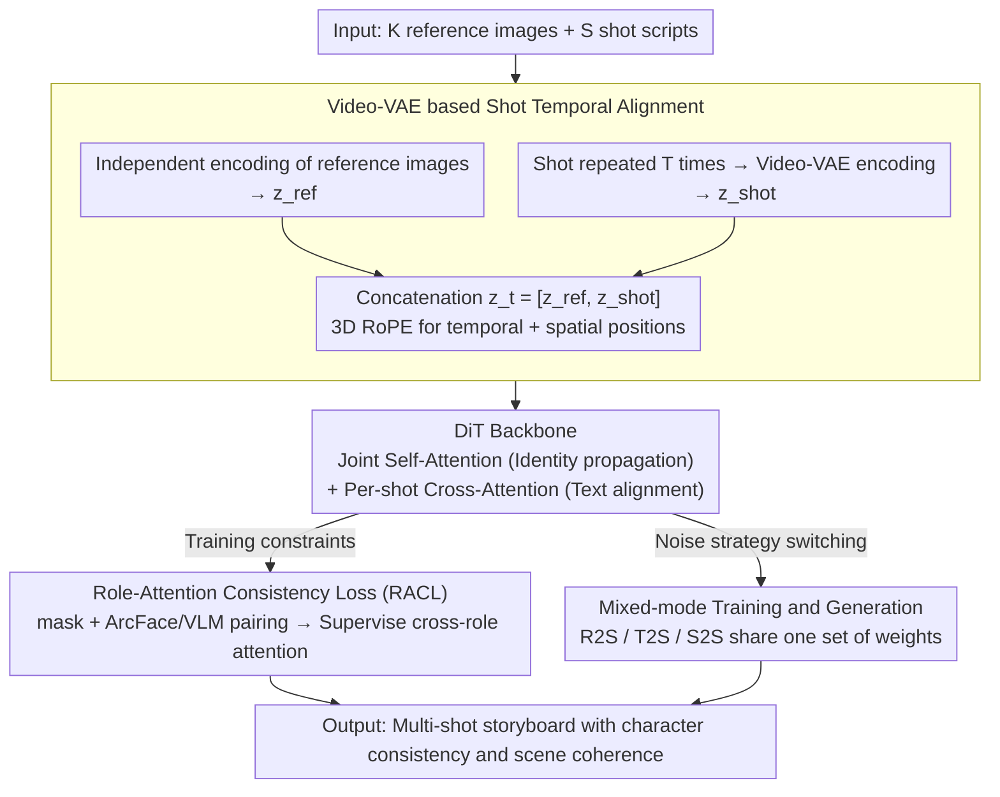

# DreamShot: Personalized Storyboard Synthesis with Video Diffusion Prior

**Conference**: CVPR 2026  
**arXiv**: [2604.17195](https://arxiv.org/abs/2604.17195)  
**Code**: [https://ll3rd.github.io/DreamShot/](https://ll3rd.github.io/DreamShot/)  
**Area**: Video Generation  
**Keywords**: Storyboard Generation, Video Diffusion Model, Character Consistency, Multi-character Reference, Attention Constraint

## TL;DR

DreamShot is proposed to leverage the spatio-temporal priors of video diffusion models to generate multi-shot storyboards with consistent characters and coherent scenes. It addresses multi-character confusion via a Role-Attention Consistency Loss and provides unified support for Text-to-Shot, Reference-to-Shot, and Shot-to-Shot modes.

## Background & Motivation

**Background**: Storyboard generation aims to create coherent sequences of key shots for cinematic storytelling. Current methods are primarily divided into two categories: image diffusion-based methods (e.g., StoryDiffusion, AnyStory, StoryMaker) which maintain character consistency via IP-Adapter or ControlNet, and video model-based methods (e.g., StoryAnchors) which utilize temporal consistency but only support text or preceding-frame conditions.

**Limitations of Prior Work**: Image models naturally favor diversity over temporal stability, leading to poor cross-shot character consistency and severe character confusion in multi-role scenes (where facial or clothing features of different characters merge incorrectly). While video models offer better consistency, dense frame generation incurs high computational costs and lacks fine-grained personalized control.

**Key Challenge**: A fundamental trade-off exists: image models offer flexibility but lack consistency, whereas video models provide consistency but lack efficiency.

**Goal**: This work aims to achieve high-quality personalized storyboards by combining the spatio-temporal consistency priors of video models with the efficiency and controllability of image-level generation.

**Key Insight**: Video VAEs (such as Wan-VAE) maintain causal temporal structures when compressing continuous frames into latent space. By repeating each storyboard shot $T$ times before encoding, independent static shots can be transformed into a coherent temporal latent sequence.

**Core Idea**: Within a video diffusion model (DiT) framework, character reference images are treated as temporal preceding anchors and storyboard shots as subsequent temporal segments. Role identity information is naturally propagated via 3D RoPE positional embeddings, while cross-character attention is constrained via RACL to prevent confusion.

## Method

### Overall Architecture

The core problem DreamShot addresses is how to keep a series of static storyboard shots character-consistent and scene-coherent while outputting only keyframes rather than dense video sequences. The mechanism involves migrating the entire process into a video diffusion model (Video-VAE + DiT). The input consists of $K$ character reference images and text scripts for $S$ shots. Each reference image is encoded independently into a latent vector, and each storyboard shot is "simulated" as a video clip (by repeating it $T$ times) before being encoded by the Video-VAE. Reference tokens and shot tokens are concatenated into a single sequence and fed into the DiT. Joint self-attention is computed across all tokens to allow character identity to flow across shots, while cross-attention aligns each shot with its corresponding text to ensure content fidelity. This architecture supports three modes: Reference-to-Shot (R2S), Text-to-Shot (T2S), and Shot-to-Shot (S2S).

### Key Designs

**1. Video-VAE based Shot Temporal Alignment**

Storyboard shots are naturally independent static images; generating them frame-by-frame with image models inherently lacks cross-shot identity continuity. DreamShot utilizes the causal temporal structure of Video-VAE: each shot (except the first) is repeated $T$ times and encoded to obtain $z_{shot} \in \mathbb{R}^{s \times d \times h \times w}$. Character reference images are encoded as $z_{ref}$, and both are concatenated along the sequence as $z_t = [z_{ref}, z_{shot}]$. The video model's 3D RoPE then assigns consistent temporal and spatial positions. By placing reference images at the front of the sequence, the DiT naturally propagates character identity along the timeline during joint self-attention. This grants the DiT cross-shot consistency without architectural changes.

**2. Role-Attention Consistency Loss (RACL)**

In multi-character scenes, the most difficult issue is feature confusion—e.g., Character A's face appearing on Character B's body. This stems from self-attention layers incorrectly mixing features from different characters. RACL intervenes at this layer. It first determines spatial ownership: saliency detection is used for masks on the reference side, and grounding segmentation for masks on the storyboard side. ArcFace and VLM are then used to pair reference characters with storyboard characters. After pairing, the attention map $A_{r_k\text{-}s_k}$ between reference character $r_k$ and storyboard character $s_k$ is extracted from the DiT. The corresponding masks serve as supervision to force the attention weights to concentrate on matching character regions. This explicitly prohibits cross-character attention during training, stopping confusion at the source.

**3. Mixed-mode Training & Generation**

Real-world storyboard production requires both generating a set of shots from scratch and extending existing shots. Training separate models for these tasks is inefficient. DreamShot unifies them using varying noise strategies: Reference-to-Shot only adds noise to shot tokens while keeping reference images clean; Text-to-Shot adds noise to all shot tokens for text-driven generation; Shot-to-Shot treats preceding shots as clean conditions to guide subsequent generation. All three modes share a common Flow Matching training objective, differing only in which tokens are noisy or clean.

### Loss & Training

The primary loss is the Flow Matching objective $\mathcal{L}_{diff}$, supplemented by RACL to constrain character attention consistency. The dataset is constructed from temporally coherent shot sequences extracted from real and synthetic videos, with each sequence paired with representative reference frames and shot-level annotations.

## Key Experimental Results

### Main Results

The paper emphasizes qualitative and quantitative comparisons with image-based methods, demonstrating advantages in character consistency, scene coherence, and generation efficiency. DreamShot successfully avoids character confusion in multi-role scenarios, whereas image-based methods like StoryDiffusion and AnyStory frequently exhibit character feature misalignment.

| Dimension | DreamShot | Image Model Methods |
|---------|-----------|------------|
| Character Consistency | Strong (Stable identity across shots) | Weak (Frequent character confusion) |
| Scene Coherence | Strong (Video prior guarantee) | Weak (Inconsistency between shots) |
| Multi-role Support | Good (Constrained by RACL) | Poor (Feature entanglement) |
| Generation Efficiency | High (Keyframes instead of dense frames) | Medium |

### Ablation Study

| Configuration | Character Consistency Metric | Description |
|------|-------------|------|
| Full model | Optimal | RACL + Video Prior |
| w/o RACL | Decrease | Confusion occurs in multi-role scenes |
| Image model backbone | Significant Decrease | Lack of temporal consistency |

### Key Findings

- Video diffusion priors are decisive for cross-shot consistency and cannot be easily replaced by simple image model upgrades.
- RACL provides significant gains in multi-character ($\ge 2$) scenes, though benefits are limited in single-character scenarios.
- The quality of the Shot-to-Shot mode is highly dependent on the quality of the preceding shots.

## Highlights & Insights

- The strategy of using a video model to generate keyframes rather than dense frames is ingenious—it retains the consistency advantages of video priors while avoiding the computational waste of redundant frames.
- The RACL design targets the root cause of multi-role confusion (feature entanglement in attention layers) by using explicit mask supervision.
- Placing reference images at the start of the sequence to leverage 3D RoPE's temporal encoding for identity propagation is a creative use of video model positional semantics.

## Limitations & Future Work

- Performance depends on the quality of the pre-trained video model (e.g., Wan2.1) and is limited by the base model's generative capacity.
- RACL requires character mask detection and one-to-one matching, which may fail under heavy occlusion or high character similarity.
- Current evaluations rely heavily on qualitative comparisons; there is a lack of standardized benchmarks for storyboard generation.
- Future work could extend to interactive editing (modifying specific shots while keeping others unchanged).

## Related Work & Insights

- **vs StoryDiffusion/StoryAdapter**: These image-based cross-frame attention methods are inherently limited by frame independence; this work solves the consistency problem fundamentally via video priors.
- **vs StoryAnchors**: While using the video paradigm, it only supports text/preceding-frame conditions and lacks multi-character reference control.

## Rating

- Novelty: ⭐⭐⭐⭐ (Video prior-driven storyboard generation is a new direction; RACL is cleverly designed)
- Experimental Thoroughness: ⭐⭐⭐ (Mainly qualitative; lacks standardized quantitative comparisons)
- Writing Quality: ⭐⭐⭐⭐ (Clear motivation and complete framework description)
- Value: ⭐⭐⭐⭐ (Establishes a new paradigm for storyboard generation with high practical utility)

<!-- RELATED:START -->

## Related Papers

- [\[CVPR 2026\] Generative Neural Video Compression via Video Diffusion Prior](generative_neural_video_compression_via_video_diffusion_prior.md)
- [\[CVPR 2026\] STAGE: Storyboard-Anchored Generation for Cinematic Multi-shot Narrative](stage_storyboard-anchored_generation_for_cinematic_multi-shot_narrative.md)
- [\[ICLR 2026\] JavisDiT: Joint Audio-Video Diffusion Transformer with Hierarchical Spatio-Temporal Prior Synchronization](../../ICLR2026/video_generation/javisdit_joint_audio-video_diffusion_transformer_with_hierarchical_spatio-tempor.md)
- [\[CVPR 2026\] NOVA: Sparse Control, Dense Synthesis for Pair-Free Video Editing](nova_sparse_control_dense_synthesis_for_pair-free_video_editing.md)
- [\[CVPR 2026\] MoVieDrive: Urban Scene Synthesis with Multi-Modal Multi-View Video Diffusion Transformer](moviedrive_urban_scene_synthesis_with_multi-modal_multi-view_video_diffusion_tra.md)

<!-- RELATED:END -->
