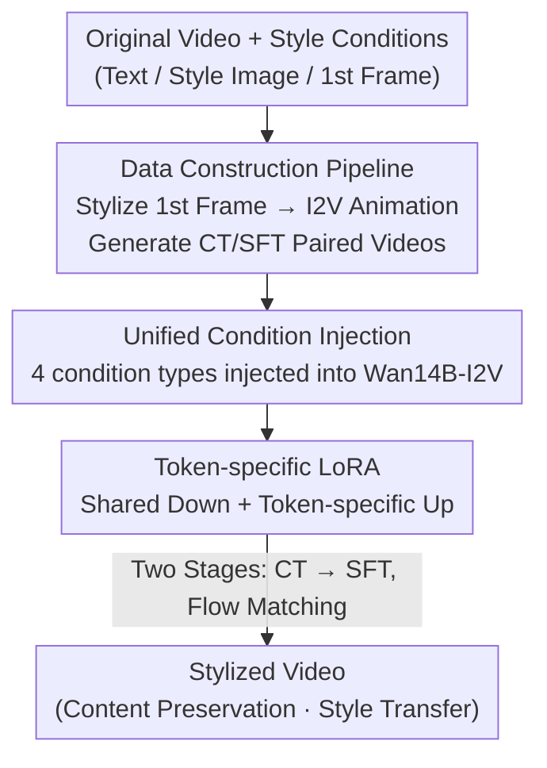

# DreamStyle: A Unified Framework for Video Stylization

**Conference**: CVPR 2026  
**Paper**: [CVF Open Access](https://openaccess.thecvf.com/content/CVPR2026/html/Li_DreamStyle_A_Unified_Framework_for_Video_Stylization_CVPR_2026_paper.html)  
**Code**: Not disclosed  
**Area**: Video Generation / Video Stylization / Diffusion Models  
**Keywords**: Video Stylization, Unified Framework, Condition Injection, Token-specific LoRA, Data Construction Pipeline

## TL;DR
DreamStyle unifies three style conditions—text, style images, and stylized first frames—into a video stylization model based on Wan14B-I2V. It addresses the lack of paired data through a data construction pipeline that "first stylizes the first frame, then generates paired videos via I2V," and utilizes token-specific LoRA to eliminate interference between different condition tokens, outperforming specialized models across three types of stylization tasks.

## Background & Motivation

**Background**: Video stylization is a significant downstream task of video generation. Input style conditions typically include text (most flexible), style images (precise visual anchors), and stylized first frames (enabling long video stylization). Each condition has its strengths, but existing methods (TokenFlow, StyleCrafter, StyleMaster, UNIC, etc.) almost exclusively support only **one** type, limiting their applicability.

**Limitations of Prior Work**: Single-modality conditions have inherent flaws: text prompts are often vague with weak constraints, failing to describe abstract styles; style images are visually precise but difficult to find for unseen styles, hindering usability and creativity. Crucially, there is a **lack of high-quality paired video data**. One class of methods learns capabilities from image stylization datasets and migrates them to video, naturally compromising between style consistency, temporal consistency, and motion magnitude. UNIC uses T2V to synthesize stylized videos and then uses gray-tile ControlNet to invert real videos for pairing, but quality is capped by the T2V model, and the strict alignment of tile ControlNet cannot handle styles with geometric deformations.

**Key Challenge**: Existing SOTA stylization methods are restricted to "single condition + lack of good data." Developing a unified model introduces a new problem: "inter-token confusion," where multiple condition tokens fed into the same model interfere with each other, leading to style degradation or confusion when using standard LoRA.

**Goal**: (1) A single model supporting text, style image, and first-frame conditions simultaneously; (2) Construction of high-quality "stylized-original" paired video data; (3) Unlocking extended applications such as multi-style fusion and long video stylization.

**Key Insight**: Current image generation/editing models surpass video models in visual quality, structure, aesthetics, and text following. Therefore, by **having an image model stylize the first frame first**, and then using an I2V model to "animate" that high-quality frame, the first frame naturally serves as both a style constraint and a content anchor.

**Core Idea**: Reformulate video stylization as a unified Video-to-Video (V2V) task. This involves injecting four types of conditions into a base I2V model through a carefully designed mechanism, using token-specific LoRA to distinguish condition tokens, and training in two stages with self-constructed paired data.

## Method

### Overall Architecture
DreamStyle consists of two relatively independent yet sequential pipelines: an **offline data construction pipeline** to create paired training data, and the **online DreamStyle framework** that injects four types of conditions into Wan14B-I2V and trains with specialized LoRA. The input is an original video plus any one (or more) style conditions, and the output is a video that preserves the subject content while adopting the target style.

Data side: A real video is sampled, the first frame (and other reference images) is stylized using SOTA image stylization models, and then an I2V model equipped with ControlNet animates the first frame into a complete stylized video, forming a "stylized-original" pair. This results in a large-scale CT dataset and a small-scale high-quality SFT dataset after automatic and manual filtering. Model side: The original video is passed through the image channel, text through cross-attention, the stylized first frame is concatenated at the beginning of the sequence, and the style image at the end. These are fed into the DiT, fine-tuned with token-specific LoRA, and supervised by flow matching loss.

### Key Designs

**1. Data Construction Pipeline: Bypassing the lack of paired data via "Stylize 1st Frame, Then Animate via I2V"**

The primary bottleneck in video stylization is the absence of paired videos showing the same motion in both real and stylized forms. The key observation of the authors is that image model quality far exceeds video models, and **a single high-quality stylized first frame provides style constraints and content anchors for the entire I2V generation**. The pipeline follows two steps: first, use an image stylization model to stylize the first frame (and $K$ extra reference images) of the original video; second, use an I2V model to generate a full stylized video from that frame. To ensure motion consistency between the stylized and original videos (essential for pairing), the authors customized depth and human-pose ControlNets for their I2V model. A ⚠️ critical detail: directly driving the stylized first frame with "control signals extracted from the original video" causes motion mismatch (depth/pose cannot capture all complex dynamics, see Fig.4). Thus, the authors use **the same control signal to drive both the stylized and original video generation** to suppress mismatch.

The data is formalized as $D=\{(x_i^{raw}, x_i^{sty}, t_i^{ns}, t_i^{sty}, s_i^{1...K})\}$, where $x^{raw}/x^{sty}$ are original/stylized videos, $t^{ns}/t^{sty}$ are text pairs with/without style descriptions (VLM captions the stylized video, and $t^{ns}$ explicitly excludes style, palette, texture, and tone), and $s^{1...K}$ are $K$ style reference images. Two sets of data are created: a large-scale CT dataset generated via InstantStyle (SDXL + depth ControlNet + ID plugin) for generalization, and a small-scale high-quality SFT dataset via Seedream 4.0 for performance. CT data is automatically filtered using VLM + CSD scores (CSD > 0.5), while SFT data undergoes full manual filtering for content consistency.

**2. Unified Condition Injection: Injecting four types of conditions into one I2V model via specialized ports**

To unify three style conditions, the challenge lies in preventing the four types of conditions (original video + text/image/first-frame styles) from conflicting. Built on Wan14B-I2V, DreamStyle uses the most suitable injection ports for each type with "minimal modification" to the base:

- **Text Condition**: Reuses the native text cross-attention of Wan14B-I2V without modification.
- **First-Frame Condition**: Fed into the base's original image condition channel, with the first-frame mask channel set to 1.0.
- **Style Image Condition**: Style image VAE latent $z^s$ is concatenated channel-wise as $z^s_t = \text{add\_noise}(z^s,t)\oplus_c \mathbf{1}^{4\times1\times H\times W}\oplus_c z^s$; high-level semantics are also injected via the CLIP image feature branch of Wan14B-I2V to strengthen semantic consistency.
- **Original Video Condition**: Original and stylized videos are encoded to latents and concatenated channel-wise with an **all-zero** mask: $z^v_t = \text{add\_noise}(z^{sty},t)\oplus_c \mathbf{0}^{4\times F\times H\times W}\oplus_c z^{raw}$ (mask 0.0 follows the "minimal modification" principle).

Crucially, conditions are organized via **frame-wise concatenation**: the style image tensor $z^s_t$ is appended to $z^v_t$ ($z^v_t \oplus_f z^s_t$) for guidance, while the first frame $z^{1st}_t$ is prepended ($z^{1st}_t \oplus_f z^v_t$). This approach incurs minimal computational overhead compared to UNIC's in-context injection, preserving the efficiency and inherent capabilities of the original I2V model.

**3. Token-specific LoRA: Multi-adapter LoRA to eliminate condition token crosstalk**

After patchification, the first frame, style image, and original video conditions become three token sequences. Since their semantic roles differ, standard LoRA fine-tuning causes inter-token confusion. Inspired by HydraLoRA, the authors make the LoRA "up" matrix **token-specific**: for input token $x_{in}$, it passes through a **shared** down matrix $W_{down}$, then selects a corresponding up matrix based on token type $i\in\{0,1,2\}$ to calculate the residual $x_{out}=W^i_{up}W_{down}x_{in}$, applied to full attention and FFN layers. This is essentially a "manually routed LoRA MoE"—shared parameters (down matrix) ensure training stability, while separate up matrices allow the model to learn features specific to each token type. Ablations show CSD scores drop from 0.515 to 0.413 without it, making it critical for style consistency.

### Loss & Training
Training follows the flow matching objective. The model $v_\theta$ receives five inputs ($z^v_t, t, z^{1st}_t, z^s_t, t^{ns/sty}$). Each batch randomly samples style conditions based on a preset ratio. The objective is the sum of regression terms for three tasks:

$$L(\theta)=\mathbb{E}_D\|v_\theta(z^v_t,t,\varnothing,\varnothing,t^{sty})-(z^{sty}-\epsilon)\|^2 + \mathbb{E}_D\|v_\theta(z^v_t,t,\varnothing,z^s_t,t^{ns})-(z^{sty}-\epsilon)\|^2 + \mathbb{E}_D\|v_\theta(z^v_t,t,z^{1st}_t,\varnothing,t^{ns})-(z^{sty}-\epsilon)\|^2$$

These correspond to text, style image, and first-frame guidance, with $\epsilon\sim N(0,1)$. The sampling ratio is Text:Image:1stFrame = 1:2:1. **Two-stage training** is employed: Stage 1 trains for 6000 steps on 40K CT data to learn diverse styles; Stage 2 trains for 3000 steps on 5K high-quality SFT data to enhance visual quality. Hyperparameters: LoRA rank=64, AdamW, lr=4e-5, 8×A100, effective batch size 16, total ~1700 A100 GPU hours.

## Key Experimental Results

### Main Results
Three tasks were compared against specialized/commercial models. Text guidance compared with Luma/Pixverse/Runway; style image guidance with StyleMaster; first-frame guidance with VACE/VideoX-Fun. Metrics include CSD score (style consistency), DINO (structural preservation), and VBench quality metrics.

| Task | Method | CSD↑ | DINO↑ | Dynamic↑ | Aesthetic↑ |
|------|------|------|-------|----------|-----------|
| Text Guidance | Runway | 0.154 | — | 0.504 | 0.606 |
| Text Guidance | **DreamStyle** | **0.167** | — | **0.584** | **0.656** |
| Image Guidance | StyleMaster(T2V) | 0.198 | — | 0.289 | 0.610 |
| Image Guidance | **DreamStyle(T2V)** | **0.532** | — | 0.689 | **0.641** |
| Image Guidance | DreamStyle(V2V) | 0.515 | 0.526 | **0.867** | 0.635 |
| 1st Frame Guidance | VideoX-Fun | 0.766 | **0.702** | 0.844 | 0.594 |
| 1st Frame Guidance | **DreamStyle** | **0.851** | 0.640 | 0.856 | **0.630** |

> Note: For text guidance, "CSD" refers to CLIP-T (style-only text-video similarity).

In text guidance, DreamStyle excels in text following and structural preservation. In image guidance, CSD jumps from StyleMaster's 0.198 to 0.532 (T2V mode). In first-frame guidance, CSD reaches a top score of 0.851. Structural preservation (DINO) is slightly lower than VideoX-Fun in first-frame guidance; the authors attribute this to stylized first frames with geometric deformations Occasionally conflicting with the original video structure.

### Ablation Study
Evaluated on style image guidance (Table 2 in paper):

| Configuration | CSD↑ | DINO↑ | Note |
|------|------|-------|------|
| Full | 0.515 | 0.526 | Balanced style and structure |
| w/o token-specific LoRA | 0.413 | 0.518 | Drop in CSD; style degradation/confusion |
| Only CT Data | 0.535 | 0.483 | High CSD but poor structure |
| Only SFT Data | 0.459 | 0.547 | Insufficient data; unstable V2V adaptation |
| w/o Style Cross-attn | 0.484 | — | Loss of global semantic features |

### Key Findings
- **Token-specific LoRA is the primary contributor**: Removing it causes CSD to drop from 0.515 to 0.413, resulting in style degradation.
- **Both datasets are essential**: CT (large, low quality) lacks structure, while SFT (small, high quality) is insufficient for adaptation. The Stage 1 → Stage 2 schedule is key.
- **Global CLIP features complement local VAE features**: Injecting CLIP features provides global style cues, improving CSD by 0.031.
- **Image quality is negatively correlated with dynamic degree**: High-motion videos often have motion blur, which lowers image quality scores, explaining why DreamStyle's image quality score is not its strongest point.

## Highlights & Insights
- **"Using image models to build data for video models" is a practical solution**: By stylizing the first frame and then animating it, the unpaired data problem becomes a scalable data production task. Driving both paths with the same control signal suppresses motion mismatch.
- **Token-specific LoRA solves "condition conflict" as a routing problem**: Shared down + token-specific up matrices (manual LoRA MoE) distinguishes semantic roles while maintaining training stability.
- **Minimal modification reuse**: Text via cross-attention, original video via image channel, and extra frames via concatenation allow expanding I2V to V2V with near-zero extra overhead, preserving the base model's efficiency.
- Multiple conditions can coexist in a single forward pass, naturally enabling multi-style fusion and long video stylization.

## Limitations & Future Work
- **Structural preservation as a trade-off for style consistency**: DINO scores are lower than dedicated models in first-frame guidance because geometric deformations in frames conflict with original structures.
- **Dependence on closed-source/internal components**: The pipeline relies on Seedream 4.0 and internal I2V models, making reproduction difficult. Video quality is capped by the chosen image models and I2V base.
- **Resolution and length constraints**: Training data is limited to 480P and 81 frames; performance at higher resolutions or longer durations is unverified.
- Future directions: Decoupling structural constraints from style consistency or introducing learnable deformation alignment to mitigate structural drift in geometric styles.

## Related Work & Insights
- **vs UNIC**: UNIC uses T2V synthesis + gray-tile inversion, which cannot handle geometric deformation and incurs high inference costs. DreamStyle uses I2V animation, handles deformation, and is more efficient.
- **vs StyleMaster**: StyleMaster adds global/local extractors and temporal LoRAs to DiT, deviating from base architectures and supporting only image conditions. DreamStyle maintains the base structure and unifies three conditions with superior CSD.
- **vs TokenFlow / AnyV2V**: These rely on time-consuming DDIM inversion and propagation; DreamStyle is an end-to-end V2V model requiring no inversion.

## Rating
- Novelty: ⭐⭐⭐⭐ First framework to unify three style conditions; token-specific LoRA and data pipeline are clever, though individual components are existing technologies.
- Experimental Thoroughness: ⭐⭐⭐⭐ Covers three tasks against commercial/SOTA baselines; however, limited by base model resolutions and T2V-only baselines for some comparisons.
- Writing Quality: ⭐⭐⭐⭐ Clear motivation, well-explained formulas, and strong correspondence between figures and text.
- Value: ⭐⭐⭐⭐ The data construction and unified injection ideas are highly practical and transferable for industrial video stylization.

<!-- RELATED:START -->

## Related Papers

- [\[CVPR 2026\] TV2TV: A Unified Framework for Interleaved Language and Video Generation](tv2tv_a_unified_framework_for_interleaved_language_and_video_generation.md)
- [\[CVPR 2026\] U-Mind: A Unified Framework for Real-Time Multimodal Interaction with Audiovisual Generation](u-mind_a_unified_framework_for_real-time_multimodal_interaction_with_audiovisual.md)
- [\[CVPR 2026\] UniTalking: A Unified Audio-Video Framework for Talking Portrait Generation](unitalking_a_unified_audio-video_framework_for_talking_portrait_generation.md)
- [\[CVPR 2026\] VGA-Bench: A Unified Benchmark and Multi-Model Framework for Video Aesthetics and Generation Quality Evaluation](vga-bench_a_unified_benchmark_and_multi-model_framework_for_video_aesthetics_and.md)
- [\[CVPR 2026\] THEval: Evaluation Framework for Talking Head Video Generation](theval_evaluation_framework_for_talking_head_video_generation.md)

<!-- RELATED:END -->
