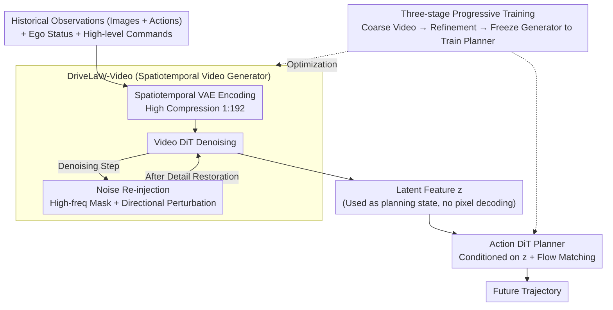

# DriveLaW: Unifying Planning and Video Generation in a Latent Driving World

**Conference**: CVPR 2026  
**arXiv**: [2512.23421](https://arxiv.org/abs/2512.23421)  
**Code**: [https://github.com/xiaomi-research/drivelaw](https://github.com/xiaomi-research/drivelaw)  
**Area**: Video Generation  
**Keywords**: World Models, Autonomous Driving Planning, Video Generation, Latent Space, Diffusion Policy

## TL;DR

DriveLaW is proposed, a driving world model that unifies video generation and motion planning via a shared latent space. By directly injecting intermediate latent features from the video generator into a diffusion planner, it achieves SOTA performance simultaneously on nuScenes video prediction and NAVSIM planning benchmarks.

## Background & Motivation

World models address real-world long-tail challenges by learning the temporal evolution of driving scenes. However, current methods limit the role of world models to three indirect levels: (1) Data generators—synthesizing rare scenario data or acting as closed-loop simulation environments; (2) Supervisory signals—predicting future visual/reachability signals to supervise planning; (3) Parallel generation—jointly generating videos and trajectories within a unified architecture, yet remaining decoupled processes.

Key Challenge: **Even in "unified" architectures, the video generator and planner continue to operate as independent modules.** Epona and DriveVLA-W0 train video generation and policy heads separately without utilizing the generator's internal latent representations as planning states. Although video generators learn rich scene semantics, object dynamics, and physical laws from large-scale data, this knowledge is "wasted" on rendering rather than being transmitted to the planner.

Key Insight: **The internal activations of a video generator encode rich, temporally coherent scene understanding—precisely the representation required for planning.** DriveLaW repositions the generator from a "renderer" to a "feature extractor," utilizing its denoised latent features directly as conditional inputs for the planner.

## Method

### Overall Architecture

DriveLaW addresses the issue of "wasted scene knowledge" by chaining the generator and planner, feeding the intermediate representations of the former directly into the latter. The pipeline consists of two concatenated components: the first half is **DriveLaW-Video**, a spatiotemporal video generator composed of a spatiotemporal VAE and a Video DiT (Diffusion Transformer), which takes historical observations and actions to denoise future video latent features $z$ (with high-frequency details restored via noise re-injection); the second half is **DriveLaW-Act**, a lightweight Action DiT diffusion planner. Instead of processing raw images, it conditions directly on $z$ and generates future trajectories using flow matching. The key lies in $z$: it is propagated as a planning state rather than being decoded into pixels. The system is optimized via a three-stage progressive training strategy.

### Key Designs

**1. Chained Generation-Planning Architecture: Latent Features as Planning States**

Previous "unified" architectures (e.g., Epona, DriveVLA-W0) are essentially parallel designs—video and trajectory branches derive independent output heads from a shared backbone, meaning internal generator representations never flow to the planner. DriveLaW connects this information flow: the denoised latent feature $z$ from the Video DiT is injected directly into the Action DiT as a conditional input without decoding. This offers three benefits: first, it inherits scene semantics, agent dynamics, and physical laws from large-scale video pre-training as planning priors; second, it avoids gradient interference between video generation and planning by separating parameter optimization; third, it ensures consistency as both the trajectory and visual details are derived from the same $z$.

**2. Noise Re-injection Mechanism: Reclaiming Details via Directional Perturbation**

The spatiotemporal VAE employs a high compression ratio of 1:192 to improve planning efficiency, but this leads to over-smoothed boundaries and blurred textures in high-speed scenarios. The Noise Re-injection is **directional**: at each denoising step, a clean latent is predicted, decoded to pixels, and converted to grayscale. A Laplacian operator generates a high-frequency response map to create a mask. Controlled noise is then injected only into these high-frequency regions. This forces the model to use its generative prior to "inpaint" perturbed areas, restoring sharp high-frequency details rather than smoothing them over.

**3. Three-stage Progressive Training: Optimal Learning Windows**

To prevent conflict between video generation and planning objectives, training is divided into three stages: (1) Video DiT is trained to generate coarse videos to establish temporal dynamics; (2) Fine-tuning is performed at higher resolution with refined denoising to capture spatial details; (3) The Video DiT is frozen, and its latent features are used to train the Action DiT specifically for planning.

### Loss & Training

Video DiT is trained with standard diffusion denoising loss, while Action DiT employs a flow matching objective for trajectory generation. In the third stage, Video DiT parameters are frozen to ensure the planner is optimized based on stable video representations.

## Key Experimental Results

### Main Results

**nuScenes Video Generation**

| Method | FID↓ | FVD↓ | Description |
|------|------|------|------|
| Prev. SOTA | Baseline | Baseline | Various world models and video generators |
| **DriveLaW-Video** | **-33.3%** | **-1.8%** | Significant margin |

**NAVSIM Planning Benchmark (PDMS)**

| Method | PDMS | Description |
|------|------|------|
| Prev. SOTA (World Model) | Baseline | Various world models + planning methods |
| **DriveLaW-Act** | **New Record** | No RL post-training or scorers required |

### Ablation Study

| Configuration | FID | PDMS | Description |
|------|-----|------|------|
| BEV Features → Planning | Higher | Lower | Traditional BEV representation |
| VLM Features → Planning | Medium | Medium | Vision-Language Model features |
| **Video Latent → Planning** | **Lowest** | **Highest** | Video generator representation is optimal |
| Parallel Design | Medium | Medium | Independent output heads |
| **Chained Design** | **Lowest** | **Highest** | Feature propagation to planner |

### Key Findings

- Video generator latent representations outperform BEV and VLM features as planning inputs, proving the unique value of representations learned from large-scale video pre-training.
- The chained design is superior to parallel designs in both tasks, validating that representation propagation is better than independent output.
- The noise re-injection mechanism significantly reduces blurring and structural inconsistency in high-speed scenarios.
- SOTA results on NAVSIM are achieved without RL or manual scorers, indicating the strength of the video prior.

## Highlights & Insights

- **"Video generator as feature extractor"** represents a profound paradigm shift: repositioning generative models from end-outputters to intermediate representation providers, bridging "generation" and "understanding."
- The comparison between **Chained vs. Parallel** designs is compelling: even in "unified" architectures, the direction and coupling of information flow are critical.
- **Three-stage training** effectively avoids multi-objective conflicts—the strategy of separate optimization followed by cascaded fine-tuning is highly generalizable.

## Limitations & Future Work

- Chained design implies planning latency is constrained by video generation speed, potentially affecting real-time performance.
- Currently supports only single-view video generation; multi-view consistency remains unexplored.
- Robustness in real-world closed-loop driving remains to be tested beyond nuScenes and NAVSIM.
- Errors in the video generator can propagate directly to the planner (error cascading).

## Related Work & Insights

- **vs Epona**: Parallel generation of videos and trajectories; decoupled design fails to utilize internal generator representations.
- **vs DriveVLA-W0**: Uses hybrid Transformers for multiple modalities but retains parallel output streams.
- **vs DiffusionDrive**: Pure diffusion planning without world-understanding priors from video generation.

## Rating

- Novelty: ⭐⭐⭐⭐⭐ First to use intermediate video generator latents as planning states; chained design is original.
- Experimental Thoroughness: ⭐⭐⭐⭐⭐ Dual-task SOTA + representation ablation + architecture ablation.
- Writing Quality: ⭐⭐⭐⭐ Clear structure, though three-stage training details could be more granular.
- Value: ⭐⭐⭐⭐⭐ Provides a new paradigm for autonomous driving world models with practical industrial background (Xiaomi EV).

<!-- RELATED:START -->

## Related Papers

- [\[CVPR 2026\] LAMP: Language-Assisted Motion Planning for Controllable Video Generation](lamp_language-assisted_motion_planning_for_controllable_video_generation.md)
- [\[CVPR 2026\] Inference-time Physics Alignment of Video Generative Models with Latent World Models](inference-time_physics_alignment_of_video_generative_models_with_latent_world_mo.md)
- [\[CVPR 2026\] EffectMaker: Unifying Reasoning and Generation for Customized Visual Effect Creation](effectmaker_unifying_reasoning_and_generation_for_customized_visual_effect_creat.md)
- [\[ICML 2026\] OLAF-World: Orienting Latent Actions for Video World Modeling](../../ICML2026/video_generation/olaf-world_orienting_latent_actions_for_video_world_modeling.md)
- [\[ICLR 2026\] ConsisDrive: Identity-Preserving Driving World Models for Video Generation by Instance Mask](../../ICLR2026/video_generation/consisdrive_identity-preserving_driving_world_models_for_video_generation_by_ins.md)

<!-- RELATED:END -->
