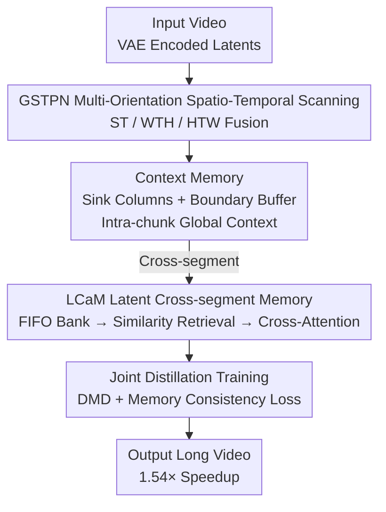

# Dual-Granularity Memory for Efficient Video Generation

**Conference**: CVPR 2026  
**Paper**: [CVF Open Access](https://openaccess.thecvf.com/content/CVPR2026/html/Wang_Dual-Granularity_Memory_for_Efficient_Video_Generation_CVPR_2026_paper.html)  
**Code**: To be confirmed  
**Area**: Video Generation / Diffusion Models / Efficient Architecture  
**Keywords**: Linear Recurrence, Chunk Isolation, Attention Sink, Latent Memory, Knowledge Distillation

## TL;DR
Tackling the "chunk isolation" issue in linear recurrent video generators caused by chunk-wise parallelism, this paper stacks two complementary memories on the GSTPN backbone: intra-chunk Context Memory (sink columns + boundary buffers, adding only +150K parameters) and cross-segment LCaM (latent memory bank + content retrieval + cross-attention). This achieves a 1.54× inference speedup while maintaining visual quality comparable to full attention.

## Background & Motivation
**Background**: The mainstream for video generation is Diffusion Transformers (DiTs). While producing high quality, self-attention has $O(N^2)$ complexity, making computation and memory usage prohibitive for high-resolution long sequences (e.g., Wan 2.1 takes 32 minutes for 5 seconds of 720p). Consequently, linear recurrent architectures (GSPN, Mamba-like) have emerged as efficient alternatives, offering $O(N)$ complexity and constant memory.

**Limitations of Prior Work**: To parallelize recurrent models on GPUs, sequences must be split into fixed-size chunks (e.g., $L=200$), with each chunk calculated independently and preceding hidden states often discarded. The authors term this phenomenon **chunk isolation**: position 201 cannot access any states from positions 1–200, leading to a loss of initial conditions, camera motion, and scene layout, manifested as visual flickering and identity drift at chunk boundaries.

**Key Challenge**: Recurrent architectures rely on the unidirectional causal propagation of hidden states, lacking the "global random access" capability of transformers. Once chunked, global context is broken. Furthermore, modern video systems process training/inference in segments; longer videos span multiple segments, where intra-chunk mechanisms cannot reach cleared historical segments.

**Key Insight**: The authors draw inspiration from StreamingLLM's discovery—retaining a few initial tokens as "attention sinks" in the KV cache significantly improves long-context consistency. This suggesting that **a few strategically preserved positions are sufficient to carry global information**. The question is: can this principle, established for globally readable attention, be transferred to unidirectional recurrent architectures?

**Core Idea**: Use "dual-granularity memory" to fill two gaps simultaneously—intra-chunk learnable sink columns + boundary buffers to restore global anchors (Context Memory), and pure latent space memory banks to retrieve historical segments (LCaM), forming a complete solution for short-term and long-term consistency.

## Method

### Overall Architecture
The method is built upon GSTPN (Generalized Spatial-Temporal Propagation Network, extending 2D GSPN to spatio-temporal data). The system is distilled from WanVideo-1.3B via Distribution Matching Distillation (DMD): replacing all self-attention layers in the original DiT with GSTPN modules and inserting the two memory systems. A video is first encoded into latent variables by a VAE, then enters GSTPN for multi-orientation spatio-temporal scanning. During scanning, Context Memory provides persistent global anchors and boundary continuity intra-chunk; across segments, LCaM retrieves relevant fragments from a historical latent memory bank and fuses them into current generation via cross-attention. This reduces latency from 103s (full attention) to 67s while preserving quality.

### Key Designs

**1. GSTPN Multi-Orientation Spatio-Temporal Scanning: Adapting Linear Recurrence for 4D Video Tensors**

GSPN originally processed 2D spatial data, propagating a hidden state row by row: $h^c_i = w^c_i h^c_{i-1} + \lambda^c_i \odot x^c_i$, where the propagation matrix $w_i$ is constrained to be row-stochastic (non-negative rows summing to 1). This ensures $\sum_j W_{ij}=1$, making the hidden state a normalized weighted sum of historical inputs, preventing exponential explosion/decay. Video tensors $X\in\mathbb{R}^{C\times F\times H\times W}$ have a strictly causal temporal dimension and bidirectional spatial dimensions. Flattening them directly into a sequence of length $FHW$ destroys this structure and exacerbates chunk isolation.

The authors propose projecting the 4D tensor along three orientations into three 2D planes for scanning: ST (spatial dimensions collapsed, scanning along time), WTH (width-time collapsed, scanning along height), and HTW (height-time collapsed, scanning along width). The outputs are restored and fused using learnable weights $\alpha_o = e^{\beta_o}/\sum_{o'}e^{\beta_{o'}}$ followed by an MLP. Ablations show that a single orientation carries directional bias (quality 80.2), while three complementary orientations covering spatio-temporal dependencies improve this to 83.5, serving as the backbone for the memory systems.

**2. Context Memory: Sink Columns + Boundary Buffer for Intra-chunk Isolation**

This is the core of migrating the "attention sink" principle to recurrent architectures. It consists of two complementary components. **Sink columns** designate the first $N_{sink}$ (default 3) columns as globally accessible anchors, allowing positions $w\ge N_{sink}$ to read from sinks in addition to standard recurrence:

$$h_{j,w} = w_j h_{j-1,w-1} + \lambda_j \odot x_{j,w} + \sum_{i\in S} G_{sink}[j,i]\odot h_{j,i}$$

The crucial difference: attention sinks are passively cached, while sink columns **actively participate in recurrent computation** via learnable gates $G_{sink}$ (input-independent parameters), allowing the model to learn "which global information to preserve." This expands the dependency set from just the current chunk to include $\{(j,i)\mid i\in S\}$. Since $S$ persists across all chunks, chunk isolation is eliminated. **Boundary buffers** provide local continuity by extending the accessible range of chunk $k$ by $N_{buf}$ (default 2) preceding positions $[\max(0,kL-N_{buf}),(k+1)L)$, allowing boundary positions to connect directly to their immediate predecessors. Together, they add only ~150K parameters (<0.1% model size) but boost quality from 79.1 (no sink) to 83.5. Ablations show synergy (combined gain +4.5 exceeds the sum of individual gains +4.1)—sinks provide long-range context, while buffers smooth its local propagation.

**3. LCaM Latent Cross-segment Memory: Tackling Cross-segment Isolation**

Context Memory cannot reach cleared historical segments. Prior methods (e.g., Context-as-Memory) store raw frames and retrieve based on camera FOV, requiring camera annotations, expensive storage, and VAE decoding. LCaM operates **entirely in latent space**. It maintains a FIFO memory bank $M_t=\{z_\tau\mid \tau\in[\max(1,t-M),t-1]\}$ of the last $M$ latent segments; once full, it follows first-in-first-out replacement, keeping memory $O(M)$ independent of total length. Storing latents instead of raw frames offers a massive compression ratio $\rho = 3s^2/C_z$ (typically $s=8, C_z=16$ yields 12× theoretical; >60× measured in mixed precision), enabling the storage of dozens of historical segments.

Retrieval relies not on camera poses but on the inherent semantic similarity of latent space. Segments are first compressed into global descriptors via spatio-temporal average pooling $F(z)=\frac{1}{TH'W'}\sum_{f,h,w}z[:,f,h,w]\in\mathbb{R}^{C_z}$ (discarding details for scene-level statistics like mean color, brightness, and semantics). Cosine similarity $s(z_t,z_\tau)=\langle F(z_t),F(z_\tau)\rangle/(\|F(z_t)\|\|F(z_\tau)\|)$ is then used. Retrieval takes the Top-$K$ candidates above a threshold $\tau$: $R_t=\text{TopK}(\{z\mid s\ge\tau\})$, where the threshold acts as a quality filter to prevent noise from weakly related segments. Retrieved segments are fused via multi-head cross-attention (query: current segment; key/value: historical segments) and injected using a learnable gate $g$ (initialized to a large negative value so $\sigma(g)\approx0$):

$$z^{cond}_t = z_t + \sigma(g)\cdot \text{Unflatten}(O)$$

The gate increases memory participation during training, preventing memory perturbations from destabilizing the backbone early on.

**4. Joint Distillation Training Objective: Integrating Memory into DMD**

LCaM is integrated via an auxiliary memory consistency loss. For a student-predicted latent $\hat z_t$, a memory-conditioned version $\hat z^{cond}_t$ is calculated when the bank is non-empty, constrained by $L_{mem}=\lambda_{mem}\|\hat z^{cond}_t - sg(\hat z_t)\|_F^2$ ($sg$: stop-gradient, treating the bank as read-only context). The total objective includes distillation, optional pixel alignment, and memory terms: $L = L_{distill}(\hat z_t, z^{teach}_t) + \lambda_{align}L_{align} + \mathbb{1}_{|M_t|>0}L_{mem}$. Training only unfrozes GSTPN modules (~10% parameters), sink gates (150K), and LCaM components (51K), taking ~7 hours on 64 H100 GPUs. This design is particularly suited for distillation scenarios where only pre-extracted latents are available.

## Key Experimental Results

### Main Results
Evaluated on WanVideo-1.3B (81 frames × 480 × 832, 33K tokens) using VBench. Latency measured on a single H100:

| Method | IQ↑ | AQ↑ | SC↑ | VA↑ | VT↑ | VR↑ | Latency↓ |
|--------|-----|-----|-----|-----|-----|-----|----------|
| Full Attention | 62.1 | 56.1 | 93.0 | 76.8 | 82.9 | 0.059 | 103s |
| SVG | 61.0 | 55.7 | 92.5 | 75.1 | 80.8 | 0.035 | 90s |
| MoBA | 60.1 | 54.8 | 92.7 | 72.8 | 78.2 | 0.021 | 126s |
| VMoBA | 60.1 | 55.2 | 92.9 | 73.5 | 79.3 | 0.025 | 104s |
| **Ours** | **62.3** | **55.9** | 92.8 | **75.5** | **81.0** | **0.040** | **67s** |

Ours (67s) is 1.54× faster than full attention and has the lowest latency among efficient methods. IQ 62.3 slightly exceeds full attention (62.1), attributed to multi-orientation scanning and sink anchors preserving fine-grained details that would otherwise degrade under chunk isolation. Shortcomings exist in OC (21.6 vs 23.3) and VR (0.040 vs 0.059), which the authors explain as a result of the structural heterogeneity between the GSTPN recurrent backbone and the LCaM cross-attention path.

### Ablation Study

| Configuration | Quality Score | Latency | Note |
|---------------|---------------|---------|------|
| ST only | 80.2 | 52s | Directional bias |
| ST + WTH | 81.6 | 59s | Complementary patterns |
| ST + WTH + HTW (Full) | **83.5** | 67s | Default |
| No sink ($N_{sink}=0$) | 79.1 | — | Chunk isolation |
| + sink only | 82.3 | — | sink adds +3.2 |
| + boundary only | 80.0 | — | boundary adds +0.9 |
| sink + boundary (Full) | 83.6 | — | Synergy +4.5 |

LCaM Hyperparameters: $K=3$ is optimal (Quality 84.8, VR 0.052); larger $K$ reduces average similarity from 0.61 to 0.55, diluting signals. A threshold $\tau=0.3$ balances 74% hit rate with 79% precision. Chunk size $L=200$ balances parallelism and sink access frequency.

### Key Findings
- **Sink columns contribute most**: Adding sinks alone (+3.2) far exceeds boundary buffers (+0.9), proving "persistent global anchors" are the primary solution to chunk isolation. Their synergy suggests buffers act as amplifiers for global context local smoothing.
- **Retrieval diversity mitigates consistency gaps**: While OC/VR lag behind full attention, increasing $K$ partially compensates (VR rises from 0.042 to 0.052 as $K$ goes 1→3).
- **Latent storage is a massive advantage**: >60× compression allows for dozens of historical segments, whereas frame-level methods are restricted to a few.

## Highlights & Insights
- **"Translating" attention sinks to recurrent causal architectures**: Unlike passive attention sinks, learnable sink columns actively participate in recurrence. This effectively rewrites "global random read" as "persistent states injected repeatedly," a clever cross-paradigm migration.
- **VAE latent semantic similarity over camera geometry**: Content retrieval via spatio-temporal pooling and cosine similarity avoids camera dependency, saves storage, and generalizes to any video domain.
- **Progressive memory injection via gated initialization**: Initializing $\sigma(g)\approx0$ ensures memory does not destabilize the pre-trained backbone early in training, a trick applicable to any additive module.

## Limitations & Future Work
- **Global consistency and human preference still lag behind Full Attention**: OC 21.6 vs 23.3 and VR 0.040 vs 0.059 are due to the heterogeneity between GSTPN and LCaM paths; currently only partially mitigated by increasing $K$.
- **Dependency on distillation settings**: LCaM's latent route and consistency loss are tailored for DMD distillation (pre-extracted latents). Its utility in training-from-scratch remains unverified.
- **Coarse descriptors**: Spatio-temporal average pooling discards fine-grained information, potentially failing to distinguish between scenes with critical detail differences.

## Related Work & Insights
- **vs StreamingLLM (attention sink)**: While StreamingLLM passively caches initial tokens, this work uses learnable gates for active recurrence. This offers near-zero parameter overhead but lacks the global random access of attention.
- **vs Context-as-Memory (frame-level memory)**: LCaM operates in latent space with content-based retrieval, offering 60× storage savings and no need for camera metadata, though with coarser descriptors.
- **vs Efficient Attention (SVG / MoBA / VMoBA)**: These sparse/approximate attention routes are still constrained by KV cache. This paper represents the "recurrence + memory" path, achieving the best trade-off between quality and latency.

## Rating
- Novelty: ⭐⭐⭐⭐ First systematic study of "chunk isolation" in recurrent video generators with a dual-memory solution.
- Experimental Thoroughness: ⭐⭐⭐⭐ Solid VBench evaluation and diverse ablations, though lacks training-from-scratch and larger model validation.
- Writing Quality: ⭐⭐⭐⭐ Clear problem definition and comprehensive analysis.
- Value: ⭐⭐⭐⭐ Practical "recurrence + memory" solution for efficient long video generation.

<!-- RELATED:START -->

## Related Papers

- [\[CVPR 2026\] Spatia: Video Generation with Updatable Spatial Memory](spatia_video_generation_with_updatable_spatial_memory.md)
- [\[CVPR 2026\] OneStory: Coherent Multi-Shot Video Generation with Adaptive Memory](onestory_coherent_multi-shot_video_generation_with_adaptive_memory.md)
- [\[ICLR 2026\] Dual-IPO: Dual-Iterative Preference Optimization for Text-to-Video Generation](../../ICLR2026/video_generation/dual-ipo_dual-iterative_preference_optimization_for_text-to-video_generation.md)
- [\[CVPR 2026\] Captain Safari: A World Engine with Pose-Aligned 3D Memory](captain_safari_a_world_engine_with_pose-aligned_3d_memory.md)
- [\[CVPR 2026\] Reward Forcing: Efficient Streaming Video Generation with Rewarded Distribution Matching Distillation](reward_forcing_efficient_streaming_video_generation_with_rewarded_distribution_m.md)

<!-- RELATED:END -->
