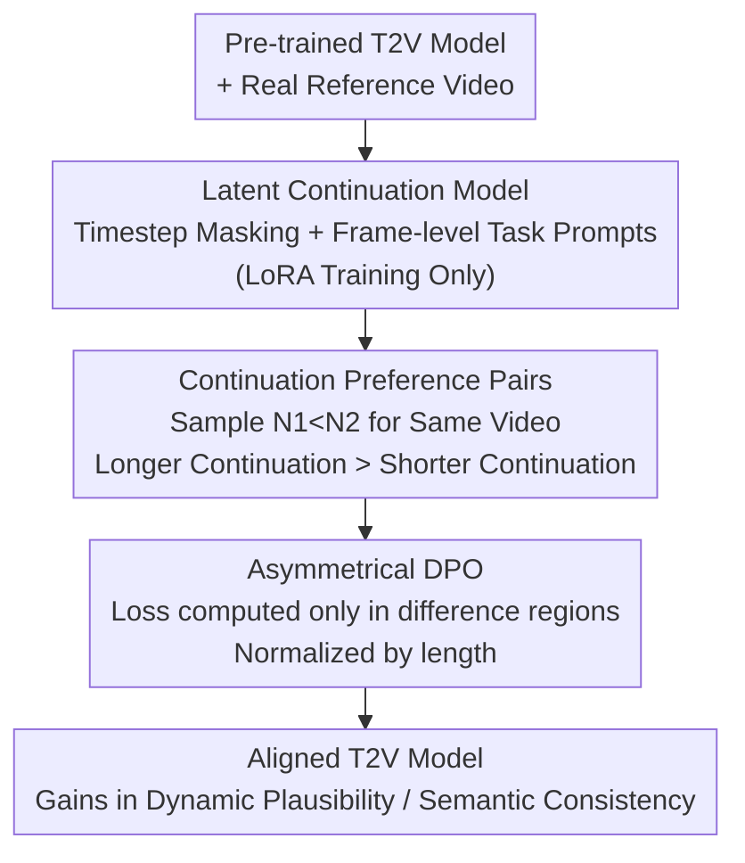

# DynamicsBoost: Dynamic Plausible Video Generation via Annotation-Free Continuation Preference Optimization

**Conference**: CVPR 2026  
**Paper**: [CVF Open Access](https://openaccess.thecvf.com/content/CVPR2026/html/Li_DynamicsBoost_Dynamic_Plausible_Video_Generation_via_Annotation-Free_Continuation_Preference_Optimization_CVPR_2026_paper.html)  
**Code**: Not released  
**Area**: Video Generation / Diffusion Models  
**Keywords**: Video Generation, Preference Alignment, DPO, Video Continuation, Annotation-Free Supervision  

## TL;DR
This work treats "video continuation" as a natural preference signal—where more conditional frames lead to less generated content and higher overall quality. This enables the automatic construction of structurally matched preference pairs without manual or VLM labeling. By applying Asymmetrical DPO, calculated only in the generated regions, to align text-to-video models, the approach significantly enhances dynamic plausibility and semantic consistency.

## Background & Motivation
**Background**: Text-to-video (T2V) diffusion and flow-matching models (e.g., Wan, Sora, CogVideoX, HunyuanVideo) can synthesize visually decent and temporally coherent videos. However, further alignment to "user-intended dynamics" requires post-training. Current alignment paradigms include training a video Reward Model (RM) for RLHF or using positive/negative video pairs for DPO.

**Limitations of Prior Work**: Both paths are bottlenecked by "preference data." The RM route requires large-scale ranked video pairs to train VLM scorers, which is costly. While DPO avoids an explicit RM, it still requires generating video pairs and having humans or VLMs judge which is better. The problem is that **video preference judgment is inherently ambiguous**: annotators must weigh image quality, temporal consistency, motion dynamics, and semantic alignment simultaneously, and preferences may fluctuate across timestamps. Consequently, neither humans nor VLMs provide consistently accurate labels.

**Key Challenge**: Preference alignment requires "accurate and scalable" data, but video preference annotation is naturally "expensive and inaccurate." This conflict forms the primary bottleneck for scaling video alignment.

**Key Insight**: The authors observe that **video continuation tasks inherently possess an ordered structure**. Given a real reference video, the more conditional frames provided, the less content the model needs to hallucinate. Since generated segments typically have lower quality than real frames, a higher number of conditional frames results in higher overall video quality. This monotonic relationship does not rely on external judgment.

**Core Idea**: Use continuation length instead of manual annotation to induce preference order. By performing two continuations of the same reference video with different conditional frame counts ($N_1 < N_2$), the $N_2$ version (shorter generation) is necessarily superior to the $N_1$ version, automatically yielding a structurally matched preference pair. An Asymmetrical DPO loss is then designed to calculate gradients only on the "continuation regions" where the two versions actually differ.

## Method

### Overall Architecture
DynamicsBoost decouples alignment into two stages: **preference pair construction and model alignment**. First, a pre-trained T2V model is extended into a latent continuation model capable of handling arbitrary conditional frame counts (training only LoRA + task prompts while freezing the backbone). Second, two different continuation lengths $N_1 < N_2$ are sampled for the same reference video; the shorter continuation (more generation) is treated as the loser, and the longer continuation (less generation) as the winner. Third, Asymmetrical DPO is applied to the segments where the videos differ, pushing the model toward higher fidelity and more reasonable dynamics. The entire pipeline requires no manual labeling or reward models.

### Key Designs

**1. Continuation Preference Pairs: Converting Monotonicity into Annotation-Free Supervision**

This design addresses the pain point of expensive and inaccurate video labeling. Given an $N$-frame real video $z_{ref}$, the first $N_1$ frames are taken as the condition $z_{cond}$, and the model generates the remaining $N-N_1$ frames $z_{gen}$ to form an "$N_1$-frame continuation." By performing a second continuation with $N_2$ frames ($N_2 > N_1$), a preference is established: because generated content is inferior to ground truth, the $N_2$ version is of higher quality. This provides a zero-shot, structurally consistent preference order.

The authors empirically validated this "monotonicity hypothesis." By fixing the total length and sweeping $N_{cond}$ from 0 to 13, VBench and VideoReward scores increased monotonically with $N_{cond}$ (except for pure T2V at $N_{cond}=0$, where structural deviation breaks the comparison). This confirms that continuation pairs provide reliable DPO signals.

**2. Latent Arbitrary-Length Continuation Model: Adapting T2V via Masking and Prompts**

To generate these pairs at scale, the T2V model must handle arbitrary frame conditioning. The authors modify the pre-trained T2V model via two mechanisms without retraining the backbone. Given latent sequence $z_0$, noise $z_1$, and timestep $t$, a binary frame-mask $M$ is defined ($M_i=1$ for conditional, $M_i=0$ for generation):

$$t' = t \cdot (1 - M), \qquad z'_t = (1-t')z_0 + t' z_1$$

Conditional frames are set to $t=0$ (clean), while frames to be generated maintain the sampled noise level (**Timestep Masking**). Additionally, **Learnable Frame-level Task Prompts** are injected: trainable embeddings $P_{cond}$ and $P_{noisy}$ mark the frame status, forming $P_{task} = M \odot P_{cond} + (1-M) \odot P_{noisy}$. Supervision is applied only to the generated frames:

$$L = \mathbb{E}\big[\,\|(1-M)\odot((z_1-z_0) - v_\Phi(z'_t, t', P_{task}))\|^2\,\big]$$

**3. Asymmetrical DPO: Focusing on Difference Regions**

Applying standard Flow-DPO to these pairs is problematic because the winner ($N_2$ continuation) and loser ($N_1$ continuation) share identical real frames for the first $N_1$ frames. Forcing preference learning on identical content introduces noise. The authors divide the sequences into three segments: ① Shared Prefix (0 to $N_1$, identical real frames); ② Asymmetric Region ($N_1$ to $N_2$, winner has real frames, loser has generated); ③ Full Generation Region ($N_2$ to $N$, both generated). Asymmetrical DPO calculates loss only on regions ② and ③:

$$L_{\text{AsymDPO}} = -\frac{1}{N - \min(N_1,N_2)} \log \sigma(-\beta \cdot \Delta E)$$

$$\Delta E = \sum_{i=\min(N_1,N_2)}^{N} \big(\|v^w_i - v_\theta(x^w_{t,i},t)\|^2 - \|v^l_i - v_\theta(x^l_{t,i},t)\|^2\big)$$

The $\frac{1}{N-\min(N_1,N_2)}$ normalization ensures gradient stability across different sampled continuation lengths.

### Loss & Training
The model uses a DiT flow-matching architecture. 100k high-quality motion videos were curated from OpenVid: 80k for continuation training and 20k as conditions for alignment. Videos are 49 frames at 288×512. Continuation training uses LoRA (rank 196, lr $8\times10^{-5}$). Alignment starts with LoRA-based SFT (lr $1\times10^{-5}$), followed by Asymmetrical DPO (lr $5\times10^{-6}$, $\beta=800$). Positive samples use 80–100% prefixes as conditions; negatives use <60%. Training was conducted on 8×A800.

## Key Experimental Results

### Main Results
DynamicsBoost was compared against Pretrain, SFT, Flow-DPO, Flow-StructuralDPO, and Flow-DenseDPO using VBench, VideoGen-Eval, and PhysGenBench. All DPO variants used the same SFT cold-start and VideoReward for evaluation fairness.

| Method | Aesthetic | Imaging | Background Consist. | Motion Smooth. | Dynamic Degree | Overall Consist. |
|------|---------|---------|-----------|-----------|---------|-----------|
| Pretrain | 55.51 | 65.12 | 96.71 | 98.81 | 34.72 | 24.48 |
| SFT | 55.80 | 64.52 | 96.85 | 96.84 | 34.15 | 24.02 |
| Flow-DPO | 59.14 | 63.31 | 98.15 | 97.36 | 31.22 | 25.22 |
| Flow-StructuralDPO | 58.08 | 65.06 | 97.02 | 96.15 | 35.25 | 24.18 |
| Flow-DenseDPO | 58.95 | 67.91 | 97.11 | 98.16 | 40.10 | 25.02 |
| **Ours** | **59.92** | 66.81 | 97.53 | **99.21** | **44.92** | **25.64** |

The **Dynamic Degree jumped from 40.10 to 44.92**, significantly outperforming baselines. Motion smoothness and consistency also achieved state-of-the-art results.

### Ablation Study
**Sampling Strategy & Loss Region** (VBench metrics):

| Config | Aesthetic | Imaging | Background | Motion | Dyn. Deg. | Overall | Note |
|------|------|------|------|---------|---------|---------|------|
| $N_1\in[1,0.6N],N_2\in[0.8N,N]$ | **59.92** | 66.81 | 97.53 | **99.21** | **44.92** | **25.64** | **Final** |
| $N_1=0,N_2=N$ | 57.09 | 65.08 | 96.76 | 96.11 | 34.32 | 24.42 | Fixed + Pure T2V Neg. |
| Regions ①–③ | 58.10 | 66.42 | 96.63 | 97.21 | 42.48 | 22.15 | Standard DPO |
| Regions ②–③ | **59.92** | 66.81 | 97.53 | **99.21** | **44.92** | **25.64** | **AsymDPO** |

### Key Findings
- **Continuation length is a valid proxy for quality**: VBench/VideoReward scores correlate monotonically with the number of conditional frames.
- **Pure T2V makes a poor negative sample**: When $N_1=0$, the structural gap is too large, leading to weak preference signals and minimal gains.
- **Randomized length is superior to fixed length**: Sampling diverse $N_1, N_2$ provides more informative supervision signals and better generalization.
- **Region ②③ is the optimal loss target**: Including the shared prefix (Region ①) degrades performance, confirming that preference learning should focus on divergent content.

## Highlights & Insights
- **Harnessing task structure as supervision**: The authors exploit the intrinsic monotonicity of continuation quality, bypassing the annotation bottleneck. This strategy of mining free labels from data structures is potentially transferable to other domains like audio or 3D.
- **Structurally matched pairs**: Unlike traditional DPO where pairs are independent samples with large structural gaps, continuation pairs share ground-truth prefixes, concentrating the learning signal specifically on generation quality.
- **Asymmetrical DPO for precise alignment**: Masking the shared prefix and normalizing by length effectively removes noisy gradients and stabilizes training across variable-length samples at zero extra cost.

## Limitations & Future Work
- **Dependence on the "generative gap"**: The assumption that generated content is inferior to ground truth may weaken as model quality reaches human-level parity or in scenarios where the base model is exceptionally strong.
- **Continuation model bottleneck**: The alignment upper bound depends on the quality of the adapted continuation model; any inherent bias in the continuation task will propagate.
- **Hyperparameter sensitivity**: The use of a large DPO temperature ($\beta=800$) and specialized continuation settings suggests the method may require careful tuning during replication.

## Related Work & Insights
- **Comparison with Flow-DPO**: Standard DPO requires VLM/human judgments and calculates loss on the whole sequence; this method is annotation-free and spatially/temporally focused via Asymmetrical DPO.
- **Comparison with RM-based routes (VisionReward, VideoAlign)**: RM routes require training massive VLM scorecards; DynamicsBoost generates massive preference pairs at nearly zero cost, enabling better scalability.

## Rating
- Novelty: ⭐⭐⭐⭐⭐ Leveraging continuation monotonicity for annotation-free alignment is a clean and clever insight.
- Experimental Thoroughness: ⭐⭐⭐⭐ Extensive benchmarks and ablations on sampling/loss regions, though limited by unreleased code.
- Writing Quality: ⭐⭐⭐⭐ High clarity in motivation-mechanism-verification flow.
- Value: ⭐⭐⭐⭐⭐ Directly addresses the scalability bottleneck in video preference alignment with a plug-and-play solution for Flow-DPO.

<!-- RELATED:START -->

## Related Papers

- [\[CVPR 2026\] LocalDPO: Direct Localized Detail Preference Optimization for Video Diffusion Models](mind_the_generative_details_direct_localized_detail_preference_optimization_for_.md)
- [\[ICLR 2026\] Dual-IPO: Dual-Iterative Preference Optimization for Text-to-Video Generation](../../ICLR2026/video_generation/dual-ipo_dual-iterative_preference_optimization_for_text-to-video_generation.md)
- [\[CVPR 2026\] Chain of Event-Centric Causal Thought for Physically Plausible Video Generation](chain_of_event-centric_causal_thought_for_physically_plausible_video_generation.md)
- [\[CVPR 2026\] SoliReward: Mitigating Susceptibility to Reward Hacking and Annotation Noise in Video Generation Reward Models](solireward_mitigating_susceptibility_to_reward_hacking_and_annotation_noise_in_v.md)
- [\[NeurIPS 2025\] DenseDPO: Fine-Grained Temporal Preference Optimization for Video Diffusion Models](../../NeurIPS2025/video_generation/densedpo_finegrained_temporal_preference_optimization_for_vi.md)

<!-- RELATED:END -->
