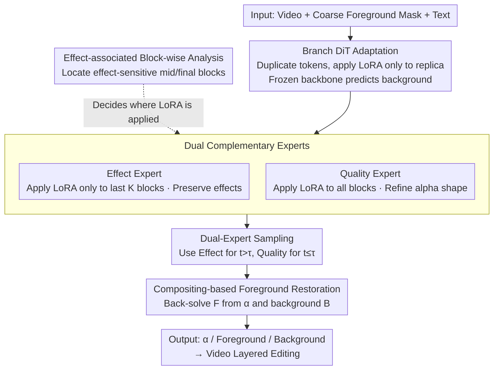

# EasyOmnimatte: Taming Pretrained Inpainting Diffusion Models for End-to-End Video Layered Decomposition

**Conference**: CVPR 2026  
**Paper**: [CVF Open Access](https://openaccess.thecvf.com/content/CVPR2026/html/Hu_EasyOmnimatte_Taming_Pretrained_Inpainting_Diffusion_Models_for_End-to-End_Video_Layered_CVPR_2026_paper.html)  
**Code**: https://github.com/GVCLab/EasyOmnimatte  
**Area**: Video Generation / Video Layering / Diffusion Models  
**Keywords**: Video Omnimatte, Video Layered Decomposition, Diffusion Prior Reuse, LoRA Experts, alpha matte

## TL;DR
By reversing the use of a pretrained video inpainting Record model—instead of erasing the foreground and its shadows/reflections, it is fine-tuned to **extract** the foreground layer and its associated effects. Using a dual-LoRA "Effect Expert + Quality Expert" setup with partitioned sampling during high/low noise diffusion stages, this work achieves the first **end-to-end, feed-forward, tens-of-seconds-level** video omnimatte (whereas the previous Gen-Omnimatte requires hundreds of seconds of layer-by-layer optimization).

## Background & Motivation
**Background**: The goal of video omnimatte is to decompose a video into a "foreground layer + all its associated visual effects (shadows, reflections, splashes/smoke)" and a "clean background layer", satisfying the standard alpha compositing equation $V = \alpha \odot F + (1-\alpha)\odot B$. Dominant methods (Omnimatte series, Gen-Omnimatte) either rely on optical flow/motion assumptions for self-supervised optimization, or employ multi-stage, test-time optimization pipelines—first generating the background, then performing thousands of steps of test-time optimization for each foreground layer.

**Limitations of Prior Work**: These methods are slow (Gen-Omnimatte takes several minutes per layer, totaling around 360 seconds) and **fail to fully utilize the priors of large generative models**, limiting decomposition quality. When the background changes rapidly, "background leakage into the foreground layer" and color distortion occur. Pure learning-based matting (BGMv2, MatAnyone), though fast, fails to capture associated effects (assigning excessively high alpha values to shadow regions, which pollutes the foreground with background colors) and generalizes poorly to non-human targets.

**Key Challenge**: A video inpainting model capable of cleanly erasing an object "along with its shadow" **must have perceived these effects** in the first place to erase them; this capacity to "perceive effects" is wasted on the "erasing" task.

**Goal**: (1) **Reuse** this perception capacity for the complementary task of foreground layer (including effects) extraction; (2) Develop a single-model, single-stage, feed-forward approach instead of multi-stage optimization.

**Key Insight**: Since inpainting models follow an intrinsic pipeline of "first perceiving effects, then eliminating them," they can be fine-tuned to output the "perceived effects" as foreground layers instead of erasing them. The authors fine-tune the inpainting model using LoRA on synthetic matting data to directly predict alpha. However, they encounter an counter-intuitive pitfall: **applying LoRA to all DiT blocks allows the model to extract the main foreground object, but systematically loses shadows and reflections**, even when the training targets explicitly include these effects.

**Core Idea**: Through block-wise analysis, it is discovered that "effect perception is concentrated in the middle-stage blocks, but is actively suppressed in the final-stage blocks." Consequently, instead of applying LoRA to all blocks, two complementary experts are trained—**Effect Expert** (LoRA applied only to the final blocks to preserve effects) and **Quality Expert** (LoRA applied to all blocks to refine the alpha shape). These experts are deployed alternately during high and low noise stages of diffusion sampling, yielding the benefits of both using "the computational cost of a single diffusion run."

## Method

### Overall Architecture
The input consists of a video $V$, frame-by-frame "coarse foreground masks" $M$ (bounding the object only, excluding effects), and a text description $c$ of the background. The output is the foreground layer $F$, the alpha matte $\alpha$, and the restored background layer $B$. The entire pipeline is built on top of a frozen pretrained video inpainting DiT. First, the input tokens are **duplicated**, and LoRA is attached only to the replica, creating a "Branch DiT Block" that allows the frozen backbone to continue predicting the background while the branch predicts the alpha (Sec. 3.1). Next, through "effect-associated block-wise analysis" of each block, the blocks responsible for perceiving or suppressing effects are identified (Sec. 3.2). Based on this, the Effect and Quality experts are trained. During diffusion sampling, a threshold $\tau$ is used to switch from the Effect Expert in high-noise stages to the Quality Expert in low-noise stages (Sec. 3.3). Finally, the foreground $F$ is back-solved from $\alpha$ and the background $B$ for video editing applications (re-timing, layer copying, scaling, adding special effects).

### Key Designs

**1. Branch DiT Adaptation: Enabling the frozen inpainting model to simultaneously output background and alpha in a single forward pass**

The issue is that directly fine-tuning the inpainting model into a matting model destroys its native prior of "erasing effects," and data is scarce. The authors' approach keeps the original input format of the inpainting model (video frames + frame-by-frame foreground mask $M$ + text $c$, projected into visual tokens via channel concatenation) and then **duplicates** the visual tokens along with their Rotary Position Embedding (RoPE). The tokens are concatenated along the token dimension into two parallel sets of tokens: the original set continues through the inpainting pipeline to predict the background, while the duplicated set is dedicated to predicting the alpha. LoRA is **attached only to the duplicated set of tokens**. Consequently, the frozen backbone predicts the background $\hat B$ as usual on the "unpolluted original tokens," while the LoRA branch redirects the output from "background prediction" to "alpha estimation" on the duplicated tokens. The authors choose to predict the alpha $\hat\alpha$ instead of directly predicting the foreground $\hat F$, as alpha is well-defined across the entire frame (0 in pure background areas), serving as a more stable and well-conditioned regression target. The foreground layer is finally back-solved from the compositing equation:

$$\hat F_f = \frac{\mathrm{clip}\big(I_f - (1-\hat\alpha_f)\cdot \hat B_f\big)}{\hat\alpha_f + \epsilon}$$

where $I_f$ is the original frame, $\hat B_f$ is the inpainted background, and $\epsilon$ prevents division by zero. In this way, the background is provided by the frozen backbone and the alpha is provided by the branch tokens, without interfering with each other.

**2. Effect-associated Block-wise Analysis: Locating blocks that "first perceive then suppress" effects, guiding LoRA placement**

Even when using all Branch DiT blocks, the model still fails to capture effects. Suspecting that the inpainting model internally follows a sequential process of "perceiving effects first, then eliminating them," the authors conduct block-level probing. For each foreground pixel $p$, an "effect association score" is defined based on the self-attention map $W$ of that block, measuring how much attention the pixel pays to the effect region $M^e$:

$$s(p) = \frac{\sum_{y\in M^e} W_{p,y}}{\sum_{x\in I} W_{p,x}}$$

This yields the effect attention map $S_{f,b}$ for the $b$-th block of the $f$-th frame. Next, a normalized block contribution score $C_b$ (summing the activations within the effect mask $M^e_f$ across all $N$ frames and normalizing over all blocks) is computed:

$$C_b = \frac{\sum_{f=1}^{N}\sum_p (S_{f,b}\odot M^e_f)}{\sum_{b=1}^{B}\sum_{f=1}^{N}\sum_p (S_{f,b}\odot M^e_f)}$$

where the effect mask $M^e_f$ is obtained by intersecting the binarized alpha with the complement of the dilated foreground mask, separating the effect region from the object itself. Partitioning the model along the valleys of the curve reveals three stages: the **initial stage** has a large field of view and encodes scene context; the **middle stage** most strongly captures the spatial structure of effects (shadows); the **final stage**, conversely, **actively suppresses** effect-related features. This "mid-stage perception, final-stage suppression" curve is precisely the basis for deciding "where to apply LoRA"—applying LoRA to the late-stage blocks responsible for suppressing effects prevents them from doing so.

**3. Dual Complementary Experts: Splitting "effect preservation" and "shape refinement" into two LoRA experts using attention masks**

Based on the above findings, the authors train two experts instead of one. The **Effect Expert** $G_E$ attaches LoRA only to the **last $K$ blocks** of the inpainting DiT:

$$\Theta_E := \{\,\mathcal{B}(L_b)\mid b\in(B-K,\,B]\,\}$$

where $\mathcal{B}$ denotes the "branching with LoRA" operation. The motivation comes directly from the block-wise analysis—modifying only the late blocks that would otherwise suppress effects avoids letting the LoRA trained for alpha prediction interfere with the model's native effect perception. During training, the self-attention mask is also modified so that the query tokens of the inpaint branch **do not attend to** the matting tokens. As a result, the inpainting branch is unaffected, and its intermediate representations sequentially provide stable guidance to the "effect-capturing branch."
The **Quality Expert** $G_Q$ attaches LoRA to **all blocks** ($\Theta_O := \{\mathcal{B}(L_b)\mid b\in[1,B]\}$) and masks out the attention between inpainting tokens and matting tokens. In this case, training the Quality Expert is equivalent to directly fine-tuning the inpainting model itself, independent of the frozen branch. This enables fast fitting to matting data and produces high-quality alphas with precise shapes, though at the cost of **completely losing effects**. The two experts are highly complementary: the Effect Expert preserves effects but has coarse boundaries, while the Quality Expert yields refined boundaries but loses effects.

**4. Dual-Expert Sampling: Alternating the two experts based on diffusion noise levels to achieve all benefits in half the diffusion cost**

Running the full diffusion process for both experts and fusing them would double the computation. The authors exploit the intrinsic nature of diffusion/flow matching where generation progresses from high noise to low noise: **coarse content and effects form during the early high-noise stages, while details are refined in the late low-noise stages**. They use a threshold $\tau$ to switch experts:

$$G = \begin{cases} G_E & \text{if } t > \tau \\ G_Q & \text{if } t \le \tau \end{cases}$$

Specifically, the Effect Expert is used during high-noise steps to generate a "coarse omnimatte with effects," and the Quality Expert is used during low-noise steps to refine the alpha shape. In experiments, $\tau=0.5$ (selected from Fig. 9). This is a classic coarse-to-fine scheme, but uniquely, both stages share the same diffusion trajectory, **eliminating the need for two full diffusion processes**. Consequently, it obtains the advantages of both high-fidelity effects and precise mattes with "zero extra computational overhead." Users can also adjust $\tau$: a smaller $\tau$ favors matting precision, while a larger $\tau$ emphasizes prominent effects.

### Loss & Training
Initialize with the video inpainting model provided by Lee et al. (based on the open-source video generation framework Wan), fine-tuned end-to-end for 8000 steps, using AdamW, learning rate $1\times10^{-3}$, and 2×H100 GPUs. The LoRA ranks for the Effect/Quality experts are 128 / 64, and the default sampling threshold is $\tau=0.5$. The training data is synthesized: foreground videos with high-quality alpha labels are composited onto large-scale high-resolution background videos. The foreground mask $M$ is obtained directly from the ground truth alpha, with random scaling, rotation, and translation applied for augmentation. A series of transformations (shear, blur, color adjustment) are applied to the foreground matte to generate "pseudo-shadows" that simulate foreground effects.

## Key Experimental Results

Evaluation is performed on DAVIS and real-world internet videos. Due to the lack of annotated test data, the authors use two types of no-reference metrics: "perceptual loss of the recomposited video vs. the original video" and "distribution perturbation on background videos when batch-compositing onto multiple backgrounds," along with a user study collecting 1680 reviews from 28 participants across 20 videos.

### Main Results

| Dataset/Method | PSNR↑ | SSIM↑ | WE↓ | FVD↓ |
|------|------|------|------|------|
| BGMv2 | 26.61 | 78.78 | 101.04 | 168.31 |
| MatAnyone† | 26.12 | 78.68 | 100.46 | 146.44 |
| Gen-Omnimatte (Optimization-based) | 24.35 | 69.36 | 101.33 | 116.32 |
| **EasyOmnimatte (Ours)** | 26.23 | 78.83 | **100.94** | **105.48** |

Ours performs significantly best on FVD (distribution fidelity after compositing onto new backgrounds, 105.48 vs. Gen-Omnimatte's 116.32) and achieves the highest SSIM. Its PSNR is comparable to pure matting baselines but significantly superior to the optimization-based Gen-Omnimatte. Crucially, the execution speed is reduced from several minutes per layer to **<10 seconds** (overall reduction from the 360s level to the 10s level), representing an order of magnitude speedup. † denotes that MatAnyone requires the shadow detection tool SSIS-v2 to barely capture effects.

The user study (0–5 scale) shows a wider margin:

| Method | Comprehensive↑ | Foreground Integrity↑ | Effect Harmony↑ | Temporal Consistency↑ |
|------|------|------|------|------|
| BGMv2 | 2.26 | 1.78 | 2.96 | 2.04 |
| MatAnyone† | 2.82 | 2.83 | 2.60 | 3.02 |
| Gen-Omnimatte | 2.85 | 2.45 | 3.36 | 2.74 |
| **EasyOmnimatte** | **4.08** | **4.07** | **3.97** | **4.21** |

### Ablation Study

| Configuration | Observation/Description |
|------|---------|
| Attention Mask Type A (Branch tokens communicate freely) | Background prediction is polluted, leading to degraded foreground decomposition |
| Attention Mask Type B | Retaining only the alpha $\rightarrow$ background attention path improves effect perception, but alpha quality remains poor |
| Attention Mask Type C (Fully isolated training + Type C used in inference) | Final solution: Quality training $\approx$ direct inpainting fine-tuning, quickly forming high-quality alphas |
| Branch DiT placed at initial/middle/final blocks (Fig. 8 a-c) | Applying LoRA to the "late-stage blocks responsible for suppressing effects" yields the most significant improvement in preserving effects |
| Effect Expert only (Fig. 8 d) | Strong effects, but matte boundary precision degrades |
| Quality Expert only (Fig. 8 e) | High foreground precision, but completely loses effects |
| **Full (Dual-expert sampling)** | Combines effect fidelity and shape precision |
| Threshold $\tau$ (Fig. 9, training/validation evaluated separately for foreground/effects via MSE) | Small $\tau$ favors matting precision, large $\tau$ favors effects; 0.5 is the optimal balance point |

### Key Findings
- **"Where to apply LoRA" is more critical than "how much to apply"**: The block-wise analysis shows that effect perception is concentrated in the middle blocks and suppressed by the final blocks. Applying LoRA only to the final blocks (Effect Expert) preserves effects, while applying it to all blocks suppresses them—this is the root cause of why "naive all-block fine-tuning loses shadows."
- **The two experts are naturally complementary**: Either expert alone has distinct drawbacks (Effect has coarse boundaries, Quality loses effects). Dual-expert sampling merges their strengths using a single diffusion trajectory without increasing computational cost.
- **Effects manifest in FVD and human evaluation**: The substantial lead in FVD and user study (especially "Foreground Integrity 4.07, Temporal Consistency 4.21") suggests that the layered results are more harmonious and lose less information when composited onto new backgrounds, whereas pixel-wise metrics like PSNR/SSIM are insensitive to whether effects are preserved.

## Highlights & Insights
- **Dual perspective of "Erasing $\leftrightarrow$ Extraction"**: Translating the observation that "a model capable of cleanly erasing shadows has already perceived them" into "fine-tuning it to output shadows instead of erasing them" is an elegant reuse of priors, avoiding the data bottlenecks of training a large matting model from scratch.
- **Locating functional blocks with attention probes**: The effect association score and block contribution score quantify the "perception first, suppression later" internal mechanism, directly guiding the placement of LoRA. This "analysis $\rightarrow$ design" feedback loop can be transferred to other tasks aiming to reuse generative priors.
- **Expert routing along the diffusion noise timeline**: Implementing coarse-to-fine as "using the effect-preserving expert for early steps and the shape-refining expert for late steps" merges two models along a shared sampling trajectory with zero extra overhead. This scheduling concept is valuable for any diffusion task with varying requirements for "coarse structure vs. fine details."
- The **frozen backbone + duplicated tokens + branch LoRA** architecture allows "background prediction" and "alpha prediction" to run in a single forward pass without mutual interference, offering a lightweight formulation for extending single-task models to multi-output architectures.

## Limitations & Future Work
- **Heavy reliance on the base inpainting model**: The authors acknowledge that the capacity upper bound of this method is constrained by the perception/generation capabilities of the base model; switching to a weaker base may lead to overall performance degradation.
- **Synthetic training data with pseudo-shadows**: Foreground effects are approximated using synthetic "pseudo-shadows" generated via shear, blur, and color adjustment. The gap between real-world complex effects (strong reflections, water splashes, smoke) and the synthetic distribution may limit generalization. The paper also lacks a real annotated test set, relying on no-reference metrics and user evaluation for indirect assessment.
- **PSNR comparable to pure matting baselines**: The method does not outperform BGMv2 on pixel-wise metrics. Its advantages lie in the "layered quality with effects," providing limited gain for scenarios where effects are ignored and only sharp portrait mattes are desired.
- **Future Work**: Extending this "block-wise analysis + expert adaptation" framework to more generative models (listed as future work by the authors); automated threshold $\tau$ selection or content-adaptive expert switching; introducing more realistic effect data synthesis or self-supervised real-effect signals.

## Related Work & Insights
- **vs. Gen-Omnimatte (Optimization-based)**: Gen-Omnimatte is a two-stage method: generating the background first, then performing thousands of test-time optimization steps per layer, which is slow, prone to error propagation, causes color distortion, and suffers from background leakage under rapid background changes. This work implements background and foreground layering in a **single-model end-to-end feed-forward** manner (<10 seconds, FVD 105.48 vs. 116.32), reusing the same removal/inpainting prior but in "reverse."
- **vs. BGMv2 / MatAnyone (Learning-based matting)**: These methods are fast but fail to capture associated effects (excessively high alpha in shadow regions $\rightarrow$ polluting the foreground color), and generalize poorly to non-human targets; relying on post-processing with shadow detection tools remains sub-optimal. This work naturally retains effects using a generative prior, with a "harmony of effects" score of 3.97 in the user study, significantly higher than both.
- **vs. Omnimatte series (Motion/Optical Flow self-supervision)**: The original Omnimatte family relies on motion assumptions such as planar homography, non-rigid warping, or 3D representations, which degrade severely when these assumptions fail. This work bypasses motion assumptions and achieves layered decomposition directly via feed-forward generation priors.

## Rating
- Novelty: ⭐⭐⭐⭐⭐ "Reversing an erasing model for extraction" + block-wise analysis to locate effect blocks + dual-expert routing along physical noise axes. The methodology is innovative and highly coherent.
- Experimental Thoroughness: ⭐⭐⭐⭐ Main results, user studies, and extensive ablation studies are complete, but it lacks a real-world annotated test set, relying instead on no-reference metrics and pseudo-shadow synthesis. PSNR does not surpass matting baselines.
- Writing Quality: ⭐⭐⭐⭐⭐ The closure of the motivation-analysis-design loop is clearly described, with well-constructed diagrams and equations.
- Value: ⭐⭐⭐⭐⭐ The first end-to-end, seconds-level video omnimatte to directly facilitate video editing/special effects, carrying strong structural significance.

<!-- RELATED:START -->

## Related Papers

- [\[CVPR 2026\] STARFlow-V: End-to-End Video Generative Modeling with Autoregressive Normalizing Flows](starflow-v_end-to-end_video_generative_modeling_with_autoregressive_normalizing_.md)
- [\[CVPR 2026\] MoCha: End-to-End Video Character Replacement without Structural Guidance](mocha_end-to-end_video_character_replacement_without_structural_guidance.md)
- [\[ICLR 2026\] MoGA: Mixture-of-Groups Attention for End-to-End Long Video Generation](../../ICLR2026/video_generation/moga_mixture-of-groups_attention_for_end-to-end_long_video_generation.md)
- [\[CVPR 2026\] Pantheon360: Taming Digital Twin Generation via 3D-Aware 360° Video Diffusion](pantheon360_taming_digital_twin_generation_via_3d-aware_360_video_diffusion.md)
- [\[CVPR 2026\] RFDM: Residual Flow Diffusion Models for Video Editing](rfdm_residual_flow_diffusion_models_for_video_editing.md)

<!-- RELATED:END -->
