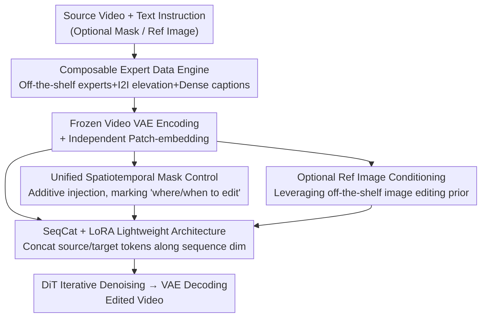

# EasyV2V: A High-quality Instruction-based Video Editing Framework

**Conference**: CVPR 2026  
**Paper**: [CVF Open Access](https://openaccess.thecvf.com/content/CVPR2026/html/Mai_EasyV2V_A_High-quality_Instruction-based_Video_Editing_Framework_CVPR_2026_paper.html)  
**Code**: [Project Page](https://snap-research.github.io/easy-v2v/)  
**Area**: Video Generation / Instruction-based Video Editing / Diffusion Models  
**Keywords**: Instruction-based Video Editing, V2V Data Engine, Sequence Concatenation Conditioning, LoRA Fine-tuning, Spatiotemporal Mask Control

## TL;DR
EasyV2V decomposes "instruction-based video editing" into data, architecture, and control, adopting the most effort-efficient solution for each: it compiles a V2V paired dataset of approximately 8 million samples using off-the-shelf expert models, image-editing-to-video elevation, and dense-captioned videos. On a pretrained T2V backbone, it only introduces a few zero-initialized patch embeddings and LoRA, injects the source video via sequence concatenation, and uses a single mask video to uniformly represent "where and when to edit." Ultimately, it achieves a VLM score of 7.73/9 on the EditVerse benchmark, outperforming existing published methods, concurrent works, and commercial systems.

## Background & Motivation

**Background**: Image editing has achieved high visual fidelity and instruction-following capability in recent years, relying on mature I2I paired data and fine-tuning on pretrained image generators; in contrast, video-to-video editing (V2V) lags significantly behind. Existing works either adapt pretrained generators in a training-free manner, which is fragile and slow, or train specifically for narrow tasks (such as ControlNet-style conditioning, video inpainting, and character reenactment). Although general-purpose instruction-based video editors can cover a wider range of editing types, they still fall short of image editors in terms of fidelity and controllability.

**Limitations of Prior Work**: The authors attribute these issues to three design dimensions that have not been systematically investigated. The first is **data**—constructing high-quality V2V paired data is inherently harder than I2I (requiring multi-frame consistency and faithful editing). Existing routes either rely on "self-training with an all-powerful teacher model" (which assumes someone has already solved the problem) or "training a crowd of expert models for each class of editing" (which is costly, hard to maintain, and requires rebuilding whenever the backbone changes). The second is **architecture**—there is no consensus on how to inject the source video into generators: channel concatenation saves tokens but entangles the source and target signals, while full fine-tuning easily leads to catastrophic forgetting. The third is **control**—prior works only control "where to edit" (using skeletons, segmentation, depth, or masks), but no one has treated "**when to edit and how the editing evolves**" (e.g., "the house catches fire after 1.5 seconds, and the flames gradually grow") as a first-class citizen.

**Key Challenge**: High quality in video editing is simultaneously constrained by these three dimensions; optimizing any single dimension in isolation is insufficient. Previous approaches either piled up teacher models, stacked experts, or modified architectures, which was costly and disconnected.

**Key Insight**: The authors' key observation (Figure 2 in the paper) is that **modern pretrained T2V models already "know" how to perform common edits**; even without fine-tuning, they can imitate effects like style transfer and gradual attribute transitions. This suggests that the "how to edit" capability is largely pre-embedded in the backbone, only requiring minimal adaptation to unlock, rather than building massive systems from scratch.

**Core Idea**: Select the most "effort-efficient, minimal modification" approach along all three dimensions (data, architecture, and control)—building data with **composable off-the-shelf experts**, performing lightweight backbone adaptation with **sequence concatenation + LoRA**, and achieving unified spatiotemporal control via **a single mask video**. These are combined into a simple yet SOTA instruction-based video editor.

## Method

### Overall Architecture
EasyV2V’s input is "source video + text instruction", optionally with "editing mask" and "reference image", and the output is the edited video matching the instruction. It supports flexible combinations such as `video + text`, `video + mask + text`, and `video + mask + reference image + text`. The overall system is supported by two main pillars: an offline **data engine** (which stitches off-the-shelf experts, image-editing elevation, and dense-captioned videos into ~8 million V2V/I2I pairs, along with transition supervision) and an online **lightweight editing architecture** (which encodes the source video, mask, and reference image, injects them into a frozen T2V backbone via sequence concatenation or addition, and only trains LoRA and new patch embeddings).

Specifically in the forward pass: the source video $Z_{src}$, target video $Z_{tgt}$, mask $Z_{msk}$, and optional reference image $Z_{ref}$ are encoded into the latent space using a **frozen video VAE**, each passing through an **independent patch-embedding layer**. The mask is integrated into the source video tokens via **addition**, and the source video tokens are **concatenated along the sequence dimension** with the noisy target tokens and optional reference tokens before being input to the DiT. The DiT backbone is frozen, with LoRA added only to the attention layers. After iterative denoising, the edited video is decoded.

### Key Designs

**1. Composable Expert Data Engine: No Teacher Training, No Expert Maintenance, Just Combining Off-the-Shelf Modules to Generate ~8M Pairs**

This addresses the data pain point directly: generating V2V pairs either relies on an all-powerful teacher (impractical) or maintaining a bunch of experts (expensive and hard to iterate). The authors propose a third way—**selecting off-the-shelf experts with 'fast inverses' and combining them** (e.g., edge↔video, depth↔video are mutual inverses of each other, making supervision signals naturally easy to obtain), and then using filtering and "preferring experts with reliable inverses" to suppress heterogeneous artifacts across different experts. There are several parallel pipelines in the engine: **human animation** (using Wan Animate to swap actors, change clothes, or transfer styles while preserving pose/expression consistency), **object removal/insertion** (open-vocabulary detection → LLM label cleaning → video segmentation → video inpainting → manual filtering → VLM instruction writing), **actor transmutation** (building zero-shot V2V pipelines on generative video models to perform intra-category replacement like quadruped-to-quadruped or bird-to-bird), **video stylization** (extracting edge maps to preserve structure, editing the first frame's style, and then generating stylized videos), and **controllable video generation** (pairing depth/HED/Canny/optical flow/pose control signals).

More importantly, two types of "amplification" methods are used. First, **elevating I2I to V2V**: because high-quality image editing data is abundant while video editing data is scarce, image editing pairs are used as supervision—either directly as "single-frame videos" for training or by **applying the same smooth 2D affine trajectory** (small rotation, scale, and translation interpolation) to the source and edited images to create pseudo-V2V pairs that "only differ at the semantic edits while the rest is just camera motion". This introduces image supervision signals while supplementing temporal structure. Second, **dense-caption T2V continuation**: from videos with time-windowed captions, the segment **before** the caption interval is taken as the source, and the segment **within** the interval as the target. An LLM is used to convert the caption ("He sits down") into an imperative instruction ("Make him sit down"), specifically filling the gap in **action-oriented edits** that are scarce in conventional V2V corpora. This eventually results in ~8 million pairs (~4.3 million open-source/licensed + ~3.4 million self-constructed), which the authors claim is the most comprehensive to date among published works, and they ablated each source.

**2. Sequence Concatenation + LoRA Lightweight Architecture: "Minimal Modifications" on Frozen Backbone to Unlock Editing Capabilities**

Addressing the pain points of "how to inject the source video" and "whether catastrophic forgetting will occur", the authors make two clear trade-offs. For the injection method, they compare **channel concatenation** (concatenating source and noisy latents along the channel dimension, modifying only the first patch embedding, fewer tokens and faster) with **sequence concatenation** (appending source video tokens after the noisy token sequence). Experiments (Table 3 in the paper) show that sequence concatenation yields consistently higher quality—the cost is more tokens and lower efficiency, but the benefit is that the source and target maintain "neat roles" without entanglement, leading to better instruction following and local details. Specifically, independent patch-embeddings are assigned to the source video, mask, and reference image respectively, placing $Z_{src}$ first and $Z_{tgt}$ last, causing the model to learn an in-context editing behavior similar to "video generation continuation" (which coincidentally aligns with the dense-caption data).

For the fine-tuning strategy, they choose **LoRA (rank=256) + training only the new patch embeddings**, freezing the entire backbone and VAE, and zero-initializing the new parameters. The reasons are very concrete: at their training scale, full fine-tuning easily leads to unstable training, source video inconsistency, overfitting, and catastrophic forgetting of pretrained knowledge; LoRA, on the other hand, **adapts faster, overfits less, preserves priors, and makes it easier to swap backbones in the future**. Table 3 directly quantifies this: `LoRA w/ SeqCat` (their final scheme) at 40K steps gets a VLM score of 7.47, while `Full w/ SeqCat` gets only 3.94—showing that full training obviously degrades at this scale.

**3. Unified Spatiotemporal Control via a Single Mask Video: Using One Mask to Express Both "Where and When to Edit"**

Prior control signals missed a crucial dimension—**when the editing occurs and how it evolves**. EasyV2V unifies this using **a binary mask video** $M$: pixels mark "where to edit" (region inpainting/removal) and frames mark "when to edit and for how long" (time interval). The mask is encoded by an independent patch-embedding and **injected into the source video tokens via addition**, rather than concatenated into the sequence—since the mask is a low-frequency signal, addition is sufficient for effective fusion, saving token budget (introducing no new tokens for the mask) and making it easier for the model to migrate to future backbones. To support "gradual editing", they synthesize **transition supervision** on the data side: given an edit start time $t_i$, they construct the target $V' = [V^{src}_{t_0:t_i},\, V^{tgt}_{t_i:t_N}]$, and derive a frame-by-frame mask that is active only after $t_i$, then use transition operators like linear blending to let the effect unfold naturally at $t_i$. During inference, if no mask is provided, a blank mask is used by default, degrading to pure instruction-based editing. Compared to keyframe prompting or token scheduling, a single mask video is "direct, differentiable, and easy to combine with text/reference images", with the only cost being a lightweight, editable mask sequence.

**4. Optional Reference Image Conditioning: Leveraging Off-the-Shelf Image Editing Priors Without Being Dragged Down by Their Flaws**

To take advantage of strong image editors when available, the model supports an **optional reference image**: during training, a frame can be sampled from the target video as a reference; during inference, it can be obtained by editing a source video frame using an external image editor or directly provided by the user. However, reference images are often imperfect (e.g., Qwen-Image-Edit may introduce spurious scaling). Thus, during training, **random cropping/rotation** are applied to the reference image, which is also **randomly dropped** with a probability of 50%, ensuring the model remains robust when the reference is missing or noisy. Reference tokens are appended to **the end of the sequence**—this fixes the token distance between $Z_{src}$ and $Z_{tgt}$ while placing $Z_{ref}$ close to $Z_{tgt}$ to provide stronger guidance. Standard style matching and detail specificity are better with references, and the model does not break when they are absent.

### Loss & Training
The base model is the pretrained **Wan-2.2-TI2V-5B** + Wan-2.2-VAE (spatiotemporal compression ratio of $4\times16\times16$), and the training resolution is $81\times832\times480$ (high-resolution results at $81\times1280\times704$ are provided in the supplementary material). LoRA rank=256, constant learning rate $1\times10^{-4}$, AdamW optimizer, trained on 32 H100 GPUs with all new parameters zero-initialized. Random reference dropping and video transition augmentation are each applied with a 50% probability.

## Key Experimental Results

### Main Results
Evaluated on the **EditVerse benchmark** (consisting of the original 20 editing types, filtered to 16 classes and 160 videos after removing those unsupported by the training dataset, such as camera pose changes). The primary metric is the **VLM score** (GPT-4o assesses prompt following, editing quality, and background consistency on a scale of 0-3 each, totaling 0-9; the authors claim this aligns best with human judgment), with frame/video-level text alignment and PickScore as auxiliary metrics.

| Method | VLM Edit Quality↑ | Pick Score↑ | Text Alignment (Frame)↑ | Text Alignment (Video)↑ |
|------|--------------|-------------|--------------|----------------|
| TokenFlow (Training-free) | 5.02 | 19.59 | 25.10 | 22.49 |
| Se\~norita-2M (w/ Ref, Qwen-Edit) | 6.45 | 20.26 | 26.51 | 23.24 |
| InsViE-1M (w/ Ref) | 4.36 | 19.25 | 25.06 | 21.28 |
| InsV2V | 4.95 | 19.33 | 24.98 | 22.74 |
| Runway Aleph (Commercial Closed-source) | 7.48 | 20.56 | 27.96 | 24.68 |
| EditVerse (Concurrent unpublished, No code) | 7.64 | 20.33 | 27.70 | 25.37 |
| **EasyV2V (No Ref)** | **7.73** | 20.36 | 27.59 | 24.46 |
| EasyV2V (w/ Ref, Flux-Kontext) | 7.53 | 20.61 | **28.10** | 25.13 |

The referenceless version achieves a VLM score of **7.73/9**, leading all published methods, concurrent works (EditVerse 7.64), and commercial systems (Runway Aleph 7.48); with reference conditioning, text alignment is further improved (Frame 28.10, Video 25.13).

Additionally, on the ImgEdit image editing benchmark (treating images as single-frame videos), although EasyV2V is not specifically designed for image editing, its overall score of 3.96 outperforms dedicated image editing models like EditVerse (3.71), which the authors attribute to the unified data pipeline combining image editing data with human-action video caption data.

### Ablation Study

**Architecture Ablation (Table 3 in paper)**—validating the two trade-offs of "sequence concatenation + LoRA":

| Configuration | VLM@20K↑ | VLM@40K↑ | Description |
|------|----------|----------|------|
| Full w/ EmbedAdd. | 4.67 | 4.57 | Full fine-tuning + patch-embedding addition (approx. channel concatenation), prone to overfitting during training |
| Full w/ SeqCat. | 3.66 | 3.94 | Full fine-tuning + sequence concatenation, full training degrades significantly at this scale |
| LoRA w/ EmbedAdd. (Ours) | 6.11 | 6.29 | LoRA + additive injection, better than full fine-tuning but still inferior to sequence concatenation |
| **LoRA w/ SeqCat. (Ours)** | **7.05** | **7.47** | Final scheme: LoRA quickly adapts T2V to V2V, yielding the highest quality |

**I2I Data Ablation (Table 4 in paper)**—validating the "elevating I2I to V2V" approach:

| Single Image | Affine Image | Video Edit | Edit Quality↑ | Pick Score↑ |
|:---:|:---:|:---:|:---:|:---:|
| ✓ | ✗ | ✗ | 5.52 | 19.49 |
| ✓ | ✓ | ✗ | 6.24 | 19.67 |
| ✗ | ✗ | ✓ | 6.69 | 19.90 |
| ✓ | ✓ | ✓ | **6.86** | **19.94** |

Gradually inflating from treating I2I as single-frame videos (5.52) to generating pseudo-V2V via affine transformations (6.24) brings progressive gains; moreover, **joint training with affine I2I and V2V (6.86) outperforms using V2V alone (6.69)**, showing that I2I data is worth incorporating and that affine elevation helps bridge the image/video domain gap.

### Key Findings
- **Architecture-wise, sequence concatenation + LoRA is a double-win**: At the same training steps, LoRA sequence concatenation achieves 7.47 @40K, whereas full training yields only 3.94. This proves that full fine-tuning at this data scale suffers from overfitting and instability, validating the core hypothesis that "modern T2V backbones already know how to edit and only need minimal adaptation."
- **The data engine has distinct strengths depending on the editing type (Table 5 in paper)**: Each self-constructed V2V dataset significantly boosts performance for its corresponding editing type (e.g., Dense Caption data reaches 6.87 on "modifying human action", and Inpainting data reaches 4.63 on "mask-based editing"). The only exception is Human Animate, which is surpassed by Actor Transmutation in VLM score (due to the latter's more diverse subjects), yet the former remains irreplaceable for preserving character identity and expression consistency.
- **I2I elevation + affine transformation is highly effective**: Using only single-frame I2I lacks motion supervision. Applying a shared affine trajectory to introduce temporal structure brings distinct gains, and joint training with V2V yields the best results.

## Highlights & Insights
- **"Combining off-the-shelf experts + fast inverses" is a highly efficient paradigm for data creation**: Instead of training a teacher or maintaining a group of experts, it selects off-the-shelf modules that are mutual inverses (edge↔video, depth↔video) to compile supervision signals. This offers low cost and high diversity, with artifacts suppressed by filtering and "preferring reliable inverses." This idea can be easily transferred to any generative editing task lacking paired data.
- **The affine trick to "elevate" I2I to V2V is ingenious**: By applying the same smooth camera trajectory to the source and edited images, massive and mature image editing datasets can be losslessly transferred into video training. This supplements temporal structure without altering semantics, directly alleviating V2V data scarcity.
- **"When to edit" is treated as a first-class control signal**: A single mask video is used to encode both space (pixels) and time (frames). Combined with transition supervision to support gradual editing, this is more direct and differentiable than keyframes or token scheduling, and easily combines with text—a dimension routinely missing in previous video editing works.
- **Additive injection for low-frequency signals, sequence concatenation for others**: The mask is a low-frequency signal, so additive injection saves tokens, while the source/reference contain high-frequency content, hence sequence concatenation is used to preserve clean roles. Selecting the injection method based on signal properties is a reusable engineering intuition.

## Limitations & Future Work
- **The authors acknowledge** that, like other diffusion video models, inference takes about one minute, preventing real-time applications.
- **Control dimensions can be further expanded**: The authors note that the framework can naturally incorporate higher-level capabilities such as geometric or cinematic camera pose control.
- **Self-identified limitations**: The data engine heavily relies on a set of off-the-shelf expert models (such as Wan Animate, open-vocabulary detection, video segmentation/inpainting, image editors, etc.). Although heterogeneous artifacts from different experts are filtered or manually screened, they still represent a potential ceiling on quality. The main evaluation metric depends on GPT-4o VLM scoring; while it is claimed to align best with humans, it is inherently a model-evaluating-model paradigm, and absolute value comparability should be treated with caution ⚠️ (refer to the original paper for accuracy). The reference-based version slightly underperforms the referenceless version in VLM edit quality (7.53/7.36 vs 7.73), indicating a minor trade-off between the text alignment gains brought by reference images and edit quality.

## Related Work & Insights
- **vs. Training-free methods (TokenFlow, STDF)**: These directly manipulate attention/latents or noise inversion without training, but they are fragile, slow, and suffer from low success rates. EasyV2V uses paired data + lightweight training, overwhelmingly dominant in quality (7.73 vs ≤5.02) and stability.
- **vs. Self-training/All-powerful teacher routes (InsV2V, Se\~norita-2M)**: These rely on one or a set of off-the-shelf video editing models to synthesize data, and are limited by teacher quality, dependency on the first frame, and weak action editing. EasyV2V uses composable experts + I2I elevation + dense-caption continuation, providing wider coverage and stronger action editing.
- **vs. Concurrent works Lucy Edit / EditVerse**: Lucy Edit uses patch-wise concatenation, supports limited editing types, and often suffers from motion misalignment; EditVerse employs an LLM-style architecture, gets close in quality, but has not open-sourced its code. EasyV2V is more comprehensive in systematically studying data sources and controllability (reference images + spatiotemporal masks), outperforming EditVerse (7.64) with a VLM score of 7.73.
- **vs. Channel concatenation conditioning injection**: The paper proves that while channel concatenation saves tokens, it entangles source and target signals, resulting in inefficient editing learning. Sequence concatenation, despite consuming more tokens, preserves clean roles and yields higher quality, making it a more worthwhile trade-off.

## Rating
- Novelty: ⭐⭐⭐⭐ Individual techniques (sequence concatenation, LoRA, mask) are not completely new, but the systematic recipe of "adopting the most effort-efficient solution on three axes (data/architecture/control) + unified spatiotemporal mask + I2I affine elevation" constitutes a clear contribution.
- Experimental Thoroughness: ⭐⭐⭐⭐⭐ The main comparison covers four categories: training-free, published, concurrent, and commercial. Detailed ablation studies are conducted on architecture, I2I elevation, and individual data sources with self-consistent conclusions.
- Writing Quality: ⭐⭐⭐⭐ The design space is clearly organized, with trade-offs explained for each design decision, though some details (VLM evaluation protocol, expert pipelines) are dense.
- Value: ⭐⭐⭐⭐⭐ It provides a reproducible "lightweight + SOTA" instruction-based video editing recipe. The data engine and single mask control ideas are practical and highly transferable.

<!-- RELATED:START -->

## Related Papers

- [\[CVPR 2026\] Scaling Instruction-Based Video Editing with a High-Quality Synthetic Dataset](scaling_instruction-based_video_editing_with_a_high-quality_synthetic_dataset.md)
- [\[CVPR 2026\] VIVA: VLM-Guided Instruction-Based Video Editing with Reward Optimization](viva_vlm-guided_instruction-based_video_editing_with_reward_optimization.md)
- [\[CVPR 2026\] CoT-Edit: Let CoT Guide Instruction Video Editing](cot-edit_let_cot_guide_instruction_video_editing.md)
- [\[CVPR 2026\] VGA-Bench: A Unified Benchmark and Multi-Model Framework for Video Aesthetics and Generation Quality Evaluation](vga-bench_a_unified_benchmark_and_multi-model_framework_for_video_aesthetics_and.md)
- [\[CVPR 2026\] DreamStyle: A Unified Framework for Video Stylization](dreamstyle_a_unified_framework_for_video_stylization.md)

<!-- RELATED:END -->
