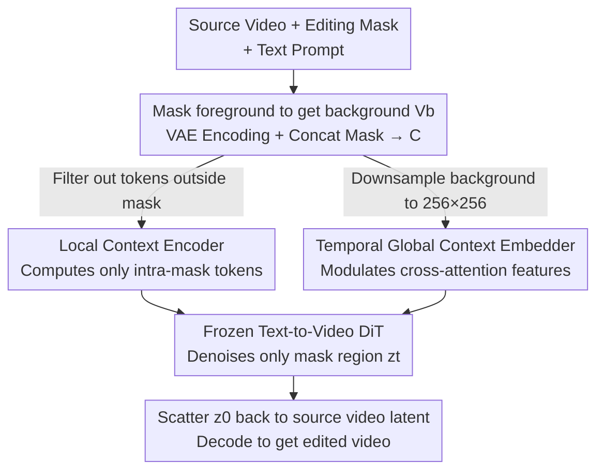

# EditCtrl: Disentangled Local and Global Control for Real-Time Generative Video Editing

**Conference**: CVPR 2026  
**Paper**: [CVF Open Access](https://openaccess.thecvf.com/content/CVPR2026/html/Litman_EditCtrl_Disentangled_Local_and_Global_Control_for_Real-Time_Generative_Video_CVPR_2026_paper.html)  
**Code**: To be confirmed  
**Area**: Video Generation / Video Editing / Diffusion Models  
**Keywords**: Generative Video Editing, Video Inpainting, Local Computation, ControlNet, Real-Time Inference

## TL;DR
EditCtrl introduces two lightweight adapters on top of a frozen text-to-video diffusion model: a "local context encoder" that processes only tokens within the mask, and a "temporal global context embedder" that observes only the downsampled background. This scales the computational cost linearly with the size of the editing region (rather than the full video resolution), enabling real-time, multi-region, and future-propagated generative editing on 4K videos, saving approximately 10× computational cost compared to existing methods while slightly improving quality.

## Background & Motivation

**Background**: High-fidelity generative video editing (video inpainting, which replaces arbitrary regions in a video with high-fidelity new content consistent with the context) has achieved massive breakthroughs over the past two years thanks to large-scale text-to-video diffusion models. The dominant paradigm relies on a pretrained DiT (e.g., VACE, VideoPainter) as the base model, feeding the entire video and pixel-level masks into the model, and utilizing full-attention in the joint spatio-temporal context for denoising generation.

**Limitations of Prior Work**: The computational cost of this full-attention paradigm is tied to the **resolution and frame count of the entire video**, and is **completely independent** of the actual size of the editing area. Even if the user only wants to paint a single car white (a sparse, local edit), the model must still process tokens from the entire frame and video sequence. This leads to extremely high latency (VACE-14B only runs at 0.10 FPS in the paper), making it impractical for physical-world applications like 4K editing, real-time AR, and simultaneous multi-area editing.

**Key Challenge**: The trade-off between quality and efficiency is bottlenecked by the coupling of mask information and video context. Because masks are fed into full-attention together with the video context, (i) computation cannot be focused solely on the regions to be edited; (ii) independent multi-region editing with different prompts is impossible; and (iii) editing cannot be propagated when future frames are unavailable (e.g., in streaming AR scenarios).

**Key Insight**: Inspired by LazyDiffusion in image editing—where the pretrained diffusion model can be fine-tuned to **denoise only local tokens within the mask** while utilizing a compressed global representation as a side-channel to provide context, thus scaling the diffusion speedup proportionally to the mask area. However, video introduces two unique challenges beyond images: maintaining **temporal consistency** and supporting video-specific downstream operations like **content propagation**.

**Core Idea**: The editing control signals are **disentangled** into a local pathway (high-frequency, intra-mask details) and a global pathway (low-frequency, video-level appearance/lighting/motion cues). Each pathway is injected into a **frozen** base model using a **lightweight adapter**. The local adapter only computes tokens within the mask (with computation proportional to the editing area), while the global adapter only processes the downsampled background (with constant cost). Leaving the base model untouched prevents quality degradation and naturally preserves compatibility with distillations, autoregressive models, and other variants.

## Method

### Overall Architecture

EditCtrl takes a source video $V_{src}$, a corresponding editing mask $V_m$, and a text prompt to produce the edited video, with a computational cost proportional to the size of the editing region. The overall pipeline follows a "background masking $\to$ dual-pathway context encoding $\to$ denoising only in masked regions via frozen DiT $\to$ scattering back to the original video" paradigm. Crucially, the **base DiT is kept frozen** throughout, concentrating all trainable parameters in the two adapters.

Specifically, the background video $V_b$ is first obtained by masking out the foreground. $V_b$ is encoded by a VAE encoder $\mathcal{E}$ and then channel-concatenated with the mask $V_m^{\downarrow}$ downsampled to the latent resolution, yielding the conditional context $C=(\mathcal{E}(V_b), V_m^{\downarrow})$. This context $C$ is split into two pathways: (1) One path uses $V_m^{\downarrow}$ as an attention mask to **filter out all background tokens outside the mask**, leaving only local tokens $C_{local}$ near the editing region, which are then passed into the **local context encoder** $c_\phi$. (2) The other path spatially downsamples the background to a fixed $256\times256$ resolution to obtain $V_b^{\downarrow}$, which is encoded and fed into the **temporal global context embedder** $G_\psi$. The outputs of both adapters are added to selected transformer layers of the frozen DiT, guiding it to denoise only the noise tokens $z_t$ inside the mask. Finally, $z_0$ is **scattered** back to the corresponding mask locations of $\mathcal{E}(V_{src})$, and decoded to produce the final video.

### Key Designs

**1. Local Context Encoder: Scaling Computation with Edit Area Instead of Video Resolution**

This is the primary contributor to computational savings, directly addressing the pain point of "full-attention processing the entire video." EditCtrl adopts a ControlNet-like architecture, starting with a context control module trained for full-frame inpainting via bidirectional full-attention (initialized with VACE weights). To adapt this for local computation, the authors use the downsampled mask $V_m^{\downarrow}$ as an attention mask to select tokens corresponding to the foreground: the background token $C$ is filtered by $V_m^{\downarrow}$ to yield $C_{local}$, and the same filtering applies to the noisy latent $z_t$. The output of the control module is **element-wise added** to the FFN output after selected video transformer layers. This ensures only tokens inside the mask run through the entire DiT and control module, proportionally accelerating the diffusion process.

However, directly discarding tokens outside the mask introduces two issues: (i) **poor boundary blending**—to address this, $V_m^{\downarrow}$ is **dilated** before selection to include adjacent pixels, ensuring the generated content blends seamlessly with the surrounding background; (ii) because the pretrained control module was originally trained in full-attention mode, suddenly switching to sparse attention causes a sharp quality drop. Thus, it must be **fine-tuned** into a proper local encoder using a mask-aware diffusion loss:

$$L_\phi = \big\| \epsilon_\theta(z_t, t; p, c_\phi(C_{local})) - \epsilon_t \odot V_m^{\downarrow} \big\|_2^2$$

where the loss is computed only over the masked region $V_m^{\downarrow}$. Fine-tuning uses a rank-128 LoRA, leaving the base weights untouched, ensuring speedups come from processing local tokens rather than sacrificing pretrained quality.

**2. Temporal Global Context Embedder: Restoring Video-level Consistency Cues at Minimal Cost**

Focusing solely on local tokens discards global video cues such as overall appearance, lighting, structure, and camera motion, causing the edited region to look disconnected from the rest of the video. This component is specifically designed to fill this gap with minimal overhead. The authors **spatially downsample the background $V_b$ to a fixed $256\times256$ size**, yielding $V_b^{\downarrow}$, regardless of the original resolution. This makes it robust to aspect ratio and frame count variations and keeps the global representation invariant to the source video resolution. It is then encoded by VAE to yield $C_{global}$ and passed through a trainable patch layer to obtain global context token embeddings, compactly capturing video-level temporal evolution and high-level scene cues.

The injection mechanism is similar to "CLIP-guided generation", but utilizes the temporal global representation here. The embedder $G_\psi$ computes attention between query tokens $Q$ and the key/value $K_g, V_g$ of global features, adding the results **after cross-attention**:

$$x = x + W_0 \cdot \text{Attention}(Q, K_g, V_g)$$

where $W_0$ is a **zero-initialized** linear layer. Zero initialization ensures that the global pathway does not disrupt existing text embedding information during early training stages, acting as a "minimal yet sufficient" control that feeds global video context without degrading prompt alignment. Since the global pathway only processes the downsampled background, its overhead is negligible while firmly anchoring local generation in the global temporal context. The loss function after introducing the global pathway is:

$$L_\psi = \big\| \epsilon_\theta(z_t, t; p, G_\psi(C_{global}), c_\phi(C_{local})) - \epsilon_t \odot V_m^{\downarrow} \big\|_2^2$$

**3. Two-Stage Progressive Training: Local Generation First, Followed by Global Guidance**

Training simultaneously with $L_\phi$ and $L_\psi$ from the start is **unstable**: when $c_\phi$ has not yet learned to generate content in the mask region based on the prompt, $G_\psi$ modifying cross-attention features only adds noise; conversely, when $c_\phi$'s initial predictions are poor, $G_\psi$ has nothing to "guide". The authors split the training into two stages using a progressive loss function:

$$L = \begin{cases} L_\phi, & \text{if } k < n \\ L_\psi, & \text{if } k \geq n \end{cases}$$

where $k$ is the training iteration and $n$ is a predefined transition threshold. The local encoder is first trained using $L_\phi$ to reliably generate local content according to the prompt, followed by $L_\psi$ to layer global embedding guidance for refinement. This sequence respects the dependency of "solidifying local generation before global coordination," preventing the two objectives from interfering with each other early on.

### A Complete Example: Three Interactive Capabilities Unlocked by Disentanglement

The most direct benefit of EditCtrl's disentangled design is enabling several interactive applications that are natively impossible for full-attention frameworks, demonstrating the power of scaling computation with the mask rather than the entire video:

- **Arbitrary Resolution Editing**: Since the computation does not depend on the total video size, 4K videos can be edited seamlessly, dynamically allocating compute during inference based on mask size (smaller masks run faster).
- **Multi-Region Multi-Prompt Editing**: Generation is performed **independently** within each mask region. Thus, multiple disconnected masks can be processed in a single **batch**, and different regions can even be assigned **different text prompts**. Complex edits across multiple areas can be completed in a single forward pass, with the individual results subsequently merged back into their corresponding locations in the output latent space. This is impossible in full-attention frameworks where the mask and video contexts are coupled.
- **Content Propagation to Future Frames**: Since the base DiT is unmodified, it can be directly swapped with an autoregressive video diffusion model for content propagation. At high frame rates, global context changes minimally between adjacent future frames. Consequently, padding $V_b^{\downarrow}$ with **its own most recent frames** acts as a causal global embedding to provide sufficient future global cues, while the mask is propagated using motion cues (e.g., optical flow or camera pose). This enables generating content even before future frames are fully captured by a headset, eliminating latency and facilitating real-time AR editing.

### Loss & Training
Training employs the progressive loss $L$ detailed above (Eq. 7, starting with $L_\phi$ followed by $L_\psi$). The local encoder is initialized with VACE weights and fine-tuned using LoRA (rank=128), with 1.3B (small) and 14B (large) versions. The global embedder is randomly initialized, with zero-convolution weights/biases initialized to 0, and the global token patch layer initialized by copying from the DiT's token patch layer. Training is conducted on 8 A100 GPUs for approximately 1 day with a batch size of 8 videos, gradient accumulation of 8, lr=1e-5, and AdamW + warmup. Each video is sampled at 49 frames, with frames and masks downsampled to $480\times720$. During training and inference, the editing mask is used to set the corresponding region of $V_{src}$ to 0.5 to obtain $V_b$.

## Key Experimental Results

Evaluations are conducted on VPBench-Edit (editing, containing 45 six-second videos), VPBench-Inp, and DAVIS (inpainting, containing 150 videos). Metrics are categorized into three groups: background preservation (PSNR/SSIM/LPIPS/MSE/MAE, measuring whether unedited regions are preserved), text alignment (CLIP / CLIP-M), temporal consistency (adjacent-frame CLIP similarity), and throughput FPS (measured on an A6000Ada, excluding VAE encoding/decoding, with 25-step DDPM).

### Main Results: Video Editing Comparison on VPBench-Edit

| Method | Params | PFLOPS↓ | PSNR↑ | SSIM↑ | LPIPS↓ | CLIP-M↑ | FPS↑ |
|------|------|---------|-------|-------|--------|---------|------|
| ReVideo | 1.5B | 193.39 | 15.52 | 0.49 | 27.68 | 20.01 | 0.11 |
| VideoPainter | 5B | 817.81 | 22.63 | 0.91 | 7.65 | 20.20 | 0.12 |
| VACE | 1.3B | 76.31 | 23.84 | 0.91 | 5.44 | 21.51 | 0.66 |
| VACE | 14B | 589.19 | 24.02 | 0.92 | 5.13 | 21.54 | 0.10 |
| **EditCtrl** | 1.5B | **17.42** | 24.16 | 0.92 | 5.54 | 21.70 | **4.67** |
| **EditCtrl** | 16B | 124.53 | **24.37** | **0.93** | **5.10** | **21.73** | 1.19 |

The PFLOPS of EditCtrl-1.5B is just 17.42, which is about 1/4.4 of its base VACE-1.3B (76.31) and 1/47 of VideoPainter (817.81). Its FPS of 4.67 is approximately 7× faster than VACE-1.3B (0.66) and 47× faster than VACE-14B (0.10). More importantly, it **slightly outperforms** its full-attention baseline VACE in background preservation (PSNR 24.16 vs 23.84) and text alignment (CLIP-M 21.70 vs 21.51), confirming that saving compute does not sacrifice quality. The larger 16B EditCtrl achieved the best overall results across most quality metrics.

### Inpainting Comparison (VPBench-Inp / DAVIS, Selected)

| Dataset | Method | Params | PSNR↑ | LPIPS↓ | CLIP-M↑ | FPS↑ |
|--------|------|------|-------|--------|---------|------|
| VPBench-Inp | ProPainter | 50M | 20.97 | 9.89 | 17.18 | 5.34 |
| VPBench-Inp | VACE | 14B | 23.03 | 7.65 | 22.18 | 0.10 |
| VPBench-Inp | **EditCtrl** | 14B | **23.60** | 8.23 | 21.96 | 1.30 |
| DAVIS | VACE | 14B | 26.12 | 4.88 | 18.75 | 0.10 |
| DAVIS | **EditCtrl** | 16B | 25.89 | 5.25 | 18.50 | **1.41** |

On the inpainting task, EditCtrl performs on par with or slightly better than the full-attention baseline while boosting throughput by an order of magnitude (1.41 vs 0.10 for VACE on DAVIS).

### Ablation Study (VPBench-Edit, Tab. 3)

| Configuration | PSNR↑ | SSIM↑ | LPIPS↓ | CLIP-M↑ | FPS↑ | Notes |
|------|-------|-------|--------|---------|------|------|
| VACE (Full-attention base) | 23.84 | 0.91 | 5.44 | 21.51 | 0.10 | Reference upper bound, but extremely slow |
| Ours (Naive) | 23.24 | 0.86 | 6.96 | 20.49 | 4.90 | No $G_\psi$ and feeds non-fine-tuned encoder without non-mask tokens; quality drops sharply |
| Ours (No $G_\psi$) | 23.80 | 0.90 | 5.74 | 21.28 | 4.90 | Fine-tuned local encoder but lacks global pathway; overfits to prompt |
| **Ours (Full)** | **24.16** | **0.92** | **5.54** | **21.70** | 4.67 | Both adapters present; quality surpasses VACE |

### Key Findings
- **Local Encoder is the Quality Foundation**: Transitioning from Naive $\to$ No $G_\psi$ (i.e., replacing the non-fine-tuned encoder with the LoRA fine-tuned local encoder) increases CLIP-M from 20.49 to 21.28 and drops LPIPS from 6.96 to 5.74, proving that fine-tuning under sparse attention is crucial.
- **Global Embedder Mitigates Overfitting**: Without $G_\psi$, the local encoder lacks global context and overfits to the prompt, leading to chaotic generation inside the target region. Reintroducing $G_\psi$ brings PSNR/SSIM/CLIP-M back up (24.16 / 0.92 / 21.70) while only marginally reducing FPS from 4.90 to 4.67—making the global pathway practically cost-free.
- **Simultaneous Efficiency and Quality Gains**: The full model surpasses its full-attention counterpart VACE in both background preservation and text alignment, while delivering a 47× higher FPS, marking a rare "faster and better" achievement.

## Highlights & Insights
- **Disentangling the mask from the video context** is the cleverest design choice: once local generation is processed independently, features like multi-region multi-prompt editing and future frame propagation are unlocked naturally for "free" rather than requiring custom modules. It is a capability derived from architectural choice rather than block-stacking.
- **Frozen Base + Dual Adapters**: This non-destructive design allows native compatibility with distilled and autoregressive variants. Swapping the base for propagation doesn't require retraining editing capabilities, offering high engineering transfer value. This pattern of adding orthogonal adapters to a frozen foundation can be readily applied to other controllable generation tasks.
- **Zero-initialized cross-attention modulation and two-stage progressive training**: These two small tricks resolve training instability caused by competing control paths, serving as a great reference for blending multiple control signals.
- **Fixed 256×256 spatial downsampling of global background**: This seemingly simple design choice makes the global representation invariant to resolution and aspect ratio, acting as the unsung hero enabling 4K real-time execution.

## Limitations & Future Work
- **VAE is the Quality Bottleneck**: The authors acknowledge that the video VAE causes noticeable degradation in background context, explaining why EditCtrl slightly lags behind full-attention VACE on certain metrics (e.g., PSNR on DAVIS).
- **Struggles in Fast-Motion Scenes**: The local encoder underperforms in videos with aggressive motion, as the combination of VAE and rapid spatial-temporal drifting leads to unstable local cues in the masked region.
- **VAE Encoding/Decoding as the 4K Bottleneck**: While VAE is not a bottleneck at $480\times720$, 4K resolution requires tiled encoding/decoding due to VRAM constraints, dragging down end-to-end throughput. In other words, while "editing compute" is saved, "encoding/decoding compute" is not.
- Future directions: The authors suggest explicitly encoding fundamental temporal info (like motion) into generative editing. Additionally, lighter, higher-fidelity VAEs or latent cache reuse could be key to unlocking true 4K real-time editing.

## Related Work & Insights
- **vs. LazyDiffusion (Image Editing)**: LazyDiffusion introduced "intra-mask denoising + compressed global context" in the image domain while fully fine-tuning the base model. EditCtrl extends this to video, **learning light local adapters rather than full fine-tuning**, thereby retaining the base model and preserving compatibility with external tools, while resolving temporal consistency and content propagation.
- **vs. VACE / VideoPainter (Full-attention Generative Editing)**: These approaches feed the entire video and masks into full-attention, tying compute to resolution and preventing multi-region/propagation due to coupled context. EditCtrl initializes the local encoder with VACE weights but downscales calculation to be linear with the mask size using sparse attention + dual adapters, even slightly exceeding VACE in quality.
- **vs. Token Merging / Pruning Acceleration**: These methods accelerate by pruning tokens outside local interest, but token importance estimation has its own overhead and often incurs visible quality drops. EditCtrl deterministically selects tokens based on masks and uses the global embedder to restore context, avoiding estimation costs and instabilities.
- **vs. Distillation / Sparse Attention / Linear Transformer Acceleration**: These speed up generation by reducing diffusion steps or attention complexity, but **do not reduce** the actual volume of processed spatial-temporal data outside the edited region. EditCtrl discards non-mask data calculation entirely, making it orthogonal and stackable with these techniques.

## Rating
- Novelty: ⭐⭐⭐⭐⭐ Architecturally clean formulation of local computation for video editing, elegantly unlocking multi-region and future propagation capabilities.
- Experimental Thoroughness: ⭐⭐⭐⭐ Dual-task evaluation (editing and inpainting), multiple baselines, with clear PFLOPS/FPS comparisons and ablation studies, though training relies on internal datasets and some interactive results are relocated to the appendix.
- Writing Quality: ⭐⭐⭐⭐ Clear logical flow from motivation to design to applications. Figures 2 and 3 are informative, and math notations (e.g., mask multiplication $\odot V_m^{\downarrow}$) are precise.
- Value: ⭐⭐⭐⭐⭐ Directly addresses the computational bottleneck of generative video editing for real-world deployment, achieving ~10× efficiency gains while maintaining base-compatibility—highly practical for real-time AR and 4K scenarios.

<!-- RELATED:START -->

## Related Papers

- [\[CVPR 2026\] PhysVid: Physics Aware Local Conditioning for Generative Video](physvid_physics_aware_local_conditioning_for_generative_video_models.md)
- [\[CVPR 2026\] EgoEdit: Dataset, Real-Time Streaming Model, and Benchmark for Egocentric Video Editing](egoedit_dataset_real-time_streaming_model_and_benchmark_for_egocentric_video_edi.md)
- [\[CVPR 2026\] Endless World: Real-Time 3D-Aware Long Video Generation](endless_world_real-time_3d-aware_long_video_generation.md)
- [\[CVPR 2026\] U-Mind: A Unified Framework for Real-Time Multimodal Interaction with Audiovisual Generation](u-mind_a_unified_framework_for_real-time_multimodal_interaction_with_audiovisual.md)
- [\[CVPR 2026\] Generative Video Motion Editing with 3D Point Tracks](generative_video_motion_editing_with_3d_point_tracks.md)

<!-- RELATED:END -->
