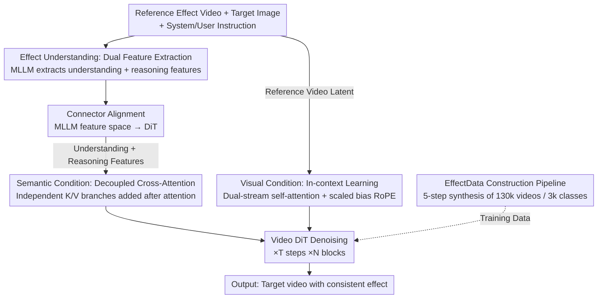

<!-- 由 tmp/gen_cvf_stubs.py 自动生成（CVF-only，无 arXiv） -->
# EffectMaker: Unifying Reasoning and Generation for Customized Visual Effect Creation

**Conference**: CVPR 2026  
**论文**: [CVF Open Access](https://openaccess.thecvf.com/content/CVPR2026/html/Yang_EffectMaker_Unifying_Reasoning_and_Generation_for_Customized_Visual_Effect_Creation_CVPR_2026_paper.html)  
**Code**: [Project Page](https://effectmaker.github.io)  
**Area**: Video Generation  
**Keywords**: Visual Effect Generation, Reference-driven, MLLM Reasoning, Diffusion Transformer, In-context Learning

## TL;DR
EffectMaker reformulates "visual effects (VFX) generation" as a **reference-driven** task. Given a reference video with visual effects and a target image, an MLLM first understands and reasons about how to adapt the effect to the new subject. Then, a video DiT extracts fine-grained visual cues from the reference video through in-context learning. This forms a dual "semantic-visual" guidance that transfers the effects to the target image and generates consistent videos **without requiring separate LoRA fine-tuning for each effect**.

## Background & Motivation
**Background**: High-quality visual effects (fire, freezing, explosions, transformations, etc.) are crucial in movies, advertisements, and games. However, traditional production relies on expert knowledge and expensive pipelines. With the maturation of video generation models (DiT-based models like Wan, HunyuanVideo, Sora, etc.), leveraging AIGC for effects has become an attractive direction.

**Limitations of Prior Work**: Existing effect generation methods are primarily bottlenecked by three aspects. First, **per-effect fine-tuning**: VFXCreator trains an independent LoRA for each effect, and Omni-Effect trains a mixture of LoRAs across 55 effect categories, which is neither efficient nor generalizable to unseen open-set effects. Second, **text-only conditioning is insufficient**: effects are often abstract, multi-layered, and stylistically complex, making it extremely difficult for text prompts to precisely describe their texture, dynamics, and atmosphere. Even professional designers are more accustomed to finding inspiration from reference clips rather than writing prompts. Third, **data scarcity**: existing VFX datasets only cover dozens to hundreds of effect categories, which is too small in scale to support systematic research.

**Key Challenge**: Open-set effect generation requires the capability to "both understand high-level semantics of the effect and replicate its fine-grained visual details." However, text-only conditions discard visual details, and pure visual replication (such as the copy-paste mechanism in MagicVFX) lacks the flexibility to adapt when there is a significant discrepancy between the reference and the target scenes. Understanding and generation are decoupled.

**Goal**: Build a **feed-forward, per-effect tuning-free** reference-driven effect generation framework that **generalizes to unseen effects**, while simultaneously addressing the matching data scarcity issue.

**Key Insight**: Model visual effect creation as "reference transfer" — extracting the "look and feel" of the effect from a reference video and transferring it to a new visual context. The authors observe that MLLMs are excellent at high-level semantic understanding and reasoning, while DiTs excel at in-context visual replication, making them perfectly complementary.

**Core Idea**: Leverage an MLLM as the "semantic reasoning path" (to determine what the effect is and how to adapt it to the new subject) + a video DiT as the "visual detail path" (to extract fine-grained cues from the reference video in-context). Together, they form a **semantic-visual dual-path guidance**, unifying understanding and generation in a single framework.

## Method

### Overall Architecture
The input to EffectMaker is a **reference effect video + a user target image**, and the output is a video transferring this effect to the target subject. It cascades two major components into an "understanding $\rightarrow$ generation" pipeline. On the understanding side, an MLLM (based on Qwen3-VL-8B) processes the reference video and target image to output two complementary conditional features (semantic understanding features + semantic reasoning features), which are aligned to the feature space of the DiT via a lightweight connector. On the generation side, an image-to-video DiT (based on Wan2.2-TI2V-5B) simultaneously receives dual-path conditioning: the semantic conditions go through decoupled cross-attention, while the visual conditions are processed via in-context learning, ultimately denoising to generate the target video.

### Key Designs

**1. Dual Features for Effect Understanding: Complementary Understanding + Reasoning**

Simply feeding the reference video to the MLLM and extracting the single-forward hidden states only captures a "semantic snapshot of the current input," lacking the inference of "how this effect should be transferred to the user's image." Therefore, the authors extract **two complementary types of features** from the MLLM. **Semantic understanding features** are extracted from the hidden states of the MLLM's last layer, encoding rich multimodal representations of the reference input. **Semantic reasoning features** are extracted from the sequence of text tokens autoregressively generated by the MLLM, which summarizes the model's understanding of the reference and explicitly encodes the reasoning process of "what the final user-desired output should look like." The user instructions guide the MLLM to reason along a chain: "First analyze the effects in the reference video $\rightarrow$ then examine the content of the target image $\rightarrow$ reason about how to adapt the effect to the new subject with significant shape discrepancies $\rightarrow$ and finally imagine and describe the target appearance after transfer." Both feature paths serve as conditions for the DiT, ensuring the generation knows both "what it is" and "how to modify it." Since the feature spaces of the MLLM and DiT are misaligned, a lightweight connector is introduced to bridge the modality gap.

**2. Semantic Conditioning: Decoupled Cross-Attention, Don't Concatenate Features**

Simply concatenating the understanding and reasoning features and feeding them into the DiT's cross-attention is found to **weaken the representation capability of the model** due to mutual interference between the two modal information streams. Consequently, **decoupled cross-attention** is adopted: the reasoning features, which are inherently textual, are encoded by the DiT's original T5 text encoder and processed via a standard cross-attention branch. The understanding features, which are more visual, are handled separately by a newly introduced independent cross-attention branch. Both branches **share the same query** but perform attention on textual and visual features using **their own independent key/value projections**, and the outputs are directly added and fused. Furthermore, to prevent semantic conditions from interfering with the reference video stream, cross-attention **only occurs between the target video tokens and the semantic conditions**, excluding the reference video tokens. This preserves the distinct information of both modalities while precisely injecting semantic guidance into the target stream to be generated.

**3. Visual Conditioning: In-Context Learning + Dual-Stream Self-Attention to Extract Fine-Grained Details**

While semantic conditions provide global guidance on "what effect to generate," they lack the fine-grained spatiotemporal details required for faithful visual replication. The authors leverage the **in-context learning** capability of the DiT for visual conditioning: the reference video and target video are encoded into latents using a **shared VAE encoder**, flattened after patchification, and **concatenated along the sequence dimension** before being fed into the DiT blocks. The key modification is converting the self-attention into a **dual-stream scheme** — where the reference and target streams utilize independent $Q/K/V$ projections to decouple their representation spaces, yet still allow bidirectional attention over the concatenated sequence:

$$O_r = \mathrm{SA}(Q_r,\,[K_r;K_t],\,[V_r;V_t]),\quad O_t = \mathrm{SA}(Q_t,\,[K_r;K_t],\,[V_r;V_t])$$

where the subscripts $r/t$ denote the reference/target streams, and $[\cdot;\cdot]$ represents concatenation along the sequence dimension. Ablations reveal that this dual-stream approach outperforms a single-stream design where "reference and target share projections." This is because the reference comprises clean latents while the target comprises noisy latents, residing in heterogeneous distributions (clean vs. noisy), and independent projections can better absorb this distribution gap. This is complemented by a **RoPE design**: a **scaled and biased 3D RoPE** is applied to the reference video by first linearly rescaling the reference's spatial RoPE index to the target coordinate system, and then adding a constant offset in the temporal dimension. This separates the positional embedding spaces of the two videos, leaving a safety gap to prevent mutual interference.

**4. EffectData: A Synthesis Pipeline Powering the Largest VFX Dataset of 130k Videos across 3k Classes**

The scarcity of effect data is a bottleneck for this entire field. The authors construct a paired dataset from scratch using a 5-step synthesis pipeline. **Step 1: Subject Collection**: Focuses primarily on portraits and animals from internal data and PPR10K, filtering out images with text, multiple subjects, or low clarity. **Step 2: VFX Taxonomy**: Combinatorially defines diverse effect categories using an orthogonal set of attributes (effect elements like ice/fire/magic, geometric patterns like particles/waves/rings, and attachment regions like face/arms/full body). **Step 3: Instruction Generation**: For each effect class, an LLM generates multiple editing instructions detailing "how to transform the source image into a version with the visual effect." **Step 4: Subject Editing**: An image editing model synthesizes the source image into a target image with the effect based on the instructions. **Step 5: Video Generation**: An MLLM describes the dynamic transition from the source to the target image, and this prompt along with the first and last frames are fed into a first-and-last-frame-to-video model to synthesize temporally coherent effect videos. This yields 130k videos across 3k classes, which is an order of magnitude larger in category count compared to existing datasets, with each video annotated with labels, captions, and instructions.

### A Complete Example
Let us walk through the process with a "fireball" effect as an example. The input consists of a fireball reference video + a target image of a girl raising her palm. On the understanding side, the MLLM first analyzes the effect in the reference (a pulsating spherical flame gathering in the center of a hand), then inspects the target image (the girl raising her hand), reasons that "the flame energy should converge at the girl's open palm to form a pulsating fireball," and writes this imagined scenario as reasoning tokens. Simultaneously, the last-layer hidden states are extracted as understanding features. After alignment via the connector, the reasoning features go through T5 + standard cross-attention, while the understanding features pass through the independent cross-attention branch to inject into the DiT. On the generation side, the fire reference video and the target image latents are concatenated. Dual-stream self-attention enables the target stream to "refer" to the flame texture and motion of the reference stream during denoising, while the scaled-bias RoPE ensures that the positional embeddings of the two videos do not conflict. After $T$ denoising steps and VAE decoding, the model outputs a coherent video of a fireball condensing in the girl's palm — which is both semantically correct (the fireball appears exactly where it should) and visually similar (the flame texture and dynamics closely match the reference).

### Loss & Training
During training, reference and target videos are randomly sampled from the same VFX class. To reduce computational costs, reference videos are temporally downsampled to 17 frames and resized to a short-edge of 448 pixels; target videos are fixed at 81 frames, with a short-edge of 704 pixels and a long-edge scaled proportionally to the user's first-frame aspect ratio. The model is trained for approximately 50k steps on 32 NVIDIA H20 GPUs using the Adam optimizer with a learning rate of $2\times10^{-5}$. The training data is sourced from the EffectData synthetic set, supplemented with samples from the OpenVFX dataset and the Higgsfield website.

## Key Experimental Results

### Main Results
Quantitative comparisons are conducted on 14 effect categories from the OpenVFX dataset, testing 10 subject images per category and reporting average scores. All metrics are model-based evaluations (higher is better): VQ = Visual Quality, MQ = Motion Quality, TA = Text Alignment, CAS = Category Alignment Score (evaluated by Gemini 2.5 on a scale of 0-5).

| Dataset | Metric | Ours | Prev. SOTA | Gain |
|--------|------|------|----------|------|
| OpenVFX (14 classes) | VQ↑ | **2.84** | Omni-Effect 2.27 | +0.57 |
| OpenVFX (14 classes) | MQ↑ | **0.25** | Wan2.2-FT 0.20 | +0.05 |
| OpenVFX (14 classes) | TA↑ | **-0.24** | VFX-Creator -0.92 | +0.68 |
| OpenVFX (14 classes) | CAS↑ | **4.63** | Omni-Effect 4.40 | +0.23 |

EffectMaker outperforms existing SOTA methods in visual/motion quality and effect alignment consistency. The comparison with the "text-only driven" Wan2.2-FT is particularly illustrative: the reference-driven paradigm is significantly more effective at modeling visually complex dynamic patterns. In open-set comparisons (unseen effects like portals, plastic models, glowing green trees), Omni-Effect fails on almost all unseen classes, and Wan2.2-FT produces roughly correct patterns but lacks similarity to the reference, whereas the proposed method consistently replicates unseen effects guided by the reference video.

### Ablation Study

| Configuration | VQ↑ | MQ↑ | TA↑ | CAS↑ | RAS↑ | Description |
|------|------|------|------|------|------|------|
| Semantic conditions only | 2.78 | 0.16 | 1.06 | 4.20 | 3.84 | Semantically correct but lacks fine-grained details |
| Visual conditions only | 2.48 | 0.12 | -0.38 | 2.24 | 1.48 | Only replicates low-level color textures, fails to capture complex effect structures |
| Semantic+Visual (Full) | **2.92** | **0.21** | **1.24** | **4.40** | **4.16** | Dual-path is the most faithful |

Attention design ablation: replacing the dual-stream self-attention with a single-stream variant ("shared projections between reference and target") causes TA to drop from 1.24 $\rightarrow$ 0.81, CAS from 4.40 $\rightarrow$ 3.30, and RAS from 4.16 $\rightarrow$ 2.84, showing a clear degradation. This confirms that because the reference (clean) and target (noisy) are in heterogeneous distributions, independent projections are better suited to handle the distribution gap. Data scale ablation: increasing the number of training effect classes from 100 to 1000 leads to comprehensive improvements (VQ 2.76 $\rightarrow$ 2.89, TA 0.94 $\rightarrow$ 1.21, CAS 3.76 $\rightarrow$ 4.22, RAS 3.22 $\rightarrow$ 4.04), indicating that wider category coverage brings better interpolation and extrapolation generalization.

### Key Findings
- **Both paths are indispensable**: Using only visual conditions replicates color and texture but fails to recreate complex geometric structures like double helixes; using only semantic conditions guides the generation in the right direction but loses details. The combination is the most faithful. The gap is most pronounced in RAS (Reference Alignment Score), which rises from 1.48 (visual-only) to 4.16 (dual-path).
- **Dual-stream attention is a key engineering point**: Independent projection under heterogeneous clean/noisy distributions is significantly superior to shared projection. Replacing this single component causes the RAS to drop by 1.32.
- **Data scale directly translates to generalization**: Expanding the effect categories tenfold provides the foundation for open-set generalization, with data scaling monotonically improving all metrics.
- In a user study involving 30 participants and 28 questions, the proposed method achieved the highest preference rates across effect quality, category alignment, and reference alignment.

## Highlights & Insights
- **Explicitly splitting "understanding" into semantic understanding and reasoning paths** is clever: one represents the input snapshot, while the other infers "how to modify it." This allows the MLLM to serve as both a perceiver and a planner, providing more comprehensive information than simply extracting hidden states.
- **Decoupled cross-attention + dual-stream self-attention** constitute a pair of elegant engineering decisions: the former rejects concatenating heterogeneous semantic features directly, while the latter rejects sharing projections for clean/noisy heterogeneous latents. The core philosophy is consistent: "do not share parameters for heterogeneous elements," a design pattern that can be transferred to any multi-condition or multi-distribution injection generation task.
- **Scaled and biased 3D RoPE** resolves the issue of positional embedding conflicts when concatenating two videos using an extremely lightweight approach, making it highly reusable for other in-context video transfer tasks.
- **Scaling up the dataset by an order of magnitude via a synthesis pipeline**: The combination of orthogonal attribute composition + LLM instruction generation + image editing + first-and-last-frame to video represents a reproducible paradigm for "generating paired data from scratch."

## Limitations & Future Work
- The authors acknowledge that the model may struggle with complex effects involving **fast or large-scale motion**, primarily limited by the capacity of the base model.
- Reliance on **synthetic training data** may introduce biases and may not fully cover the diversity and realism of real-world VFX (e.g., noisy, blurry, or multi-overlapping effect scenes).
- All evaluation metrics rely on model-based scoring (VideoAlign reward + Gemini scoring + user study), lacking objective fidelity metrics against real, professional VFX production. CAS and RAS are evaluated by the Gemini API, which might be subject to the scoring model's inherent biases. Open-set generalization is only qualitatively demonstrated in a few cases, lacking systematic quantitative evaluation of a large number of unseen classes.
- Directions for improvement: Upgrade to stronger base models to support large-motion effects; incorporate real-world VFX data to alleviate synthetic bias; search for compositions of multiple overlapping effects.

## Related Work & Insights
- **vs. VFXCreator**: VFXCreator fine-tunes an independent LoRA for each effect, which yields decent results for single effects but suffers from poor scalability and cannot generalize to unseen effects. The proposed method is a feed-forward, reference-driven, tuning-free approach with better flexibility and scalability.
- **vs. Omni-Effect**: Omni-Effect improves scalability via a mixture-of-LoRA scheme across 55 effect categories, but limited effect diversity restricts out-of-domain generalization. Guided by reference videos and trained on the 3k-category EffectData, the proposed method is significantly stronger in open-set scenarios (where Omni-Effect largely fails).
- **vs. MagicVFX**: MagicVFX directly copies and pastes reference content at the pixel level and refines it with noise, which is inflexible when the reference and target scenes differ greatly, requiring extensive manual adjustment. The proposed method utilizes MLLM reasoning to adapt effects, enabling it to handle new subjects with major shape discrepancies.
- **vs. Video-as-Prompt / VFXMaster (concurrent work)**: These concurrent works are also reference-driven and show decent generalization, but they lack reasoning capabilities and rely on manually crafted complex effect prompts, which is less user-friendly. The proposed method automatically understands and reasons using an MLLM, sparing users from writing complex effect descriptions.

## Rating
- **Novelty**: ⭐⭐⭐⭐ Reformulating visual effect generation as a reference-driven unified "understanding-generation" framework; the dual features, dual-path conditions, and dual-stream attention designs are self-consistent and complementary.
- **Experimental Thoroughness**: ⭐⭐⭐⭐ Complete qualitative and quantitative evaluations on closed/open sets, along with three sets of ablations (conditions, attention, data scale) and a user study. However, metrics are entirely model-based, and objective fidelity metrics are lacking.
- **Writing Quality**: ⭐⭐⭐⭐ Clear motivation chain, well-structured methodology, and highly illustrative diagrams.
- **Value**: ⭐⭐⭐⭐ Tuning-free per-effect generation + 3k-class largest VFX dataset, driving practical advancement in visual effect generation; the dataset itself serves as a highly reusable resource.

<!-- RELATED:START -->

## Related Papers

- [\[CVPR 2026\] SynMotion: Semantic-Visual Adaptation for Motion Customized Video Generation](synmotion_semantic-visual_adaptation_for_motion_customized_video_generation.md)
- [\[CVPR 2026\] Reasoning Diffusion for Unpaired Test Time Out-of-distribution Text-Image to Video Generation](reasoning_diffusion_for_unpaired_test_time_out-of-distribution_text-image_to_vid.md)
- [\[ICML 2026\] MotiMotion: Motion-Controlled Video Generation with Visual Reasoning](../../ICML2026/video_generation/motimotion_motion-controlled_video_generation_with_visual_reasoning.md)
- [\[CVPR 2026\] DriveLaW: Unifying Planning and Video Generation in a Latent Driving World](drivelaw_unifying_planning_and_video_generation_in_a_latent_driving_world.md)
- [\[CVPR 2026\] SMRABooth: Subject and Motion Representation Alignment for Customized Video Generation](smrabooth_subject_and_motion_representation_alignment_for_customized_video_gener.md)

<!-- RELATED:END -->
