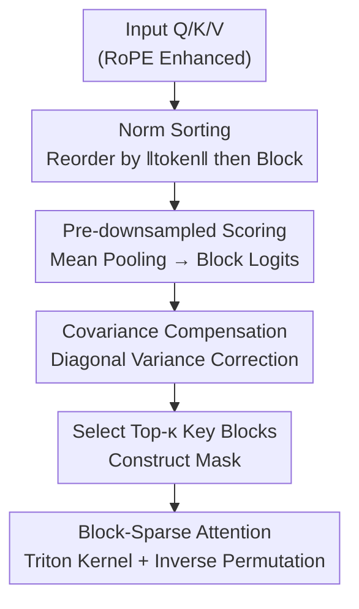

# Efficient Long-Context Modeling in Diffusion Language Models via Block Approximate Sparse Attention

**Conference**: CVPR 2026  
**arXiv**: [2605.19726](https://arxiv.org/abs/2605.19726)  
**Code**: https://github.com/JIA-Lab-research/Block-Approximate-Sparse-Attention (To be released)  
**Area**: Diffusion Language Models / Sparse Attention / Long-Context Efficiency / Video Generation  
**Keywords**: Block-Sparse Attention, Diffusion Language Model, Downsampled Attention, Norm Sorting, Covariance Compensation

## TL;DR
To address the quadratic complexity bottleneck of attention in Diffusion Language Models (DLMs) under ultra-long contexts, this paper proposes the training-free BA-Att. It evaluates block importance directly in a **downsampled block space** (independent of fixed position priors), employs **norm sorting** to homogenize blocks, and utilizes **diagonal covariance compensation** to correct systematic biases caused by block averaging. BA-Att achieves a 6.95× speedup over FlashAttention on 128K sequences and approaches full attention performance at approximately 50% sparsity across language, multimodal, and video generation tasks.

## Background & Motivation
**Background**: Diffusion Language Models (DLMs, also known as masked diffusion models) model text generation as parallel denoising of noise sequences. Unlike autoregressive models like GPT/LLaMA, they naturally support bidirectional, globally consistent, and controllable generation, making them a significant direction for next-generation generative language modeling. However, performing full attention on the entire sequence at each denoising step incurs an $O(L^2)$ complexity, causing computational costs to explode when extending to ultra-long contexts (128K or 256K).

**Limitations of Prior Work**: Existing methods to mitigate quadratic complexity mainly fall into two categories, each with drawbacks. **Learned gating** methods (e.g., SeerAttention) require additional training and are difficult to deploy as plug-and-play solutions. **Training-free** methods rely on empirical fixed patterns—such as the A-Shape in StreamingLLM, Vertical-Slash in MInference, query-specific patterns in FlexPrefill, or anti-diagonal scoring in XAttention. These training-free methods sample based on fixed position priors in a **high-resolution attention space**, often resulting in search coverage $<5\% \sim 12.5\%$ (see Table 1), which risks missing significant tokens and remains unstable under distribution shifts.

**Key Challenge**: There is a trade-off between training-free position prior sampling (low compute but low coverage, prone to missing tokens) and learned gating (high coverage but requires fine-tuning). Fundamentally, it is difficult to achieve both efficiency and fidelity.

**Goal**: To design a **training-free** sparse attention mechanism that achieves **full-coverage** search in a downsampled block space while maintaining efficiency and robustness.

**Key Insight**: Instead of sparse sampling on an $L \times L$ high-resolution attention map, it is more effective to pool Q and K into block-level representations ($N_q \times N_k$, with block size $B$ typically 128) and perform full scoring for all block pairs in this **compressed space**. This reduces complexity to $O((L/B)^2)$ while achieving 100% coverage. The challenge lies in the information loss from block averaging. The authors investigate the gap between the downsampled block distribution $m$ and the ideal oracle block distribution $\hat{m}$ and whether this gap is controllable.

**Core Idea**: Replace "position prior sampling in high-resolution space" with "full scoring in downsampled block space." The authors theoretically characterize the downsampled error upper bound $U_{g_q,g_k}$ and use norm sorting to reduce variance and covariance compensation to correct bias, bringing the block distribution closer to the oracle.

## Method

### Overall Architecture
BA-Att is a training-free block-sparse attention operator. It takes RoPE-enhanced $Q, K, V$ as input and outputs sparse attention results via three sequential stages: ① **Pre-downsampled block scoring**: Performs mean pooling within blocks for Q and K to get block representations, calculates logits and softmax in block space to obtain distribution $m$, and selects top-$\kappa$ key blocks to form a sparse mask; ② **Norm sorting**: To improve downsampling accuracy, tokens are reordered by norm before blocking to minimize intra-block variance; ③ **Covariance compensation**: Corrects second-order systematic biases lost during block averaging. Finally, block-sparse attention is executed on selected block pairs using a Triton kernel, and the result is restored via inverse permutation.

The theoretical anchor is an **oracle block distribution** $\hat{m}_{g_q,g_k}=\frac{1}{|I(g_q)|}\sum_{i\in I(g_q)}\sum_{j\in J(g_k)}A_{ij}$, which aggregates token-level scores directly from the full-resolution attention map $A$. It represents the "theoretically optimal block importance." BA-Att aims to make the inexpensive downsampled distribution $m$ approximate this oracle $\hat{m}$ through norm sorting and covariance compensation.

### Key Designs

**1. Pre-downsampled Block Sparse Attention: Full Search in Compressed Space**

Addressing the limitation where training-free methods only sample based on fixed priors in high-resolution space, BA-Att mean-pools every query/key block to obtain representations $\bar{Q}_{g_q}, \bar{K}_{g_k}$. It computes block-level logits $\ell_{g_q,g_k}=(\bar{Q}_{g_q}\cdot\bar{K}_{g_k})/\sqrt{d}$ and selects the top-$\kappa$ key blocks via softmax. By scoring **all block pairs** on the $N_q \times N_k$ downsampled map, it achieves 100% search coverage with only $O((L/B)^2)$ complexity. This avoids reliance on sink/anti-diagonal priors (coverage $<5\% \sim 12.5\%$) used in MInference/XAttention without requiring learned gates like SeerAttention.

**2. Downsampling Error Bound $U_{g_q,g_k}$: Quantifying Information Loss**

While fast, block averaging introduces errors. The authors decompose token-level logits into block-level logits plus perturbations: $Q_i=\bar{Q}_{g_q}+\delta Q_i$, $K_j=\bar{K}_{g_k}+\delta K_j$. Based on the Lipschitz continuity of softmax under $\ell_\infty$, logit deviation serves as a proxy for distribution deviation. Using Cauchy–Schwarz inequality, the upper bound is derived:

$$U_{g_q,g_k}=\frac{R^{Q}_{g_q}M^{K}_{g_k}+M^{Q}_{g_q}R^{K}_{g_k}+R^{Q}_{g_q}R^{K}_{g_k}}{\sqrt{d}},\quad |\hat{\ell}_{ij}-\ell_{g_q,g_k}|\le U_{g_q,g_k}$$

where $R^{Q}_{g_q}=\max_i\|Q_i-\bar{Q}_{g_q}\|_2$ is the intra-block "radius" (distance from mean) and $M^{Q}_{g_q}=\max_i\|Q_i\|_2$ is the max norm. Intuition: Large norm differences (large radius) within a block lead to scattered attention and poor approximation. When the radius is zero (homogeneous blocks), $U=0$. Fig. 2 shows a Pearson correlation $R>0.5$ between $U$ and real logit deviations, validating it as an effective proxy.

**3. Norm Sorting: Training-free Token Reordering**

Since the error is dominated by block radius, and training-free methods cannot use learned gates for calibration, the authors **rearrange block composition**. Each key token is assigned a score $s_j^K=\|K_j\|_2$, sorted in non-descending order to get permutation $\pi_k$, and then re-blocked. The same is done for Q with $s_i^Q=\|Q_i\|_2$. Under common heavy-tailed activation distributions, sorting by norm ensures adjacent tokens have similar magnitudes, significantly reducing $R^Q, R^K$ and tightening the bound $U_{g_q,g_k}$. This $O(L\times D)$ deterministic process clusters high-activation tokens without parameters.

**4. Covariance Compensation: Restoring Second-Order Bias**

While norm sorting reduces variance, the cross-term $\delta Q_i \cdot \delta K_j$ in the logit decomposition leaves a systematic bias: $\mathbb{E}_{i,j}[\hat{\ell}_{ij}-\ell_{g_q,g_k}]\approx\frac{1}{d}\mathrm{tr}(\Sigma^{Q}_{g_q}\Sigma^{K}_{g_k})$. A second-order correction is added: $\tilde{\ell}_{g_q,g_k}=\ell_{g_q,g_k}+\beta\Delta_{g_q,g_k}$ (default $\beta=1$). Using **diagonal variance approximation** to reduce complexity from $O(Ld^2)$ to $O(Ld)$:

$$\Delta_{g_q,g_k}\approx\frac{1}{d}\sum_{t=1}^{d}\Big(\mathrm{Var}[Q_t]_{g_q}\bar{K}_{g_k,t}^2+\mathrm{Var}[K_t]_{g_k}\bar{Q}_{g_q,t}^2+\mathrm{Var}[Q_t]_{g_q}\mathrm{Var}[K_t]_{g_k}\Big)$$

This only requires block-level first and second moments. In practice, compensation is applied only to the first and last layers (most sensitive to attention) to balance fidelity and speed.

### Loss & Training
This method is **entirely training-free**. It serves as a plug-and-play operator replacing full attention during DLM inference with no extra learned parameters or fine-tuning. Key hyperparameters: block size $B=128$, sparsity $>50\%$, and compensation weight $\beta=1$ (enabled only in boundary layers). The operator is implemented in Triton and evaluated on A100(80GB) using greedy decoding.

## Key Experimental Results

### Main Results
Evaluated across three domains: Natural Language (LLaDA1.5, UltraLLaDA), Multimodal Understanding (LLaDA-V), and Video Generation (Wan2.1-T2V-14B). Baselines include FlashAttention-2 (dense) and SVG2 (video).

LongBench (truncated to 16K, weighted AVG by task count):

| Model | Method | AVG |
|------|------|-----|
| LLaDA1.5 | Full Attn | 31.5 |
| LLaDA1.5 | +XAttention | 28.8 |
| LLaDA1.5 | +Ours | 31.3 |
| UltraLLaDA | Full Attn | 37.2 |
| UltraLLaDA | +XAttention | 34.9 |
| UltraLLaDA | +Ours | 37.2 |

RULER Long Context (Weighted AVG, "–" indicates failure):

| Model | 4K | 8K | 16K | 32K |
|------|----|----|----|----|
| LLaDA1.5 (Full) | 89.74 | 50.25 | 15.73 | – |
| LLaDA1.5+XAtt | 59.64 | 34.93 | 17.51 | – |
| LLaDA1.5+Ours | 87.54 | 51.85 | 26.62 | – |
| UltraLLaDA (Full) | 88.37 | 86.22 | 77.51 | 73.63 |
| UltraLLaDA+XAtt | 81.43 | 70.50 | 58.38 | 53.28 |
| UltraLLaDA+Ours | **90.06** | **87.71** | **80.93** | 72.88 |

UltraLLaDA+Ours **outperforms full attention** at 4K/8K/16K and significantly exceeds XAttention. Video generation (Wan2.1, VBench, ~75K tokens):

| Method | PSNR↑ | SSIM↑ | MS_SSIM↑ | LPIPS↓ |
|------|-------|-------|----------|--------|
| SVG2 | 21.51 | 0.762 | 0.832 | 0.173 |
| Ours(60%) | 22.34 | 0.782 | 0.865 | 0.163 |
| Ours(50%) | **24.08** | **0.833** | **0.906** | **0.112** |

Compared to the dedicated SVG2, Ours(50%) improves PSNR by $>2.5$ dB and reduces LPIPS by ~35%. On LLaDA-V multimodal tasks, Ours matches or slightly exceeds full attention across VideoMME and MLVU benchmarks.

### Ablation Study

Norm Sorting Strategy (Ruler-4K, varying sparsity):

| Config | 90% Sparsity | 70% Sparsity | 50% Sparsity |
|------|---------|---------|---------|
| Baseline (No Sort) | 22.34 | 52.91 | 81.08 |
| SortQ | 24.07 | 55.66 | 82.64 |
| SortK | 27.13 | 60.56 | 87.25 |
| SortQ+SortK | 26.98 | **61.66** | **88.27** |

Operator Speedup (vs. FlashAttention, 256K seq, A100):

| Config | 256K Gain | Note |
|------|------------|------|
| XAttn-8 | 3.5× | Anti-diagonal prior |
| Flex | 4.56× | Query-specific patterns |
| Ours (Sort) | **6.95×** | Norm sorting only |
| Ours (Sort+Cov) | 5.70× | Including Cov. Compensation |

### Key Findings
- **Sorting K is more critical than Q**: SortK alone improves the 50% sparsity score from 81.08 to 87.25. Consolidating salient information into fewer key blocks is the primary source of gain.
- **Covariance compensation is a quality-speed trade-off**: Pure sorting reaches 6.95×, but compensation drops it to 5.70×. Applying it only to boundary layers balances both.
- **Theoretical bound $U$ is predictive**: Norm sorting increases the correlation between $U$ and real error to $>0.5$, validating the "radius reduction → tighter bound → better approximation" chain.
- **Strong Generalization**: The same operator performs consistently across language, image, and video tasks, whereas fixed-pattern methods like XAttention drop performance on specific datasets like NarrativeQA.

## Highlights & Insights
- **Full Coverage via Downsampling**: Traditional training-free methods use sparse sampling on high-res maps (efficient but misses tokens). This work shifts search to the block space, allowing 100% coverage at $O((L/B)^2)$.
- **Theory-Driven Engineering**: $U_{g_q,g_k}$ decomposes error into radius and max norm. Norm sorting and covariance compensation directly map to these theoretical terms.
- **Efficient Diagonal Approximation**: Estimating covariance traces using block moments ($O(Ld)$) leverages existing statistics, incurring nearly zero overhead while improving fidelity.
- **Training-free Versatility**: Plugging the same operator into different modalities without weight modification is a major deployment advantage over learned alternatives like SeerAttention.

## Limitations & Future Work
- **Restricted to DLMs**: The current design targets bidirectional DLMs. Extending it to autoregressive models with causal masking may introduce new block-selection challenges.
- **Compensation Overhead**: While efficient, the 5.70× speedup is lower than the 6.95× of the sorting-only version. Future Triton optimizations or low-rank approximations could bridge this.
- **Norm Distribution Dependency**: Effectiveness relies on norm sorting significantly reducing variance. If a model's activations are extremely uniform, sorting gains might diminish.
- **Extreme Sparsity**: Experiments focused on 50%~90%. Performance at $>95\%$ sparsity remains to be fully explored.

## Related Work & Insights
- **vs. SeerAttention**: Both perform downsampled search, but BA-Att is **training-free**, avoiding the need for fine-tuning learned gates.
- **vs. XAttention**: XAttention uses high-res anti-diagonal priors (12.5% coverage) which fail on tasks like variable tracking (VT). BA-Att's full-coverage search is more robust.
- **vs. MInference/FlexPrefill**: These rely on prior-driven empirical patterns (coverage $<5\%$). BA-Att is data-driven with a theoretical error characterization.
- **vs. SVG2**: Despite being a general operator, BA-Att outperforms the video-specific SVG2 on Wan2.1, showing the effectiveness of the "full coverage + compensation" formula for long sequences.

## Rating
- Novelty: ⭐⭐⭐⭐⭐ 
- Experimental Thoroughness: ⭐⭐⭐⭐⭐ 
- Writing Quality: ⭐⭐⭐⭐ 
- Value: ⭐⭐⭐⭐⭐

<!-- RELATED:START -->

## Related Papers

- [\[ICML 2026\] Lightning Unified Video Editing via In-Context Sparse Attention](../../ICML2026/video_generation/lightning_unified_video_editing_via_in-context_sparse_attention.md)
- [\[CVPR 2026\] VMonarch: Efficient Video Diffusion Transformers with Structured Attention](vmonarch_efficient_video_diffusion_transformers_with_structured_attention.md)
- [\[CVPR 2026\] FrameDiT: Diffusion Transformer with Matrix Attention for Efficient Video Generation](framedit_diffusion_transformer_with_matrix_attention_for_efficient_video_generat.md)
- [\[CVPR 2026\] LinVideo: A Post-Training Framework towards O(n) Attention in Efficient Video Generation](linvideo_a_post-training_framework_towards_on_attention_in_efficient_video_gener.md)
- [\[CVPR 2026\] MotionEnhancer: Leveraging Video Diffusion for Motion-Enhanced Vision-Language Models](motionenhancer_leveraging_video_diffusion_for_motion-enhanced_vision-language_mo.md)

<!-- RELATED:END -->
