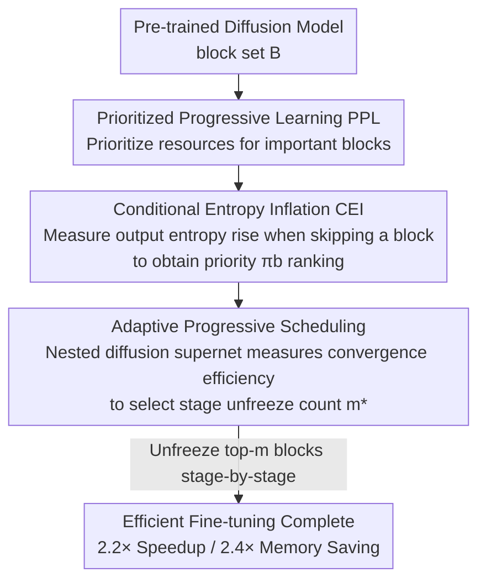

# Efficient Training for Human Video Generation with Entropy-Guided Prioritized Progressive Learning

**Conference**: CVPR 2026  
**Paper**: [CVF Open Access](https://openaccess.thecvf.com/content/CVPR2026/html/Li_Efficient_Training_for_Human_Video_Generation_with_Entropy-Guided_Prioritized_Progressive_CVPR_2026_paper.html)  
**Code**: https://github.com/changlin31/Ent-Prog  
**Area**: Video Generation  
**Keywords**: Efficient Training, Human Video Generation, Progressive Learning, Conditional Entropy, Diffusion Models

## TL;DR
To address the issues of high GPU memory usage and long training duration in human video diffusion models, this paper proposes Ent-Prog: it scores the task-related importance of each network block using "Conditional Entropy Inflation (CEI)" to prioritize unfreezing the blocks that contribute most to condition-following. It then employs a "nested diffusion supernet" to online estimate the optimal number of blocks to unfreeze in each phase for fastest convergence, achieving up to 2.2$\times$ training acceleration and 2.4$\times$ memory reduction across three human video datasets without quality degradation.

## Background & Motivation

**Background**: Human video generation (synthesizing coherent and appearance-consistent human videos given a reference image and a pose sequence) has progressed rapidly with the development of diffusion models. Mainstream approaches typically fine-tune a pre-trained large diffusion model (such as DiT, UNet + ReferenceNet) in its entirety on target tasks, coupled with auxiliary condition encoders like CLIP visual encoders, ControlNet, and ReferenceNet to enhance adherence to reference images and poses.

**Limitations of Prior Work**: Video data is extremely high-dimensional (multi-frame, high-resolution, complex temporal dependencies), consuming massive training resources. The paper provides an intuitive figure: training a DiT on 512$\times$512, 20-frame videos can consume up to 100 GB of GPU memory, exceeding the capacity of mainstream GPUs. Consequently, scaling to higher resolutions, longer videos, larger models, or more complex control signals is highly challenging.

**Key Challenge**: Traditional training schemes update **all** parameters in every iteration, without distinguishing their contributions to the target task. However, the authors find through probing experiments (Fig.1) that: (1) freezing more blocks leads to more severe performance degradation in final convergence; (2) when randomly skipping 8–23 blocks, the model is highly prone to skipping "highly interactive" blocks, causing a sharp rise in loss and conditional entropy, and leading to network collapse; (3) training only the 10 most important blocks is drastically faster in convergence than training the 10 least important blocks. That is, **different blocks contribute highly unevenly to conditional generation**, and full parameter updating wastes compute without targeting critical resources. Another route—Parameter-Efficient Fine-Tuning (such as LoRA, which minimizes trainable parameters)—lacks sufficient capacity to span the task gap when the source and target tasks differ significantly.

**Goal**: Without introducing extra parameters or simply cutting parameters, to **prioritize training resources for the network components critical to target condition generation**, and concurrently dynamically decide the computation budget for each training phase, thereby balancing performance and efficiency dynamically.

**Core Idea**: Utilize "how much the output conditional entropy inflates when a block is skipped" to measure its importance for condition-following (CEI). Based on the importance ranking, the blocks are **progressively unfrozen**—important blocks are trained first, while less important ones are trained later. Additionally, a supernet is used in each phase to online measure the "loss reduction per unit time" to adaptively determine the number of blocks to unfreeze.

## Method

### Overall Architecture

Ent-Prog reformulates the "fine-tuning of a pre-trained diffusion model" into a **prioritized progressive unfreezing pipeline**. Given a pre-trained diffusion model $\phi(\omega)$ with its set of residual blocks $B=\{b_1,\dots,b_L\}$, and the training data along with conditions $D=\{(x_0,c)\}$ for the target task, the process consists of two steps:

1. **Offline Scoring and Ranking**: Compute a training priority score $\pi_b$ (using CEI) for each block $b$. All blocks are ranked in descending order of $\pi_b$ to form an ordered list $B^\star=(b_{(1)},\dots,b_{(L)})$.
2. **Online Progressive Unfreezing**: Training is partitioned into several stages. In the $k$-th stage, only the top-$m_k$ blocks with the highest priority are unfrozen to be updated, while the remaining blocks are frozen but still participate in the forward pass. Upon entering a new stage, a "nested diffusion supernet" is used to test several candidate unfreeze counts $m$ at once, selecting the optimal $m_k^\star$ that maximizes convergence efficiency. The stage is then trained using this count.

Thus, "which blocks are trained" is determined by the CEI priority $\{\pi_b\}$, and "how many blocks to train per stage" is determined by the convergence efficiency estimated by the supernet. This combination forms a **priority-driven + adaptively growing** learning pipeline (Prioritized Progressive Learning, PPL). Note that the forward pass always traverses the entire network (preserving full capacity representation), while gradient updates are confined to the unfrozen high-priority blocks, thereby reducing memory and training time simultaneously.

### Key Designs

**1. Prioritized Progressive Learning (PPL): Train important blocks first, shifting progressive learning from "how much to grow" to "whom to grow first"**

Traditional progressive learning typically trains from scratch, starting from a "non-specific" sub-network and gradually growing, caring only about **how much to expand the network in each stage**, rather than which components to train first. However, in fine-tuning a **pre-trained** generative model, different blocks contribute significantly unevenly to the target task's condition generation (as verified in Fig.1). Blindly expanding uniformly is wasteful. PPL factorizes progressive scheduling into selecting which subset of blocks to unfreeze in each stage:

$$\psi_k=\arg\max_{\psi\subseteq B}\sum_{b\in\psi}\pi_b \quad \text{s.t.}\ |\psi|=m_k,$$

where $\psi_k$ denotes the subset of blocks unfrozen for training in the $k$-th stage, and $m_k$ represents the planned number of blocks to unfreeze in that stage. Intuitively, high-priority blocks are trained early, and low-priority blocks are postponed. Compared to traditional progressive learning, PPL introduces "which components to emphasize" (via $\{\pi_b\}$) instead of merely "how much to grow per stage" (via $(m_k)$). This couples "progressive learning" and "non-uniform importance in pre-trained models" for the first time. The questions of how to calculate $\pi_b$ and specify $m_k$ are addressed by the following two designs.

**2. Conditional Entropy Inflation CEI: Measuring block contribution to condition-following by "how much deleting this block increases prediction uncertainty"**

To rank the blocks, a **task-related** and **condition-generation-related** importance signal is required. This paper starts from conditional mutual information: a conditional diffusion model predicts noise $\hat\epsilon$ given a noisy latent $x_\tau$, timestep $\tau$, and condition $c$. A model that adheres well to conditions should demonstrate lower uncertainty given $c$:

$$I(\hat\epsilon;c\mid x_\tau,\tau)=H(\hat\epsilon\mid x_\tau,\tau)-H(\hat\epsilon\mid x_\tau,\tau,c),$$

reducing the conditional entropy $H(\hat\epsilon\mid x_\tau,\tau,c)$ is equivalent to increasing the mutual information $I(\hat\epsilon;c\mid x_\tau,\tau)$, meaning that the predicted noise contains more conditional information. In human video generation, this corresponds to generated results aligning better with the reference image and poses.

Based on this, CEI measures the inflation in output entropy when skipping a block: for block $b$, it compares the conditional entropy when skipping $b$ versus using the full model:

$$\Delta H_{\text{cond}}(b,c)=H\big(\hat\epsilon\mid x_\tau,\tau;\text{skip}(b),c\big)-H(\hat\epsilon\mid x_\tau,\tau;c).$$

A larger $\Delta H_{\text{cond}}$ indicates that skipping this block makes the prediction more uncertain, meaning the block is more crucial for condition-following. To make this computable, the authors assume $\hat\epsilon$ follows a Gaussian distribution, defining the training priority score as the Gaussian approximation of CEI (averaged over different $c$):

$$\pi(b)=\log\frac{\sigma_{\text{skip}(b)}(\hat\epsilon)}{\sigma(\hat\epsilon)},$$

where $\sigma(\hat\epsilon)$ is the standard deviation of the predicted noise under the full model, and $\sigma_{\text{skip}(b)}(\hat\epsilon)$ is that when block $b$ is disabled. In practice, approximately 1000 sets of $\tau$ and $(x_\tau,c)$ are randomly sampled to estimate this ratio, and all blocks are ranked by $\pi(b)$. High-scoring blocks are unfrozen early. The elegance of this step is that, rather than utilizing gradient norms or parameter scales, it directly measures "how the presence/absence of a block affects the model's certainty regarding the conditions," which is inherently **task-aware + condition-aware**, aligning directly with the objective of adhering to the reference image/pose. Note that mathematical formulations and Gaussian approximation details are subject to the original text.

**3. Adaptive Progressive Scheduling + Nested Diffusion Supernet: Online selection of stage unfreezing block count using "loss reduction per unit wall-time"**

With the priority ranking established, the remaining question is "how many top-ranked blocks should be unfrozen in each stage." Fixed linear growth (unfreezing blocks uniformly across stages) is not necessarily optimal because convergence efficiency varies across stages and unfreeze counts. This paper uses a **nested diffusion supernet** $\Phi(\hat\omega)$ to evaluate all candidates simultaneously. Within a shared weight space $\hat\omega$, it nests all unfreeze choices within the candidate set $M_k$. For a candidate count $m$, the unfrozen block set is defined as $B_{\text{train}}(m)=\{b_{(1)},\dots,b_{(m)}\}$ (i.e., top-$m$ elements by priority). At the start of each stage, the supernet is trained for one epoch: in each step, a candidate $m \in M_k$ is randomly sampled, and only the parameters in $B_{\text{train}}(m)$ are unfrozen and updated. The forward pass always runs the full network, while gradients backpropagate only to the unfrozen blocks.

To incorporate real-world efficiency, the authors record the wall-time $T_m^{(s)}$ for each candidate $m$ at each step, and evaluate the loss on a small, fixed holdout set $D_{\text{eval}}$ (using fixed $\tau$ and noise) to obtain a loss trajectory $\ell_m^{(s)}$. The convergence efficiency is defined as "average loss reduction per unit wall-time":

$$\text{CE}(m)=-\frac{\sum_{s=2}^{S}\big(\ell_m^{(s)}-\ell_m^{(s-1)}\big)}{\sum_{s=2}^{S}\big(T_m^{(s)}\big)}.$$

A larger $\text{CE}(m)$ signals more efficient convergence. This can be viewed as a first-order Taylor approximation of the derivative of loss with respect to time (since all candidates share the same initialization at the start of a stage, the short-term loss drop is well-approximated). After the one-epoch supernet run, the $m_k^\star$ that maximizes $\text{CE}(m)$ is chosen. The remaining training of the stage is completed using the corresponding top-$m_k^\star$ blocks, inheriting the supernet weights $\hat\omega$. Repeating this across stages yields an **adaptive progressive schedule**: each step grows by the "most cost-effective" size. Its benefit is translating "how much to unfreeze" from a hyperparameter to an **online, time-aware decision**, avoiding suboptimal manual tuning.

### Loss & Training
The training objective remains the standard Mean Squared Error (MSE) for noise prediction in diffusion models (the MSE between the predicted noise $\hat\epsilon_\omega(x_\tau,\tau)$ and the true noise $\epsilon$). To enhance transfer, the authors design a three-stage training process: (1) **subject-driven generation**—learning single-subject image generation from a reference image (50k steps, batch size 32); (2) **pose-guided generation**—generating video frames from a reference image + control pose (200k steps, batch size 8); (3) **video generation**—training only temporal layers on 10-frame, 512$\times$512 sequences (200k steps, batch size 4). The learning rate is fixed at 1e-5 across all phases. Image generation results are reported using the stage-2 model, and video generation using the stage-3 model.

## Key Experimental Results

Experiments are conducted on three distinct human datasets: Bilibili (approximately 1000 high-resolution single-dancer videos, with 4086 training blocks and 10 test blocks), TikTok, and UBC-Fashion, covering both "human video generation" and "human image generation" tasks. All experiments are conducted on 4$\times$A800 GPUs. Poses are estimated using Multi-HMR, frames are cropped using Yolov7 and resized to 768$\times$768. Inference uses the IDDPM sampler with 100 steps and CFG=4.0.

### Main Results

Human dance **video** generation on Bilibili (Ent-Prog vs. Original full training):

| Training Scheme | Steps | SSIM$\uparrow$ | PSNR$\uparrow$ | LPIPS$\downarrow$ | FID-VID$\downarrow$ | FVD$\downarrow$ | Memory (GB) | Speedup |
|---|---|---|---|---|---|---|---|---|
| Original | 100k | 0.885 | 33.00 | 0.129 | 16.50 | 168.17 | 72 | - |
| Ent-Prog | 100k | 0.884 | 33.26 | 0.132 | 15.52 | 120.35 | 44 | 1.52$\times$ |
| Original | 200k | 0.886 | 33.93 | 0.128 | 15.01 | 132.06 | 72 | - |
| Ent-Prog | 200k | 0.892 | 34.41 | 0.121 | 14.90 | 119.77 | 53 | 2.17$\times$ |

Under 200k steps, Ent-Prog **outperforms** full training on nearly all single-frame and video metrics (SSIM 0.892 > 0.886, PSNR 34.41 > 33.93, FVD 119.77 < 132.06), while reducing training time from 13 days to 6 days (2.17$\times$ speedup) and GPU memory from 72 GB to 53 GB.

Cross-dataset human **video** generation (Table 3, TikTok / UBC-Fashion):

| Dataset | Training Scheme | SSIM$\uparrow$ | PSNR$\uparrow$ | LPIPS$\downarrow$ | FVD$\downarrow$ | Memory (GB) | Speedup |
|---|---|---|---|---|---|---|---|
| TikTok | Original | 0.747 | 29.53 | 0.316 | 385.64 | 72 | - |
| TikTok | Ent-Prog | 0.790 | 30.77 | 0.268 | 264.03 | 44 | 1.52$\times$ |
| UBC | Original | 0.906 | 36.44 | 0.069 | 79.94 | 46 | - |
| UBC | Ent-Prog | 0.906 | 36.45 | 0.068 | 79.76 | 29 | 1.69$\times$ |

On TikTok, FVD decreases significantly from 385.64 to 264.03, and SSIM/PSNR/LPIPS improve comprehensively, while memory drops to 61.1% and a 1.52$\times$ acceleration is achieved. On UBC, quality matches full training, while memory is cut nearly in half and speedup is 1.69$\times$. Image generation tasks (Table 2/4) show identical trends: Bilibili Stage 1 achieves 2.07$\times$ speedup / 46.6% memory reduction; Stage 2 achieves 1.45$\times$ speedup / 36.4% memory reduction.

### Ablation Study

Ablating two core components on TikTok video generation (Table 5):

| Configuration | SSIM$\uparrow$ | PSNR$\uparrow$ | LPIPS$\downarrow$ | FID-VID$\downarrow$ | FVD$\downarrow$ | Speedup | Description |
|---|---|---|---|---|---|---|---|
| Original (Full) | 0.747 | 29.53 | 0.316 | 32.85 | 385.64 | - | Baseline |
| w/o Ada. (Linear) | 0.788 | 30.04 | 0.272 | 44.31 | 382.41 | 2.11$\times$ | Without adaptive scheduling |
| w/o CEI | 0.789 | 30.51 | 0.270 | 37.43 | 285.94 | 1.95$\times$ | Without entropy priority |
| Ent-Prog (Full) | 0.790 | 30.77 | 0.268 | 32.15 | 264.03 | 1.52$\times$ | Full model |

Removing CEI causes FID-VID to deteriorate from 32.15 to 37.43, demonstrating that without a task-aware priority, progressive unfreezing cannot identify the optimal configuration for accelerating convergence. Removing adaptive scheduling (replacing it with linear growth) accelerates training (2.11$\times$) but compromises both single-frame and video metrics (FID-VID 44.31, FVD 382.41, almost reverting to baseline levels), demonstrating that fixed scheduling yields suboptimal configurations. This indicates that "whom to train" and "how much to train" are both indispensable.

### Key Findings
- **CEI is the primary safeguard for quality**: Removing it yields the worst FID-VID (37.43), showing that the value of priority ranking lies not only in saving time but in allocating training resources to blocks that truly impact condition-following, thereby preserving or even enhancing quality.
- **Adaptive scheduling balances efficiency and quality**: While linear scheduling can be faster, it sacrifices quality. Adaptive scheduling selects the optimal choice online using "loss drop per unit time," avoiding suboptimality.
- **Efficiency gains are robust across datasets**: Across three vastly different datasets, 1.45$\times$–2.17$\times$ speedups and 30%–58% memory reductions are consistently achieved, with most metrics matching or exceeding full training.
- **Full-network forward pass + sub-network gradient updates** is key to saving memory without losing expressivity—it retains full capacity processing during inference and forward passes, while restricting gradients to unfrozen blocks.

## Highlights & Insights
- **Translating "which block is important" to an information-theoretic quantity**: Using conditional entropy inflation (how much output entropy increases when a block is skipped) to define importance is far more aligned with the "condition-following" generation objective than typical gradient norms or parameter scales. This is a highly insightful "aha" point that can be applied to analyze component importance in any conditional generative model.
- **Supernets used as "schedule searchers" rather than "architecture searchers"**: One-shot supernets in NAS are traditionally used to search for architectures; here, they are cleverly repurposed as estimators of convergence efficiency for different numbers of unfrozen blocks, with wall-time directly incorporated into the metric—a highly pragmatic engineering approach.
- **The "full forward + subset gradient update" paradigm**: Reducing the scope of gradient updates while keeping the full forward pass expressivity intact is a highly transferable efficient fine-tuning trick, offering broader applicability than LoRA (as it introduces no low-rank constraints and preserves network capacity).

## Limitations & Future Work
- The limitations recognized by the authors are brief, only noting that efficient training might accelerate the proliferation of models with harmful biases or inappropriate uses (at the ethical level).
- Self-identified limitations: (1) The method is bound to residual block architectures like DiTs; its transferability to non-block or tightly coupled architectures (such as UNets with skip connections) has not been fully verified. (2) CEI relies on the assumption of a "Gaussian $\hat\epsilon$" and uses approximately 1000 sampled points to estimate variance ratios; the trade-off between estimation noise/cost and accuracy lacks a sensitivity analysis. (3) An extra epoch of supernet training is required at the beginning of each stage. Whether this overhead is fully accounted for in the reported speedups remains slightly ambiguous (subject to the original text).
- Future directions: Enable **dynamic updates** of CEI priorities during training (as block importance might drift across stages) rather than relying on a one-time offline ranking; or refine the unfreezing granularity from blocks to heads/channels.

## Related Work & Insights
- **vs Parameter-Efficient Fine-Tuning (LoRA, etc.)**: PEFT methods minimize trainable parameters but lack capacity when task gaps are wide. Ent-Prog does not introduce low-rank constraints or reduce capacity; instead, it uses a "full-capacity forward + subset block update" scheme, saving costs through priority and scheduling, which makes it well-suited for scenarios with substantial task gaps.
- **vs Traditional Progressive Learning (Auto-Prog / Progressive Unfreezing)**: Traditional methods only decide "how much a network grows per stage" and start from non-specific sub-networks. Ent-Prog layers "whom to train first" (CEI priority) on top of "how much to grow," specifically tailored to the non-uniform component importance in pre-trained models.
- **vs Manual Multi-stage / Patch-level Efficient Training Frameworks**: Those rely on manually designed stages. Ent-Prog **automates** scheduling by measuring online convergence efficiency via supernets, with claims of cross-architecture generalizability.
- **vs Human Video Generation Backbones (Animate Anyone / Champ / Human4DiT)**: Those focus on "how to generate better videos," whereas Ent-Prog is orthogonal, focusing on "how to train such models more efficiently," allowing it to be stacked on top of them.

## Rating
- Novelty: ⭐⭐⭐⭐ Defining block importance through conditional entropy inflation and searching unfreezing schedules using supernets are both novel and complementary.
- Experimental Thoroughness: ⭐⭐⭐⭐ Spanning 3 datasets $\times$ 2 tasks (image/video) along with dual-component ablations provides comprehensive coverage, though it lacks supernet overhead breakdown and CEI sampling sensitivity analysis.
- Writing Quality: ⭐⭐⭐⭐ Motivation is well-established through pilot experiments, and formulas are mathematically complete, though minor discrepancies exist between textual speedup descriptions and tables.
- Value: ⭐⭐⭐⭐ Directly addresses GPU memory and training time bottlenecks in human video diffusion, achieving 2.2$\times$ speedup and 2.4$\times$ memory savings without sacrificing quality—offering high practical value.

<!-- RELATED:START -->

## Related Papers

- [\[CVPR 2026\] NS-Diff: Fluid Navier-Stokes Guided Video Diffusion via Reinforcement Learning](ns-diff_fluid_navier-stokes_guided_video_diffusion_via_reinforcement_learning.md)
- [\[CVPR 2026\] LinVideo: A Post-Training Framework towards O(n) Attention in Efficient Video Generation](linvideo_a_post-training_framework_towards_on_attention_in_efficient_video_gener.md)
- [\[CVPR 2026\] ProPhy: Progressive Physical Alignment for Dynamic World Simulation](prophy_progressive_physical_alignment_for_dynamic_world_simulation.md)
- [\[CVPR 2026\] M4V: Multimodal Mamba for Efficient Text-to-Video Generation](m4v_multimodal_mamba_for_efficient_text-to-video_generation.md)
- [\[CVPR 2026\] SwitchCraft: Training-Free Multi-Event Video Generation with Attention Controls](switchcraft_training-free_multi-event_video_generation_with_attention_controls.md)

<!-- RELATED:END -->
