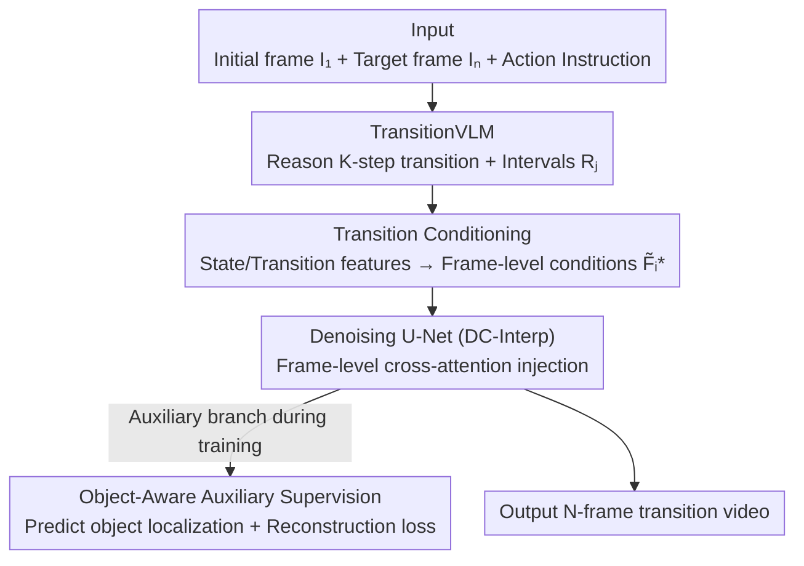

# Ego-InBetween: Generating Object State Transitions in Ego-Centric Videos

**Conference**: CVPR 2026  
**Paper**: [CVF Open Access](https://openaccess.thecvf.com/content/CVPR2026/html/Ge_Ego-InBetween_Generating_Object_State_Transitions_in_Ego-Centric_Videos_CVPR_2026_paper.html)  
**Code**: None  
**Area**: Video Generation  
**Keywords**: Egocentric video, object state transition, video interpolation, vision-language model, frame-level condition injection  

## TL;DR
Addressing the new task of "generating intermediate frames to smoothly transition an object from an initial to a final state given an initial frame, a target frame, and an action instruction" (EIVST), EgoIn first uses a fine-tuned TransitionVLM to reason through the number of steps and their respective time intervals. These conditions are then injected frame-by-frame into a diffusion interpolation model, supplemented by object positioning auxiliary supervision to maintain object appearance consistency. It significantly leads in FVD and other metrics across four egocentric and robotic manipulation datasets.

## Background & Motivation

**Background**: Enabling machines to understand how objects change according to actions is crucial for embodied intelligence. Existing related tasks fall into two categories: text-conditioned video prediction (TVP, e.g., Seer, AID), which predicts future frames from a single reference frame and an instruction; and transition video generation between images, including video frame interpolation (VFI) and scene transitions (e.g., SEINE, FILM), which aims to generate smooth motion or appearance transitions between two reference images.

**Limitations of Prior Work**: TVP methods are provided with only one reference frame and an instruction, lacking **visual guidance of the target state**, making it unclear what to generate—for instance, given a closed refrigerator, it is difficult to infer what is inside or how to retrieve a bowl of lettuce. While interpolation/transition methods have both start and end frames, they only excel at **smooth appearance interpolation**. When faced with multi-step or compositional actions, they degrade into simple repetitive motions because they rely too heavily on additional guidance and lack the ability to "reason the transition process" between two object states.

**Key Challenge**: Existing I2V models tend to **over-rely on given explicit information** and cannot mobilize broader context like humans to reason about "which objects are changing, what transformations are occurring, and where the transformations happen in the sequence." Simply connecting a general VLM leads to **hallucinations**: fabricating visually non-existent transition steps, extending steps beyond the target frame, or partitioning time intervals uniformly and incorrectly.

**Goal**: Define and solve the **Egocentric Instructed Visual State Transition (EIVST)** task—given an initial frame $I_1$, a target frame $I_N$, and an action instruction, generate an intermediate frame sequence $\{\hat{I}_i \mid 2 \le i \le N-1\}$ that characterizes the object state transition process through $K$ reasoned steps.

**Key Insight**: Mimic the human way of reasoning state transitions by splitting the problem into two parts—first "think through how to change" (reasoning process), then "draw it" (generation), following a divide-and-conquer strategy. The key lies in first using a **disciplined, non-hallucinating** VLM to explicitly reason the transition process, then feeding it as frame-level conditions to the generator.

**Core Idea**: Use a fine-tuned VLM to explicitly reason the "$K$ steps + time interval per step" transition process, and then inject this into a diffusion interpolation model via frame-level cross-attention, transforming "invisible reasoning" into "controllable frame-by-frame generation conditions."

## Method

### Overall Architecture
EgoIn operates in two sequential stages: **Stage 1** uses a fine-tuned TransitionVLM to read the initial frame, target frame, and action instruction to reason the initial/final object state descriptions, the $K$-step object state transition, and the time interval for each step $\{R_j\}_{j=1}^K$; **Stage 2** involves the Transition Conditioning (TC) module encoding these state/transition details into **frame-level conditions** $\{\tilde{F}_i^*\}_{i=1}^N$, which are injected into a denoising U-Net via frame-level cross-attention to generate an $N$-frame video. During training, an Object-Aware Auxiliary Supervision (OAS) is added: the U-Net is required to predict localization maps for the manipulated objects, optimized alongside the video reconstruction loss to maintain object appearance consistency. The entire generator is built upon a lightweight DynamiCrafter Interpolation (DC-Interp) base.

### Key Designs

**1. TransitionVLM: Taming a General VLM into a Structured Transition Reasoner**

Directly using Qwen2.5-VL 7B for state transition reasoning leads to hallucinations—fabricating non-existent transitions, extending steps beyond target frames, or partitioning time intervals uniformly. The authors **construct supervision data** using GPT-4o to correct this: ① For state descriptions, the manipulated object is identified according to the action instruction, bounding boxes are detected via Qwen2.5-VL, and both are fed to GPT-4o to force focus on the object area and reduce irrelevant background descriptions. ② For transition descriptions, the **full $N$-frame video** is fed to GPT-4o (instead of just the first and last frames) to generate $K$ state transition steps and corresponding time intervals—having the full video ensures the transition descriptions are accurate.

To preserve the original model's reasoning and generalization, **LoRA rather than full parameter fine-tuning** is used, and the state and transition paths are decoupled: S-Adapter + S-LoRA + a prediction head are injected to learn state information (supervised by $\mathcal{L}_S, \mathcal{L}_T$ for initial/final states), while T-Adapter + T-LoRA + another head learn transition information ($K$-step transitions + time intervals, supervised by $\mathcal{L}_R$ for intervals). Hallucinations are significantly reduced after fine-tuning—ablation studies show that replacing "original VLM reasoned steps" with "TransitionVLM steps" markedly improves the rationality of the generated video (e.g., first opening the refrigerator door, then placing the pot, rather than in disorder).

**2. Transition Conditioning: Converting VLM Textual Reasoning into Frame-level, Time-weighted Conditions**

I2V models rely on attention to **implicitly** model input conditions, lacking explicit frame-by-frame guidance, which makes it difficult to determine the timing of transition steps and often leads to missing steps. TC converts TransitionVLM output into explicit frame-level conditions across two branches:

*Multi-modal Semantic State Encoding*: Takes the start/end frames $\{I_1, I_N\}$ and TransitionVLM state features. Here, **internal features $F_1^S, F_N^S$ before the prediction head are used instead of generated text prompts**, as they are richer in information and more robust to noise. The initial state $\{I_1, F_1^S\}$ and final state $\{I_N, F_N^S\}$ each pass through a weight-shared SQ-Former (adapted from BLIP) to align vision and semantics, followed by multi-layer Self-Attn + FFN to obtain $\tilde{F}^S$. Learnable position tokens are also introduced to distinguish states and enhance temporal awareness.

*Range-Aware Transition Encoding*: The core is a **soft weighting mechanism**—based on the intervals $\{R_j\}_{j=1}^K$ predicted by TransitionVLM, weights $W_{i,j}$ are resampled for each frame $i$ and step $j$ from a Gaussian distribution, where the center and length of interval $R_j$ serve as the Gaussian mean and standard deviation. This **smooths** rigid, noisy step boundaries into continuous weights, avoiding abrupt changes at transitions. Frame transition features are obtained by a weighted sum of $\{F_1^T, \dots, F_K^T\}$ according to $\{W_{i,1}, \dots, W_{i,K}\}$. Finally, $\tilde{F}^S$ is concatenated with frame-level $\{\tilde{F}_i^T\}_{i=1}^N$ and processed via MLP + Self-Attn to yield final frame-level conditions $\{\tilde{F}_i^*\}_{i=1}^N$, injected into the U-Net.

**3. Object-Aware Auxiliary Supervision: Maintaining Consistency through "Incidental Localization"**

Generated transitions often suffer from object appearance drift or incoherent motion. OAS uses **multi-task learning** to let the U-Net learn to locate key objects while reconstructing frames: a localization head consisting of two convolutional layers is attached after the U-Net's last block to predict object probability maps. Ground truth is generated using Qwen2.5-VL to find the object and SAM2 to generate masks frame-by-frame, downsampled to the head's resolution. Optimization uses pixel-wise cross-entropy:

$$\min_{\theta}\ \mathbb{E}_{z,t,\epsilon}\big\|\epsilon - \epsilon_{\theta}(z_t; t, f_r, I_1, I_N, \{\tilde{F}_i^*\}_{i=1}^N)\big\|_2^2 + \lambda \mathcal{L}_{\text{LOC}}$$

where $\lambda$ controls the weight of the localization loss (empirically set to $0.1$ for balance and stability). Crucially, SAM2 is **only used to create ground truth during training**. No masks or boxes are required at inference, resulting in zero extra cost.

### Loss & Training
- TransitionVLM: Fine-tuned on ~10k state descriptions + 30k transition descriptions (Epic100/EgoFHO) plus ~2k+4k (Robotics datasets). Adapter learning rate $1\times10^{-5}$, LoRA learning rate $5\times10^{-5}$, lora rank=64, alpha=32, 4 epochs, batch size 128.
- Generator: Two-stage process—first freezing other parameters to optimize the TC module for 20k steps (lr $1\times10^{-4}$, batch 64); then jointly fine-tuning U-Net spatial layers + TC module for 10k steps (lr $2\times10^{-5}$, batch 32). Inference uses 50-step DDIM.

## Key Experimental Results

### Main Results
Experiments on four datasets (two human-object interaction: Epic100/EgoFHO; two robotic manipulation: DualArm/Bridge) using VBench metrics: FVD↓, Video Temporal Quality (VTQ)↑, Video-Text Consistency (VTC)↑, Video-Image Consistency (VIC)↑. All comparative methods were fine-tuned on the EIVST training set for fairness.

| Dataset | Metric | DC-Interp (Second Best) | EgoIn (Ours) |
|--------|------|------|------|
| Epic100 | FVD↓ / VTQ↑ / VTC↑ / VIC↑ | 296.67 / 0.8797 / 0.2041 / 0.9081 | **215.27 / 0.9081 / 0.2373 / 0.9313** |
| EgoFHO | FVD↓ / VTQ↑ / VTC↑ / VIC↑ | 290.30 / 0.8740 / 0.2079 / 0.9196 | **203.85 / 0.8987 / 0.2340 / 0.9396** |
| DualArm | FVD↓ / VTQ↑ / VTC↑ / VIC↑ | 298.51 / 0.8895 / 0.2107 / 0.9324 | **209.63 / 0.9142 / 0.2361 / 0.9468** |
| Bridge | FVD↓ / VTQ↑ / VTC↑ / VIC↑ | 287.47 / 0.9153 / 0.2092 / 0.9302 | **191.09 / 0.9374 / 0.2395 / 0.9511** |

FVD decreased by approximately 70-100 points across the four datasets relative to the second best. In a 40-person user study, EgoIn obtained **70%+** preference votes in rationality, instruction alignment, and motion quality.

### Ablation Study

Incremental addition of components (Baseline: fine-tuned DC-Interp on Epic100):

| Configuration | FVD↓ | VTQ↑ | VTC↑ | VIC↑ | Description |
|------|------|------|------|------|------|
| Baseline | 296.67 | 0.8797 | 0.2041 | 0.9081 | Fine-tuned DC-Interp |
| + TransitionVLM | 261.78 | 0.8909 | 0.2233 | 0.9146 | Added text conditions, more rational steps |
| + TVLM & TC | 232.10 | 0.9013 | 0.2312 | 0.9251 | Frame-level conditions for controllable timing |
| + TVLM & TC & OAS | **215.27** | **0.9081** | **0.2373** | **0.9313** | Added localization for better consistency |

Ablation of step count $K$ (Epic100 FVD): $K{=}1$ had insufficient context (247.41); $K{=}2$ improved significantly (228.66); $K{=}4$ introduced redundant steps for simple transitions (233.25); **adaptive $K\in[1,4]$ was optimal** (215.27).

### Key Findings
- **Modular synergy**: TransitionVLM ensures the "logic" is correct, TC controls "when" each step occurs across frames, and OAS ensures the object "looks consistent"; the FVD improvement is a result of all three.
- **VLM fine-tuning is mandatory**: Zero-shot Qwen2.5-VL 7B produced illogical states (e.g., placing a pot in a full fridge), which was corrected by TransitionVLM.
- **Predicted intervals vs. Uniform splitting**: Using non-uniform intervals predicted by TransitionVLM produces more natural and temporally aligned transitions compared to uniform splitting.

## Highlights & Insights
- **Decoupling "Reasoning-then-Generation"**: Delegating common-sense reasoning (steps/timing) to a VLM while leaving high-fidelity rendering to the diffusion model is more reliable than end-to-end I2V modeling—a divide-and-conquer strategy applicable to other complex generation tasks.
- **Gaussian Soft-Weighting**: Smoothing discrete step boundaries into continuous frame weights is a clever trick to respect VLM-derived partitions while avoiding temporal artifacts.
- **Training-time Teachers for Inference Efficiency**: OAS distills knowledge from a heavy segmentation model (SAM2) into a light 2-layer conv head, maintaining zero inference overhead.
- **Utilizing Intermediate VLM Features**: Using internal features $F^S$ rather than text prompts is an important reminder that intermediate representations are often richer and more robust for generators.

## Limitations & Future Work
- Long-term state transitions involving significant scene or viewpoint changes remain a challenge, requiring stronger long-range dependency modeling.
- The paper does not provide code, and the precise structures of new modules like SQ-Former and the Adapters are mainly described via schematics, posing a barrier to reproduction.
- Heay reliance on the "data pipeline" (GPT-4o, Qwen2.5-VL, SAM2); errors from these upstream models directly contaminate training ground truth, and their sensitivity was not analyzed.

## Related Work & Insights
- **vs Seer / AID**: These predict the future from a single frame + instruction but lack a **visual anchor for the target state**. Ours uses the target frame and explicit reasoning for better control.
- **vs FILM / TRF**: These excel at smooth interpolation but fail on multi-step compositional actions. Ours utilizes VLM reasoning and frame-level conditions for semantically complex transitions.
- **vs SEINE**: Aimed at smooth scene transitions without modeling action-induced object changes. Ours focuses on finer-grained instructed object state transitions.

## Rating
- Novelty: ⭐⭐⭐⭐⭐ Proposes the EIVST task with a novel decoupling of VLM reasoning and frame-level diffusion injection.
- Experimental Thoroughness: ⭐⭐⭐⭐ Extensive datasets and metrics, though lacking code and sensitivity analysis for upstream models.
- Writing Quality: ⭐⭐⭐⭐ Clear task definition and motivation; some module details are slightly brief and rely on diagrams.
- Value: ⭐⭐⭐⭐ High practical value for visualizing processes in embodied AI and robotic manipulation.

<!-- RELATED:START -->

## Related Papers

- [\[CVPR 2026\] Generating Humanless Environment Walkthroughs from Egocentric Walking Tour Videos](generating_humanless_environment_walkthroughs_from_egocentric_walking_tour_video.md)
- [\[CVPR 2026\] VideoRealBench: A Chain-of-Thought Realism Evaluation Benchmark for Generated Human-Centric Videos](videorealbench_a_chain-of-thought_realism_evaluation_benchmark_for_generated_hum.md)
- [\[ACL 2026\] OSCBench: Benchmarking Object State Change in Text-to-Video Generation](../../ACL2026/video_generation/oscbench_benchmarking_object_state_change_in_text-to-video_generation.md)
- [\[CVPR 2026\] HandWorld: Hand-Centric Unified Video Action Generation](handworld_hand-centric_unified_video_action_generation.md)
- [\[CVPR 2026\] GenHOI: Towards Object-Consistent Hand-Object Interaction with Temporally Balanced and Spatially Selective Object Injection](genhoi_towards_object-consistent_hand-object_interaction_with_temporally_balance.md)

<!-- RELATED:END -->
