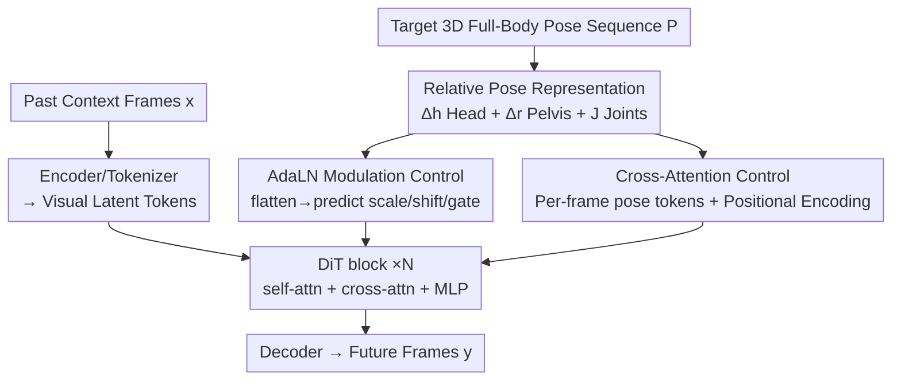

# EgoControl: Controllable Egocentric Video Generation via 3D Full-Body Poses

**Conference**: CVPR 2026  
**Paper**: [CVF Open Access](https://openaccess.thecvf.com/content/CVPR2026/html/Pallotta_EgoControl_Controllable_Egocentric_Video_Generation_via_3D_Full_Body_Poses_CVPR_2026_paper.html)  
**Code**: https://cvg-bonn.github.io/EgoControl (Project Page)  
**Area**: Video Generation / Diffusion Models / Embodied AI  
**Keywords**: Egocentric video generation, 3D full-body pose control, video diffusion, relative pose representation, AdaLN modulation  

## TL;DR
EgoControl utilizes a compact representation of "relative head pose + pelvis-rooted joint poses" on the pretrained video diffusion model Cosmos. By injecting control signals through a twin-pathway of AdaLN modulation and pose token cross-attention, it achieves precise future frame prediction driven by the 3D full-body pose of an egocentric wearer, aligning both camera perspective and visible limb movements with the control pose.

## Background & Motivation

**Background**: Enabling embodied agents to "rehearse" the visual consequences of their actions in their mind is a key capability for planning, prediction, and interaction (AR/VR, teleoperation). This requires generative models to be not only photorealistic but also controllable by fine-grained, physically plausible body-level instructions. Current SOTA video generation models (e.g., Cosmos, various DiT-based diffusion/flow-matching) exhibit strong image quality and support high-level conditions such as text and camera trajectories.

**Limitations of Prior Work**: Existing controllable video generation faces two major dead zones. First, conditions like text or camera trajectories **cannot directly control the articulated body of the camera wearer**—whereas egocentric camera motion originates from the global translation and rotation of the wearer's head, and local joint movements of arms, hands, and legs create the occlusions and object interactions that define egocentric scenes. Second, most existing pose-controllable generation focuses on **third-person perspectives + 2D skeletons**, where the subject is largely visible and camera motion is limited; 2D poses cannot be effectively transferred to egocentric views.

**Key Challenge**: The egocentric perspective is an extreme scenario characterized by "strong viewpoint changes + frequent self-occlusion + rich hand-object interactions," where body pose and visual observations are tightly coupled (head motion moves the viewpoint, hand motion brings hands into the frame). To faithfully simulate the visual consequences of a specific action (reaching out, turning while walking, grasping an object), it is essential to specify **complete 3D full-body pose sequences**, a modality missing in existing conditions.

**Goal**: To train an egocentric video prediction model that, given a short segment of past observations and a target full-body pose sequence, generates temporally coherent future frames aligned with the control poses.

**Key Insight**: Since the majority of visual changes in egocentric views stem from camera (head) motion, the pose representation must reflect the "agent's own motion" rather than absolute coordinates in the world. This is achieved by encoding motion through inter-frame relative transformations instead of global absolute poses.

**Core Idea**: Design a compact relative pose representation that encodes both global camera dynamics and articulated body dynamics, injecting it into the diffusion process via a "modulation + cross-attention" twin-pathway to translate body motion into egocentric visual outcomes. EgoControl is the first model to explicitly control egocentric video generation using 3D full-body poses.

## Method

### Overall Architecture

EgoControl is based on a latent conditional video diffusion model using Cosmos as the backbone. A tokenizer $E$ maps frames to continuous latent variables $z_0 = E(x)$. The forward process perturbs the clean latents with continuous noise levels $\sigma$ according to the EDM formulation: $z = z_0 + \sigma\varepsilon,\ \varepsilon\sim\mathcal{N}(0,I)$. The denoising network (a DiT) directly predicts the clean latent:

$$\mathcal{L}(\theta) = \mathbb{E}_{z_0,\varepsilon,\sigma,c}\big[\,w(\sigma)\,\lVert z_\theta(z,\sigma,c) - z_0\rVert_2^2\,\big]$$

The key lies in the context $c$, which includes not only past visual context $x=(x_1,\dots,x_N)$ but also a pose sequence $P=(p_1,\dots,p_M)$ representing "future motion intent." The pipeline involves: encoding past frames → converting pose sequences to relative representations → injecting signals into DiT blocks via two paths (AdaLN modulation and pose token cross-attention) → denoising → decoding future frames $y=(y_1,\dots,y_M)$. The modulation path handles image quality and global head motion, while the cross-attention path handles fine-grained joint alignment.

### Key Designs

**1. Relative Pose Representation: Feeding Motion via Inter-frame Differences**

The Nymeria dataset provides 3D body poses in a global reference frame, where each pose consists of $J=23$ joint matrices. To operate from an "embodied perspective," the model focuses on self-motion. The sequence $P$ is decomposed into three relative components.

Head: For global head poses $H=(H_0,\dots,H_M)$, relative transformations $\Delta H_i = H_i H_{i-1}^{-1}$ are converted to 6D vectors $\Delta h_i\in\mathbb{R}^{1\times6}$ (translation + Euler rotation). Pelvis: Using the pelvis as the root, inter-frame relative motion $\Delta r\in\mathbb{R}^{M\times1\times6}$ is calculated. Joints: Transformations of joints relative to the pelvis $J\in\mathbb{R}^{M\times21\times6}$ are computed. The final unified representation is:

$$P = [\Delta h,\ \Delta r,\ J]\in\mathbb{R}^{M\times23\times6}$$

Ablations show that differential encoding (relative to the previous frame) is nearly twice as accurate in translation as cumulative encoding (relative to the first frame), as cumulative values drift over time. Using pelvis-centered coordinates for joints instead of inter-frame differences $\Delta j$ improved mIoU by approximately 5.55.

**2. AdaLN Modulation Control: Modulating Normalization and Residuals**

This path treats the entire pose sequence as a global condition. The pose tensor $P$ is flattened and mapped via MLPs $g_e, g_m$ to embeddings $e_P$ and modulation parameters $m_P^{\beta\gamma g}$. For each DiT block, shift, scale, and gate parameters are predicted for self-attn, cross-attn, and MLP components:

$$[\beta_P^{(k)},\gamma_P^{(k)},g_P^{(k)}] = W_{m1}^k W_{m2}^k\,\mathrm{SiLU}(e_P) + m_P^{\beta\gamma g}$$

The diffusion step $t$ is fused additively: $e_P \leftarrow e_t + e_P$. This mechanism excels at overall image quality and global head motion but lacks fine-grained joint control when used alone.

**3. Pose Token Cross-Attention Control: Retaining Temporal Structure for Fine-grained Alignment**

To address the limitations of AdaLN, this path retains the temporal structure of $P$. Each frame's pose vector $P_m$ is projected to a feature space and combined with sinusoidal positional encodings to form $M$ pose tokens. These tokens serve as the context $c$ for cross-attention with visual tokens, providing "temporally localized" control signals that complement the global AdaLN modulation.

### Loss & Training
The objective is the EDM-style denoising reconstruction loss $\mathcal{L}(\theta)$. The model uses a cosmos-predict2 (2B, 480p, 16 FPS) backbone. It is trained on 45-frame segments (13 past frames, 32 future frames) from the Nymeria dataset, which contains 3D poses and 480x480 egocentric video.

## Key Experimental Results

### Main Results

| Configuration | SSIM↑ | LPIPS↓ | DreamSim↓ | FVD↓ | TransErr↓ | RotErr↓ | mIoU↑ | Acc%↑ |
| :--- | :--- | :--- | :--- | :--- | :--- | :--- | :--- | :--- |
| Base Cosmos (Off-the-shelf) | 42.29 | 50.62 | 23.00 | 71.00 | 16.53 | 15.60 | 20.03 | 85.36 |
| Finetuned (Ours, no pose) | 47.47 | 45.74 | 18.14 | 40.70 | 9.93 | 13.65 | 25.13 | 85.20 |
| Head control (Ours, only $\Delta h$) | 56.94 | 29.71 | 10.22 | 22.68 | 5.16 | 3.29 | 33.70 | 91.14 |
| **Body control (Ours, full $P$)** | **58.60** | **26.71** | **8.54** | **20.18** | **4.90** | **2.96** | **52.13** | **96.33** |

Full-body control improves arm alignment (mIoU) by nearly 55% compared to head-only control. Interestingly, joint information also improves camera perspective and head pose consistency (lower Trans/Rot errors), suggesting that full-body context aids global camera control.

### Ablation Study

| Mechanism (7k iter) | SSIM↑ | DreamSim↓ | FVD↓ | mIoU↑ | TransErr↓ | RotErr↓ |
| :--- | :--- | :--- | :--- | :--- | :--- | :--- |
| AdaLN | 52.16 | 11.48 | 29.14 | 33.44 | 6.07 | 5.99 |
| Cross-attn (CA) | 51.65 | 12.20 | 29.28 | 37.84 | 6.85 | 7.19 |
| **AdaLN + CA** | **52.60** | **10.94** | **27.51** | **37.40** | **5.59** | **5.23** |

### Key Findings
- **Dual pathways are complementary**: AdaLN handles image quality and global motion, while Cross-Attention ensures fine-grained joint alignment. Combining them yields the best results.
- **Differential representation is vital**: Cumulative/absolute poses drift and become unstable over long sequences; frame-to-frame differences provide a more stable signal.
- **Pelvis-rooted joint coordinates are easier to learn**: This method is significantly more robust than per-joint inter-frame differences (+5.55 mIoU).

## Highlights & Insights
- **Full-body context aids camera control**: Inclusion of joint data unexpectedly improved camera viewpoint consistency, implying that full-body poses provide a richer context for inferring ego-motion.
- **Hybrid "Coarse + Fine" Control**: The combination of global modulation (AdaLN) and temporal tokens (Cross-Attention) is a transferable design for tasks requiring both global style and local detail control.
- **SAM2 for Quantitative Evaluation**: Using SAM2 to track and segment visible arms to calculate mask mIoU is an effective way to quantify "pose alignment" in egocentric views.

## Limitations & Future Work
- **Lack of fine hand control**: The model does not explicitly model finger joints due to the absence of hand pose labels in Nymeria.
- **Data bias**: Training is restricted to specific capture setups (fisheye cameras, mocap suits), which may limit zero-shot generalization to different clothing or lenses.
- **Evaluation scale**: Arm mIoU was calculated on a subset of frames, limiting the scope of body control assessment.

## Related Work & Insights
EgoControl surpasses existing camera-only control methods like CAMI2V and single-frame autoregressive methods like PEVA in both temporal consistency and resolution. By modeling the tight coupling between "body as camera" and "body as content," it moves generative models toward becoming physically grounded world simulators driven by body-level instructions.

## Rating
- **Novelty**: ⭐⭐⭐⭐⭐ (First explicit 3D full-body control for egocentric video.)
- **Experimental Thoroughness**: ⭐⭐⭐⭐ (Solid ablations and metrics, though single-dataset.)
- **Writing Quality**: ⭐⭐⭐⭐⭐ (Logical derivation and clear insights.)
- **Value**: ⭐⭐⭐⭐ (Strong implications for embodied AI and AR/VR simulator development.)

<!-- RELATED:START -->

## Related Papers

- [\[CVPR 2026\] EgoX: Egocentric Video Generation from a Single Exocentric Video](egox_egocentric_video_generation_from_a_single_exocentric_video.md)
- [\[CVPR 2026\] Towards Realistic and Consistent Orbital Video Generation via 3D Foundation Priors](orbital_video_3d_foundation_priors.md)
- [\[CVPR 2026\] Accelerating Diffusion-based Video Editing via Heterogeneous Caching: Beyond Full Computing at Sampled Denoising Timestep](accelerating_diffusion-based_video_editing_via_heterogeneous_caching_beyond_full.md)
- [\[CVPR 2026\] Pantheon360: Taming Digital Twin Generation via 3D-Aware 360° Video Diffusion](pantheon360_taming_digital_twin_generation_via_3d-aware_360_video_diffusion.md)
- [\[CVPR 2026\] 3D-Aware Implicit Motion Control for View-Adaptive Human Video Generation](3d-aware_implicit_motion_control_for_view-adaptive_human_video_generation.md)

<!-- RELATED:END -->
