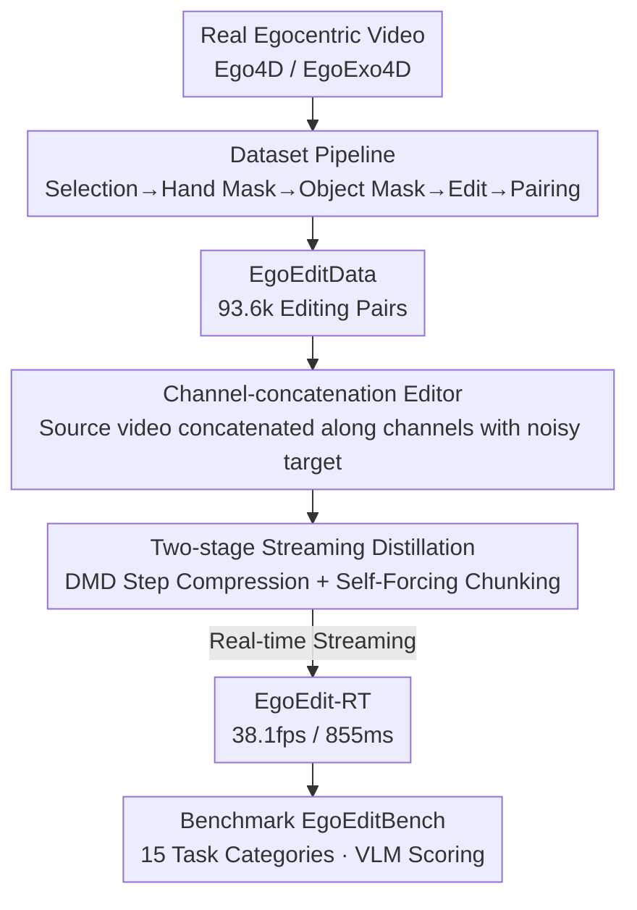

# EgoEdit: Dataset, Real-Time Streaming Model, and Benchmark for Egocentric Video Editing

**Conference**: CVPR 2026  
**Paper**: [CVF Open Access](https://openaccess.thecvf.com/content/CVPR2026/html/Li_EgoEdit_Dataset_Real-Time_Streaming_Model_and_Benchmark_for_Egocentric_Video_CVPR_2026_paper.html)  
**Code**: [Project Page](https://snap-research.github.io/EgoEdit) (Dataset and benchmark promised to be public; model code not yet released)  
**Area**: Video Generation  
**Keywords**: Egocentric video editing, real-time streaming generation, instructive editing, autoregressive distillation, AR  

## TL;DR
Addressing egocentric video editing scenarios in Augmented Reality (AR) characterized by "first-person perspective, frequent hand-object interaction, and large ego-motion," the authors introduce a complete ecosystem: data (EgoEditData, 93.6k editing pairs), a model (EgoEdit, a channel-concatenation editor + EgoEdit-RT, a real-time streaming version distilled in two stages achieving 38.1 fps and 855 ms first-frame latency on a single H100), and a benchmark (EgoEditBench, 1700 samples across 15 task categories). It significantly outperforms existing methods in egocentric editing while maintaining competitive performance on general editing tasks.

## Background & Motivation
**Background**: Instructive video editing (e.g., "turn the banana into a water gun") is emerging as a potential engine for AR, allowing users to add, remove, or modify scene elements with a single sentence. InstructPix2Pix successfully pioneered this paradigm with paired "before/after" data, and models like EditVerse and Lucy Edit have extended it to video.

**Limitations of Prior Work**: Existing editors and their training corpora are almost entirely **exocentric** (third-person)—featuring stable perspectives, gentle motion, and minimal hand-object interaction. However, real AR scenarios are **egocentric**: the camera on the head shake constantly, hands frequently occlude and manipulate objects, and interactions are complex. This distribution shift causes existing editors' reliability to plummet. Furthermore, offline diffusion editing pipelines suffer from high latency, failing to support "watch-as-you-generate" real-time interaction.

**Key Challenge**: Editing quality depends heavily on the scale and quality of paired data, yet **egocentric editing data is virtually non-existent**. Simultaneously, high-quality diffusion editing requires ~40 denoising steps (80 forward passes), which is fundamentally at odds with real-time low latency.

**Goal**: To solve egocentric editing end-to-end by addressing three sub-problems: (1) creating a specialized high-quality egocentric editing dataset; (2) training an editing model capable of real-time streaming inference; and (3) building a benchmark for fair evaluation of this setting.

**Key Insight**: Since "data quality + domain alignment" are the primary drivers of editing performance, the authors focus on **meticulous selection** rather than massive quantity. They target object replacement/removal under hand-object interaction—the most relevant and difficult tasks for AR—while explicitly preserving hand structures. On the model side, channel-wise concatenation is used to avoid the quadratic overhead of sequence concatenation, followed by autoregressive distillation for real-time performance.

**Core Idea**: To transition egocentric video editing from offline high-latency to real-time interaction through a complete ecosystem comprising "specialized data + channel-concatenation editor + two-stage streaming distillation + dedicated benchmark."

## Method

### Overall Architecture
EgoEdit is a tripartite ecosystem rather than a single model: The **dataset construction pipeline** filters "hand-manipulating-object" clips from real egocentric videos and synthesizes "replaced/removed" target videos to create EgoEditData. The **channel-concatenation editing model** adapts a pre-trained Text-to-Video DiT into an editor (EgoEdit) conditioned on the source video. **Two-stage streaming distillation** then compresses this 40-step slow editor into a 4-step, chunk-based autoregressive version (EgoEdit-RT). Finally, the **evaluation benchmark**, EgoEditBench, provides standardized scoring across 15 egocentric task categories. The following diagram illustrates the data flow:

### Key Designs

**1. Dataset Construction Pipeline: Selecting Hand-Object Interaction Clips from Mass Egocentric Videos**

The scarcity of egocentric editing data is the biggest barrier to learning-based AR experiences. Starting from Ego4D/EgoExo4D, the authors designed a "quality-first" multi-stage pipeline with strict filtering: ① **Selection**: Retain only high-quality camera models, perform stabilization and deblurring; only 1.8% of videos remain. ② **Hand Mask**: Detect hands (discard clips without hands) and use hand regions as visual prompts for SAM 2 to obtain temporally consistent hand masks; 49.6% remain after manual review. ③ **Object Naming**: Use Qwen2.5-VL-32B to name "the object being manipulated"; discard clips without meaningful interaction. ④ **Object Mask**: Use Grounded SAM for coarse masks, then filter false interactions by calculating "hand-object mask boundary distance" and "object mask-hand skeleton distance." Coarse masks are seeded into SAM 2 for fine masks; 43.6% remain after manual review. ⑤ **Object Editing**: Use GPT-5 Mini to propose diverse replacement targets (including imaginary objects), Qwen-Image to synthesize reference images, and feed the reference + scene description + object mask into Wan 2.1 VACE 14B to generate edited videos (removal is treated as "no target object"). This step is extremely slow (0.112 fps on 8x H100) and has low yields; 37.8% remain after manual artifact removal. ⑥ **Pairing**: Combine source and edited versions with GPT-5 Mini generated instructions. The final pipeline retains only **0.4%** of the original footage, resulting in 10.9k source + 38.8k synthetic videos (70 hours) and **93.6k** pairs. This "quality-over-quantity + explicit hand preservation" strategy is fundamental to domain alignment.

**2. Channel-concatenation Editor: Injecting Source Video via Channels to Avoid Quadratic Sequence Overheads**

To convert a T2V model into an editor, the source video $X_{src}$ must be injected as a condition. Common practice involves **sequence concatenation** (e.g., EditVerse/UNIC), where source patches are appended to target tokens along the sequence dimension. However, doubling the sequence length increases self-attention costs quadratically, conflicting with real-time requirements. EgoEdit adopts **channel-wise concatenation** (following Lucy Edit): the source $X_{src}$ and noisy target $X^{tgt}_t$ are **concatenated along the channel dimension before patching**, keeping model costs nearly identical to the base model. The backbone is a T2V DiT trained on the Wan 2.1 autoencoder latent space. The text condition $c$ is injected via cross-attention. Editing prediction is denoted as $\hat{v} = G(X^{tgt}_t \mid X_{src};\, c)$. Training uses Rectified Flow: given a linear path $X_t = (1-t)X_0 + t X_1$ with constant velocity $v_t = X_1 - X_0$, the objective is:

$$\mathcal{L}_{RF} = \mathbb{E}_{t,\,X_1,\,X_0}\big\| G(X_t, t) - (X_1 - X_0) \big\|_2^2 ,$$

where $t$ is sampled from a logit-normal distribution. At inference, an ODE is integrated from noise to data using Euler steps. Prioritizing architectural efficiency is a prerequisite for real-time distillation.

**3. Two-stage Streaming Distillation: DMD + Self-Forcing for Sub-second Latency**

The baseline editor is accurate but slow—40 denoising steps + CFG equals 80 forward passes (NFE), and it requires generating the full sequence before showing the first frame. The authors use two-stage distillation: ① **Bidirectional DMD Distillation**: Compresses the 40-step CFG model into a 4-step model with distilled guidance, reducing NFE from 80 to 4. ② **Self-Forcing**: A causal student model rolls out autoregressively on the video stream, using a score model based on the bidirectional teacher to apply DMD loss. This allows the student to correct accumulated error (exposure bias) and support low-latency autoregressive inference. A key feature is **chunk-by-chunk generation**: each chunk contains 3 latent frames. Since the Wan autoencoder natively supports autoregressive operations, the model edits and presents results as the camera records (watch-as-you-generate). Recording the first chunk (3 latent frames ≈ 9 RGB frames) takes 562ms; with model processing, total first-frame latency is 855ms. This step achieves real-time performance with minimal quality loss.

**4. EgoEditBench: Standardized Scoring for 15 Egocentric Tasks**

Existing benchmarks are built on exocentric natural videos. The authors established EgoEditBench following the EditVerseBench protocol: 100 source videos were sampled from the Ego4D split **not used for EgoEditData** (categories clustered via K-means on BERT embeddings to ensure diversity). GPT-5 generated targeted instructions for 15 tasks—including addition, effects, removal, replacement, background change, camera pose change, stylization, reasoning, and X-to-Video (Depth/Sketch/Pose). Condition signals were synthesized using OpenCV Canny, DWpose, and Depth Anything. The resulting **1700** source-instruction pairs are evaluated using VLM scores, Pick Score, Text Alignment (TA), and Temporal Consistency (TC).

### Loss & Training
The base editor was fine-tuned on EgoEditData plus an additional 1.31M video and 3.5M image editing pairs. Training: batch 96, 30k steps, AdamW lr 1e-5, weight decay 0.1, with EMA. DMD distillation: 4.5k steps, lr 1e-6 (model), 4e-7 (critic). Self-Forcing: 3.5k steps, same lrs. Final resolution: 512×384 at 16 fps.

## Key Experimental Results

### Main Results
Comparison on EgoEditBench (Egocentric) vs. EditVerseBench (General) (VLM Score, PS=Pick Score, TA=Text Alignment, TC=Temporal Consistency, higher is better):

| Method | Category | EgoBench VLM | EgoBench TC | EditVerse VLM | EditVerse TC |
|------|------|------|------|------|------|
| TokenFlow | Attention Manipulation | 4.99 | 95.04 | 5.87 | 98.21 |
| Señorita-2M ‡ | First-frame Prop. | 7.52 | 95.86 | 6.99 | 98.33 |
| InsV2V | Instructive | 5.24 | 94.01 | 5.71 | 96.39 |
| Lucy Edit | Instructive | 5.44 | 94.41 | 6.27 | 98.62 |
| EditVerse † | Instructive | — | — | 8.26 | 98.68 |
| **EgoEdit** | Instructive | **7.76** | **96.70** | 8.00 | 98.54 |
| StreamDiffusionV2 | Streaming | 2.55 | 94.31 | 2.78 | 98.22 |
| **EgoEdit-RT** | Streaming | **7.71** | 96.41 | 8.18 | 98.55 |

EgoEdit significantly leads in egocentric scenarios (VLM 7.76, highest TC 96.70) while remaining close to the strongest closed-source model, EditVerse, in general tasks (8.00 vs 8.26). Notably, EgoEdit exhibits **cross-domain robustness**: VLM score drops only 0.24 when switching from general to egocentric, whereas Lucy Edit drops 0.83 and InsV2V drops 0.47. The streaming EgoEdit-RT maintains performance comparable to the full teacher and far exceeds existing real-time editors (StreamDiffusionV2 VLM 2.55).

### Ablation Study
Latency/Throughput Analysis (Single H100, 512×384):

| Stage | Streaming | NFE | VLM | First-chunk Latency (ms) | Throughput (model+AE, fps) |
|------|---------|-----|-----|------|------|
| No Distill | No | 80 | 7.76 | 13432 | 9.68 |
| DMD (4-step) | No | 4 | 7.31 | 6925 | 43.5 |
| Self-Forcing | Yes | 4 | 7.71 | **855** | 38.1 |

Data Volume Ablation (evaluating 10k step checkpoints):

| EgoEditData % | 0% | 25% | 75% | 100% |
|------|------|------|------|------|
| EgoBench VLM | 4.87 | 7.12 | 7.52 | **7.85** |

### Key Findings
- **Self-Forcing is essential for sub-second latency**: Standard methods require full sequence calculation before the first frame. Self-Forcing cuts first-chunk latency from 13.4s to 855ms and recovers VLM score from DMD’s 7.31 to 7.71.
- **EgoEditData is the performance engine**: VLM score increases monotonically from 4.87 to 7.85 as more data is used, validating that domain-aligned data is the root cause of improvement.
- **Latency bottleneck is recording, not computation**: Of the 855ms latency, 562ms is recording the 9 frames; model plus AE take only ~300ms.
- **Emergent In-the-wild capabilities**: The real-time version preserves hands during interaction, applies correct lighting to objects, and enables interactions like "walking a dog" where the model reacts to user movement. However, structural changes are limited (e.g., a sword cannot cut through furniture).

## Highlights & Insights
- **Complete Ecosystem Solution**: By addressing data, models, and benchmarks simultaneously, the authors provide a foundation for egocentric research.
- **Architecture Efficiency**: Using channel concatenation instead of sequence concatenation was a critical design choice that enabled subsequent real-time distillation.
- **Explicit Hand Preservation**: Using hand-skeleton and distance constraints in the data pipeline ensures hands are treated as "first-class citizens," a key distinction from exocentric editing.
- **Domain Robustness Measurement**: Measuring the "performance drop" when switching domains is an insightful way to quantify adaptation beyond absolute scores.

## Limitations & Future Work
- **Performance Gap**: EgoEdit-RT still shows perceptible quality gaps compared to the non-distilled version, particularly for out-of-distribution instructions and temporal consistency during occlusions.
- **Dependency on Closed-source LLMs**: The dataset pipeline relies heavily on GPT-5 Mini, Qwen-Image, and high-compute models, making replication costly ⚠️.
- **Limited Structural Interaction**: Inserted objects do not truly interact with the physical environment (e.g., a sword cannot slice a chair), indicating the model learns appearance-level rather than physics-level editing.
- **Future Directions**: Reducing chunk size for lower latency; replacing closed-source dependencies; and introducing physical/geometric constraints.

## Related Work & Insights
- **vs. EditVerse**: EditVerse uses sequence concatenation and is slightly stronger on general tasks but lacks egocentric data, source code, and real-time capability.
- **vs. Lucy Edit**: Both use channel concatenation, but Lucy Edit lacks egocentric data, showing a large 0.83 VLM drop on EgoEditBench.
- **vs. StreamDiffusionV2**: These are training-free and much faster, but quality is significantly lower (VLM 2.55/4.32).
- **vs. Self-Forcing**: The authors apply the distillation logic from Self-Forcing/CausVid to the new egocentric setting rather than inventing a new distillation algorithm.

## Rating
- Novelty: ⭐⭐⭐⭐ First end-to-end framework for egocentric editing, though components are based on existing techniques.
- Experimental Thoroughness: ⭐⭐⭐⭐ Extensive benchmark comparisons, latency analysis, and data ablations.
- Writing Quality: ⭐⭐⭐⭐ Clear structure and visualization.
- Value: ⭐⭐⭐⭐⭐ Dataset and benchmark are substantial contributions to AR infrastructure.

<!-- RELATED:START -->

## Related Papers

- [\[CVPR 2026\] EditCtrl: Disentangled Local and Global Control for Real-Time Generative Video Editing](editctrl_disentangled_local_and_global_control_for_real-time_generative_video_ed.md)
- [\[CVPR 2026\] Scaling Instruction-Based Video Editing with a High-Quality Synthetic Dataset](scaling_instruction-based_video_editing_with_a_high-quality_synthetic_dataset.md)
- [\[CVPR 2026\] Endless World: Real-Time 3D-Aware Long Video Generation](endless_world_real-time_3d-aware_long_video_generation.md)
- [\[CVPR 2026\] U-Mind: A Unified Framework for Real-Time Multimodal Interaction with Audiovisual Generation](u-mind_a_unified_framework_for_real-time_multimodal_interaction_with_audiovisual.md)
- [\[CVPR 2026\] VGA-Bench: A Unified Benchmark and Multi-Model Framework for Video Aesthetics and Generation Quality Evaluation](vga-bench_a_unified_benchmark_and_multi-model_framework_for_video_aesthetics_and.md)

<!-- RELATED:END -->
