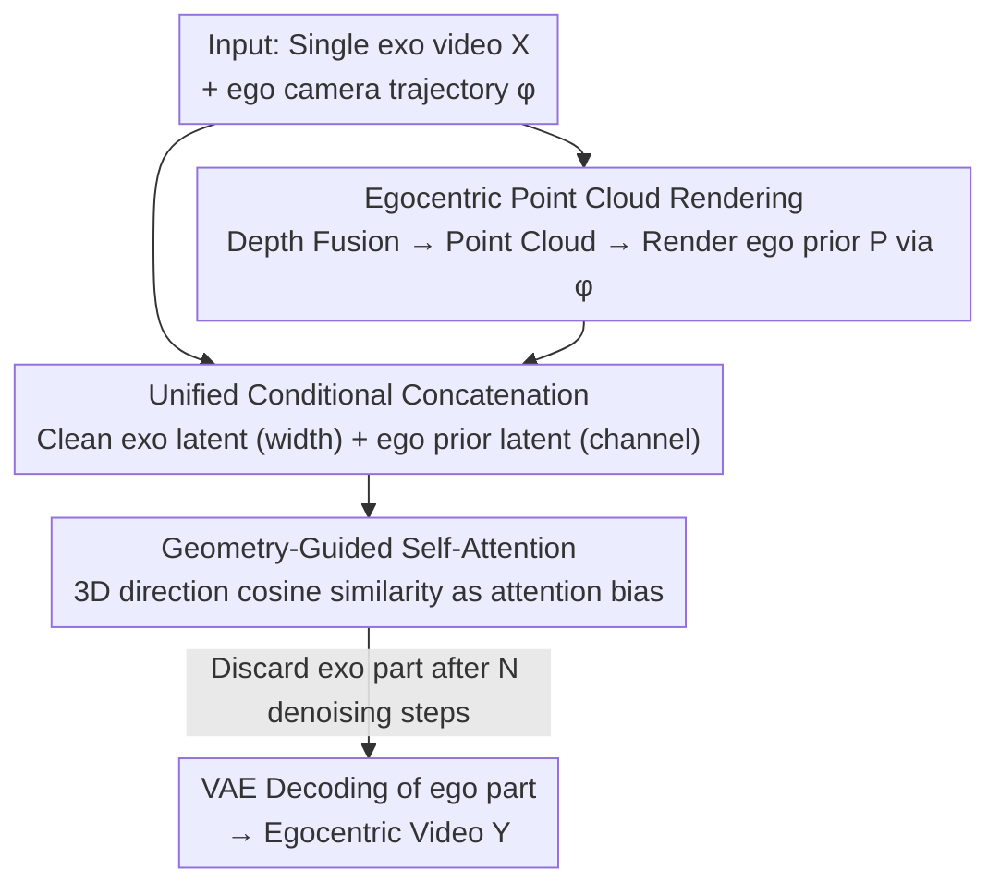

# EgoX: Egocentric Video Generation from a Single Exocentric Video

**Conference**: CVPR 2026  
**Paper**: [CVF Open Access](https://openaccess.thecvf.com/content/CVPR2026/html/Kang_EgoX_Egocentric_Video_Generation_from_a_Single_Exocentric_Video_CVPR_2026_paper.html)  
**Code**: None (No official implementation provided)  
**Area**: Video Generation / Diffusion Models  
**Keywords**: Egocentric video generation, exo-to-ego, video diffusion models, point cloud rendering prior, geometry-guided attention  

## TL;DR
Given a **single** exocentric video and a target egocentric camera trajectory, EgoX first performs 3D lifting to render an "egocentric prior video." It then employs width/channel-wise bidirectional concatenation combined with geometry-guided self-attention, leveraging a pre-trained video diffusion model (Wan 2.1 14B + LoRA) to generate geometrically consistent, high-fidelity egocentric videos. It significantly outperforms baselines such as Exo2Ego-V on the Ego-Exo4D dataset.

## Background & Motivation
**Background**: Translating exocentric videos into egocentric videos (exo-to-ego) allows viewers to "step into the scene and become the protagonist," which is valuable for cinematography, AR/VR, and robotic imitation learning. The most straightforward approach is to adapt recent "camera-controlled video generation" models (e.g., TrajectoryCrafter), which can generate coherent novel views under **moderate viewpoint changes**.

**Limitations of Prior Work**: Exo-to-ego involves **extreme** camera pose translations—the field of view changes almost completely, with virtually no pixel-level overlap between the two perspectives. This introduces two specific challenges: (1) The drastic viewpoint shift results in large **unseen regions** that must be "hallucinated" through scene understanding rather than direct observation; (2) **Only a small portion** of the exocentric frame is relevant to the egocentric view, requiring the model to distinguish which content to use as a condition and which irrelevant background to suppress. Conventional camera-control models lack designs for this and often fail.

**Key Challenge**: The model must simultaneously achieve **geometric consistency for visible content** and **reasonable synthesis of large unseen regions**. These two tasks naturally conflict under extreme viewpoint differences: introducing exo-conditions via cross-attention can lead to the loss of pre-trained weights (as in 4Diff), while direct channel-wise concatenation of exo-features leads to overfitting or quality degradation due to the lack of pixel correspondence.

**Goal**: Generate a complete egocentric video using only **one** exocentric video (without requiring an additional initial egocentric frame or multiple exocentric camera views). In contrast, EgoExo-Gen requires the first egocentric frame, and Exo2Ego-V requires four exocentric inputs—constraints added to bypass the inherent difficulty.

**Key Insight**: Instead of forcing the diffusion model to learn cross-view transformation from scratch, it is better to **compute the geometry first**. By lifting the exocentric video into a point cloud and rendering an "egocentric prior video" along the target trajectory, the model is provided with pixel-aligned anchors. This maximizes the reuse of the pre-trained video diffusion model's spatiotemporal knowledge (using only LoRA), delegating the synthesis of unseen regions to the pre-trained prior.

**Core Idea**: A three-part system consisting of "egocentric prior from point cloud rendering + bidirectional concatenation of clean latents + geometry-guided self-attention" transforms the extreme viewpoint transformation problem into "conditioned generation with geometric alignment on a pre-trained diffusion model."

## Method

### Overall Architecture
The input consists of an exocentric video $X=\{X_i\}_{i=0}^{F}$ and target egocentric camera poses $\phi=\{\phi_i\}_{i=0}^{F}$; the output is the egocentric video $Y$ of the same scene. The pipeline follows three steps: first, the exocentric video is lifted into a 3D point cloud via **monocular and temporal depth fusion**, and an **egocentric prior video** $P$ is rendered according to the trajectory $\phi$ (providing pixel-level RGB and camera trajectory cues, albeit with noise and missing regions). Then, the **clean** exocentric latent $x_0$ and egocentric prior latent $p_0$ are combined with the noisy latent $z_t$ through **width/channel-wise bidirectional concatenation** and fed into the frozen Wan 2.1 video diffusion model (fine-tuned only with LoRA). Inside the DiT, **geometry-guided self-attention** ensures the egocentric query only attends to geometrically aligned exocentric regions. After sampling, the exocentric portion of the latent is discarded, and only the egocentric part is decoded.

### Key Designs

**1. Egocentric Point Cloud Rendering: Providing Pixel-level Geometric Anchors for Extreme View Transformation**

To address the lack of pixel correspondence after drastic viewpoint shifts, EgoX does not force the diffusion model to learn cross-view transformations implicitly. Instead, it **explicitly calculates the geometry**. For each frame, it uses a single-image depth estimator for $D_m$ and a temporal depth estimator for $D_v$. The former is independent per frame (leading to temporal jitter), while the latter is temporally smooth but affine-invariant (scale/shift ambiguous). By aligning $D_v$ to $D_m$ using momentum-updated optimization for per-frame affine parameters $\hat\alpha,\hat\beta$, the fused depth is:

$$D_f = \frac{1}{\hat\alpha / D_v + \hat\beta}$$

Dynamic objects are masked out, and only the static background participates in alignment and rendering. After obtaining the aligned depth $D_f$, it is back-projected into a 3D point cloud using camera intrinsics and then rendered based on the egocentric pose $\phi$ to produce the prior video $P=\mathrm{render}(X,D_f,\phi)$. This $P$ **shares the viewpoint** with the target egocentric video and thus possesses natural pixel-level correspondence—it provides explicit RGB signals and implicit camera trajectory cues. Its weaknesses—rendering noise and large holes in regions not visible to the exocentric camera—are addressed by the subsequent designs.

**2. Unified Conditional Concatenation (Width + Channel + Clean Latents): Feeding the Diffusion Model with Complementary Priors**

The egocentric prior $P$ alone is insufficient; it is viewpoint-aligned but content-incomplete. Conversely, the exocentric video $X$ is content-complete but viewpoint-misaligned. EgoX integrates them using **two different concatenation methods**. The egocentric prior latent $p_0$ is aligned with the target viewpoint and retains pixel correspondence, so it is concatenated along the **channel dimension** with the noisy latent $z_t$, providing viewpoint-aligned and temporally coherent guidance. The exocentric latent $x_0$ is misaligned with $z_t$, so it is concatenated along the **width dimension**, forcing the model to infer cross-view correspondence and implicitly perform spatial warping. The overall denoising relation is:

$$z_{t-1} = f_\theta\big(x_0, z_t \,\|\, x_0, p_0 \,\|\, m_1, m_0\big)$$

where $m$ represents binary masks marking which spatial regions are "conditions" and which are to be "synthesized." A crucial innovation is the use of **clean latents**: unlike SDEdit-style approaches that concatenate **noisy** conditional latents with the noisy target, EgoX concatenates the **clean** $x_0$ at **every denoising timestep**, updating only $z_t$ while keeping $x_0$ fixed. This allows the model to stably reference fine-grained details in $x_0$ at every step, making spatial warping more accurate. Removing the clean latent in ablations caused the FVD to deteriorate from 184 to 343, with the loss of fine objects like spoons and small ingredients. This condition set only requires training LoRA (rank=256) on Wan 2.1, freezing the backbone to preserve pre-trained spatiotemporal priors.

**3. Geometry-Guided Self-Attention (GGA): Focusing Attention on Geometrically Aligned Regions**

The exocentric condition contains many regions irrelevant to the egocentric view, which can interfere with generation. GGA's goal is to ensure that when an egocentric query token attends to exocentric key tokens, the attention considers not only **semantic similarity** but also **3D spatial alignment**. Tokens that are both similar and geometrically aligned receive high weights. Specifically, using the point cloud from the first step, unit source vectors are calculated from the egocentric camera center $c_i$ to the 3D positions of the query/key: $\hat q=\frac{\tilde q-c_i}{\|\tilde q-c_i\|_2}$ and $\hat k=\frac{\tilde k-c_i}{\|\tilde k-c_i\|_2}$. Their cosine similarity is then injected as a **multiplicative geometric prior** into the attention logits:

$$s'_{m,n} = s_{m,n} + \log\big(g(\hat q_m,\hat k_n)\cdot\lambda_g\big),\qquad g(\hat a,\hat b)=\cos\text{-}\mathrm{sim}(\hat a,\hat b)+1$$

where $s_{m,n}=q_m^\top k_n/\sqrt c$ is the standard attention logit and $\lambda_g$ adjusts the strength of the geometric bias. The cosine plus 1 ensures positivity before taking the log. After softmax, the weight is $a_{m,n}\propto \exp(s_{m,n})\,g(\hat q_m,\hat k_n)^{\lambda_g}$. Note: While Eq. (4) uses a log format, the power form in Eq. (7) of the original paper is the functional equivalent; the implementation follows the paper's specifics. The engineering challenge is that while image generation can pre-multiply rotation matrices, the **egocentric camera center changes every frame** in video. GGA computes all ego-exo directional similarities as an **additive bias attention mask**, allowing the use of optimized attention kernels without sacrificing efficiency.

### Loss & Training
The base model is the Wan 2.1 (14B) Image-to-Video inpainting variant (to support channel-wise concatenation of noisy latents and ego-priors). Fine-tuning uses LoRA (rank=256) with a batch size of 1, trained on 8×H200 (140GB) for approximately one day. Data includes 4,000 selected segments from Ego-Exo4D (3,600 training / 400 testing), plus 100 out-of-distribution segments to test generalization.

## Key Experimental Results

### Main Results
Evaluated on Ego-Exo4D against Exo2Ego-V, TrajectoryCrafter, Wan Fun Control, and Wan VACE (all baselines fine-tuned on the same data). Metrics include image-level (PSNR/SSIM/LPIPS/CLIP-I), object-level (Location Error/IoU/Contour Acc using SAM2+DINOv3 tracking), and video-level (FVD + VBench).

| Scene | Method | PSNR↑ | SSIM↑ | LPIPS↓ | CLIP-I↑ | Loc.Err↓ | IoU↑ | FVD↓ |
|------|------|-------|-------|--------|---------|----------|------|------|
| Seen | Exo2Ego-V | 14.53 | 0.384 | 0.569 | 0.774 | 156.66 | 0.074 | 622.47 |
| Seen | TrajectoryCrafter | 13.05 | 0.375 | 0.606 | 0.780 | 100.74 | 0.128 | 546.09 |
| Seen | Wan VACE | 12.95 | 0.413 | 0.626 | 0.829 | 109.62 | 0.114 | 508.69 |
| Seen | **EgoX** | **16.05** | **0.556** | **0.498** | **0.896** | **61.81** | **0.363** | **184.47** |
| Unseen | Exo2Ego-V | 12.70 | 0.439 | 0.597 | 0.679 | 214.32 | 0.003 | 1283.50 |
| Unseen | Wan Fun Control | 13.59 | 0.439 | 0.604 | 0.799 | 191.40 | 0.042 | 968.78 |
| Unseen | **EgoX** | **14.38** | **0.457** | **0.552** | **0.877** | **149.93** | **0.092** | **440.64** |

The gap in object-level metrics is most significant (Seen scene IoU 0.363 vs. 0.128 for the second best, FVD 184 vs. 508), indicating that EgoX is far superior in preserving geometric and object consistency. While absolute image-level metrics are low due to the inherent difficulty of synthesizing unseen regions, EgoX remains the leader. Wan VACE achieved the highest VBench temporal smoothness score but did so by generating **overly static** videos (Dynamic Degree only 0.673); EgoX maintains a better balance between dynamics and fidelity.

### Ablation Study (Seen Scene)

| Config | PSNR↑ | LPIPS↓ | IoU↑ | FVD↓ | Description |
|------|-------|--------|------|------|------|
| Full (EgoX) | 16.05 | 0.498 | 0.363 | 184.47 | Complete Model |
| w/o GGA | 14.77 | 0.530 | 0.326 | 254.08 | Attention diverges to irrelevant regions; geometric misalignment |
| w/o Ego prior | 13.67 | 0.573 | 0.417 | 211.50 | Lacks pixel correspondence/trajectory cues; fails to follow viewpoint |
| w/o clean latent | 15.07 | 0.540 | 0.376 | 343.33 | Noisy exo-latent blurs details; loses small objects |

> Note: The IoU (0.417) for "w/o Ego prior" being higher than Full (0.363) is an unexplained anomaly in the original paper; it may be affected by the reduction of visible objects. PSNR/LPIPS/FVD all deteriorated.

### Key Findings
- **Clean latents have the greatest impact on FVD** (184 → 343), confirming that keeping $x_0$ clean throughout denoising is key to fine-grained detail fidelity.
- **GGA determines geometric alignment**: Attention visualizations show that without GGA, egocentric queries attend to irrelevant regions, whereas GGA sharpens focus on geometrically relevant areas.
- **Strong Generalization**: The model successfully generates coherent egocentric videos for out-of-distribution segments and even in-the-wild clips (e.g., *The Dark Knight*), thanks to frozen pre-trained weights and LoRA fine-tuning.

## Highlights & Insights
- **"Compute geometry first, then let the diffusion model fill the gaps"**: This division of labor is clever: explicit point cloud rendering provides deterministic anchors, while the pre-trained prior handles the uncertain synthesis of unseen regions.
- **Same exo-condition, two different concatenation styles**: Viewpoint-aligned egocentric priors use channel-wise concatenation, while viewpoint-misaligned exocentric videos use width-wise concatenation. Using "concatenation dimension" to distinguish "aligned" vs. "warp-required" conditions is a transferable architectural insight.
- **GGA as an additive attention bias**: This bypasses the difficulty of dynamic per-frame egocentric camera centers while remaining efficient and compatible with optimized attention kernels.
- **Permanently fixed clean latents**: Distinguishing from SDEdit's noisy conditions, this detail is a high-yield design choice for detail preservation.

## Limitations & Future Work
- **Requirement of egocentric camera poses**: The framework currently requires user-provided (or interactively specified) egocentric trajectories. Integrating an automatic head-pose estimation module is a future direction.
- **Static background assumption**: The point cloud rendering masks out dynamic objects. ⚠️ This implies that geometric priors for moving subjects in the scene may be unreliable, potentially impacting performance in highly dynamic scenarios.
- **High computational barrier**: Based on Wan 2.1 14B and 8×H200 GPUs, reproduction costs are high, and the model is not currently open-source.
- Image-level absolute metrics (PSNR 16) suggest that the fidelity of synthesized unseen regions still has room for improvement.

## Related Work & Insights
- **vs. Exo2Ego-V**: Requires **four** exocentric camera inputs and separately trained spatial/temporal modules, limiting generalization. EgoX uses **one** exocentric input and leverages pre-trained spatiotemporal priors for better generalization.
- **vs. EgoExo-Gen**: Requires the first egocentric frame to generate the sequence. EgoX generates the entire video from scratch without any egocentric frames.
- **vs. 4Diff (Cross-attention conditioning)**: 4Diff fails to reuse powerful pre-trained diffusion weights effectively. EgoX preserves the pre-trained prior via latent concatenation and LoRA.
- **vs. Channel-concatenation of exo-features**: Those methods suffer from lack of pixel correspondence. EgoX solves this by rendering an aligned egocentric prior before channel-wise concatenation.

## Rating
- Novelty: ⭐⭐⭐⭐⭐ First framework for complete egocentric generation from single exo-video; novel combination of point cloud prior, bidirectional concat, and GGA.
- Experimental Thoroughness: ⭐⭐⭐⭐ Four baselines, three category metrics, seen/unseen/in-the-wild coverage. Some anomalies in ablation metrics; not yet open-sourced.
- Writing Quality: ⭐⭐⭐⭐ Motivation and design components are clearly articulated.
- Value: ⭐⭐⭐⭐ Directly applicable to cinematography, AR/VR, and robotics; methodology is transferable to other extreme view generation tasks.

<!-- RELATED:START -->

## Related Papers

- [\[CVPR 2026\] EgoControl: Controllable Egocentric Video Generation via 3D Full-Body Poses](egocontrol_controllable_egocentric_video_generation_via_3d_full-body_poses.md)
- [\[CVPR 2026\] EgoEdit: Dataset, Real-Time Streaming Model, and Benchmark for Egocentric Video Editing](egoedit_dataset_real-time_streaming_model_and_benchmark_for_egocentric_video_edi.md)
- [\[ECCV 2024\] SV3D: Novel Multi-view Synthesis and 3D Generation from a Single Image using Latent Video Diffusion](../../ECCV2024/video_generation/sv3d_novel_multi-view_synthesis_and_3d_generation_from_a_single_image_using_late.md)
- [\[ICCV 2025\] ReCamMaster: Camera-Controlled Generative Rendering from A Single Video](../../ICCV2025/video_generation/recammaster_camera-controlled_generative_rendering_from_a_single_video.md)
- [\[ICCV 2025\] Causal-Entity Reflected Egocentric Traffic Accident Video Synthesis](../../ICCV2025/video_generation/causal-entity_reflected_egocentric_traffic_accident_video_synthesis.md)

<!-- RELATED:END -->
