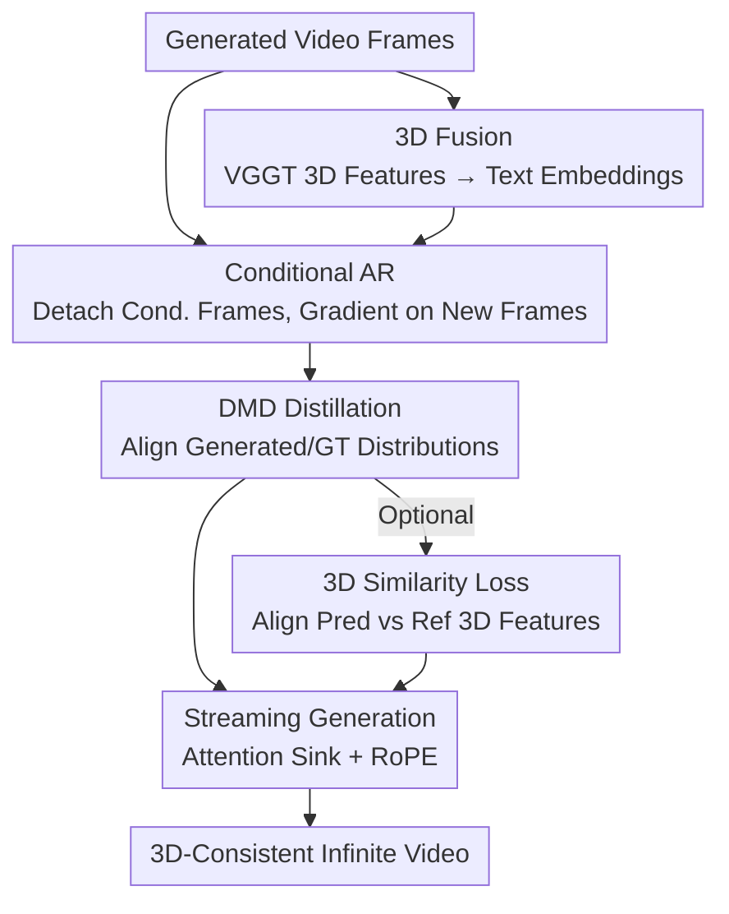

# Endless World: Real-Time 3D-Aware Long Video Generation

**Conference**: CVPR 2026  
**Paper**: [CVF Open Access](https://openaccess.thecvf.com/content/CVPR2026/html/Zhang_Endless_World_Real-Time_3D-Aware_Long_Video_Generation_CVPR_2026_paper.html)  
**Code**: [Project Page](https://bwgzk-keke.github.io/EndlessWorld/) (Open-source repository not yet available)  
**Area**: Video Generation / Diffusion Models  
**Keywords**: Long Video Generation, Autoregressive Diffusion, 3D Consistency, Streaming Generation, Attention Sink

## TL;DR
Endless World combines "conditional autoregression (truncated conditional frame gradients) + fusing VGGT-extracted 3D features into text embeddings + attention sinks" into a 1.3B distilled video diffusion model. It achieves real-time (17 FPS) generation of infinitely extendable, geometrically consistent videos on a single GPU without quality degradation over time, achieving a VBench total score of 84.54 at 30 seconds, surpassing SOTAs like LongLive.

## Background & Motivation

**Background**: Current video diffusion models (e.g., Wan2.1, LTX-Video) exhibit high quality on short segments (5 seconds). To extend length, the mainstream approach follows the autoregressive (AR) route—segmenting video into chunks where new chunks are predicted conditioned on previously generated frames, often accelerated by KV caching (e.g., Self-Forcing).

**Limitations of Prior Work**: These AR methods suffer from continuous quality degradation in long videos, leading to color drift, structural distortion, and flickering after 20-30 seconds. The paper identifies two root causes: (1) **Training-inference inconsistency**: During training, conditional frames are differentiable, allowing the model to "back-modify" past frames for overall naturalness. During inference, conditional frames are fixed, causing the coordination gained during training to fail and small motion errors to accumulate into drift. (2) **Lack of explicit 3D constraints**: Without geometric guidance, long sequences suffer from geometric instability, flickering textures, and inconsistent scene layouts.

**Key Challenge**: Long sequences necessitate autoregression, yet autoregression causes error accumulation. Training directly on long sequences is prohibitively expensive. Global geometric consistency is required for stability, but existing 3D-aware methods mostly rely on synthesizing new views from point clouds/3D caches as conditions, which are limited by synthesis quality and fail to **directly** inject high-quality 3D features into the generation process.

**Goal**: To achieve infinite length, 3D consistency, and zero quality degradation over time under the constraints of no super-long sequence training, no added inference overhead, and real-time performance on a single GPU.

**Key Insight**: **Detach** conditional frames from the computational graph to align the training objective with the fact that conditional frames are fixed during inference, eliminating the training-inference gap at the source. Furthermore, treat VGGT 3D features as "global scene descriptors at the same level as text prompts" and fuse them into text embeddings to provide continuous geometric guidance. Finally, leverage **attention sinks** from streaming-LLMs to preserve initial scene memory for infinite extension.

## Method

### Overall Architecture

Endless World is built upon **Wan2.1-T2V-1.3B** and converted into a few-step causal attention model using the DMD paradigm of Self-Forcing for real-time AR generation. The training pipeline consists of three main steps plus an optional 3D similarity regularization:

1.  **3D Fusion**: Use a pre-trained VGGT to extract 3D structural features $f_{3D}$ from videos (decoded from random noise latents), and inject them into text embeddings via a learnable CNN fusion module to obtain fused conditions $\tilde{e}$.
2.  **Conditional Generation**: Autoregressively generate new frames conditioned on previously generated ones, but **detach** the conditional frames so that gradients only backpropagate through new frames.
3.  **DMD Distillation**: Use Distribution Matching Distillation (DMD) to align the distribution of generated videos (including new and conditional frames) with the ground-truth video distribution in a training-free manner.
4.  **(Optional) 3D Similarity Loss**: Constrain the consistency between 3D features of "conditionally predicted frames" and "noise-generated frames" to enhance geometric consistency.

During inference, a streaming strategy involving **attention sink + RoPE** is used to alternate between long and short context modes for infinite generation.

### Key Designs

**1. Conditional AR + Gradient Detachment: Aligning Training with Fixed Inference Context**

This addresses the training-inference inconsistency. Conventional Self-Forcing defines the joint distribution as $p_\phi(v_{1:n}) = \prod_{k=1}^{n} p_\phi(v_k \mid v^\phi_{<k})$, where $v^\phi_{<k}$ is differentiable. DMD loss matches the whole sequence, meaning gradients flow through past frames, allowing the model to "cheat" by modifying the context. Endless World "peels" the conditional frames from the graph:

$$p_\phi(v_j \mid v^\phi_{i:j-1}, v_{<i}^{\text{detach}}), \quad j > i$$

Only newly generated frames contribute to parameter updates. This ensures the training condition mechanism is identical to inference, preventing temporal dependency leakage and stabilization of motion trajectories. This design improved the VBench total score from 82.94 to 83.30 in ablations.

**2. 3D Fusion: 3D Features as Global Scene Descriptors**

The authors observe that both text prompts and 3D features are high-level global descriptions of "world structure." Instead of synthesizing views, 3D features are treated as prompts. Pre-trained VGGT features $f_{3D} \in \mathbb{R}^{c'\times h'\times w'\times d'}$ are fused with text embeddings $e_{\text{text}}$ via a learnable module $f_{\text{fusion}}$: $\tilde{e} = f_{\text{fusion}}(e_{\text{text}}, \hat{f}_{3D})$. A **zero convolution** ensures the 3D branch starts from zero without destroying the pre-trained backbone. This fusion at the **text level** (global) rather than the **latent level** (local) proved more stable, avoiding flickering.

**3. 3D Similarity Loss: Optional Geometric Constraint**

To balance geometry and naturalness, the model predicts masked frames $\hat{v}^t$ using conditional context and compares their 3D features with reference frames $v^t$:

$$\mathcal{L}_{\text{3D}} = 1 - \frac{\langle \hat{f}_{3D}^t, f_{3D}^t \rangle}{\|\hat{f}_{3D}^t\|_2 \, \|f_{3D}^t\|_2}$$

While it improves temporal consistency/flickering (97.86→98.41), it slightly reduces aesthetic quality (66.33→61.60), making it an optional module for user trade-off.

**4. Attention Sink + RoPE for Streaming: Infinite Extension**

Following streaming-LLMs, the model retains **all tokens of the first frame as persistent sink tokens** to maintain contextual memory. Rotational Position Embeddings (RoPE) are applied after the KV cache to maintain temporal phase continuity between windows. Inference alternates between **Long-Context** (1 sink + 68 neighbor frames) and **Short-Context** (1 sink + 2 neighbor frames) to maintain efficiency and consistency.

### Loss & Training
Training uses VidProM data with 81-frame sequences. Masking occurs at 3-frame intervals. The total objective is $\mathcal{L}_{\text{total}} = \mathcal{L}_{\text{gen}} + \lambda_{3D}\mathcal{L}_{3D}$ with $\lambda_{3D}=0.1$. Training was conducted on 4× H100 GPUs, and inference on 1× H100.

## Key Experimental Results

### Main Results
Evaluations were performed using VBench-long and user studies. Backbone: Wan2.1-T2V-1.3B (832×480, 16 FPS).

| Model | Duration | Type | Params | FPS↑ | Total↑ | Quality↑ | Semantic↑ |
|------|------|------|------|------|------|------|------|
| Wan2.1 | 5s | Diffusion | 1.3B | 0.78 | 84.26 | 85.30 | 80.09 |
| Self-Forcing | 30s | AR | 1.3B | 17.0 | 81.59 | 83.82 | 72.70 |
| FramePack | 30s | AR | 1.3B | 0.92 | 81.95 | 83.61 | 75.32 |
| LongLive | 30s | AR | 1.3B | 20.7 | 83.52 | 85.44 | 75.82 |
| **Ours** | 30s | AR | 1.3B | 17.0 | **84.54** | **85.52** | **80.60** |

Endless World outperforms other AR methods at 30s, and its semantic score (80.60) is comparable to the 5s Wan2.1 base model while maintaining real-time 17 FPS.

### Ablation Study
Effects of components on VBench (30s):

| Sink | Cond(Latent) | Cond(Text) | 3D | Total↑ | Quality↑ | Semantic↑ |
|------|------|------|------|------|------|------|------|
| × | × | × | × | 81.59 | 83.82 | 72.70 | Baseline |
| ✓ | × | × | × | 82.94 | 83.89 | 79.16 | + Attention sink |
| ✓ | ✓ | × | × | 83.30 | 84.50 | 78.48 | + Grad Detach |
| ✓ | ✓ | ✓ | × | 82.83 | 84.10 | 77.73 | Latent-level 3D |
| ✓ | ✓ | × | ✓ | **84.54** | **85.52** | **80.60** | Text-level 3D |

### Key Findings
- **Attention sink provides the largest semantic boost**: 72.70→79.16, proving that long-term memory is vital.
- **Text-level 3D fusion is superior**: Latent-level fusion disrupted local motion and increased flickering.
- **3D similarity loss is a double-edged sword**: It improves consistency but hurts aesthetics; hence it is optional.
- **Robustness to duration**: Performance degradation from 30s to 60s is significantly more graceful than predecessors.

## Highlights & Insights
- **"Gradient Detachment" is a simple yet surgical fix**: It aligns training with inference realities without changing architecture or overhead.
- **3D as a global prompt**: Bypasses the pitfalls of view synthesis, treating geometry as a high-level constraint.
- **Honest trade-off reporting**: Making the 3D loss optional reflects a pragmatic approach to the "geometry vs. aesthetics" conflict.
- **Cross-modal trick transfer**: Successfully adapting attention sinks from LLMs to video proves the universality of memory mechanisms in sequence generation.

## Limitations & Future Work
- **Dependency on VGGT**: The geometric guidance ceiling is tied to the quality of the pre-trained VGGT.
- **Unresolved Trade-offs**: The choice between geometric fidelity and motion smoothness remains a binary toggle rather than a simultaneous optimization.
- **Evaluation Bias**: Long video results rely heavily on VBench; more diverse real-world interaction scenarios are needed for validation.

## Related Work & Insights
- **vs. Self-Forcing**: Endless World eliminates the "self-forcing" training effect by detaching conditional frame gradients, preventing the accumulated drift seen in the original.
- **vs. LongLive**: Avoids the flickering caused by multi-prompt switching, achieving infinite length with a single stabilized prompt.
- **vs. Traditional 3D-Aware Methods**: Instead of synthesis-then-conditioning, it uses direct feature injection at the text embedding layer for better quality.

## Rating
- Novelty: ⭐⭐⭐⭐ (Simple but effective "detach" strategy combined with clever 3D-text fusion).
- Experimental Thoroughness: ⭐⭐⭐⭐ (Extensive VBench metrics and component analysis).
- Writing Quality: ⭐⭐⭐⭐ (Clear motivation and honest regarding trade-offs).
- Value: ⭐⭐⭐⭐ (High practical value for real-time, infinite 3D-consistent generation).

<!-- RELATED:START -->

## Related Papers

- [\[ICLR 2026\] LongLive: Real-time Interactive Long Video Generation](../../ICLR2026/video_generation/longlive_real-time_interactive_long_video_generation.md)
- [\[ICLR 2026\] Rolling Forcing: Autoregressive Long Video Diffusion in Real Time](../../ICLR2026/video_generation/rolling_forcing_autoregressive_long_video_diffusion_in_real_time.md)
- [\[CVPR 2026\] Yume1.5: A Text-Controlled Interactive World Generation Model](yume15_a_text-controlled_interactive_world_generation_model.md)
- [\[CVPR 2026\] U-Mind: A Unified Framework for Real-Time Multimodal Interaction with Audiovisual Generation](u-mind_a_unified_framework_for_real-time_multimodal_interaction_with_audiovisual.md)
- [\[CVPR 2026\] SeeU: Seeing the Unseen World via 4D Dynamics-aware Generation](seeu_seeing_the_unseen_world_via_4d_dynamics-aware_generation.md)

<!-- RELATED:END -->
