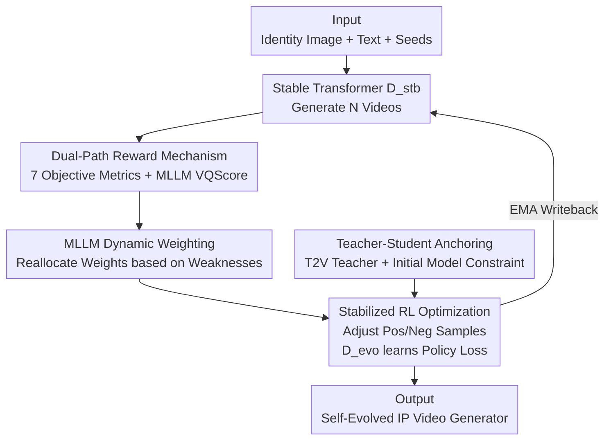

# EvoID: Reinforced Evolution for Identity-Preserving Video Generation

**Conference**: CVPR 2026  
**Paper**: [CVF Open Access](https://openaccess.thecvf.com/content/CVPR2026/html/Zhang_EvoID_Reinforced_Evolution_for_Identity-Preserving_Video_Generation_CVPR_2026_paper.html)  
**Code**: Undisclosed  
**Area**: Video Generation / Reinforcement Learning / Diffusion Models  
**Keywords**: Identity-Preserving Video Generation, Reinforcement Learning, Dual-Path Reward, Teacher-Student Framework, MLLM Dynamic Weighting

## TL;DR
EvoID reformulates "identity-preserving video generation" from imitation learning into a reinforcement learning-driven self-evolution process. By employing a dual-path reward system (objective metrics + MLLM global preference) as an internal evaluator and anchoring exploration with a frozen T2V teacher, the generative model actively balances identity fidelity, motion naturalness, and temporal consistency. It achieves a Total Score of 0.704 on the OpenS2V-Eval person domain, surpassing both the open-source VACE-14B (0.658) and the commercial Hailuo (0.653).

## Background & Motivation
**Background**: The goal of identity-preserving (IP) video generation is to generate a video of a subject performing new actions given one or more reference faces and a text prompt, while maintaining facial similarity. Current mainstream methods rely on imitation learning: attaching adapters or fine-tuning pretrained diffusion/DiT models using reconstruction losses (L1/L2/LPIPS) to learn a static mapping from "reference image + text" to "video frames."

**Limitations of Prior Work**: Reconstruction loss is a "static target" that only forces the output closer to a reference frame. It lacks a mechanism to actively balance high-level, human-centric quality dimensions: identity fidelity (similarity), motion naturalness (physical realism), and temporal consistency (stability). Consequently, models often fall into a "conservative equilibrium," resulting in the notorious **copy-paste effect**—where the face is accurate but the subject remains static or moves unnaturally, degrading the overall visual quality.

**Key Challenge**: The optimal balance between "strict identity preservation" and "allowing deformation for natural motion" varies dynamically depending on the input (different faces/prompts) and the training stage. A fixed loss function cannot navigate these state-dependent multi-objective trade-offs.

**Goal**: To develop a framework that dynamically decides which quality dimension to prioritize during training. This requires solving two key challenges in applying RL to IP video generation: (1) Designing a reward signal that accurately reflects multi-dimensional quality. (2) Ensuring the underlying generative capability and realism do not collapse while chasing rewards.

**Key Insight**: Reformulate the task as a sequential decision-making problem. Use RL to enable the generative model to "self-evolve," actively learning generation policies for multi-dimensional perceptual goals, thereby exceeding the upper bound of pretraining.

**Core Idea**: Replace static reconstructive imitation learning with self-evolving RL using "dual-path rewards (objective metrics + MLLM global preference) as internal evaluators + teacher-student anchoring to stabilize exploration."

## Method

### Overall Architecture
EvoID starts with a pretrained IP DiT model and clones its weights into two components: the **Stable Transformer** ($\mathcal{D}^{ip}_{\theta_{stb}}$, the stable anchor) and the **Evolving Transformer** ($\mathcal{D}^{ip}_{\theta_{evo}}$, the fast explorer). It also introduces a frozen T2V DiT as the **Prior Transformer** ($\mathcal{D}^{txt}$, the teacher). An evolution cycle proceeds as follows: the Stable Transformer generates a batch of videos using the same "identity image + text + multiple random seeds"; multiple reward models provide objective and preference scores; an MLLM analyzes the batch to output weights indicating which dimensions need improvement; these weights are fused into a unified reward; finally, the noisy videos are fed to all three networks, where the Explorer is updated via a "Reward-driven Policy Loss + Teacher Regularization Loss," while the Stable Transformer follows the Explorer via EMA.

The pipeline forms a closed loop of "Generation → Scoring → Dynamic Weighting → Evolutionary Update → EMA Update," as shown below:

### Key Designs

**1. Stabilized RL Optimization: Pulling Samples via "Evolution Direction"**

To address the inability of static losses to optimize multi-dimensional trade-offs, EvoID reformulates optimization as RL. For a condition $c_{ip}=\{c_{txt}, x_{id}\}$, the Stable Transformer first generates $N$ videos, each receiving a normalized reward $\mathcal{R}(x_0)\in[0,1]$. Adding noise to $x_0$ yields $x_t=(1-t)x_0+t\epsilon$. Both networks predict velocities $v_{stb}=\mathcal{D}^{ip}_{\theta_{stb}}(X)$ and $v_{evo}=\mathcal{D}^{ip}_{\theta_{evo}}(X)$. The difference $\Delta=v_{evo}-v_{stb}$ defines the Explorer's "evolution direction." For high-reward (positive) samples, the strategy moves along the evolution direction $v^+=v_{stb}+\beta\Delta$ to approach the target $v$; for low-reward samples, it moves in the opposite direction $v^-=v_{stb}-\beta\Delta$. The Policy Loss is:

$$\mathcal{L}_{policy}=\mathcal{R}(x_0)\|v^+-v\|_2^2+(1-\mathcal{R}(x_0))\|v^--v\|_2^2$$

Intuitively, this pushes the model toward high-reward directions and away from low-reward ones. $\theta_{evo}$ is updated via gradient descent, and $\theta_{stb}$ follows via EMA, providing a stable baseline for comparison.

**2. Teacher-Student Anchoring: T2V Teacher + Self-Constraint**

Optimizing solely for Policy Loss can lead to "reward hacking," where the model collapses its general generative capabilities (quality drift). EvoID uses a frozen T2V model $\mathcal{D}^{txt}$ sharing the same VAE space as a "teacher." An L2 alignment loss acts as a proxy for KL divergence, anchoring the student's velocity prediction to this robust "world prior":

$$\mathcal{L}_{t2v}=\|\mathcal{D}^{ip}_{\theta_{evo}}(x_t,t;c_{ip})-\mathcal{D}^{txt}(x_t,t;c_{txt})\|_2^2$$

Additionally, the initial IP model $\mathcal{D}^{ip}_{\theta_0}$ is used as a self-constraint to prevent the student from deviating too far from the original policy: $\mathcal{L}_{self}=\|\mathcal{D}^{ip}_{\theta_{evo}}(x_t,t;c_{ip})-\mathcal{D}^{ip}_{\theta_0}(x_t,t;c_{ip})\|_2^2$. The final objective is:

$$\mathcal{L}_{evo}=\mathcal{L}_{policy}+\lambda_{t2v}\mathcal{L}_{t2v}+\lambda_{self}\mathcal{L}_{self}$$

Policy Loss drives evolution, $\mathcal{L}_{t2v}$ anchors image quality, and $\mathcal{L}_{self}$ ensures stability (with $\lambda_{t2v}=0.01, \lambda_{self}=0.2$).

**3. Dual-Path Reward Mechanism: Objective Metrics + MLLM Preference (VQScore)**

Relying on a single vision model often fails to capture human preference; for instance, "copy-paste" results in high identity scores but unnatural physics. EvoID uses a complementary dual-path approach. Path one consists of **7 objective rewards**: ArcFace + CurricularFace for identity; GME for text consistency; and Aesthetic, Q-Align (temporal), Naturalness, and Optical Flow (motion range) for quality. Path two is the **MLLM Preference Reward (VQScore)**: an MLLM is provided with scoring criteria to evaluate visual realism, text consistency, identity, motion, and camera movement, generating a consolidated score as a proxy for human preference.

**4. MLLM-Guided Dynamic Weighting: Adaptive Redistribution**

Aggregating $K$ rewards is challenging due to competing objectives (e.g., large motion vs. identity fidelity). EvoID utilizes an MLLM as a conductor. The $K$ rewards are grouped ($G=3$: Identity / Text / Quality). Each reward has a prior weight $w^k_{prior}$. In each iteration, the MLLM outputs a 3D "attention" vector $S_v=\{s^g\}$ based on the generated videos. This is normalized with a smoothing factor $\tau$ as $p^g_{mllm}=(s^g+\tau)/\sum_{g'}(s^{g'}+\tau)$ and fused with the prior:

$$p^g_{blend}=(1-\gamma)\,p^g_{prior}+\gamma\,p^g_{mllm}$$

The weights are redistributed: $w^k_{final}=p^g_{blend}\cdot\big(w^k_{prior}/\sum_{k'\in G_g}w^{k'}_{prior}\big)$. This adaptively assigns higher weights to the model's current "weak dimensions."

### Loss & Training
The final loss is $\mathcal{L}_{evo}=\mathcal{L}_{policy}+0.01\,\mathcal{L}_{t2v}+0.2\,\mathcal{L}_{self}$. The base model is VACE-14B, the T2V teacher is Wan2.1-T2V-14B, and the evaluator is Qwen3-VL-30B-A3B-Instruct. LoRA (rank=32) is used for both the student and the anchor. Training involves 4 prompt pairs per step, 8 seeds each (32 videos total), using AdamW with a learning rate of 1e-4 for 200 evolution steps. Training takes ~36 hours on 36 H100 GPUs. Inference uses 20 denoising steps and CFG=5.0.

## Key Experimental Results

### Main Results
On the OpenS2V-Eval person domain (60 pairs), EvoID achieved the highest Total Score and EvoScore:

| Method | Type | FaceSim.↑ | Total Score↑ | EvoScore↑ |
|:---|:---|:---:|:---:|:---:|
| VACE-14B (Base) | Open-source | 0.647 | 0.658 | 0.544 |
| Phantom-14B | Open-source | 0.550 | 0.642 | 0.567 |
| Hailuo | Commercial | 0.577 | 0.653 | 0.588 |
| ViduQ2 | Commercial | 0.514 | 0.650 | 0.648 |
| **EvoID** | Ours | **0.745** | **0.704** | 0.682 |
| **EvoID†** (w/ EvoScore Reward) | Ours | 0.675 | 0.687 | **0.718** |

EvoID significantly improved the Total Score (0.658 to 0.704) over its base model. Adding EvoScore as an explicit reward (EvoID†) further boosted preference scores but slightly reduced Face Similarity, suggesting a move away from rigid copy-paste toward naturalness.

### Ablation Study
Ablation of objective reward (OR) components:

| Configuration | Total Score↑ | EvoScore↑ |
|:---|:---:|:---:|
| Base VACE-14B | 0.658 | 0.544 |
| + Uniform Reward Weights (UWR) | 0.685 | 0.627 |
| + UWR + T2V Teacher (TP) | 0.706 | 0.663 |
| + Prior Weighted Rewards (PWR) + TP | 0.715 | 0.664 |

Ablation of the dual-path mechanism (on top of PWR+TP):

| OR | + Preference (PR) | + Dynamic Weighting (MDW) | + EvoScore Reward (ESR) | Total Score↑ | EvoScore↑ |
|:---:|:---:|:---:|:---:|:---:|:---:|
| ✓ | | | | 0.715 | 0.664 |
| ✓ | ✓ | | | 0.685 | 0.675 |
| ✓ | ✓ | ✓ | | 0.704 | 0.682 |
| ✓ | ✓ | ✓ | ✓ | 0.687 | 0.718 |

### Key Findings
- **RL as a Primary Gain Source**: Switching from imitation learning to RL with uniform weights already improves the Total Score significantly.
- **Trade-off between Total Score and Preference**: Objective rewards maximize quantitative scores, while preference rewards (PR) shift the model toward human-preferred naturalness at the cost of slight metric drops.
- **Dynamic Weighting effectively targets weaknesses**: Weighting for identity vs. motion shifts over training steps, confirming the MLLM's role in focusing on the current weakest link.

## Highlights & Insights
- **Reformulating IP Generation as RL Evolution**: Moving beyond static mappings to allow the model to navigate multi-dimensional quality trade-offs effectively tackles the copy-paste effect.
- **Dual-Path Reward Synergy**: Combining fine-grained objective metrics with holistic MLLM preference suppresses "metric-high but perception-low" samples without needing custom-trained reward models.
- **MLLM as a Dynamic "Judge"**: Using an MLLM to supervise weights turns multi-objective reward aggregation into an adaptive process.
- **Practical Stability Engineering**: The trio of EMA anchors, T2V teachers, and self-constraints keeps RL training stable with manageable overhead.

## Limitations & Future Work
- Small training data scale (291 faces) and limited evaluation domain (person-only).
- Heavy reliance on the MLLM (Qwen3-VL-30B) for reward signals; robustness under weaker MLLMs remains unverified.
- A structural trade-off exists between Total Score (identity-heavy) and EvoScore (preference-heavy).
- Still lags slightly behind commercial systems like ViduQ2 in pure video quality, likely due to a lack of proprietary post-processing.

## Related Work & Insights
- **Comparison with Imitation Learning (ConsisID / VACE)**: These models use reconstruction loss and are prone to copy-paste. EvoID achieves a significant boost (0.658 to 0.704) on the same base model by switching to self-evolving RL.
- **Comparison with Identity-GRPO**: Unlike GRPO methods that require training dedicated reward models on preference data, EvoID uses off-the-shelf models and teacher-student regularization.

## Rating
- Novelty: ⭐⭐⭐⭐⭐ (RL for IP video evolution; dynamic weighting via MLLM).
- Experimental Thoroughness: ⭐⭐⭐⭐ (Competitive baselines and blind tests, but limited to person domain).
- Writing Quality: ⭐⭐⭐⭐ (Logical flow and clear formulation).
- Value: ⭐⭐⭐⭐⭐ (Provides a transferable preference-alignment paradigm for controllable generation).

<!-- RELATED:START -->

## Related Papers

- [\[CVPR 2026\] Identity-Preserving Image-to-Video Generation via Reward-Guided Optimization](identity-preserving_image-to-video_generation_via_reward-guided_optimization.md)
- [\[CVPR 2026\] ConsID-Gen: View-Consistent and Identity-Preserving Image-to-Video Generation](consid-gen_view-consistent_and_identity-preserving_image-to-video_generation.md)
- [\[CVPR 2026\] PLACID: Identity-Preserving Multi-Object Compositing via Video Diffusion with Synthetic Trajectories](placid_identity-preserving_multi-object_compositing_via_video_diffusion_with_syn.md)
- [\[CVPR 2025\] Identity-Preserving Text-to-Video Generation by Frequency Decomposition](../../CVPR2025/video_generation/identity-preserving_text-to-video_generation_by_frequency_decomposition.md)
- [\[CVPR 2026\] Stand-In: A Lightweight and Plug-and-Play Identity Control for Video Generation](stand-in_a_lightweight_and_plug-and-play_identity_control_for_video_generation.md)

<!-- RELATED:END -->
