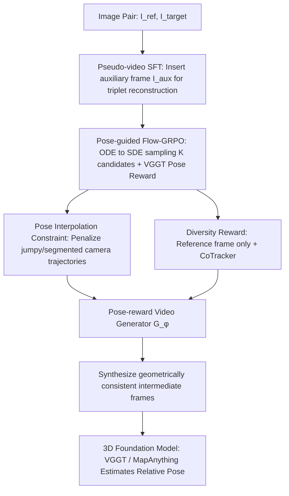

# ExPose: Reinforcing Video Generation Models for Extreme Pose Estimation

**Conference**: CVPR 2026  
**Paper**: [CVF Open Access](https://openaccess.thecvf.com/content/CVPR2026/html/Yoon_ExPose_Reinforcing_Video_Generation_Models_for_Extreme_Pose_Estimation_CVPR_2026_paper.html)  
**Code**: https://github.com/yh-yoon/ExPose  
**Area**: Video Generation / 3D Vision  
**Keywords**: Extreme Viewpoint Pose Estimation, Video Generation, Flow-GRPO, 3D Foundation Models, Intermediate Frame Interpolation  

## TL;DR
Direct relative pose estimation often fails when two images have extreme viewpoint differences and minimal overlap; ExPose fine-tunes a video generation model using GRPO reinforcement learning into a "pose-reward-driven" generator. This allows it to interpolate **geometrically consistent** intermediate frames between the two views, which are then processed by 3D foundation models like VGGT or MapAnything to significantly improve pose estimation accuracy (e.g., DL3DV AUC 48.1 $\to$ 53.6).

## Background & Motivation

**Background**: Relative camera pose estimation is a cornerstone for SfM, SLAM, and 3D reconstruction. Traditional methods rely on pixel-level feature correspondence to optimize reprojection errors, performing well with sufficient overlap. Recent 3D foundation models (VGGT, MapAnything, etc.) utilize feed-forward networks for direct geometry and pose regression, partially relaxing the rigid requirement for "sufficient overlap."

**Limitations of Prior Work**: When the input image pair has **minimal visual overlap and extreme viewpoint changes** (extreme baseline), traditional optimization methods collapse catastrophically. 3D foundation models also struggle due to a reliance on point-level supervision and a lack of contextual understanding of the real 3D scene. A natural remedy is to use video generation models to **interpolate intermediate frames**, providing additional observational cues—much like how humans infer reasonable layouts from sparse views using contextual priors.

**Key Challenge**: The primary training objective of video generation models is "visual realism and temporal smoothness," lacking **explicit 3D geometric awareness**. Consequently, generated intermediate frames are often "temporally smooth but spatially inconsistent"—visually fluid but featuring implausible camera trajectories. Consequently, downstream pose estimation becomes a **matter of chance**, requiring repeated sampling and manual selection of occasionally self-consistent videos, which is neither stable nor controllable.

**Goal**: Align video generation models during intermediate frame synthesis such that "generation quality" and "3D consistency" are optimized for the actual downstream task of pose estimation, rather than just aesthetics.

**Key Insight**: Treat the downstream 3D foundation model (VGGT) as a **geometry-aware rewarder** that scores candidate videos based on the magnitude of the pose error. The otherwise difficult-to-supervise objective of "geometric consistency" is converted into an optimizable scalar reward suitable for reinforcement learning.

**Core Idea**: Use Group Relative Policy Optimization (GRPO) to fine-tune a video generation model, where the reward signal is derived from the pose accuracy provided by a 3D foundation model. This encourages the generator to produce geometrically consistent intermediate frames benefitial for pose estimation **without requiring any 3D ground-truth supervision**.

## Method

### Overall Architecture

ExPose addresses the following problem: given a reference image $I_{ref}$ and a target image $I_{target}$ with extreme viewpoints, estimate the relative pose $(\hat R, \hat t) = F_\theta(I_{ref}, I_{target})$. Since direct two-view inference likely fails, it utilizes a video generator $G_\phi$ to fill in intermediate frames, converting sparse observations into a dense sequence for a fixed 3D pose estimator $F_\theta$. The training tunes $G_\phi$ into a "pose-reward-optimized" generator via three complementary components.

The training pipeline consists of: **Pseudo-video supervised fine-tuning** for initialization (inserting an auxiliary frame $I_{aux}$ to construct triplets for reconstruction supervision); **Pose-guided Flow-GRPO online reinforcement learning**, which converts deterministic rectified-flow sampling into stochastic sampling to produce candidate sets for relative preference updates; **Pose Interpolation Constraint** to penalize jumpy trajectories; and a **Diversity Reward** to encourage the exploration of different camera paths. During inference, only $\{I_{ref}, I_{target}\}$ are required.

### Key Designs

**1. Pseudo-video Supervised Fine-tuning: Establishing a physically plausible baseline**

Generating intermediate frames from only two frames often leads to discontinuous content. ExPose introduces an auxiliary frame $I_{aux}$ from the DL3DV dataset during training that has meaningful overlap with both endpoints. $I_{aux}$ is selected via sub-sampling based on which candidate maximizes downstream pose accuracy. A pre-trained generator produces $N$ frames of pseudo-video $V(I_{ref}, I_{aux}, I_{target})$ as the target, while the model $G_\phi$ aligns to it using only the two views:

$$\mathcal{L}_{SFT} = \frac{1}{N}\sum_{n=1}^{N}\left\|\hat V^{(n)}(I_{ref}, I_{target}) - V^{(n)}(I_{ref}, I_{aux}, I_{target})\right\|_1$$

The auxiliary frame acts as an "anchor," suppressing mutations and providing a geometrically sound initialization for RL.

**2. Pose-guided Flow-GRPO: Converting downstream pose error into optimizable reward**

SFT alone does not optimize the final goal of pose accuracy. ExPose utilizes online RL with VGGT as the rewarder.

First, the backbone LTX-Video is a rectified-flow (RF) model, which is **deterministic**. To generate diverse candidates for GRPO, the deterministic ODE update $dx_t = v_\phi(x_t, t)\,dt$ is rewritten as an **SDE update** that preserves the marginal distribution:

$$x_{t+\Delta t} = x_t + D_\phi(x_t, t)\,\Delta t + \sigma_t\sqrt{\Delta t}\,\varepsilon$$

Second, the reward calculation: VGGT estimates $(\hat R_i, \hat t_i)$ for each candidate $i$. Comparing these with ground-truth rotation $R^\star$ and unit translation $u^\star$, a compact scale-invariant reward is defined:

$$r_{\text{pose},i} = -\lambda_{rot}\, d_{SO(3)}(\hat R_i, R^\star) - \arccos\!\left(\tilde t_i^\top u^\star\right)$$

Group-relative preference updates are performed using the GRPO strategy:

$$\mathcal{L}_{GRPO} = -\sum_{groups}\sum_{(i\succ j)}\log\sigma\!\left(\beta(s_i - s_j)\right) + \mathcal{L}_{KL}$$

**3. Pose Interpolation Constraint (PIC): Enforcing continuous camera trajectories**

Candidate videos might align at the endpoints but contain jumpy, disjointed camera trajectories. PIC is a geometric regularizer measuring the equidistance of the camera center $c_m$ of the middle frame to the start $c_1$ and end $c_T$:

$$r_{pic} = -\lambda_{pic}\cdot\frac{\bigl|\,d(c_m, c_1) - d(c_T, c_m)\,\bigr|}{D + \varepsilon}$$

This reward penalizes fragmented trajectories and stabilizes translation estimation.

**4. Diversity Reward: Compelling the policy to explore different camera paths**

Pure noise injection often collapses into similar trajectories. ExPose removes the target frame from the conditioning set during early sampling stages, allowing the generator to diverge. Points are tracked via CoTracker to quantify displacement $r^{(b)}(n)$, and the diversity reward is calculated based on the average distance between differing video candidates:

$$r_{div}(i) = \lambda_{div}\cdot\frac{1}{B-1}\sum_{j\ne i} D_{ij}$$

### Loss & Training

The total training objective combines the supervised signal with geometric preferences:

$$\mathcal{L} = \mathcal{L}_{GRPO} + \lambda_{SFT}\,\mathcal{L}_{SFT}$$

The architecture uses LTX-Video (rectified-flow) as the backbone and VGGT as the pose rewarder. No 3D ground-truth supervision is required for the pose estimator itself during this stage.

## Key Experimental Results

### Main Results

Comparison on DL3DV with VGGT as the estimator (extreme viewing angles and low overlap):

| Method | MRE↓ | MTE↓ | R@5°↑ | T@5°↑ | AUC↑ |
| :--- | :--- | :--- | :--- | :--- | :--- |
| VGGT (No Generation) | 54.28 | 29.08 | 50.00 | 27.33 | 39.79 |
| Aether | 43.05 | 25.44 | 47.33 | 32.33 | 42.63 |
| LTX-Video (Backbone) | 44.13 | 24.32 | 54.33 | 37.00 | 46.88 |
| InterPose | 45.22 | 23.51 | 56.33 | 37.00 | 48.13 |
| **ExPose (Ours)** | **33.78** | **20.50** | **60.67** | **42.67** | **53.64** |

ExPose achieves SOTA across every metric on DL3DV. Gains are consistent across different estimators (MapAnything) and datasets (NAVI, ScanNet, Cambridge Landmarks).

### Ablation Study

Incremental component impact (DL3DV + LTX-Video + VGGT):

| Configuration | MRE↓ | MTE↓ | R@15°↑ | AUC↑ | Note |
| :--- | :--- | :--- | :--- | :--- | :--- |
| Video only | 44.13 | 24.32 | 66.33 | 46.88 | Backbone generation |
| + SFT | 35.48 | 21.67 | 72.67 | 51.84 | Major MRE reduction |
| + GRPO | 34.41 | 21.35 | 73.67 | 52.84 | Improves rotation accuracy |
| + PIC | 35.51 | 20.72 | 73.00 | 53.31 | Primarily reduces MTE |
| + Div (Full) | 33.78 | 20.50 | 73.67 | 53.64 | Best overall performance |

### Key Findings
- **SFT provides the foundation**: Adding SFT reduces MRE significantly, proving that a geometrically plausible initialization is necessary before RL.
- **PIC stabilizes translation**: PIC specializes in reducing translation directional error (MTE) by ensuring smooth camera centers.
- **Robustness across estimators**: Performance gains are consistent regardless of whether VGGT or MapAnything is used as the downstream model.

## Highlights & Insights
- **Conversion of Geometry to Reward**: Converting "geometric consistency" into a scalar reward via foundation models bypasses the need for explicit 3D supervision.
- **ODE to SDE for Flow-GRPO**: The SDE sampling modification is a critical engineering bridge that allows rectified-flow models to participate in preference-based RL.
- **Diversity through Conditioning**: The "removing target frame" trick for exploration is a simple yet effective way to prevent trajectory collapse in reinforcement learning.

## Limitations & Future Work
- The quality of the pseudo-video depends on the selection of $I_{aux}$.
- The reward signal is limited by the accuracy of the rewarder (VGGT); error propagation from the rewarder remains a potential bottleneck.
- The two-stage pipeline is computationally heavier than direct end-to-end models due to the inference cost of video generation.

## Related Work & Insights
- **vs InterPose**: InterPose uses test-time scaling (sampling multiple videos and selecting the best). ExPose trains the generator itself to favor consistent geometry, outperforming InterPose's AUC (53.64 vs 48.13).
- **vs Video Models**: Models like LTX-Video or DynamiCrafter target "visual realism," resulting in "pretty but geometrically incorrect" frames. ExPose proves that aligning generation with pose objectives is the differentiator.

## Rating
- Novelty: ⭐⭐⭐⭐⭐ 
- Experimental Thoroughness: ⭐⭐⭐⭐ 
- Writing Quality: ⭐⭐⭐⭐ 
- Value: ⭐⭐⭐⭐ 

<!-- RELATED:START -->

## Related Papers

- [\[NeurIPS 2025\] PoseCrafter: Extreme Pose Estimation with Hybrid Video Synthesis](../../NeurIPS2025/video_generation/posecrafter_extreme_pose_estimation_with_hybrid_video_synthesis.md)
- [\[CVPR 2026\] BulletTime: Decoupled Control of Time and Camera Pose for Video Generation](bullettime_decoupled_control_of_time_and_camera_pose_for_video_generation.md)
- [\[CVPR 2026\] PoseAnything: General Pose-guided Video Generation with Part-aware Temporal Coherence](poseanything_general_pose-guided_video_generation_with_part-aware_temporal_coher.md)
- [\[CVPR 2026\] PAM: A Pose-Appearance-Motion Engine for Sim-to-Real HOI Video Generation](pam_a_pose-appearance-motion_engine_for_sim-to-real_hoi_video_generation.md)
- [\[ICML 2026\] World-R1: Reinforcing 3D Constraints for Text-to-Video Generation](../../ICML2026/video_generation/world-r1_reinforcing_3d_constraints_for_text-to-video_generation.md)

<!-- RELATED:END -->
