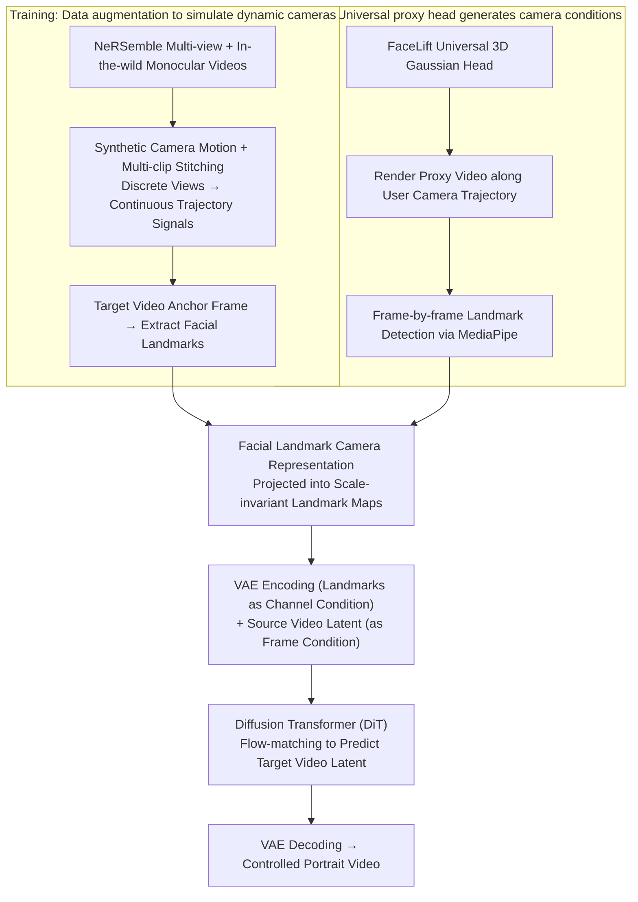

# FaceCam: Portrait Video Camera Control via Scale-Aware Conditioning

**Conference**: CVPR 2025  
**arXiv**: [2503.05506](https://arxiv.org/abs/2603.05506)  
**Code**: [Available](https://weijielyu.github.io/FaceCam)  
**Area**: Video Generation
**Keywords**: Camera Control, Portrait Video Generation, Scale-Aware, Facial Landmarks, Video Diffusion Model

## TL;DR

The FaceCam system is proposed to address camera control in monocular portrait videos by using facial landmarks as a scale-aware camera representation. This approach avoids the scale ambiguity inherent in traditional extrinsic camera representations. Additionally, two data augmentation strategies—synthetic camera motion and multi-clip stitching—are designed to support continuous camera trajectory inference.

## Background & Motivation

Camera motion control is a central issue in controllable video generation, particularly critical in portrait videos for social media, post-production, and AR/VR. Existing methods face two core challenges:

**Challenge 1: Scale Ambiguity**
- **Scene-agnostic parameter representations** (e.g., Plücker rays, extrinsic matrices): The same parameter change can produce drastically different visual effects in scenes of different scales.
- Monocular videos cannot determine absolute depth; the scene is determined only up to a global similarity transformation (unknown scale and translation).
- Mathematically: For any $\alpha > 0$, letting $\mathbf{x}' = \alpha\mathbf{x}$ and $\mathbf{t}' = \alpha\mathbf{t}$ leaves the perspective projection invariant.

**Challenge 2: Training Data**
- It is extremely difficult to obtain paired videos of the same dynamic portrait scene under different camera trajectories.
- Synthetic 3D dynamic portrait data often lacks realism.

**Core Motivation**: There is a need for a camera representation that does not expose unobservable global scales, while generalizing from limited static multi-view data to continuous camera trajectories.

## Method

### Overall Architecture

FaceCam aims to solve the following: given a monocular portrait video, allow the user to specify arbitrary camera movements (zoom, pan, orbital rotation) and generate a corresponding new video while maintaining the person's identity. The pipeline bypasses the traditional approach of using "camera extrinsics as direct conditions" and instead uses a **facial landmark projection map** as the camera command. During training, this map is derived from annotations in real multi-view data; during inference, it is rendered from a universal proxy head.

In the training phase, three signals are fed into a Diffusion Transformer: the source video, the target video, and facial landmarks extracted from the target video's anchor frame. Each is encoded into a latent space via a VAE. The model learns to predict the target video latent from the source video latent and the landmark condition using a flow-matching loss. In the inference phase, a different method is used for landmark generation: first, FaceLift creates an identity-agnostic universal 3D Gaussian head (shared across all experiments), which is rendered along the user-specified trajectory. Facial landmarks are then detected frame-by-frame via MediaPipe to produce the landmark map used as the camera condition.

### Key Designs

**1. Facial Landmarks as Scale-Aware Camera Representation: Bypassing Monocular Scale Ambiguity via Image-Space Point Correspondences**

Scene-agnostic representations like Plücker rays or extrinsic matrices expose unobservable global scales. FaceCam addresses this based on classical multi-view geometry: point correspondences in image space are sufficient to characterize relative camera motion. Given 7 or more 2D correspondences, the Fundamental matrix $F$ can be estimated, subsequently recovering the Essential matrix $E = \mathbf{K}^\top F \mathbf{K}$ and the relative pose $[\mathbf{R}|\mathbf{t}]$ (up to a global scale). Instead of feeding camera parameters, the model extracts 3D positions $\mathbf{X} = \{\mathbf{x}_k\}_{k=1}^m$ of $m$ facial landmarks in an anchor frame, projects them into 2D pixel coordinates $\mathbf{U} = \{\mathbf{u}_k\}_{k=1}^m$ based on the target pose, and rasterizes these points into an image-space landmark map.

This representation is inherently scale-invariant: if 3D landmarks and translation are scaled simultaneously ($\mathbf{x}_k' = s\mathbf{x}_k$, $\mathbf{t}' = s\mathbf{t}$), the 2D projection remains unchanged:

$$\mathbf{u}_k' = \mathcal{N}(\mathbf{K}(\mathbf{R}\mathbf{x}_k' + \mathbf{t}')) = \mathcal{N}(\mathbf{K}s(\mathbf{R}\mathbf{x}_k + \mathbf{t})) = \mathbf{u}_k$$

Consequently, the conditions seen by the model do not contain the ambiguous global scale. Conversely, given 3D landmarks and 2D projections, a PnP solver can recover the camera rotation and translation (up to a scale), making the landmark map and camera pose information one-to-one.

**2. Data Generation Strategy: Crafting Continuous Trajectory Signals from Static Multi-View Data**

Paired videos of dynamic portraits across different trajectories are nearly impossible to collect. FaceCam utilizes NeRSemble (425 subjects, 16 views, ~9.4K videos) and ~800 in-the-wild monocular videos, using data augmentation to create "dynamic camera" signals:

| Strategy | Method | Problem Solved |
|------|------|----------|
| Scale + Color Augmentation | Random scaling [0.75, 1.25], foreground segmentation + random background colors | Increases data diversity |
| Synthetic Camera Motion | Simulation of zoom (interpolation) and pan (crop offsets) | Introduces dynamic camera effects (parallel motion only) |
| Multi-clip Stitching | Concatenating 1-4 segments from different camera positions | Introduces camera rotation (discrete pose changes) |
| In-the-wild Data | Applying synthetic camera motion to monocular videos | Mitigates overfitting to studio lighting |

While synthetic motion only generates parallel movements like zoom/pan, actual rotations are handled through multi-clip stitching. A key empirical finding is that the model learns to **generalize to continuous trajectories** despite only seeing discrete pose jumps during training.

**3. Inference Pipeline: Translating Camera Trajectories into Landmark Conditions via a Proxy Head**

At inference time, the user provides a monocular video and a desired trajectory. Rather than performing 3D reconstruction for each input, FaceCam decouples condition generation from the input video. It uses a 3D Gaussian head created by FaceLift as a universal proxy. This proxy is rendered along the target trajectory to produce a proxy video, from which facial landmarks are detected frame-by-frame. Since the landmark map encodes camera pose and scale rather than the specific facial structure of the generated subject, the proxy's identity does not affect the final result.

### Loss & Training

The training is built on the Wan open-source video base model using a flow-matching loss. Source video latents are concatenated with noise latents as frame conditions, while camera condition latents are injected as channel conditions. Only the 3D attention layers and projection layers are fine-tuned. The model is trained on 24 NVIDIA A100 GPUs for 3K steps with a learning rate of 5e-5 and a batch size of 24.

## Key Experimental Results

### Main Results

**Table 1: Evaluation on Static Cameras (Ava-256 Dataset)**

| Method | PSNR↑ | SSIM↑ | LPIPS↓ | ArcFace↑ |
|------|-------|-------|--------|----------|
| ReCamMaster | 9.73 | 0.557 | 0.581 | 0.701 |
| TrajectoryCrafter | 10.32 | 0.546 | 0.567 | 0.522 |
| FaceCam* (Proxy) | 9.83 | 0.582 | 0.549 | 0.807 |
| **Ours** | **15.85** | **0.721** | **0.252** | **0.857** |

**Table 2: Evaluation on In-the-wild Videos with Dynamic Cameras (100 videos, 10 motions)**

| Method | Camera Acc. | ArcFace | Quality | Aesthetic | Subject Consist. | Background Consist. |
|------|-----------|---------|------|------|-----------|-----------|
| ReCamMaster | 83% | 78.92 | 69.05 | 55.85 | 93.26 | 93.02 |
| TrajectoryCrafter | 99% | 49.79 | 71.37 | 55.76 | 92.23 | 92.25 |
| Ours (No Wild) | **100%** | 77.73 | 70.71 | 55.73 | **94.52** | **95.16** |
| **Ours** | 97% | **83.94** | **73.49** | **59.91** | 94.77 | 94.98 |

### Ablation Study

**Training Data Ablation** (Table 2, last two rows):
- Training only on NeRSemble yields nearly perfect camera control (100%) but lower identity preservation (77.73) and quality (70.71).
- Adding in-the-wild videos significantly improves identity preservation (83.94) and quality (73.49), with a minor sacrifice in camera accuracy (97%).

### Key Findings

1. Ours significantly leads in PSNR (15.85 vs 10.32), indicating that scale-aware representations are crucial for precise camera control.
2. ReCamMaster fails during large angular changes (scale ambiguity causes the head to move out of frame).
3. TrajectoryCrafter suffers from facial distortion due to errors in dynamic point cloud estimation (ArcFace only 0.522).
4. Facial landmark conditions encode camera pose and scale decoupled from head motion, rather than just face position.
5. Generalization from discrete camera changes in training to continuous trajectories in inference is a major empirical finding.

## Highlights & Insights

1. **Theoretical Foundation**: Camera representation is derived from multi-view geometry principles, ensuring mathematical scale invariance.
2. **Practical Pipeline**: Uses a universal 3D proxy head to render target trajectories, eliminating the need for per-video 3D reconstruction.
3. **Data Efficiency**: Achieves SOTA using only ~9.1K videos and 3K steps, significantly less than typical requirements.
4. **Stitching Generalization**: The unexpected ability of the model to generalize from discrete pose jumps to continuous motion is a key insight.

## Limitations & Future Work

1. Success depends on the robustness of facial landmark detection; performance may degrade in extreme profiles or heavily occluded scenes.
2. The universal proxy head ignores individual differences in head shapes.
3. Validation is currently limited to single-person scenes; multi-person control remains unexplored.
4. Currently restricted to portrait videos; cannot be directly extended to general scene camera control.

## Related Work & Insights

- **Vs. ReCamMaster**: ReCamMaster uses scene-agnostic extrinsic conditions; FaceCam uses scene-aware landmark representations.
- **Vs. TrajectoryCrafter**: The latter relies on dynamic point cloud reconstruction, where geometric errors result in facial distortion.
- **Inspiration**: Using facial landmarks as a proxy for geometric correspondence can be extended to other areas with stable keypoints, such as hands or full human bodies.

## Rating

- Novelty: ⭐⭐⭐⭐⭐ 
- Experimental Thoroughness: ⭐⭐⭐⭐ 
- Writing Quality: ⭐⭐⭐⭐⭐ 
- Value: ⭐⭐⭐⭐⭐ 

<!-- RELATED:START -->

## Related Papers

- [\[CVPR 2026\] PhysVid: Physics Aware Local Conditioning for Generative Video](physvid_physics_aware_local_conditioning_for_generative_video_models.md)
- [\[CVPR 2026\] SymphoMotion: Joint Control of Camera Motion and Object Dynamics for Coherent Video Generation](symphomotion_joint_control_of_camera_motion_and_object_dynamics_for_coherent_vid.md)
- [\[CVPR 2026\] BulletTime: Decoupled Control of Time and Camera Pose for Video Generation](bullettime_decoupled_control_of_time_and_camera_pose_for_video_generation.md)
- [\[ICLR 2026\] Light-X: Generative 4D Video Rendering with Camera and Illumination Control](../../ICLR2026/video_generation/light-x_generative_4d_video_rendering_with_camera_and_illumination_control.md)
- [\[CVPR 2025\] HunyuanPortrait: Implicit Condition Control for Enhanced Portrait Animation](../../CVPR2025/video_generation/hunyuanportrait_implicit_condition_control_for_enhanced_portrait_animation.md)

<!-- RELATED:END -->
