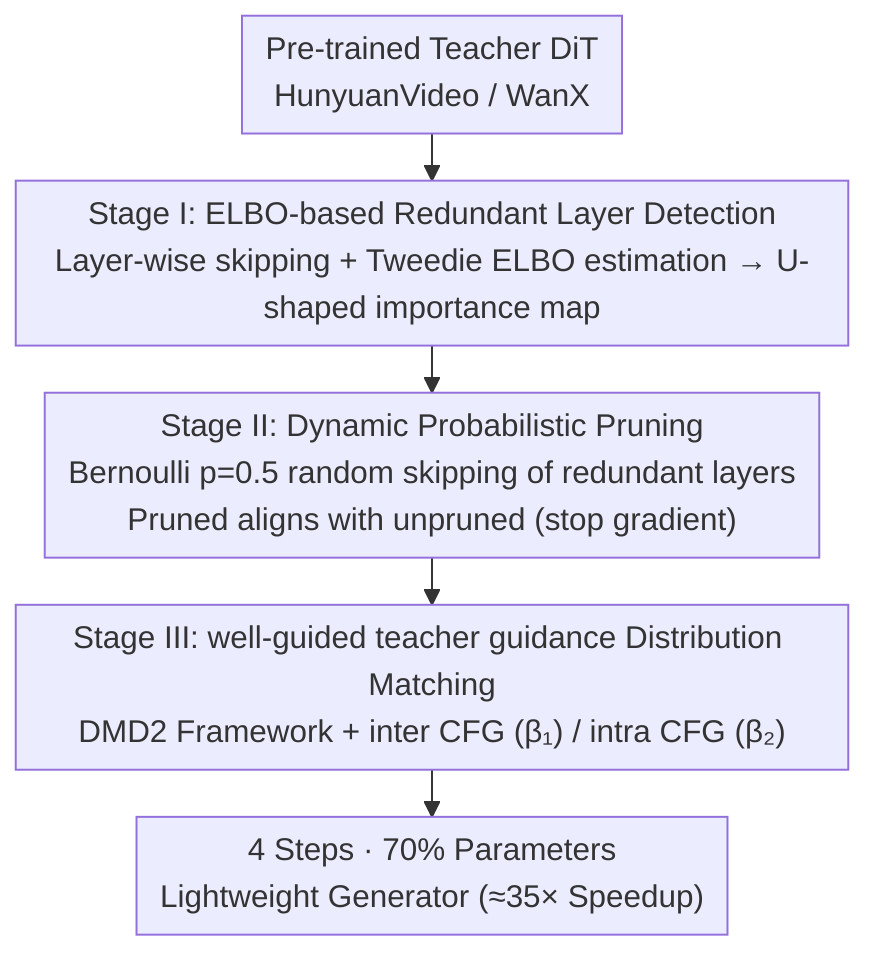

# FastLightGen: Fast and Light Video Generation with Fewer Steps and Parameters

**Conference**: CVPR 2026  
**arXiv**: [2603.01685](https://arxiv.org/abs/2603.01685)  
**Code**: None  
**Area**: Video Generation  
**Keywords**: Video generation acceleration, Step distillation, Model pruning, Distribution matching, DiT compression

## TL;DR

FastLightGen proposes a three-stage distillation algorithm that achieves joint distillation of sampling steps and model size for the first time. By identifying redundant layers, employing dynamic probabilistic pruning, and using well-guided teacher guidance distribution matching, it compresses HunyuanVideo/WanX into a lightweight generator with 4 steps and 30% parameter pruning, achieving approximately 35x speedup while outperforming the teacher model.

## Background & Motivation

**Background**: Large-scale video generation models (e.g., HunyuanVideo, WanX) are based on DiT, containing 13B+ parameters and requiring multi-step denoising. Generating a 5-second video takes approximately 20 minutes on an H100.

**Core Problem**: 
   - Existing acceleration methods focus either on reducing steps (LCM/DMD) or parameters (F3-Pruning/ICMD), lacking joint optimization.
   - Extreme step distillation (1-2 steps) leads to a sharp decline in performance.
   - Joint distillation can provide greater acceleration under identical performance (4 steps with 50% parameters = 50x vs. pure step reduction to 3 steps = 33.3x).

**Ours**: A three-stage pipeline involving redundant layer identification, dynamic probabilistic pruning, and well-guided teacher guidance distribution matching.

## Method

### Overall Architecture

FastLightGen seeks to simultaneously reduce sampling steps and model parameters, compressing a 13B parameter, multi-step video DiT into a 4-step generator with only 70% of the parameters without compromising quality. Instead of treating "step reduction" and "parameter reduction" as separate sequential tasks, it designs a three-stage distillation pipeline for joint convergence. Stage I identifies redundant DiT blocks. Stage II employs "probabilistic layer skipping" to train the model into a robust form capable of functioning at various depths. Stage III uses distribution matching to align this pruned, few-step student with the teacher's output distribution. The input across all stages remains the same pre-trained teacher (HunyuanVideo / WanX), resulting in a fast and compact few-step generator.

### Key Designs

**1. Stage I — Detecting Redundant Layers via ELBO: Finding blocks to prune instead of blind clipping.**

For joint parameter pruning, the first step is identifying which parts can be removed with minimal impact. FastLightGen temporarily skips each DiT block individually and uses the Tweedie formula to derive an ELBO estimate from single-step denoising results. This measures how much generation quality drops without that specific block. A lower drop indicates higher redundancy. This process generates an importance map showing a distinct **U-shaped pattern**: initial layers (near input) and final layers (near output) are critical, while middle layers are mostly redundant. For hybrid structures like HunyuanVideo, double blocks are more essential than single blocks. This layer-wise probing quantifies safety for pruning rather than relying on empirical ratios.

**2. Stage II — Dynamic Probabilistic Pruning: Training a single model robust to depth.**

After identifying layers, the challenge is maintaining model functionality after removal. Direct pruning followed by fine-tuning yields a model valid only for one specific configuration. FastLightGen utilizes randomized training: layers marked as unimportant in Stage I are skipped at each step based on a Bernoulli distribution ($p=0.5$). Consequently, shared weights generate both "unpruned" and "pruned" outputs in a single forward pass. The training objective aligns pruned outputs with unpruned outputs using a stop-gradient on the latter, treating the full model as an internal teacher that improves alongside the student.

$$\mathcal{L}_{\text{II}} = \alpha \cdot \|f_{\text{pruned}} - \text{sg}(f_{\text{unpruned}})\|^2 + (1-\alpha)\cdot \mathcal{L}_{\text{GT}}$$

The parameter $\alpha$ balances distillation and original ground truth (GT) supervision. Experiments show that $\alpha=1$ (using only distillation) performs best, as "soft" targets from the full model are more conducive to learning for pruned models than "hard" GT supervision. This creates a model robust to depth that functions stably across various retention ratios during deployment.

**3. Stage III — well-guided teacher guidance: Distribution matching with appropriate teacher intensity.**

Final alignment of the few-step pruned student with the teacher utilizes a modified DMD2 distribution matching framework. FastLightGen introduces well-guided teacher guidance: the DiT acting as the real distribution reference considers both pruned and unpruned outputs, decoupling two orthogonal guidance strengths—$\beta_1$ (inter CFG) for standard text-conditional guidance and $\beta_2$ (intra CFG) for the influence of the unpruned output over the pruned output. These coefficients are randomly sampled during training to ensure the student adapts to varying intensities. This avoids two failure modes: if guidance is too weak, the teacher provides insufficient gradients; if too strong, the student cannot converge to the distant teacher distribution. By optimizing $\beta_2$ for unpruned $\to$ pruned guidance, the student captures details from the full model without overextending.

### Loss & Training

- Stage II: 16x H100, lr=1e-5, 4000 iter, ~64 GPU days.
- Stage III: lr=5e-7, 1000 iter, ~16 GPU days.
- Optimal configuration: $(\alpha, \beta_1, \beta_2) = (1, 3.5, 0.25)$ for WanX.
- Excessively long training should be avoided to prevent exaggerated motion or oversaturation.

## Key Experimental Results

### Main Results

**VBench-I2V Comparison (WanX-TI2V, Table 2)**:

| Method | motion smooth | dynamic deg | aesthetic | imaging | average | time |
|------|-------------|------------|-----------|---------|---------|------|
| Euler (teacher) | 0.982 | 0.461 | 0.653 | 0.711 | 0.790 | 885s |
| DMD2 | 0.977 | 0.160 | 0.583 | 0.683 | 0.716 | 35.4s |
| LCM | 0.979 | 0.003 | 0.570 | 0.665 | 0.684 | 35.4s |
| MagicDistillation | 0.980 | 0.561 | 0.634 | 0.701 | 0.798 | 35.4s |
| **FastLightGen** | **0.983** | 0.500 | **0.656** | **0.717** | 0.794 | **28.3s** |

**Comparison with Open Source VDMs (Table 1)**:

| Method | average |
|------|---------|
| CogVideoX-I2V | 0.759 |
| SVD-XT-1.0 | 0.789 |
| WanX-TI2V (teacher) | 0.790 |
| **FastLightGen** | **0.794** |

### Ablation Study

**Distillation Weight Ablation (Table 4)**:

| distill weight alpha | average |
|---------------------|---------|
| 0.0 | 0.780 |
| 0.5 | 0.780 |
| 0.7 | 0.788 |
| **1.0** | **0.791** |

**Intra CFG Ablation (Table 5, beta_1=3.5)**:

| beta_2 | dynamic deg | average |
|--------|------------|---------|
| 0.00 | 0.459 | 0.812 |
| **0.25** | 0.500 | **0.820** |
| 0.75 | 1.000 | 0.848 (jitter present) |

### Key Findings

- The 4-step + 30% pruning (70% parameter retention) configuration offers the best cost-performance ratio, yielding ~35.71x acceleration.
- Joint distillation achieves higher speedup than single-dimension distillation at equivalent performance levels (50x vs. 33.3x).
- Pure distillation ($\alpha=1$) is optimal for Stage II.
- Aesthetic and imaging quality exceed those of the teacher model.

## Highlights & Insights

1. **Joint Distillation Paradigm**: First to prove that joint step and size distillation outperforms single-dimension optimization.
2. **Well-guided Teacher**: Inter/intra CFG independently control two orthogonal dimensions.
3. **Dynamic Probabilistic Pruning**: A single model adapts to different depths.
4. **U-shaped Importance**: A universal finding that the first and last layers of VDMs are most critical.

## Limitations & Future Work

1. Validation limited to TI2V tasks.
2. High training cost (~80 GPU days).
3. Large values of $\beta_2$ result in motion anomalies.
4. Pruning restricted to block-level granularity.
5. Sensitivity to data quality.

## Related Work & Insights

- **DMD2**: Foundation for distribution matching distillation.
- **MagicDistillation**: Strong baseline for step distillation.
- **ICMD**: Pioneer in video model size distillation.
- **Insight**: The concept that an "overly strong teacher can be harmful" warrants further investigation.

## Rating

| Dimension | Score (1-5) | Description |
|------|-----------|------|
| Novelty | 4 | Joint distillation + well-guided teacher. |
| Technical Depth | 4 | Sophisticated three-stage design. |
| Experimental Thoroughness | 4.5 | Extensive ablation across models and metrics. |
| Writing Quality | 4 | Clear diagrams and tables. |
| Value | 4.5 | 35x speedup is highly significant. |
| Total Score | 4.2 | |

<!-- RELATED:START -->

## Related Papers

- [\[CVPR 2026\] SURF: Signature-Retained Fast Video Generation](surf_signature-retained_fast_video_generation.md)
- [\[CVPR 2026\] Transition Matching Distillation for Fast Video Generation](transition_matching_distillation_for_fast_video_generation.md)
- [\[CVPR 2026\] LightMover: Generative Light Movement with Color and Intensity Controls](lightmover_generative_light_movement_with_color_and_intensity_controls.md)
- [\[CVPR 2026\] VSRELL: A Simple Baseline for Video Super-Resolution and Enhancement in Low-Light Environment](vsrell_a_simple_baseline_for_video_super-resolution_and_enhancement_in_low-light.md)
- [\[ICML 2026\] Physics in 2-Steps: Locking Motion Priors Before Visual Refinement Erases Them](../../ICML2026/video_generation/physics_in_2-steps_locking_motion_priors_before_visual_refinement_erases_them.md)

<!-- RELATED:END -->
