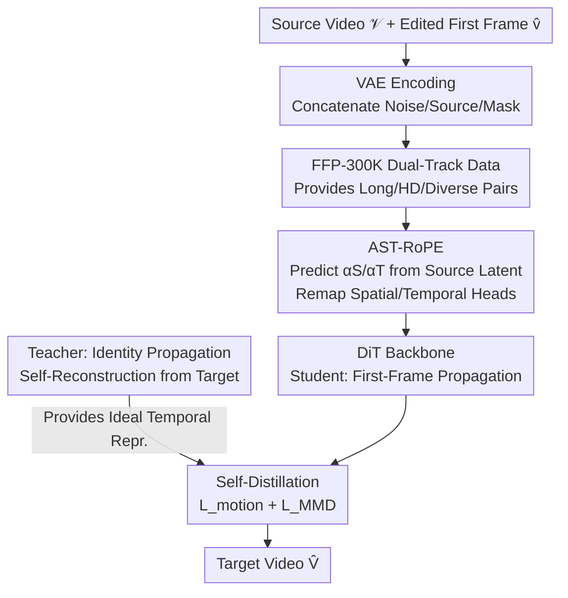

# FFP-300K: Scaling First-Frame Propagation for Generalizable Video Editing

**Conference**: CVPR 2026  
**Paper**: [CVF Open Access](https://openaccess.thecvf.com/content/CVPR2026/html/Huang_FFP-300K_Scaling_First-Frame_Propagation_for_Generalizable_Video_Editing_CVPR_2026_paper.html)  
**Code**: https://ffp-300k.github.io (Project Page)  
**Area**: Video Generation / Video Editing  
**Keywords**: First-Frame Propagation, Video Editing, Dataset Construction, Rotary Positional Embedding (RoPE), Self-Distillation  

## TL;DR
Addressing the limitation that "First-Frame Propagation (FFP) video editing relies on run-time guidance," this work first constructs FFP-300K, a high-fidelity dataset of 290,000 pairs of 720p, 81-frame edited videos via a dual-track pipeline. It then introduces FreeProp, a guidance-free framework that dynamically decouples "first-frame appearance" from "source motion" using AST-RoPE and employs self-distillation, treating the model’s own ideal representation of the source video as regularization. This approach outperforms all methods on EditVerseBench, including the commercial model Aleph.

## Background & Motivation
**Background**: High-fidelity video editing primarily follows two paths. One is instruction-based, where the model edits the entire video based on text instructions. The second is First-Frame Propagation (FFP), which uses mature image editing tools to modify the first frame to the user's satisfaction, subsequently "propagating" these edits to all following frames. FFP offloads the difficult task of semantic understanding to image editors, focusing its own capacity on "robust temporal propagation," making it more controllable and capable of high-fidelity results.

**Limitations of Prior Work**: While FFP is conceptually elegant, existing methods rely heavily on **run-time guidance** to function—either requiring per-video LoRA fine-tuning (e.g., I2VEdit) or auxiliary inputs like depth maps, optical flow, or predicted masks (e.g., StableV2V, GenProp). These guidance mechanisms increase computational overhead and bind the model's generalization to the quality of auxiliary signals.

**Key Challenge**: The authors point out that dependence on guidance is not an inherent flaw of the FFP paradigm but a symptom of **poor training data**. Existing datasets are often: (1) too short or low-resolution (Señorita-2M, InsViE), failing to capture long-range motion and detail; (2) task-limited (VPData focuses only on inpainting) and do not distinguish between local and global editing; (3) mixtures of images and videos (VIVID-10M) that disrupt continuous motion priors. Lacking duration, resolution, and diversity, models fail to learn robust temporal priors and must rely on external guidance as a "crutch."

**Goal**: The objective is split into two sub-problems: (a) building a large-scale, long-duration, high-definition, and diverse dataset with strictly paired source/target clips; (b) designing a truly "guidance-free" propagation framework that resolves the core tension between "adhering to first-frame appearance" and "matching source video motion."

**Key Insight**: Data comes first, followed by the model. With data capable of teaching the model long-range temporal priors, the model can discard run-time guidance.

**Core Idea**: By combining FFP-300K (data) with FreeProp (AST-RoPE remapped positional embeddings + self-distillation regularization), FFP editing can be completed using only the "source video + edited first frame" as inputs.

## Method
The contributions consist of two parts: the **FFP-300K dataset construction pipeline** and the **FreeProp model framework**.

### Overall Architecture
Data Side: FFP-300K uses **two independent specialized tracks** to generate semantically aligned video editing pairs—a local editing track (based on Koala-36M for object-level swap/removal) and a global stylization track (based on Omni-Style for scene-level style transfer). Each track follows a "perception → description → synthesis → filtering" workflow, resulting in 290,000 standardized pairs at 720p and 81 frames.

Model Side: FreeProp is built upon Fun-Control (a conditional video generation model derived from Wan 2.1). Given a source video $\mathcal{V}$ and an edited first frame $\hat{v}$, inputs are encoded into latents via VAE. The first-frame latent is zero-padded along the time dimension and concatenated with noise latents, source latents, and a first-frame binary mask for velocity prediction (flow matching) in a DiT. Two innovations are integrated: **AST-RoPE** for dynamic remapping of positional embeddings to decouple appearance/motion references, and **self-distillation** using a parallel "identity propagation" teacher task to provide ideal alignment targets for the student FFP task.

The training framework of FreeProp (Student FFP task + Teacher Identity Propagation task) is shown below:

### Key Designs

**1. FFP-300K Dual-Track Data Construction Pipeline: Modular Synthesis to Fill the Data Gap**

To address the issues of short, low-res, and mixed-task data, the authors use two **specialized tracks**. The **local editing track** processes source videos from Koala-36M: Qwen2.5-VL-72B identifies editable subjects in the first frame, Grounded-SAM2 generates frame-wise masks, and VACE (a video inpainting model) synthesizes results. A key finding is that **the form of spatial conditioning matters**: using mask erosion forces VACE to rely on internal priors for coherent completion. Swap tasks use a "no-bbox" configuration for more natural integration, while removal tasks use "with-bbox" to ensure consistency in background reconstruction. The **global stylization track** follows two stages: Stage 1 creates source videos using Wan2.1-14B-I2V based on film-like captions from Omni-Style images; Stage 2 generates stylized targets using VACE guided by captions, style images, and depth maps from Video Depth Anything.

For quality control, the removal subset underwent an **iterative refinement loop**: 40,000 candidates were screened by Qwen2.5-VL, with 14,389 verified by humans to fine-tune VACE. The enhanced VACE then regenerated the entire removal subset. The final FFP-300K contains **290,441 pairs** (143,913 stylization, 40,000 removal, 106,528 swap/modification) at 720p/81-frame resolution.

**2. AST-RoPE (Adaptive Spatio-Temporal RoPE): Decoupling Appearance and Motion via Dynamic Mapping**

Standard RoPE imposes a **static coordinate system** on DiT, where time progresses linearly and spatial distances are fixed, hindering long-range propagation from the first frame. AST-RoPE allows the model to **dynamically modulate token perceived positions based on source content**. Following observations that attention heads specialize in spatial or temporal tasks, heads are statically partitioned into **spatial heads $\mathcal{H}_S$** and **temporal heads $\mathcal{H}_T$**. A lightweight Transformer + MLP predicts spatial scaling factor $\alpha_S$ and temporal scaling factor $\alpha_T$ from the source latent $z_{src}$.

For **spatial heads**, $\alpha_S$ modulates the perceived distance of the first frame by offsetting its temporal index from 0 to $\alpha_S \cdot F'$. When $\alpha_S < 1$, the **effective distance between the first frame and subsequent frames is shortened**, increasing attention scores and ensuring edited content is robustly propagated. For **temporal heads**, $\alpha_T$ rescales the temporal axis from $[0, 1, \dots, F-1]$ to $[0, \alpha_T, \dots, \alpha_T(F-1)]$. Videos with fast motion learn a smaller $\alpha_T$, shrinking the perceived inter-frame distance to encourage the temporal head to model more intense motion.

**3. Identity Propagation-based Self-Distillation: Utilizing "Perfect Knowledge" of Source Motion**

Standard flow matching often fails to sufficiently constrain motion dynamics, leading to semantic drift over time. The authors' insight is that **internal latents generated by the model when processing the source video are the ideal alignment targets**. A parallel "Teacher" identity propagation task is run, where the goal is to reconstruct target video $\hat{V}$ from its own first frame $\hat{v}$, forcing the teacher's internal latents to encode the desired spatio-temporal dynamics. The student FFP task is then regularized toward these ideal representations.

Two complementary losses are used. **Inter-frame Relation Distillation $\mathcal{L}_{motion}$** aligns the Gram matrix of spatial downsampled latents between tasks to preserve motion structure:

$$\mathcal{L}_{motion} = \frac{1}{F'(F'-1)}\sum_{i\neq j}|G_{i,:,j,:}-\hat{G}_{i,:,j,:}|$$

**First-frame Consistency Loss $\mathcal{L}_{MMD}$** uses Maximum Mean Discrepancy (MMD) with an RBF kernel to measure the "temporal drift" $d_i$ of frame $i$ relative to the first frame, ensuring the student's drift trajectory matches the teacher's $\hat{d}_i$:

$$\mathcal{L}_{MMD} = \sum_{i=2}^{F} |d_i - \hat{d}_i|$$

### Loss & Training
Fine-tuned Fun-Control using LoRA (rank=128) for 2 epochs; AdamW optimizer, $2\times10^{-4}$ learning rate with cosine decay; $\lambda_{motion}=5$, $\lambda_{MMD}=1$. Variants for 33 and 81 frames were trained for fair comparison.

## Key Experimental Results

### Main Results
On EditVerseBench (125 selected videos), Ours (33f/81f) achieved SOTA across all 6 automatic metrics:

| Type | Method | Res | Frames | CLIP↑ | DINO↑ | Frame↑ | Video↑ | PickScore↑ | VLM↑ |
|------|------|--------|------|-------|-------|--------|--------|-----------|------|
| Instruction | EditVerse | 624×352 | 64 | 0.986 | 0.986 | 27.776 | 25.293 | 20.132 | 7.104 |
| Inst.(Comm.) | Aleph | 1280×720 | 64 | 0.989 | 0.984 | 28.087 | 24.837 | 20.291 | 7.154 |
| FFP | VACE | 832×480 | 61 | 0.990 | 0.989 | 27.169 | 24.188 | 20.095 | 6.072 |
| FFP | **Ours-81f** | 1280×720 | 81 | **0.991** | **0.991** | **28.316** | **25.925** | 20.405 | 7.600 |

Ours-81f lead in temporal consistency (CLIP/DINO) and video-level text alignment. User studies also favored this approach in terms of Editing Accuracy (EA), Motion Accuracy (MA), and Video Quality (VQ).

### Ablation Study
Based on the 81-frame variant:

| Config | CLIP↑ | DINO↑ | Frame↑ | Video↑ | PickScore↑ | VLM↑ | Description |
|------|-------|-------|--------|--------|-----------|------|------|
| Baseline | 0.986 | 0.984 | 27.420 | 24.960 | 20.010 | 7.210 | Wan-Fun fine-tuned on FFP-300K only |
| +AST-RoPE| 0.989 | 0.988 | 28.178 | 25.817 | 20.354 | 7.542 | Added spatio-temporal RoPE |
| Full | 0.991 | 0.991 | 28.316 | 25.925 | 20.405 | 7.600 | Added self-distillation |

### Key Findings
- **Data Contribution**: The Baseline (standard fine-tuning on FFP-300K without structural changes) already outperforms several existing methods, validating the "bottleneck is data" hypothesis.
- **AST-RoPE Impact**: This component provided the most significant gain in VLM and Video scores, proving that decoupling appearance and motion is critical.
- **Self-Distillation**: Primarily improves long-term temporal stability and prevents semantic drift.
- **Sequence Length Trade-off**: Shorter sequences show slightly higher perceptual quality, while longer sequences excel in temporal consistency.

## Highlights & Insights
- **Root Cause Diagnosis**: Re-diagnosing FFP's reliance on guidance as a data deficiency rather than a paradigm flaw is a strong move, verified by the competitive performance of the Baseline.
- **Efficient Adaptation**: AST-RoPE allows "appearance anchoring" and "motion imitation" to be decoupled into spatial and temporal heads with nearly zero computational cost.
- **Teacher Choice**: Using the model’s "perfect knowledge" of the source video for self-distillation avoids the distribution mismatch issues found in cross-model distillation.
- **Engineering Recipes**: Practical insights like "swap vs. removal" spatial constraints and iterative refinement loops for dataset construction are highly reusable.

## Limitations & Future Work
- **Dependency on Large Models**: The data pipeline relies on Qwen2.5-VL-72B and Grounded-SAM2, meaning quality is upper-bounded by these synthetic-data generators.
- **Narrowed Evaluation**: EditVerseBench was filtered to videos with "stable temporal structures," and the switch to Qwen2.5-VL for VLM evaluation makes some cross-benchmark comparisons difficult.
- **First-Frame Sensitivity**: FFP is naturally limited by the image editor; propagation cannot fix errors in the edited first frame.
- **Interpretability**: While $\alpha_S/\alpha_T$ follow intuitive rules (e.g., fast motion → small $\alpha_T$), deeper quantitative analysis of their learned behavior is needed.

## Related Work & Insights
- **Comparison to Instruction-based Methods**: While models like EditVerse/Aleph struggle to balance text understanding with temporal consistency, this work offloads semantics to image editors, achieving higher stability and outperforming commercial models.
- **Comparison to Guided FFP**: Unlike I2VEdit or StableV2V, this method achieves **pure guidance-free propagation** by leveraging data scale and structural priors.
- **Dataset Evolution**: FFP-300K sets a new standard for FFP training sets with 720p resolution and 81-frame duration, significantly surpassing Señorita-2M and VIVID-10M in utility for long-range editing.

## Rating
- Novelty: ⭐⭐⭐⭐
- Experimental Thoroughness: ⭐⭐⭐⭐
- Writing Quality: ⭐⭐⭐⭐
- Value: ⭐⭐⭐⭐⭐

<!-- RELATED:START -->

## Related Papers

- [\[CVPR 2026\] First Frame Is the Place to Go for Video Content Customization](first_frame_is_the_place_to_go_for_video_content_customization.md)
- [\[ICLR 2026\] LoRA-Edit: Controllable First-Frame-Guided Video Editing via Mask-Aware LoRA Fine-Tuning](../../ICLR2026/video_generation/lora-edit_controllable_first-frame-guided_video_editing_via_mask-aware_lora_fine.md)
- [\[CVPR 2026\] VideoCoF: Unified Video Editing with Temporal Reasoner](videocof_unified_video_editing_with_temporal_reasoner.md)
- [\[CVPR 2026\] LoL: Longer than Longer, Scaling Video Generation to Hour](lol_longer_than_longer_scaling_video_generation_to_hour.md)
- [\[CVPR 2026\] RecEdit-Drive: 3D Reconstruction-Guided Spatiotemporal Video Editing for Autonomous Driving Scenes](recedit-drive_3d_reconstruction-guided_spatiotemporal_video_editing_for_autonomo.md)

<!-- RELATED:END -->
