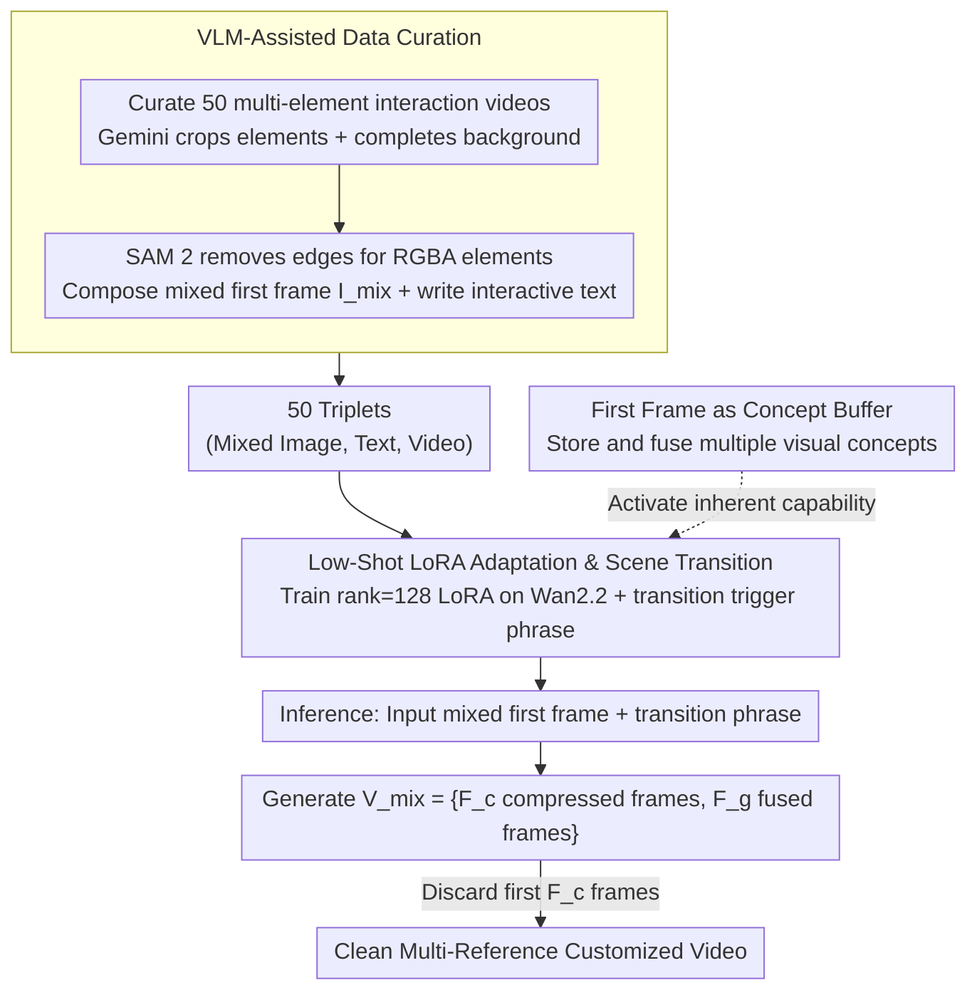

# First Frame Is the Place to Go for Video Content Customization

**Conference**: CVPR 2026  
**arXiv**: [2511.15700](https://arxiv.org/abs/2511.15700)  
**Code**: [http://firstframego.github.io](http://firstframego.github.io)  
**Area**: Video Understanding / Video Generation  
**Keywords**: Video Content Customization, First Frame Concept Buffer, Multi-reference Video Generation, LoRA Fine-tuning, Vision-Language Model

## TL;DR

Discovered the inherent ability of video generation models to implicitly treat the first frame as a "concept memory buffer" for storing and reusing multiple visual entities. Proposed FFGo—a lightweight LoRA adaptation method using only 20-50 training samples to activate this capability without modifying the architecture, achieving multi-reference video content customization. Rated best in 81.2% of cases in user studies.

## Background & Motivation

1.  **Background**: Video generation models (e.g., Wan2.2, Stable Video Diffusion) can generate high-quality videos. Multi-reference video generation (combining objects/scenes from multiple reference images into one video) is a key application direction. Typical methods like VACE and SkyReels-A2 achieve this by modifying architectures and training on millions of data points.
2.  **Limitations of Prior Work**: (a) Architectural modification methods require changing pre-trained model structures, harming compatibility and efficiency. (b) Large-scale task-specific fine-tuning leads to model overfitting on specific scenarios (mainly human-object interaction), losing the broad generation priors learned during pre-training. (c) Existing methods typically limit the number of references to 3 (person, object, scene) and cannot handle more complex inputs.
3.  **Key Challenge**: How to achieve multi-reference video content customization without modifying the architecture or relying on large-scale customized datasets?
4.  **Goal**: (a) Understand the inherent capability of video generation models—whether the first frame can serve as concept storage. (b) Reliably activate this capability. (c) Achieve multi-scene generalization while maintaining pre-trained knowledge.
5.  **Key Insight**: The authors discovered an overlooked phenomenon—pre-trained Image-to-Video (I2V) models already possess the latent ability to extract visual concepts from a mixed first frame and fuse them in subsequent frames. However, this ability is difficult to trigger directly through prompt engineering (unstable, loss of object identity). This capability can be reliably activated by LoRA adaptation using a very small number of training samples.
6.  **Core Idea**: The first frame of a video model is a "concept buffer" rather than just a spatiotemporal starting point. LoRA fine-tuning with 20-50 samples can activate this inherent capability, enabling multi-reference video customization without architectural changes while preserving pre-trained knowledge.

## Method

### Overall Architecture

The problem FFGo addresses is combining objects and scenes from multiple reference images into a single video without altering the architecture of pre-trained I2V models or relying on millions of customized data points. The approach is to feed a "mixed first frame" composed of all references into the model, allowing the model to fuse these elements into a coherent scene in subsequent frames. The pipeline consists of three steps: first, using a Vision-Language Model (VLM) to automatically extract elements and backgrounds from existing videos to create dozens of training triplets (mixed image, text, video); second, training a lightweight LoRA on Wan2.2-I2V-A14B to teach the model to reliably perform "scene transition + entity fusion" from the mixed first frame; and third, during inference, inputting a mixed image with a transition trigger phrase, generating a video, and discarding the initial compressed frames to obtain a clean, customized video. The fulcrum of the method is the observation that the first frame is a "memory buffer" capable of holding multiple visual concepts.

### Key Designs

**1. First Frame as Concept Buffer: Activating existing but hard-to-trigger capabilities rather than teaching new ones**

This is the foundation of the work. The authors found that standard I2V models already have the potential to merge elements from a collaged first frame into a coherent scene in subsequent frames. However, this capability is крайне unstable, limited by three barriers: transition prompts require tedious manual tuning and vary by model/video; scene transitions are inconsistent; and reference object identities are often lost during fusion. FFGo's strategy is not to "add" multi-reference capability via architectural changes but to stably activate this latent ability. A direct benefit is that the broad generation priors from pre-training are fully preserved, avoiding the overfitting common in task-specific fine-tuning.

**2. VLM-Assisted Data Curation: Using models instead of manual labor to create high-quality triplets**

To activate the aforementioned capability, training samples must be in the format of "mixed first frame $\rightarrow$ fused video," which does not exist in standard datasets. FFGo uses a VLM to reverse-engineer standard videos into this format: from 2,000 videos, 50 with clear multi-element interactions are selected. For each video, Gemini-2.5-Pro identifies and crops elements from the first frame while completing a full background without these elements. SAM 2 is used to remove white edges to obtain RGBA elements. Elements and backgrounds are then composed into a mixed image $I_{mix}$, and Gemini-2.5-Pro writes text describing the interaction. This produces 50 (mixed image, text, video) triplets covering human-object, human-human, element insertion, and robotic manipulation. Using VLMs ensures precise cropping and descriptions, allowing a few dozen samples to provide sufficient scene diversity.

**3. Low-Shot LoRA Adaptation & Scene Transition: Solidifying "unstable potential" into "reliable capability"**

Activation is achieved by training a rank=128 LoRA on Wan2.2-I2V-A14B and introducing a unique transition trigger phrase (e.g., "ad23r2 the camera view suddenly changes.", similar to rare identifiers in DreamBooth) to specifically represent the "scene transition" action, avoiding semantic conflict with normal text. Generated video frames are split into two segments: $F = \{F_c, F_g\}$. The first $F_c=4$ frames are time-compressed frames preserving the mixed image, while the subsequent $F_g$ frames contain the fused content; discarding the first $F_c$ frames during inference yields the clean video. Since Wan2.2 uses independent denoising Transformers for low and high noise regions, LoRAs are trained for both. The low-rank nature of LoRA ensures pre-trained weights remain largely unchanged, preserving broad priors—the reason its generalization exceeds large-scale fine-tuning methods. The entire training requires only 50 samples and 5 hours on two H200 GPUs.

### Loss & Training

Standard diffusion denoising loss is used. LoRA rank=128. Training data covers four categories: human-object interaction (60%), human-human interaction (14%), element insertion (20%), and robotic manipulation (6%). Training used 2 NVIDIA H200 GPUs, batch size 4, for only 5 hours.

## Key Experimental Results

### Main Results

User Study (200 annotations, 40 users):

| Model | Overall Quality↑ | Identity (Object)↑ | Identity (Scene)↑ | Avg Rank↓ | % Rank #1↑ |
|------|----------|----------|----------|----------|-------------|
| Wan2.2-I2V-A14B | 2.09 | 3.32 | 3.01 | 3.27 | 3.4% |
| SkyReels-A2 | 2.34 | 2.89 | 3.43 | 3.02 | 4.3% |
| VACE | 3.00 | 3.50 | 3.66 | 2.50 | 11.1% |
| **FFGo (Ours)** | **4.28** | **4.53** | **4.58** | **1.21** | **81.2%** |

FFGo leads across all dimensions, with 81.2% of users selecting FFGo's results as the best.

### Ablation Study

Comparison with base model (qualitative):

| Configuration | Behavior |
|------|------|
| Wan2.2 + best manual transition prompt | Often animates elements independently; objects disappear after transition |
| Wan2.2 + no transition prompt | Almost no entity fusion achieved |
| **FFGo (after LoRA adaptation)** | Consistently maintains object identity; coherent scene transitions |

Key Comparison: FFGo transforms the base model Wan2.2 (lowest performance) into the top performer in evaluation.

### Key Findings

- **Validation of Inherent Capability**: In rare cases where the base model successfully maintains all object identities and executes coherent transitions, FFGo's output is very similar to the base model's, proving FFGo activates existing capabilities rather than learning new ones.
- **Superior Generalization**: VACE and SkyReels-A2 were trained on millions of samples but target human-object scenes, performing poorly in new scenarios like robot manipulation, driving simulation, or underwater scenes. FFGo, with only 50 samples, significantly outperforms both due to the preservation of pre-trained priors.
- **Reference Quantity Advantage**: VACE and SkyReels-A2 are architecturally limited to 3 references. FFGo, using the first frame as a concept buffer, has no such limit; experiments validated effects with up to 5 references (4 objects + 1 scene).
- Preserving pre-trained knowledge is critical—post-training data quality and diversity are lower than pre-training data, and over-fine-tuning leads to model degradation.

## Highlights & Insights

- **Insight into Inherent Capability**: The idea that the first frame is a concept buffer rather than just a starting point is highly insightful. This discovery changes our understanding of I2V models and suggests other overlooked latent capabilities might exist.
- **"Activate rather than Train" Paradigm**: Instead of training a model for a new skill, it is more effective to identify and activate an existing but hard-to-trigger capability. The cost of 20-50 samples is extremely low, yet the result exceeds million-scale training, demonstrating that understanding internal mechanisms is more valuable than brute-force data scaling.
- **High Practical Value**: As a lightweight plugin, FFGo is compatible with existing I2V models, requires no architecture changes, trains quickly, and preserves pre-trained capabilities, offering a plug-and-play enhancement for multi-reference customization.

## Limitations & Future Work

- As the number of reference objects increases, the resolution of each object in the first frame decreases, making identity preservation difficult. The practical limit is approximately 4-5 references.
- Selective control of specific objects via text prompts becomes difficult when there are many reference objects as descriptions may lack precision.
- Reliance on Gemini-2.5-Pro for data curation increases cost and dependency on closed-source APIs.
- The authors suggest using multiple starting frames as an extended concept buffer to break capacity limits in the future.
- Currently validated only on Wan2.2; whether other I2V models (e.g., CogVideoX, Sora) possess similar inherent capabilities remains to be investigated.

## Related Work & Insights

- **vs VACE**: VACE modifies architecture for multi-reference input and trains on millions of samples, excelling primarily in human-object scenarios. It struggles with multi-object interactions or exceeding 3 references. FFGo surpasses it without architectural changes using only 50 samples.
- **vs SkyReels-A2**: Similar to VACE, it uses architectural changes and large-scale training with a 3-reference limit. It was rated best in only 4.3% of cases (vs 81.2% for FFGo).
- **vs Wan2.2 Base**: FFGo proves the base model has latent entity fusion abilities that are unstable. LoRA adaptation converts this unstable potential into a reliable utility.
- This work continues the research line of "exploring inherent capabilities of pre-trained models" (e.g., in-context LoRA for DiT, I2V models for perception tasks).

## Rating

- Novelty: ⭐⭐⭐⭐⭐ The fresh perspective on the role of the first frame is highly insightful.
- Experimental Thoroughness: ⭐⭐⭐⭐ Includes user studies and qualitative comparisons, though lacks some automated quantitative metrics (e.g., CLIP-score).
- Writing Quality: ⭐⭐⭐⭐ Smooth storyline, convincing observations, and rich illustrations.
- Value: ⭐⭐⭐⭐⭐ Provides a highly efficient video customization solution and broadens the understanding of pre-trained model capabilities.

<!-- RELATED:START -->

## Related Papers

- [\[CVPR 2026\] FFP-300K: Scaling First-Frame Propagation for Generalizable Video Editing](ffp-300k_scaling_first-frame_propagation_for_generalizable_video_editing.md)
- [\[ICLR 2026\] LoRA-Edit: Controllable First-Frame-Guided Video Editing via Mask-Aware LoRA Fine-Tuning](../../ICLR2026/video_generation/lora-edit_controllable_first-frame-guided_video_editing_via_mask-aware_lora_fine.md)
- [\[CVPR 2026\] Content-Aware Dynamic Patchification for Efficient Video Diffusion](content-aware_dynamic_patchification_for_efficient_video_diffusion.md)
- [\[CVPR 2026\] Gloria: Consistent Character Video Generation via Content Anchors](gloria_consistent_character_video_generation_via_content_anchors.md)
- [\[CVPR 2026\] Towards Holistic Modeling for Video Frame Interpolation with Auto-regressive Diffusion Transformers](towards_holistic_modeling_for_video_frame_interpolation_with_auto-regressive_dif.md)

<!-- RELATED:END -->
