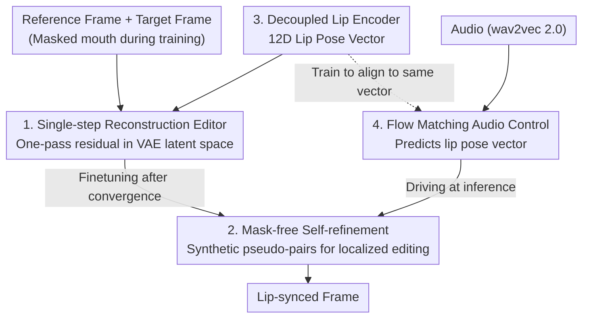

# FlashLips: 100-FPS Mask-Free Latent Lip-Sync using Reconstruction Instead of Diffusion or GANs

**Conference**: CVPR 2026  
**Paper**: [CVF Open Access](https://openaccess.thecvf.com/content/CVPR2026/html/Zinonos_FlashLips_100-FPS_Mask-Free_Latent_Lip-Sync_using_Reconstruction_Instead_of_Diffusion_CVPR_2026_paper.html)  
**Code**: Not disclosed  
**Area**: Video Generation  
**Keywords**: Lip-sync, Mask-free editing, Latent space reconstruction, Flow matching, Real-time generation  

## TL;DR
FlashLips reformulates lip-sync as a "deterministic image editing" problem rather than a generation problem. By replacing diffusion/GANs with a single-step latent editor trained purely on reconstruction and driving it via a Flow Matching "audio-to-lip-pose" Transformer, the U-Net version achieves 109 FPS on a single H100. Simultaneously, it outperforms larger and slower diffusion baselines in FID/FVD and lip-sync precision.

## Background & Motivation

**Background**: The goal of lip-sync is to edit only the mouth region to match the audio while fully preserving identity, expression, head pose, and background. As a local video-to-video editing task, it is more controllable and suitable for dubbing/localization than "audio-driven full-face generation." Prevailing approaches have evolved from GANs (Wav2Lip, StyleSync) to recent diffusion models (LatentSync, KeySync, Diff2Lip).

**Limitations of Prior Work**: GANs suffer from training instability, sensitivity to hyperparameters, and visible artifacts. While diffusion models offer high image quality, their **inference requires multi-step denoising**, limiting speeds to far below real-time (e.g., LatentSync at 5.7 FPS and KeySync at 3.6 FPS in Table 2). Furthermore, these pipelines generally **rely on heavy preprocessing** such as explicit mouth masks, face alignment, and intermediate landmarks or 3D templates, which increase engineering overhead and introduce new artifacts.

**Key Challenge**: Lip-sync is essentially a **highly constrained task**—given a reference identity, a target frame, and precise lip-motion cues, the output is nearly uniquely determined by the input. Given this, why use iterative generators designed for "sampling diverse outputs from noise"? The authors argue that the stochasticity and multi-step cost of iterative generation are wasteful in this context, serving as the root cause for slow speeds and the necessity for mask-based preprocessing.

**Goal**: ① Eliminate iterative generation (no GANs, no diffusion) by using deterministic single-step forward passes. ② Completely remove the need for explicit mouth masks during inference. ③ Decouple "rendered appearance" from "mouth motion," letting audio control only the latter.

**Key Insight**: Treating lip-sync as **deterministic latent residual editing**. With sufficient context (identity + target frame + low-dimensional lip pose vector), a single forward pass can learn high-quality lip updates without needing adversarial objectives or denoising schedules.

**Core Idea**: Use "reconstruction instead of diffusion/GANs" to create a single-step latent editor, driven by a Flow Matching Transformer that maps audio to low-dimensional lip pose vectors. This two-stage decoupling remains simple and stable.

## Method

### Overall Architecture
FlashLips is a two-stage, mask-free system that completely separates **control (how the mouth moves)** from **rendering (what it looks like)**. Stage 1 is a deterministic single-step editor operating in the VAE latent space. It takes a reference frame, a target frame, and a low-dimensional lip pose vector as input, outputting the edited frame in one pass trained solely on reconstruction loss. Stage 1 is first trained using "mouth masking + reconstruction." Once converged, it undergoes **mask-free self-refinement**, enabling the network to localize edits to the mouth without needing masks at inference. Stage 2 is an audio-to-lip-pose Transformer trained via Flow Matching to predict the same lip pose vectors required by Stage 1. During inference, audio is mapped to a lip pose vector via Stage 2 and fed into the self-refined editor (LipsChange network) for single-step generation.

### Key Designs

**1. Single-step Reconstruction Editor: Lip-sync as deterministic latent residual editing**

To address the slow speed of diffusion and the instability of GANs, the authors perform single-step editing directly in the SDXL VAE latent space. Let $x_{src}$ be the source frame to be edited and $x_{ref}$ be a reference frame sampled $t$ frames apart in the same video. During training, the mouth region of the source frame is masked to obtain $x_{masked}$. These are encoded via a frozen VAE into $z_{src}, z_{masked}, z_{ref}$. The reference latent then passes through a trainable backbone $f_{ref}$ for identity adaptation. The lip pose vector $z_{lips}\in\mathbb{R}^M$ is spatially broadcast into $z_{lips}^{exp}$, and the three are concatenated along the channel dimension:

$$z_{input} = \mathrm{Concat}\big(z_{masked},\, z_{ref},\, z_{lips}^{exp}\big)$$

The network does not directly predict the target latent but rather a **residual towards the ground truth**. Given the ground truth residual $z_{target}=z_{src}-z_{masked}$, the network outputs $\hat z_{target}$, reconstructed as $\hat z_{src}=z_{masked}+\hat z_{target}$, then decoded via the frozen VAE to $\hat x_{src}$. Training utilizes **only reconstruction losses** (Latent L1 + Pixel L1 + VGG/VGGFace perceptual loss; no adversarial, no denoising). This avoids the costs of iterative generation because the output is nearly determined by the input.

**2. Mask-free Self-refinement: Using the editor to synthesize pseudo-pairs for mouth-localized editing**

While reconstruction training relies on mouth masks, performing face parsing/masking during inference is slow and artifact-prone. FlashLips samples lip pose vectors to **synthesize "mouth-edited" variants of frames using the model itself**, constructing symmetric pseudo-pairs $(\text{src}\leftrightarrow\text{mod})$ and $(\text{mod}\leftrightarrow\text{src})$. A LipsChange network, initialized with reconstruction weights, is fine-tuned on these pseudo-pairs (approx. 200k steps). Since only the mouth differs between pairs, the network learns to localize changes to the mouth and copy the rest, eliminating external segmentation at inference. Unlike prior mask-free works relying on pre-constructed datasets, this supervision is **generated online by the editor**, allowing for greater lip variety across identities.

**3. Decoupled Lip Encoder: Compressing control into a 12D vector of "mouth/jaw" configurations**

To ensure stable prediction from audio, the control vector must **contain pose information with almost no appearance data** (teeth, lip color, skin tone, etc., should come from the reference frame). The encoder has two branches: a frozen expression encoder with a small MLP for the primary vector $z_{lips}^{main}\in\mathbb{R}^M$, and a lightweight CNN on mouth crops for a small residual $z_{lips}^{add}$, resulting in $z_{lips}=z_{lips}^{main}+z_{lips}^{add}$. Ablations (Table 5) show that using only the expression encoder (V1) saturates at 8D with low identity leakage. Adding the residual (V2) improves reconstruction but increases leakage. The authors select **12D (V1 8D + V2 4D)** as the optimal trade-off. To avoid alignment/cropping overhead, the Lip Encoder is **distilled into a ResNet** (ResNet-50 in text, ResNet-34 in Fig 4 ⚠️) that predicts the lip vector directly from the RGB face.

**4. Flow Matching Audio Control: Mapping "what is said" to "how the mouth moves"**

Stage 2 connects audio to the editor using a Transformer conditioned on wav2vec 2.0 features, trained via Conditional Flow Matching (CFM) in the **lip pose vector space**. Given audio features $a$ and target lip pose $z_{lips}$, noise $\varepsilon\sim\mathcal N(0,I)$ and time $t\sim\mathcal U(0,1)$ are sampled to construct an interpolation and target velocity field:

$$z_t=(1-t)\,\varepsilon+t\,z_{lips},\qquad u=z_{lips}-\varepsilon$$

The Transformer $v_\theta$ is trained to match the velocity field:

$$L_{FM}=\mathbb{E}_{t,\varepsilon,a}\big\|v_\theta(z_t,t,c)-u\big\|_2^2,\quad c=\mathrm{Concat}[a,\,e(a),\,z_{lips}^{K}]$$

where $e(a)$ is a pretrained audio emotion encoder and $z_{lips}^{K}$ are $K$ randomly sampled source lip poses. Since the control space is decoupled from appearance, the audio task is simplified, leading to better generalization and smooth temporal transitions.

### Loss & Training
Stage 1 is supervised jointly in the latent and pixel spaces. Let $\Delta z=\hat z_{target}-z_{target}$, $M$ be the lower-face pixel mask, and $m$ be its latent downsampled version. Latent losses include $L^{lat}_{L1}=\mathrm{MAE}(\Delta z)$ and $L^{lat}_{L1m}=\mathrm{MAE}_m(\Delta z)$. Pixel losses include lower-face L1 $L^{pix}_{L1M}$, mouth-region L1 $L^{pix}_{L1lips}$ (if mouth area > threshold), VGG-19 $L_{VGG}$, and VGGFace2 perceptual loss $L^{face}_{VGG}$. The total loss is:

$$L_{total}=0.1L^{lat}_{L1}+0.1L^{lat}_{L1m}+10L^{pix}_{L1M}+100L^{pix}_{L1lips}+50L_{VGG}+5L^{face}_{VGG}$$

Mouth-region pixel loss carries the highest weight (100) to focus optimization on lip fidelity. Training used 8×H100 GPUs with a batch size of 32. The reconstruction phase took 1M steps (AdamW + OneCycleLR), followed by 200k steps for self-refinement. The Stage 2 Transformer (150M parameters) used AdamW with a constant learning rate of $5\times10^{-5}$. Backbones include a U-Net (250M, optimized for speed) and a Transformer (300M, optimized for quality).

## Key Experimental Results

### Main Results
Evaluated on HDTF, CelebV-HQ, and CelebV-Text using 100 reconstruction and 100 cross-audio videos. FlashLips variants achieve top FID and FVD while significantly leading in speed.

| Protocol | Model | FID ↓ | FVD ↓ | LipScore ↑ | ID ↑ |
|------|------|-------|-------|-----------|------|
| Reconstruction | LatentSync | 5.30 | 36.47 | 0.55 | 0.86 |
| Reconstruction | KeySync | 5.48 | 24.80 | 0.56 | 0.81 |
| Reconstruction | **FlashLips–U-Net** | 4.75 | 15.20 | 0.70 | 0.85 |
| Reconstruction | **FlashLips–Transformer** | **4.43** | **12.31** | **0.71** | 0.86 |
| Cross-Audio | KeySync | 6.81 | 37.55 | 0.36 | 0.79 |
| Cross-Audio | LatentSync | 7.69 | 46.08 | 0.33 | 0.84 |
| Cross-Audio | **FlashLips–Transformer** | **5.89** | **29.40** | 0.37 | 0.81 |

Both FlashLips versions ranked top two for LipScore. ID preservation was first in Reconstruction (tied with LatentSync) and second in Cross-Audio. While PSNR/SSIM ranked third, the gap was small, indicating that single-step reconstruction does not sacrifice significant fidelity.

### Inference Speed

| Model | FPS ↑ | Relative Speedup (vs U-Net) |
|------|-------|----------------|
| KeySync | 3.60 | 30.4× |
| LatentSync | 5.70 | 19.2× |
| Diff2Lip | 19.77 | 5.5× |
| TalkLip | 51.53 | 2.1× |
| **FlashLips–Transformer** | 66.84 | 1.6× |
| **FlashLips–U-Net** | **109.41** | 1.0× |

The U-Net version at 109 FPS is 30x faster than KeySync and is the only high-quality solution significantly exceeding real-time requirements.

### Ablation Study

| Configuration | Key Metrics | Description |
|------|---------|------|
| Lip Pose V1 8D | LipScore 0.34 / ID 0.83 | Frozen expression encoder only. Low identity leakage; saturates at 8D. |
| Lip Pose V1 8D + V2 4D (12D, Selected) | LipScore 0.38 / ID 0.80 | Optimal balance between quality and decoupling. |
| Lip Pose V1 8D + V2 16D | LipScore 0.40 / ID 0.63 | Higher reconstruction but severe identity leakage; cross-audio fails. |
| Reference Frame = 1 (Transformer) | FVD 41.38 / ID 0.79 | Weak identity preservation in cross-audio. |
| Reference Frames = 4 (Selected) | FVD 29.40 / ID 0.81 | Significant identity improvement with minimal sync loss. |
| Reference Frames > 4 | Marginal gains | Excess identity info interferes with audio driving. |

### Key Findings
- **Lip pose dimensionality is a decoupling trade-off**: Increasing the lip residual (V2) improves PSNR (up to 36.86) but degrades identity (ID drops from 0.83 to 0.63), causing sync issues and identity drift. 12D is the sweet spot.
- **Reference frames 1→4 improve identity**: Increasing frames beyond 4 provides marginal gains and can distract the audio-to-pose network.
- **U-Net vs. Transformer is a speed/quality choice**: Accuracy is similar; Transformer has better perceptual quality but is slower.
- **Pixel-level metrics are the bottleneck**: Lower PSNR/SSIM suggests deterministic regression is more conservative with fine textures than diffusion, though it wins in perceptual FVD/FID.

## Highlights & Insights
- **"Strongly conditioned tasks don't need generative models"**: The core insight is that since lip-sync outputs are nearly determined by inputs, the problem can be reduced from "sampling" to "regression." This bypasses diffusion's multi-step cost—a paradigm applicable to other highly conditioned local editing tasks.
- **Self-refinement via pseudo-pairs**: Using the model to synthesize its own "edited" variants for supervision is an elegant trick. It allows the model to learn localized editing without external masks, removing a major inference bottleneck.
- **Control space decoupling + distillation**: Compressing "how the mouth moves" to 12D ensures audio-side learning is stable. Distilling the preprocessing pipeline into a single ResNet eliminates the final milliseconds of overhead.

## Limitations & Future Work
- The authors acknowledge that robustness under **occlusions and extreme motion** needs improvement. The control space currently lacks rich prosody/emotional signals beyond the conditioned emotion embedding $e(a)$.
- **Pixel-level fidelity (PSNR/SSIM) is slightly lower than diffusion**, indicating that deterministic regression might produce smoother or more conservative fine textures.
- The evaluation used a relatively small scale (100 samples per protocol).
- Future Work: Expanding the control vector to joint pose/prosody/emotion representations and introducing temporal modules or robust training for large head poses and occlusions.

## Related Work & Insights
- **vs. LatentSync / KeySync (Diffusion)**: These rely on multi-step denoising for quality, yet FlashLips outperforms them in FID/FVD while being 19–30x faster and mask-free.
- **vs. Wav2Lip / StyleSync (GAN)**: GANs use adversarial and SyncNet supervision but are unstable. FlashLips uses pure reconstruction loss, which is more stable.
- **vs. DiffDub (Two-stage Diffusion)**: While both decouple control and rendering, FlashLips replaces the rendering stage with a single-step editor and the control stage with Flow Matching, resulting in two orders of magnitude speedup (1.86 FPS vs 109 FPS).

## Rating
- Novelty: ⭐⭐⭐⭐⭐ Reformulating lip-sync from generation to deterministic editing is highly effective and intuitive.
- Experimental Thoroughness: ⭐⭐⭐⭐ Compared against 6 strong baselines, though sample sizes per protocol were small.
- Writing Quality: ⭐⭐⭐⭐⭐ Clear progression from motivation to method and ablations.
- Value: ⭐⭐⭐⭐⭐ High-quality 100+ FPS mask-free lip-sync has immediate industrial value for dubbing and digital humans.

<!-- RELATED:START -->

## Related Papers

- [\[CVPR 2026\] SWIFT: Sliding Window Reconstruction for Few-Shot Training-Free Generated Video Attribution](swift_sliding_window_reconstruction_for_few-shot_training-free_generated_video_a.md)
- [\[CVPR 2026\] Latent-Compressed Variational Autoencoder for Video Diffusion Models](latent-compressed_variational_autoencoder_for_video_diffusion_models.md)
- [\[CVPR 2026\] Phantom: Physics-Infused Video Generation via Joint Modeling of Visual and Latent Physical Dynamics](phantom_physics-infused_video_generation_via_joint_modeling_of_visual_and_latent.md)
- [\[CVPR 2026\] When to Lock Attention: Training-Free KV Control in Video Diffusion](when_to_lock_attention_training-free_kv_control_in_video_diffusion.md)
- [\[CVPR 2026\] RecEdit-Drive: 3D Reconstruction-Guided Spatiotemporal Video Editing for Autonomous Driving Scenes](recedit-drive_3d_reconstruction-guided_spatiotemporal_video_editing_for_autonomo.md)

<!-- RELATED:END -->
