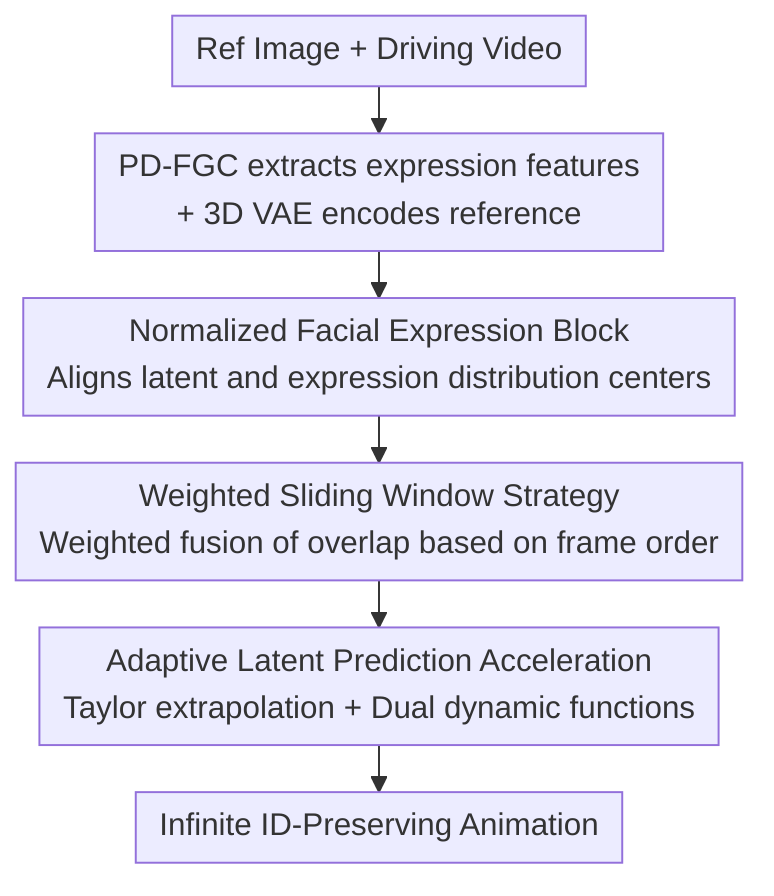

# FlashPortrait: 6× Faster Infinite Portrait Animation with Adaptive Latent Prediction

**Conference**: CVPR 2026  
**Paper**: [CVF Open Access](https://openaccess.thecvf.com/content/CVPR2026/html/Tu_FlashPortrait_6x_Faster_Infinite_Portrait_Animation_with_Adaptive_Latent_Prediction_CVPR_2026_paper.html)  
**Code**: [Project Page](https://francis-rings.github.io/FlashPortrait) (Code not yet open source)  
**Area**: Video Generation / Portrait Animation / Diffusion Acceleration  
**Keywords**: Portrait Animation, Infinite Video, Diffusion Acceleration, Adaptive Latent Prediction, Identity Preservation

## TL;DR
FlashPortrait utilizes a training-free inference mechanism consisting of "Weighted Sliding Window + Adaptive Latent Extrapolation." This significantly compresses denoising steps for long portrait animations, achieving up to 6× inference acceleration while generating videos exceeding 1800 frames without identity (ID) drift.

## Background & Motivation

**Background**: Portrait animation synthesizes natural facial videos with consistent identity by combining a reference image with a driving video. Recent mainstream approaches have shifted from GANs to Diffusion models, and from U-Net to Diffusion-in-Transformer (DiT) architectures, such as HunyuanPortrait, FantasyPortrait, and Wan-Animate. To meet the demands of film and digital human scenarios, research has begun to pursue "long video" and even "infinite" generation.

**Limitations of Prior Work**: Long-duration video generation introduces two intertwined challenges. First is **speed**—DiT-based methods denoise frame-by-frame and step-by-step, often resulting in thousands of seconds of latency for a 20-second video. Second is **drifting**—distortions in body structure, identity (ID) inconsistency, and color shifts commonly appear after approximately 20 seconds. Existing acceleration techniques are insufficient: caching methods (TeaCache, TaylorSeer, FoCa) are training-free but "reuse old features," which leads to incorrect denoising directions under large-scale facial movements. Distillation methods (Self-Forcing) require significant compute to train a 4-step student model and rely on autoregressive segment sampling. Students cannot fully inherit the teacher's prior, leaving small latent errors in each segment that accumulate into visible distribution shifts and color flickering.

**Key Challenge**: Facial movements in portrait animation are "complex and large-scale," causing latent variables to fluctuate sharply across time steps. This is the Achilles' heel of general acceleration methods (largely designed for I2V with slight motion)—fixed-order or fixed-pattern extrapolation cannot track these fluctuations, leading to rapid error accumulation and ID instability. In other words, **"Speed" and "ID Stability" are naturally in conflict during long portrait animation**.

**Goal**: To achieve "6× acceleration" and "infinite length + ID preservation" simultaneously, without training additional student models and intervening only during the inference phase.

**Key Insight**: The authors observed two phenomena: (1) although latents fluctuate, their "rate of change" and "magnitude of cross-layer derivatives" across adjacent time steps are regular and measurable, allowing the **adaptive** determination of extrapolation aggressiveness; (2) intra-segment ID flickering is rooted in the large distance between the distribution centers of diffusion latents and facial expression features.

**Core Idea**: Finite differences of historical latents are used to approximate high-order derivatives of the current latent, followed by Taylor expansion to **directly predict latents for future time steps, skipping several full denoising passes**. Two dynamic functions adaptively scale this extrapolation across time steps and network layers to ensure ID stability while skipping steps.

## Method

### Overall Architecture

FlashPortrait uses Wan2.1-I2V-14B as the backbone. The driving video passes through a pre-existing PD-FGC to extract ID-independent facial expression features (head pose, eyes, emotion, mouth). The reference image is injected through two paths: one via a CLIP image encoder to obtain image embeddings for modulating facial attributes in each DiT block, and another encoded by a frozen 3D VAE into latent codes (after zero-padding in the temporal dimension), which are concatenated channel-wise with compressed video frames and a binary mask (1 for the first frame, 0 for others). During inference, video frames are replaced with random noise, and the DiT restores animation frames through iterative denoising.

The three contributions of the pipeline correspond to three modifications: using **Normalized Facial Expression Blocks** inside the DiT to replace original image cross-attention blocks (addressing intra-segment ID flicker); using a **Weighted Sliding Window Strategy** at the window level to smoothly fuse overlaps (addressing inter-segment transitions); and using **Adaptive Latent Prediction Acceleration** within each window to skip denoising steps (addressing speed). The combination yields a fast and stable infinite portrait animator.

### Key Designs

**1. Normalized Facial Expression Block: Aligning Expression Features and Diffusion Latents**

The pain point is specific: ID flickers even within the same segment because the distribution centers of diffusion latents $z_i$ and raw facial expression embeddings are far apart. Injection forces the merging of misaligned distributions, leading to unstable facial modeling. FlashPortrait first processes mouth embeddings $emb_m$ and other features (pose/eyes/emotion) $emb_{e*}$ through self-attention $\mathrm{SA}(\cdot)$ and FFN layers to enhance spatial awareness, concatenating them into a portrait embedding $emb_p$. The latent $z_i$ undergoes cross-attention with image embeddings and portrait embeddings to produce $z_i^{img}$ and $z_i^p$. The key step is normalization alignment: the authors require $\frac{z_i^{img}-\mu_{img}}{\sigma_{img}}=\frac{z_i^{p}-\mu_p}{\sigma_p}$ to ensure overlapping distribution centers, thus rescaling the portrait branch using the mean and variance of the image branch before summation:

$$\bar{z}_i^{p}=\frac{z_i^{p}-\mu_p}{\sigma_p}\times\sigma_{img}+\mu_{img},\qquad \bar{z}_i=\bar{z}_i^{p}+z_i^{img}$$

Ablation studies show this step is critical: using only pure normalization or centralization fails to reduce the distribution gap effectively; merging both mean and standard deviation is required to reduce AED from a baseline of 44.78 to 29.68.

**2. Weighted Sliding Window Strategy: Smoothing Overlap Regions**

Long videos are generated segment-by-segment via sliding windows, but traditional methods often leave abrupt jumps at boundaries. FlashPortrait assigns "relative frame-order aware" weights $W=\{w_i=\tfrac{i}{v}\mid i=0,1,\dots,v\}$ (where $v$ is the overlap length, set to 5) to the overlap latent variables of adjacent windows:

$$z_i^{overlapp}=W*C_i+(1-W)*C_{i-1}$$

Where $C_i$ and $C_{i-1}$ are the latents of the current and previous windows in the overlap. This linear arithmetic weight creates a gradient-based seamless transition. The window advances by $l-v$ frames (where $l$ is window length) until the entire sequence is covered. Ablations show this reduces AED from 36.44 to 29.68 compared to standard sliding windows.

**3. Adaptive Latent Prediction Acceleration: Extrapolating the Future with Adaptive Step-Skipping**

This is the primary engine for 6× acceleration, which is training-free and enabled only during inference. The core idea is to **avoid running the DiT at every step** by using Taylor expansion to predict future latents from history. Setting the expansion point at $t+k$ ($K$ is the interval, set to 5; $k\in\{1,\dots,K-1\}$):

$$f(t)=\sum_{i=0}^{n}\frac{f^{(i)}(t+k)}{i!}(-k)^{i}+R_{n+1}$$

To avoid actual differentiation, derivatives are approximated by finite differences: $\triangle f(t)=f(t+K)-f(t)$ and $\triangle^2 f(t)=\triangle f(t+K)-\triangle f(t)$. The authors prove via induction that $\triangle^{i}f(t)\approx K^{i}f^{(i)}(t)$. Consequently, the DiT only performs full denoising at sparse steps $\{t+K, t+2K,\dots,t+(n+1)K\}$, while other steps are filled by extrapolation.

However, fixed-order extrapolation is unreliable for large facial movements. The authors add **two dynamic functions** for adaptive scaling. The first tracks the "temporal latent variation rate": defined as $\sigma(t)=\frac{df(t)}{dt}$ and average rate $\sigma_{avg}(T')$, let $s(t)=\left(\frac{\sigma(t)}{\sigma_{avg}(t)}\right)^{\alpha}$ (with $\alpha=1.5$). Higher variation in early steps triggers larger effective $K$ compensation, while stabilization in later steps reduces scaling to avoid over-amplifying $\triangle^i f(t)$. The second tracks the "cross-layer derivative magnitude ratio": $r(t,l,i)=\frac{\mathrm{E}[\|f^{(i)}(t,l)\|]}{\mathrm{E}[\|f^{(i)}(t,avg)\|]}$ with scaling $w(t,l,i)=\frac{1}{\sqrt{r(t,l,i)}}$. Low layers capturing sensitive textures with high derivatives ($r>1$) have scaling reduced, while high layers modeling stable structures ($r<1$) have it increased. These refine the mapping as:

$$\triangle^{i}f(t,l)\approx K^{i}\cdot w(t,l,i)\cdot s(t)\cdot f^{(i)}(t,l)$$

Leading to the final layer-wise prediction formula:

$$f(t,l)=f(t+k,l)+\sum_{i=1}^{n}\frac{\triangle^{i}f(t+k,l)\cdot(-k)^{i}}{i!\cdot K^{i}\cdot w(t+k,l,i)\cdot s(t+k)}$$

Ablations confirm the necessity of "dynamic functions": removing them (reducing to TaylorSeer-style prediction) causes AED to jump from 29.68 to 42.66. While FoCa and Self-Forcing might be faster, they produce severe artifacts and ID drift under large expressions.

### Loss & Training

Only the DiT attention modules are trained; the rest are frozen. The goal is reconstruction loss. To enhance facial fidelity, face masks $M_{face}$ and lip masks $M_{lip}$ extracted via MediaPipe are used for loss weighting:

$$\mathcal{L}=\mathbb{E}_{\theta}\left(\left\|(z_{gt}-z_{\varepsilon})\odot(1+M_{face}+M_{lip})\right\|^2\right)$$

This focuses the model on facial and lip regions. Training involves ~2000 hours of data (Hallo3 + Celebv-HQ + web videos), 20 epochs, 200 H100 GPUs, $lr=10^{-5}$, $K=5$, and $n=3$.

## Key Experimental Results

### Main Results

Comparisons were conducted on Voxceleb2 & Vfhq (avg. 10s) and a self-built Hard100 (1-3 min long videos). In the table, `a/b` represents results for the two datasets. Speed is the latency for a 20s 480×832 video.

| Model | FVD↓ (Vox/Hard) | PSNR↑ (Vox/Hard) | AED↓ (Vox/Hard) | MAE↓ (Vox/Hard) | Speed↓ |
|------|------|------|------|------|------|
| Wan-Animate (Strong Baseline) | 336.12 / 695.48 | 32.54 / 18.13 | 19.54 / 42.98 | 7.88 / 20.08 | 2298s |
| FantasyPortrait | 328.93 / 723.57 | 32.48 / 16.47 | 19.66 / 45.34 | 7.64 / 19.87 | 4339s |
| HunyuanPortrait | 366.72 / 882.54 | 31.93 / 16.63 | 20.75 / 49.95 | 8.85 / 20.48 | 1602s |
| **Ours** | **320.47 / 340.21** | 32.36 / **26.16** | **15.19 / 29.68** | **5.93 / 12.54** | **720s** |

Performance is comparable on short videos, but the **gap widens on long videos**: Compared to Wan-Animate on Hard100, AED/APD/MAE improve by 30.9% / 30.4% / 37.5%, while inference is ~3× faster. Compared to FantasyPortrait (4339s), the acceleration is ~6×. Qualitative results show ID maintenance after 3000+ frames, whereas competitors suffer from color drift and facial/body distortion after 30 seconds.

### Ablation Study

**Acceleration Mechanism Comparison** (Hard100, 20s video latency):

| Configuration | AED↓ | APD↓ | MAE↓ | Speed↓ |
|------|------|------|------|------|
| Baseline (No Accel) | 29.12 | 23.86 | 12.37 | 4328s |
| TeaCache | 33.94 | 27.62 | 15.06 | 2164s (~2×) |
| w/o Dynamic Func (≈TaylorSeer) | 42.66 | 35.98 | 19.63 | 682s |
| FoCa | 37.47 | 32.96 | 17.88 | 862s |
| Self-Forcing | 52.85 | 39.32 | 20.79 | 266s |
| **Ours** | **29.68** | **24.40** | **12.54** | **720s** |

**Normalization Block Ablation**: Baseline (Direct Addition) AED 44.78 → Pure Norm 38.42 → Centralization 33.76 → **Ours 29.68**. This validates that fusing both mean and standard deviation of branches is necessary to close the distribution gap.

**Hyperparameters $K$/$n$** ($n=3, K=5$ as default): $K=2$ is near-lossless but slow (2116s), $K=8$ is fast (295s) but AED spikes to 44.21. Increasing $n$ improves prediction accuracy but slows down; $n > 3$ offers marginal gains. Thus, $K=5, n=3$ is the optimal quality-speed tradeoff.

### Key Findings
- **The "Dynamic Functions" are the Main Engine**: Removing them (returning to fixed-order prediction) yields faster speed (682s) but doubles AED (42.66), suggesting that "adaptive scaling" is the linchpin of ID stability under large motion.
- **The Longer the Video, the Larger the Gap**: All competitors show significant degradation on long videos. Ours achieves much higher PSNR on Hard100 (26.16 vs Wan-Animate 18.13), confirming the efficacy of weighted sliding windows and distribution alignment against error accumulation.
- **Two Sources of ID Drift**: Authors analyze that drift <15s stems mainly from distribution misalignment during condition injection, while drift >15s stems primarily from inter-segment error accumulation—each is addressed by specific designs.

## Highlights & Insights
- **Replacing "Cache Reuse" with "Extrapolation Prediction"**: Caching methods reuse old features and fail under large motion. This work extrapolates future latents using historical finite differences, an upgrade to the TaylorSeer concept specifically tuned for portrait movements.
- **Transferable Distribution Alignment Trick**: Rescaling one branch using the $(\mu, \sigma)$ of another before addition effectively aligns mismatched features. This logic is applicable to any "heterogeneous conditional injection in diffusion" (e.g., audio/pose-driven).
- **Training-Free & Plug-and-Play**: Both the acceleration mechanism and weighted windows are inference-only, requiring no additional distillation training, lowering deployment costs.

## Limitations & Future Work
- The backbone is Wan2.1-14B, requiring 200 H100 GPUs for training, creating a high barrier to entry. Code availability is subject to official release.
- While fast, 720s for a 20s video is still not real-time. Quality degrades significantly for $K>5$, indicating that step-skipping is bounded by facial motion complexity.
- Dynamic functions introduce hyperparameters like $\alpha$. While values are provided, their robustness across datasets is not fully analyzed, and discussion on failure cases (extreme occlusion) is limited.
- ID consistency >15s depends on suppressing accumulation errors; consistency theoretically degrades over infinite length—long-term stability is verified up to 5400+ frames.

## Related Work & Insights
- **vs. Cache-based Accel (TeaCache / TaylorSeer / FoCa)**: These are training-free but use fixed patterns for reuse/extrapolation, offering lower speedup (~2×) or drifting under large motion. Ours uses "Finite Difference Extrapolation + Dual Dynamic Functions" to reach 6× speed with ID stability.
- **vs. Distillation-based Accel (Self-Forcing)**: Distillation requires training 4-step students and autoregressive sampling, leading to accumulation errors suitable only for near-static videos (AED 52.85). Ours is training-free and significantly better for long videos.
- **vs. Wan-Animate / FantasyPortrait**: These are DiT-based but lack specialized long-video/acceleration mechanisms, resulting in severe color drift and distortion after 30 seconds. This work systematically improves transitions (weighted window), ID (norm-block), and speed (adaptive extrapolation).

## Rating
- Novelty: ⭐⭐⭐⭐ First training-free acceleration framework for ID-preserving infinite portrait animation; targeted dynamic function design.
- Experimental Thoroughness: ⭐⭐⭐⭐ Comprehensive main results and ablations (normalization/sliding window/acceleration/hyperparameters) across short and long video datasets.
- Writing Quality: ⭐⭐⭐⭐ Clear derivations and motivation, though high symbol density creates a moderate learning curve.
- Value: ⭐⭐⭐⭐ Simultaneously achieving acceleration, ID preservation, and infinite length is highly practical for long-form portrait video applications.

<!-- RELATED:START -->

## Related Papers

- [\[CVPR 2026\] PersonaLive! Expressive Portrait Image Animation for Live Streaming](personalive_expressive_portrait_image_animation_for_live_streaming.md)
- [\[CVPR 2025\] HunyuanPortrait: Implicit Condition Control for Enhanced Portrait Animation](../../CVPR2025/video_generation/hunyuanportrait_implicit_condition_control_for_enhanced_portrait_animation.md)
- [\[CVPR 2026\] AdapTok: Learning Adaptive and Temporally Causal Video Tokenization in a 1D Latent Space](adaptok_learning_adaptive_and_temporally_causal_video_tokenization_in_a_1d_laten.md)
- [\[CVPR 2026\] Infinity-RoPE: Action-Controllable Infinite Video Generation Emerges From Autoregressive Self-Rollout](infinity-rope_action-controllable_infinite_video_generation_emerges_from_autoreg.md)
- [\[CVPR 2026\] HarmoVid: Relightful Video Portrait Harmonization](harmovid_relightful_video_portrait_harmonization.md)

<!-- RELATED:END -->
