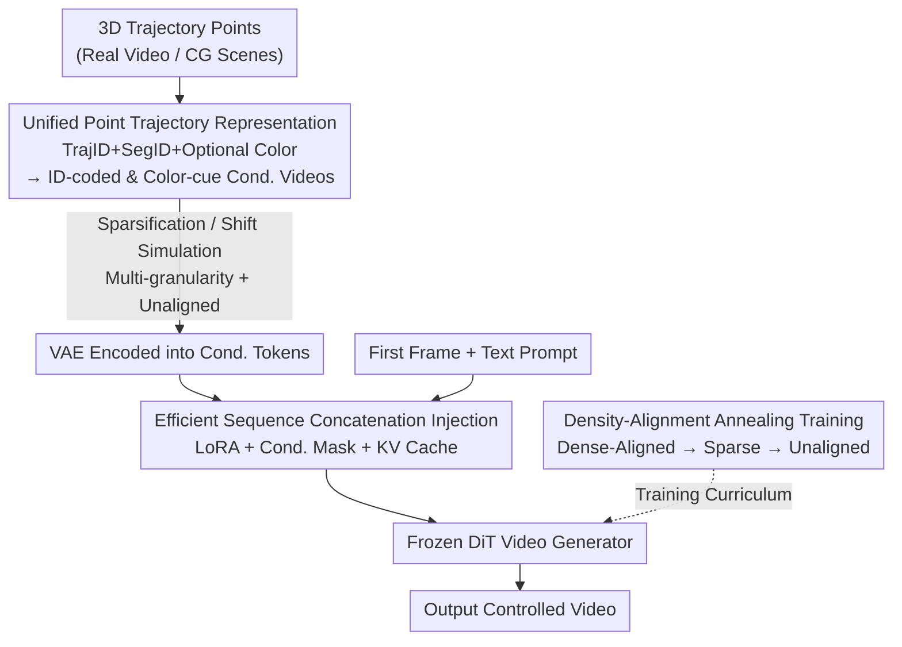

# FlexTraj: Image-to-Video Generation with Flexible Point Trajectory Control

**Conference**: CVPR 2026  
**Paper**: [CVF Open Access](https://openaccess.thecvf.com/content/CVPR2026/html/Zhang_FlexTraj_Image-to-Video_Generation_with_Flexible_Point_Trajectory_Control_CVPR_2026_paper.html)  
**Code**: [Project Page](https://bestzzhang.github.io/FlexTraj)  
**Area**: Video Generation  
**Keywords**: Image-to-Video Generation, Trajectory Control, Point Trajectory Representation, Sequence Concatenation Conditioning, Annealing Training

## TL;DR
FlexTraj introduces a unified point trajectory representation incorporating trajectory IDs, segmentation IDs, and optional colors. Combined with "efficient sequence concatenation" for condition injection and a "density-alignment annealing" training curriculum, it enables a single image-to-video model to simultaneously support multi-granularity trajectory control—including dense, spatially sparse, temporally sparse, and even unaligned trajectories. FlexTraj achieves significantly lower trajectory errors and higher video quality than existing specialized methods on DAVIS and FlexBench.

## Background & Motivation
**Background**: Diffusion video generation models (e.g., Sora, CogVideoX, Wan) have achieved exceptional visual quality, but "controllability" remains an open challenge. To allow users to specify motion, prior works have introduced various conditioning signals, such as depth maps, edges, boxes, masks, and human poses. However, these signals correspond to a **single control granularity**. Point trajectories are naturally different: by adjusting the sampling density, they can slide continuously between "dense down to every pixel" and "sparse to a few drag points," making them theoretically the ideal medium for unifying various control granularities.

**Limitations of Prior Work**: Unfortunately, this potential has not been fully realized. Most point trajectory methods (such as DragNuwa, ToRA) only handle 2D drags; the few that extend to 3D can only choose one or the other—either supporting only sparse (LeviTor) or only dense (DAS) trajectories. The recent Motion Prompting attempts to unify sparse and dense control by **using manual templates to "densify" sparse signals during inference**. However, these templates are hand-designed, and the model itself is not trained under diverse conditions, which limits both accuracy and flexibility. More critically, almost all methods **assume that the input motion is strictly structurally aligned with the first frame**. Once the user-provided motion comes from another character or a rough set of cubes (CG scenes), these methods fail completely.

**Key Challenge**: For a single model to simultaneously learn "dense and aligned" control (highly deterministic, ensuring fast convergence) and "sparse and unaligned" control (highly flexible, with a large parameter search space), these two requirements pull in opposite directions. Simply mixing various tasks randomly during training leads the model to oscillate between contradictory supervisory signals, resulting in poor convergence.

**Goal**: To build a truly "multi-granularity + alignment-free" unified trajectory control framework that covers all tasks (dense, spatially sparse, temporally sparse, and unaligned) that prior works could only address individually.

**Key Insight**: The authors decompose this into three sub-problems: (1) finding a sufficiently expressive **point representation** that maintains temporal correspondence and accommodates newly appearing points; (2) finding a **conditioning injection method** on the DiT backbone that is both controllable and tolerant of non-alignment while remaining computationally efficient; and (3) designing a **training curriculum** that allows a single model to stably learn all granularities.

**Core Idea**: Use a unified point representation with three attributes (TrajID + SegID + optional Color) rendered into two conditioning videos, inject the condition tokens into the DiT via efficient sequence concatenation empowered by LoRA, and train this system using a curriculum that gradually anneals from dense-aligned to sparse-unaligned inputs.

## Method

### Overall Architecture
The input to FlexTraj consists of a first frame image, a text prompt, and a set of annotated 3D trajectory points (obtained from real video tracking or CG scenes). The output is a video controlled by these trajectories. The entire pipeline consists of three steps: first, the 3D trajectory points are encoded into **two conditioning videos** (an ID-coded video and a Color-cue video). In this step, sparsification or translation of the points can simulate various controls, such as spatially sparse, temporally sparse, or unaligned trajectories. Next, a pre-trained VAE encodes these two conditioning videos into tokens, which are injected into a frozen DiT video generator via "efficient sequence concatenation + LoRA". Finally, this unified model is trained using a "density-alignment annealing" curriculum. These three steps correspond to §3.1, §3.2, and §3.3 of the paper, representing the three key designs detailed below.

### Key Designs

**1. Unified Point Trajectory Representation: Encoding "Who, When, and What it Looks Like" at Once with Three-Attribute Points**

The paint points are specific: optical flow- or Gaussian-based representations lack explicit temporal correspondence (the same point cannot be tracked across frames), while representations like the "first frame color propagation" used in DAS cannot represent **newly appearing** points (e.g., a face revealed as a person turns their head) because point identities are fixed at initialization. FlexTraj assigns three attributes to each point $p^t_i = (x^t_i, y^t_i, z^t_i, s_i, u_i, a_i)$: a segmentation ID $s_i$ to distinguish different object instances, a trajectory ID $u_i$ to index specific points within an instance, and an optional color vector $a_i$ to encode appearance. These annotated points are then projected back into pixel space and rendered into two conditioning videos—an ID-coded video $V_{ID}$ that stores SegID in the red channel and TrajID in the green/blue channels, and a Color-cue video $V_{Color}$ that records optional colors. The beauty lies in: TrajID guarantees cross-frame correspondence (resolving the temporal aspect), SegID informs newly appearing regions of which instance they belong to (resolving new points), and the **control granularity is simply a function of sampling density**—sampling densely yields dense control, while sampling just a few points yields sparse control. All trajectories are projected into the same conditioning video format, naturally unifying different granularities. The color attribute is "optional": it is provided only when appearance cues are needed, such as in camera redirection; otherwise, it is omitted, and the model handles both cases seamlessly.

**2. Efficient Sequence Concatenation Condition Injection: Replacing ControlNet's Structural Alignment Binding with Attention-based Interaction**

Feeding conditioning tokens into generative models is non-trivial. The most intuitive ControlNet-style injection on DiT backbones suffers from poor controllability and **implicitly enforces structural alignment**—the condition and the first frame must be aligned, which directly contradicts the goal of "supporting unaligned inputs." On the other side, simple sequence concatenation is flexible but suffers from exploded computational costs during training. FlexTraj compromises with "efficient sequence concatenation": it first uses a pre-trained VAE from CogVideoX to encode the two conditioning videos into $Z_{ID}, Z_{Color}$, then uses a zero-initialized linear projection $W$ to fuse them as $Z_c = Z_{ID} + W Z_{Color}$ (zero initialization ensures appearance cues are added without overriding structural information). Then, the conditioning tokens, noise tokens $Z_n$, and text tokens $Z_t$ are concatenated into a unified sequence $Z = [Z_n; Z_t; Z_c]$. To retain spatial alignment cues, $Z_c$ reuses the positional encoding of $Z_n$. For fine-tuning, only LoRA is utilized: low-rank updates $Q_c = Q + \Delta Q_c$ (similarly for K and V) are added to the QKV projection of the DiT, and **are only active when processing conditioning tokens**. The base model is frozen to maintain generative capabilities, and optimization follows the standard diffusion objective $L_{diff} = \mathbb{E}\big[\|\epsilon - \epsilon_\theta(x_t, t, Z)\|_2^2\big]$. Crucially, because conditions enter the generation process via **attention interaction** rather than direct addition, strict alignment is not enforced, naturally accommodating unaligned inputs. Taking inspiration from EasyControl, a conditioning mask is added to prevent conditioning tokens from attending to noise/text tokens ($M_{ij} = -\infty$ when $i \in Z_c, j \in Z_n \cup Z_t$, and 0 otherwise), while the reverse search is permitted. Since conditioning tokens remain constant across denoising timesteps, their $K_c, V_c$ can be computed once at $t=0$ and cached for reuse, saving approximately 50% of FLOPs during inference.

**3. Density-Alignment Annealing Training Curriculum: Annealing Step-by-Step from the Most Deterministic Dense-Aligned Setup to Sparse-Unaligned Inputs**

Why is this necessary? The authors initially attempted to randomly sample and mix different types of conditioning during training, which yielded poor results. This is because the parameter search space was vastly expanded: dense-aligned inputs are highly deterministic and easy to learn, whereas unaligned inputs require high flexibility, placing contradictory demands on the model. Training them together makes stable convergence difficult. FlexTraj resolves this by adopting a four-stage curriculum: (1) First, train under the **most deterministic dense-aligned** setting, where both ID-coded and Color-cue videos are fully provided, offering the richest information and the fastest convergence. (2) Keep the setting dense but randomly drop the Color-cue video with a probability $p_c$; the determinism of denseness ensures stable convergence. (3) Once the model stabilizes on dense inputs, gradually introduce spatial and temporal sparsity—spatial sparsity is simulated by randomly dropping trajectories or dropping them by segments, keeping only a fraction $p_s$; temporal sparsity is simulated by keeping only $p_t$ frames (selected uniformly or randomly). (4) Finally, train on **unaligned** inputs by translating the trajectories relative to the input frames, while **lowering the learning rate** to mitigate catastrophic forgetting of previously learned capabilities, and introducing unaligned trajectory pairs synthesized from CG scenes to increase diversity. This "from easy to difficult, from deterministic to flexible" annealing path allows a single model to smoothly generalize to various levels of sparsity and alignment.

### Loss & Training
The training objective is the standard diffusion denoising loss (Eq. 6). The base DiT remains fully frozen, with only the LoRA low-rank updates and the zero-initialized fusion projection $W$ being learned. The training data comprises approximately 40k real-world videos (VideoPainter) + 2.5K dance videos (HumanVid) + 5K CG-synthesized videos (Mixamo, including same-pose, different-character pairs to construct unaligned datasets). Trajectory annotations are automatically generated using SAM for video segmentation and SpatialTracker for dense point tracking.

## Key Experimental Results

### Main Results
We evaluate across four tasks on DAVIS and our self-constructed FlexBench. FVD (lower is better), Consistency / TrajSIM (higher is better), and TrajErr (lower is better) are reported as DAVIS (FlexBench):

| Task | Method | FVD↓ | Consistency↑ | TrajErr / TrajSIM |
|------|------|------|--------------|-------------------|
| Dense | DAS | 714.3 (1338.8) | 0.981 | 0.029 |
| Dense | MagicMotion | 705.3 (1621.0) | 0.980 | 0.116 |
| Dense | **Ours** | **532.4** (1397.8) | 0.979 | **0.017** |
| Spatially Sparse | ToRA | 1233.3 (1210.2) | 0.974 | 0.058 |
| Spatially Sparse | LeviTor | 1337.3 (1944.2) | 0.951 | 0.050 |
| Spatially Sparse | **Ours** | **710.4** (851.6) | 0.980 | **0.025** |
| Temporally Sparse | SparseCtrl | 2533.4 (2949.8) | 0.967 | 0.087 |
| Temporally Sparse | MagicMotion | 1054.4 (1719.4) | 0.978 | 0.100 |
| Temporally Sparse | **Ours** | **837.0** (1144.8) | **0.983** | **0.031** |
| Unaligned | DAS | 773.9 (2716.3) | 0.979 | TrajSIM 0.861 |
| Unaligned | **Ours** | **622.3** (2654.2) | 0.976 | TrajSIM **0.908** |

Across all four tasks, FlexTraj achieves the lowest TrajErr / highest TrajSIM and the best or second-best FVD in almost all cases. While the Consistency metric is occasionally slightly lower, the authors explain that FlexTraj generates significantly larger motion magnitudes, which naturally tends to lower this specific metric.

### Ablation Study
Results on DAVIS are reported as Aligned | Unaligned:

| Configuration | FVD↓ | Consistency↑ | TrajErr↓ \| TrajSIM↑ | Description |
|------|------|--------------|----------------------|------|
| w/o TrajID(CorrID) | 668.2 \| 606.0 | 0.982 \| 0.976 | 0.029 \| 0.904 | Without trajectory ID, temporal correspondence becomes ambiguous |
| w/o SegID | 707.9 \| 636.6 | 0.982 \| 0.976 | 0.040 \| 0.895 | Without segmentation ID, instances are confused |
| ControlNet | 1083.2 \| 1098.4 | 0.988 \| 0.988 | 0.131 \| 0.556 | Replacing with ControlNet injection |
| RandomMix | 1034.6 \| 1003.8 | 0.993 \| 0.993 | 0.126 \| 0.588 | Randomly mixed training |
| Sparse2Dense | 1030.0 \| 987.6 | 0.987 \| 0.987 | 0.126 \| 0.592 | Reverse curriculum (sparse to dense) |
| **Ours (Full)** | **693.3 \| 622.25** | 0.981 \| 0.976 | **0.024 \| 0.908** | Full model |

### Key Findings
- **Conditioning injection method contributes the most**: Changing the injection back to ControlNet causes TrajErr to skyrocket from 0.024 to 0.131 and unaligned TrajSIM to plunge from 0.908 to 0.556, proving that ControlNet's alignment bias is indeed the root cause of failures in unaligned scenarios.
- **The training curriculum is indispensable**: Both RandomMix and Sparse2Dense (reverse curriculum) yield a TrajErr of around 0.126, showing that the specific order of "annealing from dense-aligned to sparse-unaligned" is key; learning fails if reversed or randomized.
- **TrajID and SegID each play their own roles**: Removing TrajID preserves shapes but disrupts point correspondences and rotation directions; removing SegID causes two people moving towards each other to erroneously merge; removing Color preserves instance segmentation but leads to drifted appearances.
- **Generalizability**: The framework is equally effective when migrated to the Wan2.2 backbone, demonstrating even greater potential on longer sequences; the 5B Wan2.2 version even outperforms the 14B Wan-Move on MoveBench in terms of FID.

## Highlights & Insights
- **The unified perspective of "control granularity = sampling density" is elegant**: By packing dense, spatial-sparse, and temporal-sparse inputs into a single "projected conditioning video" format, the model does not require separate input designs for each granularity. This abstraction is the fundamental reason it can handle all granularities in a single model.
- **The three-attribute point representation solves two vintage problems simultaneously**: TrajID handles temporal correspondence while SegID handles newly emerging points, perfectly filling the gaps in optical-flow and color-propagation representations by merely appending two integers to each point.
- **Unaligned capabilities originate from "attention interaction instead of direct addition"**: This thoroughly explains "why ControlNet fails"—its additive injection implicitly enforces structural alignment. Switching to sequence concatenation allows conditions to be "queried" via attention, turning alignment from a hard constraint into a soft cue. This insight is highly transferable to other conditional generation tasks that require tolerance for input mismatch.
- **Condition tokens are fixed across timescales $\rightarrow$ KV cache saves 50%**: A very practical engineering trick that can be applied to any scenario where the conditional input does not change across denoising steps.

## Limitations & Future Work
- Evaluation is primarily conducted on DAVIS, FlexBench, and MoveBench. Furthermore, the Consistency metric is naturally biased downward under large motions; using "larger motion" as an explanation for lower scores lacks a more decoupled motion quality metric.
- Trajectory annotations rely on automated generation via SAM + SpatialTracker; tracking and segmentation errors propagate into the training supervision. The paper does not quantify the impact of such noise.
- The ability to handle unaligned inputs heavily depends on CG-synthesized unaligned trajectory pairs; whether this sufficiently covers the distribution of real-world unaligned inputs (which feature semantic correspondence but large structural differences) remains questionable.
- Hyperparameters such as the transition thresholds between the four annealing stages and drop probabilities ($p_c, p_s, p_t$) appear to require manual tuning. Automating or adopting an adaptive curriculum is a promising direction for future improvement.

## Related Work & Insights
- **vs. DAS**: Both target 3D dense point trajectory control. DAS preserves temporal consistency via first-frame color propagation, but point identities are fixed at initialization, preventing it from representing newly appearing points. FlexTraj explicitly encodes identities using TrajID + SegID, preserving temporal consistency while accommodating new points, and additionally supports sparse and unaligned controls.
- **vs. LeviTor**: LeviTor aggregates segmentation masks into sparse points and depth but lacks point correspondences, and the U-Net backbone limits its performance. FlexTraj operates on DiT with explicit point correspondences, achieving much better FVD (710 vs 1337) and fidelity under sparse control.
- **vs. Motion Prompting**: It uses manual templates to densify sparse signals during inference to achieve "unified" sparse/dense control; however, the templates are hand-designed and the model is not trained under diverse conditions. FlexTraj directly trains multi-granularity control into a single model via an annealing curriculum, offering higher accuracy and flexibility.
- **vs. MagicMotion**: MagicMotion uses masks and boxes to achieve dense and sparse control, but these controls are discrete and support only object-level 2D motion. FlexTraj utilizes continuous point trajectories, supporting part-level and 3D control (handling occlusions and rotations).

## Rating
- Novelty: ⭐⭐⭐⭐⭐ The first trajectory control framework to simultaneously support multi-granularity and unaligned inputs; both the unified point representation and the annealing curriculum possess high originality.
- Experimental Thoroughness: ⭐⭐⭐⭐ Extensive evaluation across four tasks, complete ablation studies, and generalization across different backbones; however, some metric explanations remain qualitative.
- Writing Quality: ⭐⭐⭐⭐⭐ The structure mapping three sub-problems to three key designs is exceptionally clear, with well-explained motivations and trade-offs.
- Value: ⭐⭐⭐⭐⭐ Provides a practical paradigm to unify various control granularities for controllable video generation, holding clear significance for CG and creative workflows.

<!-- RELATED:START -->

## Related Papers

- [\[ICLR 2026\] Learning Video Generation for Robotic Manipulation with Collaborative Trajectory Control](../../ICLR2026/video_generation/learning_video_generation_for_robotic_manipulation_with_collaborative_trajectory.md)
- [\[CVPR 2026\] Diverse Video Generation with Determinantal Point Process-Guided Policy Optimization](diverse_video_generation_with_determinantal_point_process-guided_policy_optimiza.md)
- [\[CVPR 2026\] Generative Video Motion Editing with 3D Point Tracks](generative_video_motion_editing_with_3d_point_tracks.md)
- [\[CVPR 2026\] ConsID-Gen: View-Consistent and Identity-Preserving Image-to-Video Generation](consid-gen_view-consistent_and_identity-preserving_image-to-video_generation.md)
- [\[CVPR 2026\] CamDirector: Towards Long-Term Coherent Video Trajectory Editing](camdirector_towards_long-term_coherent_video_trajectory_editing.md)

<!-- RELATED:END -->
