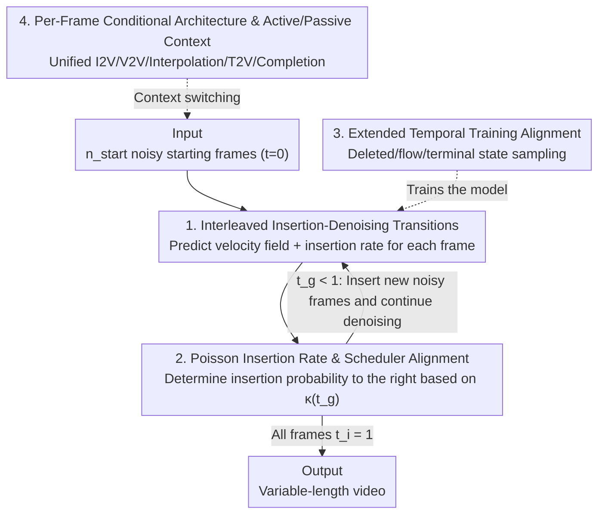

# Flowception: Temporally Expansive Flow Matching for Video Generation

**Conference**: CVPR 2026  
**Paper**: [CVF Open Access](https://openaccess.thecvf.com/content/CVPR2026/html/Ifriqi_Flowception_Temporally_Expansive_Flow_Matching_for_Video_Generation_CVPR_2026_paper.html)  
**Code**: To be confirmed  
**Area**: Video Generation / Flow Matching  
**Keywords**: Flow Matching, Video Generation, Non-autoregressive, Variable-length Generation, Frame Insertion

## TL;DR
Flowception weaves continuous flow matching denoising and discrete frame insertion into a unified probabilistic path. This allows a non-autoregressive model to insert frames into a sequence in an arbitrary order while simultaneously denoising existing frames step-by-step during sampling. This mechanism achieves variable-length video generation, outperforming both full-sequence and autoregressive baselines on FVD and VBench, while saving training FLOPs by approximately 3x.

## Background & Motivation

**Background**: The migration of expansion and flow matching models from high-fidelity image generation to video generation has primarily split into two paradigms. One is **full-sequence generation**, which treats the entire video as a large tensor where all frames share a global timestep and are denoised jointly using bi-directional attention. The other is **temporal autoregressive (AR)** generation, which generates the video frame-by-frame (or block-by-block) from left to right.

**Limitations of Prior Work**: Full-sequence models achieve high quality through collective error correction via bi-directional attention during denoising. However, they denoise the entire sequence in parallel, meaning frames cannot be streamed before the entire sequence is completely denoised. Furthermore, their generation length is fixed, and the attention complexity grows quadratically with the frame count, hindering long video generation. AR models support streaming output (displaying generated frames immediately while attending to them for subsequent frames) but suffer from two major bottlenecks:
First, **exposure bias**—during training, ground-truth frames are used as context, whereas during inference, the model must condition on its own imperfectly generated frames. This train-test mismatch prevents the model from learning error recovery, causing minor errors to accumulate and amplify along the temporal chain, rapidly degrading video quality. Second, to leverage KV caching (without which AR sampling is prohibitively expensive), AR models typically employ causal attention masks, which severely restrict representational capacity.

**Key Challenge**: Full-sequence models are high-quality but computationally heavy, fixed-length, and non-streamable; AR models are streamable but suffer from error accumulation and restricted causal attention. These two pathways present a rigid trade-off among quality, efficiency, and flexibility.

**Goal**: To design a unified framework that can simultaneously: (1) eliminate both exposure bias and causal attention restrictions of AR models; (2) lift the fixed-length constraint of full-sequence models; (3) significantly reduce the computational cost of full-sequence generation.

**Key Insight**: The authors observe that if **frames are inserted progressively rather than all at once** during generation, the sequence remains brief in the early sampling stages where only a few frames require denoising, naturally reducing attention computational overhead. Furthermore, if the insertion location is determined dynamically by the model rather than being forced in a left-to-right manner, distant frames can coordinate in early stages when the sequence is short, avoiding error accumulation without relying on restrictive causal masks.

**Core Idea**: Combine continuous Flow Matching and discrete Edit Flow into a single model to learn a unified probabilistic path that **interleaves frame insertion and denoising**. At each sampling step, the model predicts both a velocity field for denoising and an insertion rate for frame generation. This yields a **coupled ODE-jump process** over variable-length sequences, enabling video generation in arbitrary orders and to arbitrary lengths.

## Method

### Overall Architecture

Flowception operates on a variable-length frame sequence space $\mathcal{X}=\bigcup_{n=0}^{\infty}\mathbb{R}^{n\times H\times W\times C}$, where each sequence $X$ is paired with a **per-frame time vector** $t\in\bigcup_n[0,1]^n$, indicating that each frame holds its own noise level, unlike a global timestep shared across the entire sequence. At each position $i$, the model outputs two elements: an **insertion rate** $\lambda^\theta_i(X,t)\in\mathbb{R}_{\ge 0}$ (predicting the number of missing frames to its right) and a **velocity field** $v^\theta_i(X,t)\in\mathbb{R}^{H\times W\times C}$ (to denoise existing frames).

During generation, $n_{\text{start}}$ noisy starting frames are initialized (all set to $t_i=0$). Then, **transition steps** are performed iteratively: at each step, the model simultaneously (i) advances all existing frames along the velocity field $X_i\leftarrow X_i + h\,v^\theta_i$, and (ii) inserts a new noise frame (sampled from a unit Gaussian with initial $t=0$) to the right of certain frames with a probability determined by the insertion rate. A global time $t_g$, moving from 0 to 1, controls whether frame insertion is permitted. The process terminates when all frames reach $t_i=1$. Consequently, a video progressively "grows" from scattering a few distant keyframes to iteratively inserting and denoising intermediate frames. Since frames are determined solely by relative ordering, switching between "active/passive context frames" can uniformly support tasks such as I2V, V2V, frame interpolation, T2V, and scene completion.

### Key Designs

**1. Interleaved Insertion-Denoising Coupled ODE-Jump Transition Steps: Enabling "new frame growth" and "old frame denoising" to occur simultaneously in a single step**

This is the core distinction between Flowception and other fixed-length flow models: standard flow matching evaluates continuous ODEs on fixed-shape tensors, preserving sequence length throughout. Here, the sequence length dynamically changes. The authors introduce an **insertion operator** $\mathrm{ins}(X,i,\varepsilon)=(X_1,\dots,X_i,\varepsilon,X_{i+1},\dots,X_n)$ to insert a 0-SNR noisy frame after position $i$. During each transition step, two actions occur simultaneously across all positions: a flow step $X_i = X_i + h\,v^\theta_i(X,t)$ progresses existing frames through denoising, and an insertion $X=\mathrm{ins}(X,i,\varepsilon),\ t=\mathrm{ins}(t,i,0)$ is executed with probability $h\,\frac{\dot\kappa(t_g)}{1-\kappa(t_g)}\lambda^\theta_i$. This yields a coupled process combining local continuous flow (ODE) and discrete insertion (jump). Once a new frame is inserted, it and the neighboring partially denoised frames are denoised collectively in parallel; hence, the time values of later inserted frames are naturally lagged ($t_i \le t_g$). The advantage is that newly inserted frames can attend to and coordinate with their surrounding contexts from the very beginning, fundamentally bypassing the error accumulation in AR models caused by "committing preceding frames before starting subsequent ones."

**2. Poisson Insertion Rate and Scheduler Alignment: Using a learnable count head to locate and quantity insertions, aligning the insertion pace with the distribution of visible frames**

How does the model determine whether and how many frames to insert at a given position? The authors design the insertion rate head $\lambda_i$ to directly predict the **number of missing frames to its right**, optimizing it using the negative log-likelihood of a Poisson distribution (inspired by OneFlow): letting $k_i$ denote the ground-truth missing frame count between $i$ and $i+1$, the objective is formulated as $\mathcal{L}_{\text{ins}}=\sum_{i}\lambda^\theta_i(X,t)-k_i\log\lambda^\theta_i(X,t)$. During sampling, a monotonic **scheduler** $\kappa(t_g)$ (where $\kappa(0)=0, \kappa(1)=1$, dynamically behaving as a simple linear $\kappa(t)=t$) enforces that "the probability of any non-starting frame being visible at global time $t_g$ is $\kappa(t_g)$." The probability coefficient $\frac{\dot\kappa(t_g)}{1-\kappa(t_g)}\lambda^\theta_i$ in the transition step serves to calibrate the insertion pace to this scheduled distribution—leaving the spatial locations to be data-driven while ensuring overall temporal tempo control via the scheduler. Analogous to OneFlow, the insertion rate does not explicitly condition on time; $t_g$ is tracked solely during sampling and is not fed into the model. Under constant-step inference, the maximum number of iterations is roughly double the steps required for $t_g$ to reach 1.

**3. Extended Temporal Training Alignment: Eliminating Train-Inference Distribution Mismatch via Deleted/Flow/Terminal Tri-State Sampling**

The generation process naturally induces a highly distinct distribution: at any given moment, different frames have varying time values, and some frames remain uninserted. Training without replicating this distribution leads to a severe train-inference mismatch. The authors address this by introducing an **extended time** $\tau$ (which can exceed $[0, 1]$), defining the clipped value as $t=\mathrm{clip}(\tau)=\max\{0,\min\{1,\tau\}\}$. On one hand, the global time is extended to $\tau_g\in[0,2]$ (since insertions halt when $t_g$ reaches 1, but existing frames must continue denoising until they reach 1, necessitating extra temporal budget), giving $t_g=\mathrm{clip}(\tau_g)$. On the other hand, under a linear scheduler, new frames are inserted uniformly across $t_g\in[0,1]$, resulting in a temporal lag $u_i = \tau_g - \tau_i \sim \mathrm{Unif}(0,1)$, which yields $\tau_i = \tau_g - u_i \in [-1, 2]$. Consequently, each frame falls into one of three states: $\tau_i<0$ representing **deleted** (not yet inserted), $0\le\tau_i<1$ representing **flow** (being actively denoised), and $\tau_i\ge 1$ representing **terminal** (completed and frozen). During training, one simply samples $\tau_g\sim p(\tau_g)$, computes $\tau_i = \tau_g - u_i$, extracts visible frames $X^{\text{visible}}_1=(X_i\mid\tau_i>0)$, and constructs noisy sequences via $X=tX^{\text{visible}}_1+(1-t)X_0$ (where $X_0\sim\mathcal{N}(0,I)$). The velocity head is then optimized and trained using the standard flow matching loss $\mathcal{L}_{\text{vel}}=\lVert v^\theta(X,t)-(X^{\text{visible}}_1-X_0)\rVert^2$. This extended time formulation strictly aligns the distribution of "which frames are visible at what noise level" between training and inference, serving as the essential driver for the framework's effectiveness.

**4. Per-Frame Conditional DiT Architecture and Active/Passive Contexts: Unifying Multiple Tasks with a Single Model via Relative Order**

To capture varying timesteps across individual frames within a single sequence, the authors modify the AdaLN modulation in DiT to operate in a **per-frame** manner. To distinguish between noisy and conditioning frames, the input channels are doubled: the first $C$ channels house the noise frames, while the second set carries the conditioning inputs (or zero-padding). The insertion rate head appends a learnable token to each frame token, passing through a simple MLP with exponential activation to produce non-negative rates. The baseline architecture consists of 38 attention blocks with an inner dimension of 1536, 24 heads, and ~2.1B parameters. It utilizes VideoROPE for position encoding and executes full bi-directional attention across frames (and optionally concatenated text tokens in an MMDiT style). Because frames at any given moment are identified purely by their **relative order**, the authors classify context frames into two categories: **active** (which trigger subsequent insertions to their right) and **passive** (which do not trigger insertions). This classification allows a single active frame to support I2V, an ordered sequence of conditioning frames to guide arbitrary frame interpolation (without pre-specifying intermediate frame counts), and diverse combinations of active/passive contexts to cover V2V, T2V, and scene completion under one unified model—dispensing with the need to train specialized networks for each task.

### Loss & Training
The total objective is the sum of the insertion loss and the velocity loss: $\mathcal{L}_{\text{ins}}$ (Poisson counting NLL overseeing $\lambda_i$) + $\mathcal{L}_{\text{vel}}$ (standard L2 flow matching loss overseeing velocity $v_i$). During training, noisy variable-length sequences are constructed by sampling the extended time $\tau_g$ (as described in Key Design 3). Regarding computational efficiency: under a linear scheduler, $\mathbb{E}_{p(\tau_g)}[\kappa(\tau_g)^2]=\int_0^1\tau_g^2\,d\tau_g=1/3$, which reduces the attention training FLOPs to approximately $1/3$ of full-sequence flow matching. During sampling, the latest flow updates occur at $\tau_g=2$, demanding at most twice the flow iterations, which corresponds to around $2/3$ of the full-sequence FLOPs (yielding a wall-clock speedup of approximately 1.5x, or 30% faster in practice). For T2V experiments, the authors fine-tune the open-source LTX-2b (0.9.5) model after implementing the architectural modifications.

## Key Experimental Results

Evaluation is conducted on Tai-Chi-HD, RealEstate10K (narrow domain), and Kinetics-600 (class-strucure). The default resolution is 256, generating up to 145 frames @16FPS. The pipeline employs the LTX autoencoder (spatial downsampling of 32, temporal downsampling of 8, with a modified decoder that propagates a frame validity mask to support variable-length decoding). Evaluation metrics include FVD (computed against a 5k training subset) and selected dimensions from VBench. Flowception is compared against two baselines: full-sequence models and frame-by-frame autoregressive models (employing both causal and non-causal attention schemes).

### Main Results: Image-to-Video (256 resolution, 145 frames)

| Dataset | Method | Imaging↑ | Background↑ | Aesthetic↑ | Subject↑ | Dynamic↑ | FVD↓ |
|--------|------|----------|-------------|------------|----------|----------|------|
| Kinetics-600 | Full Seq. | 37.09 | 94.75 | 39.42 | 92.46 | 44.35 | 204.65 |
| Kinetics-600 | Autoreg. | 38.77 | 92.69 | 38.17 | 85.82 | 54.66 | 201.34 |
| Kinetics-600 | **Flowception** | **41.92** | **96.96** | **42.05** | **94.74** | 47.07 | **164.73** |
| Tai-Chi-HD | Full Seq. | 47.48 | 94.42 | 54.93 | 92.18 | 18.61 | 27.30 |
| Tai-Chi-HD | Autoreg. | 47.15 | 95.93 | 54.98 | 93.41 | 21.23 | 25.30 |
| Tai-Chi-HD | **Flowception** | **48.42** | 95.93 | 54.96 | **94.43** | 20.02 | **25.21** |
| RealEstate10K | Full Seq. | 50.11 | 93.48 | 44.53 | 85.85 | 81.64 | 26.17 |
| RealEstate10K | Autoreg. | 48.55 | 93.84 | 44.48 | 87.29 | 72.60 | 47.48 |
| RealEstate10K | **Flowception** | **51.18** | **96.93** | **48.09** | 87.02 | 78.59 | **21.80** |

Flowception consistently delivers superior FVD across all three datasets (with Kinetics-600 dropping from ~201–205 to 164.73, and RealEstate10K dropping from 26–47 to 21.80) and achieves optimal or sub-optimal performance on most VBench tasks. For T2V generation (fine-tuned on LTX-2b with CFG=7.0 and 50 NFEs), Flowception enhances the Imaging score to 51.37 and the Aesthetic score to 49.56, surpassing both original LTX (49.22 / 48.25) and its full-sequence fine-tuned counterpart (47.96 / 47.28), with only a minor drop in the Dynamic score; furthermore, it consistently reduces wall-clock time by roughly 30% compared to the full-sequence version.

### Ablation Study 1: Insertion Strategy Comparison (RealEstate10K)

| Insertion Strategy | FVD↓ | Motion↑ | Dynamic↑ |
|----------|------|---------|----------|
| Random | 25.03 | 99.09 | 70.68 |
| Hierarchical | 23.94 | 99.10 | 71.20 |
| Left-to-right | 23.61 | 99.03 | 73.04 |
| **Flowception (Learned Insertion Rate)** | **21.80** | **99.30** | **78.59** |

The FVD metric shows progressive improvement, stepping from random $\rightarrow$ hierarchical $\rightarrow$ left-to-right $\rightarrow$ data-driven learned strategy, validating the efficacy of learning frame insertion placement. Notably, the left-to-right baseline here obtains an FVD of 23.61, which is significantly better than the AR baseline's FVD of 47.48/45.13. The authors hypothesize that while AR baselines fully freeze prior frames before processing subsequent ones, Flowception allows new frames to begin denoising while previous frames are still partially noisy (behaving more similarly to the full-sequence baseline, which scores 26.17).

### Ablation Study 2: AR Attention Pattern Comparison (RealEstate10K)

| Metric | AR Causal | AR Non-Causal | Flowception |
|------|---------|-----------|-------------|
| FVD↓ | 47.48 | 45.13 | **21.80** |
| Imaging↑ | 48.55 | 48.70 | **51.18** |
| Background↑ | 93.84 | 93.88 | **96.93** |
| Aesthetic↑ | 44.48 | 45.28 | **48.09** |
| Subject↑ | 87.29 | 87.46 | 87.02 |
| Dynamic↑ | 72.60 | 73.52 | **78.59** |

Non-causal AR slightly outperforms causal AR across the board (confirming that causal masks restrict representation capacity), yet both remain in the 45+ FVD regime. In contrast, Flowception drastically reduces the FVD to 21.80, excelling in almost all metrics except for subject consistency.

### Key Findings
- **Learning insertion placement is critical**: Ablation 1 indicates that data-driven insertion dynamically outperforms any pre-defined order. Flowception tends to first insert distant frames to capture global motion, and then insert nearby frames to smoothly interpolate, revealing an emergent coarse-to-fine generation sequence.
- **Early short sequences benefit local attention**: Since distant frames attend to one another early when the sequence is short, Flowception is more resilient to constraining attention to a local window of $\pm K$ frames compared to full-sequence baselines (Figure 8 shows much milder degradation for Flowception as the window shrinks).
- **Error accumulation stems from "committing preceding frames" rather than "left-to-right" generation itself**: If left-to-right insertion allows previous frames to co-evolve before being fully denoised, the FVD remains low. This suggests that the primary driver for AR degradation is pre-committing previous frames.

## Highlights & Insights
- **Unifying discrete insertion and continuous denoising into a single probability path**: Formulating variable-length generation as a coupled ODE-jump process is theoretically solid (combining flow matching and edit flow) and implementationally elegant, requiring only an extra insertion rate head on DiT to gain variable-length and order-agnostic generation capabilities.
- **The ingenious three-state Deleted/Flow/Terminal design via extended time $\tau\in[-1,2]$**: By subtracting uniform lags from the global time, it neatly reconstructs the distribution in which early frames display varying noise levels and other frames are outright absent. This aligns training and inference via a single sampling formula, rendering it highly transferable to other variable-length or token-by-token diffusion/flow frameworks.
- **Structural rather than superficial efficiency gains**: The short sequence length during early stages reduces expected attention training FLOPs to exactly $1/3$ ($\int_0^1 \tau^2\, d\tau$), presenting an elegant mathematical byproduct.
- **Unified multi-task capacity under a single set of weights**: Based entirely on relative frame ordering, configuring active or passive context frames naturally unlocks tasks like I2V, V2V, T2V, and scene completion, without needing to pre-specify intermediate keyframe budgets.

## Limitations & Future Work
- **Increased sampling iterations**: The authors acknowledge that although training on subsets of sequences enables beneficial emergent properties, guaranteeing complete denoising for all frames requires the extended global time to reach $\tau_g=2$, nearly doubling the sampling steps. Investigating more efficient interleaved scheduling is an immediate future direction.
- **Mathematical derivations delegated to the supplementary material**: The main text refers readers to the supplementary material for derivations of the insertion probability coefficient $\frac{\dot\kappa}{1-\kappa}$, the lag distribution under general schedulers, and detailed FLOP analyses. This confines readers to intuitive explanations in the main text; readers should verify official mathematical details in the appendix.
- **Validation limited to narrow domains and moderate resolutions**: The experiments are mostly constrained to Tai-Chi-HD, RealEstate10K, and Kinetics-600 at 256 resolution. Results on large scale 2M open-domain videos are placed in the appendix without quantitative evaluation, demanding further open-domain validation on large-scale long videos.
- **Reliance on automated metrics**: Evaluation relies heavily on automated metrics like FVD and VBench, lacks rigorous human evaluations and long-term consistency metrics, and assesses "drift reduction" primarily through qualitative visualizations.

## Related Work & Insights
- **vs. Full-Sequence Flow/Diffusion (e.g., joint denoising of the entire video tensor)**: Full-sequence methods suffer which incur quadratic attention overhead, fixed temporal length, and zero streaming option despite their bi-directional attention benefits. Flowception preserves bi-directional joint error correction while reducing training FLOPs to $1/3$ and sampling to $2/3$ through progressive insertion, enabling variable-length natively.
- **vs. Autoregressive (Causal/Non-causal frame-by-frame)**: AR methods exhibit streaming capabilities but are hindered by exposure bias, error accumulation, and causal-mask expressivity limits due to KV-caching. Flowception relaxes preceding frame commitments to let distant frames coordinate early, dropping the FVD from 45+ to 21.80 and preventing error accumulation.
- **vs. AR variants with "multi-frame joint denoising but strictly left-to-right order" (where later frames are noisier)**: Although these methods denoise multiple frames concurrently, their strict left-to-right insertion flow prohibits early coordination among distant frames. Flowception resolves this by supporting arbitrary-order insertions.
- **vs. Keyframe-Plus-Interpolation paradigms (e.g., MovieDreamer, ART-V)**: These methods first utilize autoregressive modules for keyframes and subsequently interpolate via I2V pipelines, often leveraging CLIP or masked diffusion to combat drift. Flowception integrates keyframe selection and interpolation into a singular insertion-denoising path, bypassing explicit two-stage pipelines or hardcoded interpolation gap configurations.

## Rating
- **Novelty**: ⭐⭐⭐⭐⭐ Unifies continuous flow matching and discrete edit flow into a coupled ODE-jump process for variable-length video generation, offering a novel and theoretically sound perspective.
- **Experimental Thoroughness**: ⭐⭐⭐⭐ Solid validation across three datasets covering I2V, T2V, and frame interpolation, with comprehensive ablations on insertion orders, attention schemes, and local window shapes. However, human evaluations, large-scale general domain quantitative studies, and higher resolution demonstrations are absent.
- **Writing Quality**: ⭐⭐⭐⭐ Clear progression from motivation to methodology and efficiency gains, complemented by intuitive diagrams. Yet, key derivations are heavily deferred to the supplementary material, rendering the main text slightly self-contained.
- **Value**: ⭐⭐⭐⭐⭐ Establishes a unified alternative paradigm for long-video generation and flexible editing that balances quality, efficiency, variable-length capability, and multi-task versatility, promising significant potential impact.

<!-- RELATED:START -->

## Related Papers

- [\[CVPR 2026\] Transition Matching Distillation for Fast Video Generation](transition_matching_distillation_for_fast_video_generation.md)
- [\[CVPR 2026\] Reward Forcing: Efficient Streaming Video Generation with Rewarded Distribution Matching Distillation](reward_forcing_efficient_streaming_video_generation_with_rewarded_distribution_m.md)
- [\[CVPR 2026\] RFDM: Residual Flow Diffusion Models for Video Editing](rfdm_residual_flow_diffusion_models_for_video_editing.md)
- [\[CVPR 2026\] FlowMotion: Training-Free Flow Guidance for Video Motion Transfer](flowmotion_training-free_flow_guidance_for_video_motion_transfer.md)
- [\[ICLR 2026\] Flow Caching for Autoregressive Video Generation](../../ICLR2026/video_generation/flow_caching_for_autoregressive_video_generation.md)

<!-- RELATED:END -->
