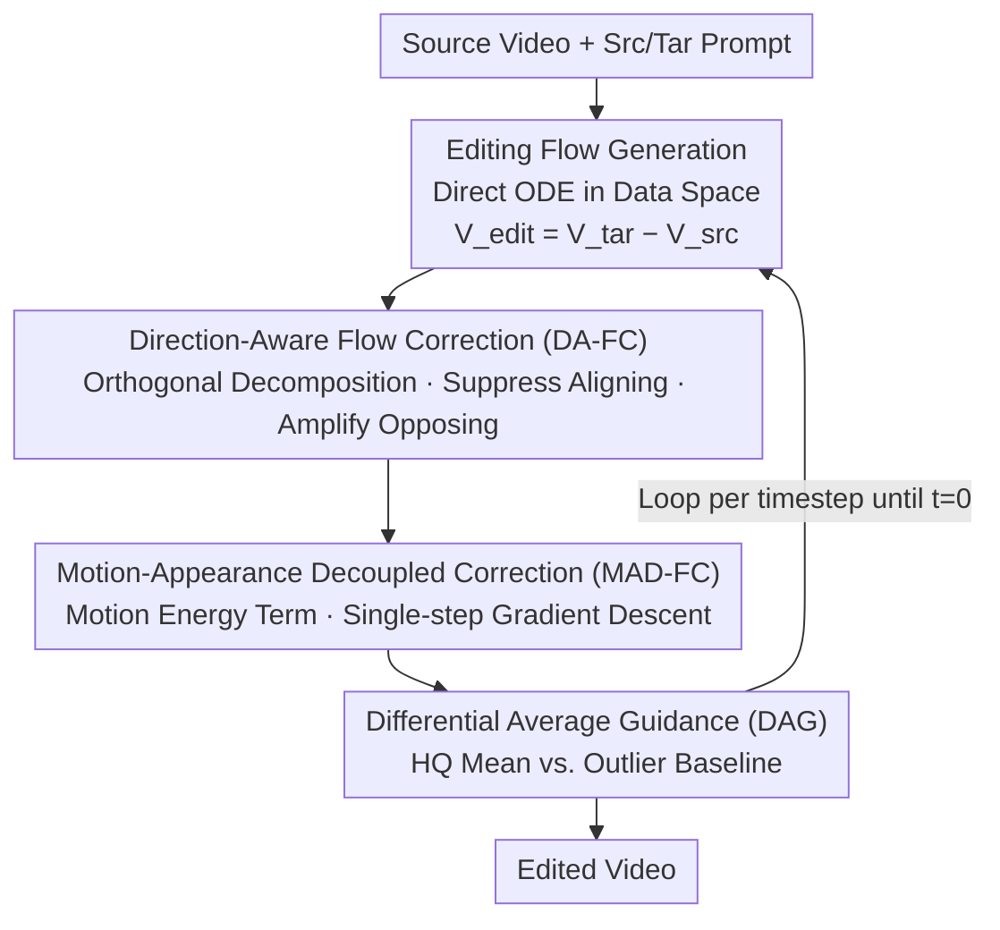

# FlowDirector: Training-Free Flow Steering for Precise Text-to-Video Editing

**Conference**: CVPR 2026  
**Paper**: [CVF Open Access](https://openaccess.thecvf.com/content/CVPR2026/html/Li_FlowDirector_Training-Free_Flow_Steering_for_Precise_Text-to-Video_Editing_CVPR_2026_paper.html)  
**Code**: The paper states it will be open-sourced (URL TBD)  
**Area**: Video Generation / Video Editing / Diffusion Models  
**Keywords**: Text-driven video editing, training-free, inversion-free editing, Rectified Flow, flow steering  

## TL;DR
FlowDirector models text-driven video editing as a "direct evolution" driven by ODEs in the data space, completely bypassing the traditional inversion step. By employing three training-free flow steering strategies (Direction-Aware, Motion-Appearance Decoupled, and Differential Average Guidance), it effectively manages "thorough modification," "motion preservation," and "trajectory stability," simultaneously achieving SOTA performance in instruction following, temporal consistency, and background preservation.

## Background & Motivation
**Background**: The mainstream of text-driven video editing follows the training-free route—directly reusing priors from pre-trained diffusion/T2V models to modify videos without fine-tuning. Almost all methods in this category (FateZero, TokenFlow, FLATTEN, RAVE, VideoDirector, etc.) follow the **inversion-editing paradigm**: first "inverting" the source video into a latent noise trajectory, then manipulating intermediate representations during the denoising process to complete the edit.

**Limitations of Prior Work**: While inversion is effective for images, it is problematic for video. Videos are high-dimensional temporal sequences, and inverting an entire video requires generating a **temporally smooth latent trajectory**, which image inversion techniques were not inherently designed for. Consequently, small per-frame inversion errors **accumulate** into temporal drift and flickering; cross-frame attention misalignment destroys layout and identity; and the entanglement of motion and appearance leads to inconsistent styles and distorted actions. Combined, these factors severely degrade editing quality.

**Key Challenge**: The inversion paradigm faces an unavoidable dilemma—it must map data to noise to create "modification space," but this mapping is imprecise. The loss of precision is directly transferred to appearance fidelity and motion consistency.

**Goal**: The goal of this work is to eliminate inversion entirely. It models the "source video → editing result" as a **direct evolution path** in the data space, allowing the video to migrate smoothly along its native spatio-temporal manifold. However, naively applying an inversion-free paradigm to video introduces three new challenges: (1) the temporal dimension carries richer appearance/structural information, making significant semantic transformations difficult without breaking spatio-temporal plausibility; (2) the lack of strong constraints leads to severe motion distortion and drift; (3) sampling noise accumulated across frames makes the system hypersensitive to perturbations, resulting in unstable trajectories.

**Key Insight**: Inspired by flow-based inversion-free image editing (FlowEdit, FlowAlign), Rectified Flow is used to construct a direct ODE trajectory between source and target distributions. However, the inversion-free paradigm has a side effect—it retains strong content information from the source video, creating a "semantic gravity" that pulls the edit back, leading to overly conservative results. This is precisely what needs to be overcome.

**Core Idea**: On top of the direct ODE editing flow, three complementary flow steering operators are superimposed to address "insufficient editing," "motion drift," and "trajectory jitter," all without training any parameters.

## Method

### Overall Architecture
The input to FlowDirector is a source video $X_{\text{src}}$ + source prompt $c_{\text{src}}$ (automatically described by an LLM if unavailable) + target prompt $c_{\text{tar}}$. The output is the edited video, processed entirely using a pre-trained T2V model $v_\theta$ (implemented with Wan-2.1 1.3B) without fine-tuning.

The pipeline starts by constructing a direct ODE trajectory in the data space via **Editing Flow Generation**: the evolution velocity of the editing state $Z_t^{\text{edit}}$ is defined as the difference between target and source velocities, with the trajectory starting from the source video ($t=1$) and converging to the edited result ($t=0$). At **each time step**, the editing flow sequentially passes through three steering stages: **DA-FC** for reorientation (ensuring the edit is effective), **MAD-FC** for motion locking (preventing motion drift), and **DAG** for trajectory stabilization (preventing texture jitter), followed by integration to obtain the result. Since these three corrections are serial and progressively refine the same editing flow, the trajectory is shorter and more efficient than inversion methods, yielding higher quality.

### Key Designs

**1. Editing Flow Generation: Transforming editing into direct ODE evolution in data space, eliminating inversion.**

To address the root cause of "imprecise inversion degrading fidelity," FlowDirector no longer uses the Gaussian noise mapping of the video as a starting point. Instead, it constructs the editing trajectory directly in the data space. Following the unified editing equation of FlowEdit, the editing state is defined as $Z_t^{\text{edit}} = X_{\text{src}} - Z_t^{\text{src}} + Z_t^{\text{tar}}$, and its evolution is controlled by an ODE where the velocity field is the difference between target and source velocities:

$$\frac{dZ_t^{\text{edit}}}{dt} = V_{\text{edit}}(t) = v_\theta(Z_t^{\text{tar}}, t, c_{\text{tar}}) - v_\theta(Z_t^{\text{src}}, t, c_{\text{src}})$$

The trajectory starts at $Z_1^{\text{edit}} = X_{\text{src}}$ and converges to the editing result as $t\to 0$. The source state is obtained via Rectified Flow linear interpolation $Z_t^{\text{src}} = (1-t)X_{\text{src}} + tN_t$ ($N_t\sim\mathcal{N}(0,I)$). Since the target video is unseen, the target state is solved by inverting the editing equation: $Z_t^{\text{tar}} = Z_t^{\text{edit}} + Z_t^{\text{src}} - X_{\text{src}}$. The advantage of this construction is that **the source and target states share the same noise $N_t$**. When taking the difference, noise and random perturbations cancel out, leaving $V_{\text{edit}}$ to carry the semantic changes driven by the prompts, which is the object of all subsequent steering.

**2. Direction-Aware Flow Correction (DA-FC): Suppressing components that "resist change" and magnifying those that "drive change."**

Inversion-free paradigms retain strong source priors, creating "semantic gravity." Standard editing flows are often overwhelmed by source priors, resulting in conservative edits. The key insight is that the original editing flow contains two opposing forces: components **aligning** with the source direction cause redundant drift, while components **opposing** the source direction truly drive semantic change. DA-FC performs orthogonal decomposition on $V_{\text{edit}}$ along $V_{\text{src}}$ for each token:

$$V_{\parallel} = \frac{\langle V_{\text{edit}}, V_{\text{src}}\rangle}{\|V_{\text{src}}\|^2 + \varepsilon}\, V_{\text{src}}, \quad V_{\perp} = V_{\text{edit}} - V_{\parallel}$$

Asymmetric steering is then applied: when $V_\parallel$ aligns with the source (inner product $\ge 0$), only the perpendicular component $V_\perp$ is kept; when it opposes the source (inner product $<0$), it is amplified: $\tilde{V}_{\text{edit}} = (1+\alpha)V_\parallel + V_\perp$ ($\alpha>0$ is the amplification factor). This suppresses redundant alignment and amplifies "change force," leading to a more decisive trajectory. To avoid modifying irrelevant regions, an editing mask $M$ is aggregated from cross-attention maps of prompts and softened using Euclidean distance transform $d$ with exponential decay: $\widetilde{M}_{c,t}(x,y) = M_{c,t}(x,y) + (1-M_{c,t}(x,y))e^{-\lambda d_{c,t}(x,y)}$. This is applied element-wise: $\hat{V}_{\text{edit}} = \tilde{V}_{\text{edit}} \odot \widetilde{M}$, ensuring smooth transitions between edited areas and background.

**3. Motion-Appearance Decoupled Flow Correction (MAD-FC): Constructing an orthogonal control surface that penalizes motion deviation while remaining immune to appearance changes.**

Drastic appearance transformations (e.g., person to bear) and strict motion preservation (e.g., basketball trajectory) often conflict. Inversion-free methods cannot inject explicit structural guidance (like cross-attention maps) from the source as inversion methods do. Under complex dynamics like occlusion, motion errors accumulate and are misinterpreted by the model as "intended appearance changes," causing depth mismatch. Simply forcing similarity to the source would undo necessary appearance edits. MAD-FC separates "pure motion" from static appearance mathematically: at each step, Tweedie estimates the denoised states $Z_0^{\text{src}} = Z_t^{\text{src}} - tV_{\text{src}}$ and $Z_0^{\text{tar}} = Z_t^{\text{tar}} - tV_{\text{tar}}$. Temporal averaging provides appearance reference anchors $(A_h^{\text{src}}, A_h^{\text{tar}})$, and motion representations are obtained by subtracting anchors from denoised states: $G_{\text{src}} = Z_0^{\text{src}} - A_h^{\text{src}}$, $G_{\text{tar}} = Z_0^{\text{tar}} - A_h^{\text{tar}}$. Motion mismatch is measured by energy $J_t(Z) = \tfrac{1}{2}\|G_{\text{tar}} - G_{\text{src}}\|_2^2$.

After the standard ODE update, **single-step gradient descent** on $J_t$ corrects the editing state. Using the first-order approximation $\nabla_{Z_t} J_t \approx G_{\text{tar}} - G_{\text{src}}$, the update is:

$$Z_t^{\text{edit}} \leftarrow Z_t^{\text{edit}} - \zeta\Big[\underbrace{(Z_0^{\text{tar}} - Z_0^{\text{src}})}_{\text{motion}} - \phi\underbrace{(A_h^{\text{tar}} - A_h^{\text{src}})}_{\text{appearance}}\Big]$$

Where $\zeta>0$ controls overall correction strength and $\phi\in[0,1]$ adjusts the degree of "appearance alignment." MAD-FC effectively aligns source and target motion energy at each step, transferring source motion while using $\phi$ to trade off between appearance correction and motion preservation—ensuring stability during complex dynamics.

**4. Differential Average Guidance (DAG): Pushing trajectories away from noise using "consensus vs. outlier" differential signals.**

Direct ODE editing velocity estimates have high variance, where single-sample noise introduces directional jitter that accumulates into temporal flickering. While image editing can suppress noise through brute-force multiple-sample averaging, this is computationally expensive for video. DAG uses "active navigation": at each step, $L_{\text{HQ}}$ editing flows under different noises are averaged for a high-quality estimate $V_{\text{HQ}} = \frac{1}{L_{\text{HQ}}}\sum_{\ell} V_{\text{edit}}^{(\ell)}$; then, the $K$ samples with the **lowest** cosine similarity to $V_{\text{HQ}}$ are picked and averaged as a conservative baseline $V_{\text{BL}}$. The difference $\bar{D} = V_{\text{HQ}} - V_{\text{BL}}$ acts as a "noise drift" signal, guiding the final velocity: $V_{\text{DAG}} = V_{\text{HQ}} + w\bar{D}$ ($w>0$). This actively pushes the trajectory away from outlier noise, locking the edit onto a low-variance manifold with minimal computation ($L_{\text{HQ}}=3, K=2$). To further stabilize details against wide steps in late-stage flow-matching, a **single noise sample is fixed** for the final 8 denoising steps.

### Loss & Training
The entire process is **training-free, with no parameter updates**. Key hyperparameters: 50-step denoising with no skipping; $\alpha=0.25$ and $\lambda=0.25$ for DA-FC; Task-specific $(\zeta, \phi)$ for MAD-FC—$(0.01, 0.3)$ for strong motion, $(0.007, 0.5)$ for weak motion; $L_{\text{HQ}}=3, K=2, w=2.75$ for DAG, with noise fixed for the last 8 steps. Main results were obtained using Wan-2.1 1.3B on a single NVIDIA H20 141G.

## Key Experimental Results

Evaluation set: 150 video-text editing pairs constructed from internet videos and DAVIS, covering insertion, deletion, and object editing, evaluated at 41-frame and 81-frame settings. Baselines: FateZero, FLATTEN, TokenFlow, RAVE, and VideoDirector. Metrics: Pick-Score (human preference), CLIP-T (text alignment), CLIP-F (temporal consistency), WarpSSIM (structure preservation via RAFT optical flow), and $Q_{\text{edit}}=\text{WarpSSIM}\cdot\text{CLIP-T}$ (comprehensive).

### Main Results
The table below shows results for 41 frames (↑ higher is better).

| Method | Pick-Score↑ | CLIP-T↑ | CLIP-F↑ | WarpSSIM↑ | Q_edit↑ |
|------|-------------|---------|---------|-----------|---------|
| FateZero | 20.41 | 32.01 | 92.25 | 78.37 | 25.09 |
| FLATTEN | 20.84 | 33.56 | 92.80 | 77.44 | 26.01 |
| TokenFlow | 20.99 | 32.69 | 93.82 | 74.98 | 24.51 |
| RAVE | 21.01 | 33.25 | 94.03 | 76.32 | 25.38 |
| VideoDirector | 20.61 | 32.56 | 95.48 | 75.89 | 24.70 |
| **FlowDirector (1.3B)** | **21.82** | **34.64** | **97.34** | **78.49** | **27.19** |
| FlowDirector (14B) | 22.61 | 34.95 | 97.30 | 79.86 | 28.67 |

Ours 1.3B version leads across CLIP-T, CLIP-F, and $Q_{\text{edit}}$, with Pick-Score and WarpSSIM being the best or second best; the 14B model improves almost all metrics further.

### Ablation Study
Removing components sequentially (41 frames):

| Config | CLIP-T↑ | CLIP-F↑ | WarpSSIM↑ | Q_edit↑ | Note |
|------|---------|---------|-----------|---------|------|
| Director ODE (no skip) | 34.59 | 94.66 | 62.71 | 21.69 | Raw ODE, poor structure preservation |
| Director ODE (skip) | 32.23 | 96.84 | 78.90 | 25.43 | Skip early steps; stable but weak editing |
| w/o DA-FC | 32.25 | 95.70 | 78.83 | 25.42 | No direction steering; CLIP-T drops to 32.25 |
| w/o MAD-FC | 34.71 | 97.10 | 69.26 | 24.04 | No motion decoupling; WarpSSIM drops to 69.26 |
| w/o DAG | 34.62 | 97.19 | 78.32 | 27.11 | No differential guidance; flickering returns |
| **FlowDirector** | 34.64 | 97.34 | 78.49 | 27.19 | Full model |

Ablating $\alpha$ in DA-FC: Increasing $\alpha$ from 0 to 0.25 improves CLIP-T from 33.02 to 34.64 and $Q_{\text{edit}}$ from 26.04 to 27.19, validating that "amplifying opposite components → more thorough editing."

### Key Findings
- **MAD-FC contributes most to motion preservation**: Removing it drops WarpSSIM from 78.49 to 69.26 (approx. −9.2). CLIP-T slightly rises—confirming that without motion constraints, the model interprets motion errors as "intentional appearance changes."
- **DA-FC determines editing effectiveness**: Removing it drops CLIP-T to 32.25; edits are submerged by source priors. Larger $\alpha$ strengthens semantic change but lowers WarpSSIM, which the authors attribute to metric limitations—warping edited frames with source flow causes mismatch during drastic edits.
- **DAG's visual gains exceed numerical gains**: Metrics show minor improvements, but the authors note that WarpSSIM/CLIP-T are insensitive to texture flickering and local inconsistencies ⚠️, underestimating DAG's actual impact.
- **Robustness to long occlusion**: In a "bike → motorcycle" case with ~20 frames of occlusion, the object retains identity and appearance consistency before and after occlusion—a major difficulty for inversion methods.

## Highlights & Insights
- **Orthogonal decomposition of editing flow** is the most elegant tactic: separating "redundant same-direction components" from "effective opposite-direction components" and steering them asymmetrically solves the "semantic gravity" problem. This token-wise decomposition is transferable to any flow/velocity-guided task.
- **Differential vs. Simple Average**: DAG does not just average samples; it constructs a "consensus vs. outlier" signal for active navigation, approaching low-variance results with only 3 samples—a practical trick for high-dimensional domains.
- **Motion-Appearance Decoupling via Anchors**: Using temporal averages as appearance anchors and denoised residuals as motion, combined with single-step gradient descent, achieves adjustable motion transfer without explicit structural guidance.
- The method is **entirely training-free** and plug-and-play for pre-trained T2V models. The three operators are non-coupled and address specific symptoms, resulting in a clean "diagnosis-treatment" design.

## Limitations & Future Work
- WarpSSIM systematic distortions occur during dramatic deformations when using source video optical flow; the metric penalizes strong edits—a better motion preservation metric is needed.
- Three steering operators introduce task-related hyperparameters (especially $(\zeta, \phi)$ in MAD-FC), limiting automation.
- DAG requires multiple samplings, incurring computational overhead (runtime analysis and acceleration were moved to Supplementary Material ⚠️).
- Performance is heavily bound by the spatio-temporal prior quality of the base T2V model (Wan-2.1).

## Related Work & Insights
- **vs. FlowEdit / FlowAlign (Inversion-free Image Editing)**: Inherits the "direct ODE in data space" core but identifies and solves the three specific video challenges (conservative editing, motion drift, noise sensitivity).
- **vs. VideoDirector / Other Inversion-based T2V Editing**: These follow "invert-then-denoise" and suffer from error accumulation. FlowDirector eliminates inversion at its root, significantly outperforming them in CLIP-F and temporal consistency.
- **vs. FateZero / TokenFlow / FLATTEN / RAVE (Zero-shot T2I Adapters)**: These lack native temporal understanding. FlowDirector utilizes native T2V priors and flow steering for superior consistency and precision.

## Rating
- Novelty: ⭐⭐⭐⭐⭐ First to implement inversion-free ODE editing for video; orthogonal decomposition and differential guidance are highly original.
- Experimental Thoroughness: ⭐⭐⭐⭐ 5 SOTA baselines, dual frame lengths, multiple metrics, and ablation. However, some key analyses (runtime, MAD-FC params) were deferred to supplementary.
- Writing Quality: ⭐⭐⭐⭐⭐ Clear chain of logic: motivation → pain points → countermeasures; the "why" behind each steering operator is well-explained.
- Value: ⭐⭐⭐⭐⭐ Training-free, plug-and-play, SOTA quality; establishes a new paradigm for inversion-free video editing.

<!-- RELATED:START -->

## Related Papers

- [\[CVPR 2026\] FlowPortal: Residual-Corrected Flow for Training-Free Video Relighting and Background Replacement](flowportal_residual-corrected_flow_for_training-free_video_relighting_and_backgr.md)
- [\[CVPR 2026\] FlowMotion: Training-Free Flow Guidance for Video Motion Transfer](flowmotion_training-free_flow_guidance_for_video_motion_transfer.md)
- [\[CVPR 2026\] RFDM: Residual Flow Diffusion Models for Video Editing](rfdm_residual_flow_diffusion_models_for_video_editing.md)
- [\[CVPR 2026\] SWIFT: Sliding Window Reconstruction for Few-Shot Training-Free Generated Video Attribution](swift_sliding_window_reconstruction_for_few-shot_training-free_generated_video_a.md)
- [\[CVPR 2026\] SwitchCraft: Training-Free Multi-Event Video Generation with Attention Controls](switchcraft_training-free_multi-event_video_generation_with_attention_controls.md)

<!-- RELATED:END -->
