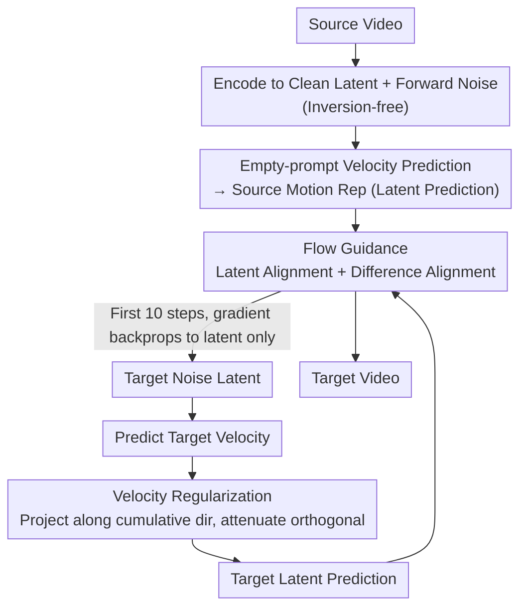

# FlowMotion: Training-Free Flow Guidance for Video Motion Transfer

**Conference**: CVPR2026  
**arXiv**: [2603.06289](https://arxiv.org/abs/2603.06289)  
**Code**: [HKUST-LongGroup/FlowMotion](https://github.com/HKUST-LongGroup/FlowMotion)  
**Area**: Video Generation  
**Keywords**: video motion transfer, flow matching, training-free, latent prediction, velocity regularization

## TL;DR

FlowMotion is proposed as a training-free video motion transfer framework that constructs motion guidance signals directly using the latent prediction from flow-based T2V models. By avoiding gradient backpropagation through internal model layers, it achieves high motion fidelity while significantly reducing inference time and GPU memory overhead.

## Background & Motivation

1.  **Demand for Video Motion Transfer**: Given a source video and a text prompt, the goal is to generate a target video that preserves the source motion patterns (object movement, camera trajectories, etc.) while rendering a new scene. This has wide applications in VR and film production.
2.  **High Cost of Training-based Methods**: Methods like MotionDirector and MotionInversion require fine-tuning temporal attention or LoRA parameters for each reference video, taking 20 minutes to over 2 hours, which is unsuitable for real-time or large-scale scenarios.
3.  **Low Efficiency of Existing Training-free Methods**: Methods such as MotionClone, SMM, and DiTFlow rely on intermediate outputs (attention maps / diffusion features) and require backpropagation through deep internal layers. This results in GPU memory usage as high as 51–89 GB and inference times of 350–1800+ seconds.
4.  **Architectural Dependency**: Most training-free methods are tied to specific architectures (U-Net / DiT) and are difficult to generalize to new models; some also require an additional inversion process, further increasing time costs.
5.  **Rise of Flow-based T2V Models**: Models based on flow matching and DiT, such as Wan and HunyuanVideo, have become SOTA, yet existing motion transfer methods haven't fully exploited the characteristics of flow-based models.
6.  **Key Insight — Early Latent Prediction Encodes Rich Temporal Information**: Analysis reveals that in the early steps of the denoising process in flow-based T2V models, the latent prediction (a single-step estimation of the clean latent) already contains coarse motion trajectories and temporal dynamics, while appearance details accumulate later. This provides a theoretical basis for constructing motion guidance directly on the predicted output.

## Method

### Overall Architecture

FlowMotion addresses specific pain points: existing training-free motion transfer either relies on internal layers (attention maps/diffusion features) for backpropagation—requiring 51–89 GB VRAM and hundreds of seconds—or is locked to specific architectures and requires inversion. The key observation is that the **latent prediction** in flow-based T2V models already encodes coarse motion and dynamics in early denoising steps. FlowMotion operates directly on this output: the source video is encoded into a clean latent $z_0^{src}$, forward-noised to $z_t^{src}$, and passed through the model to predict velocity $v_t^{src}$ to compute the motion representation $\hat{z}_0^{src}(t) = z_t^{src} - t \cdot v_t^{src}$ (without inversion). During target generation, the target latent prediction is computed in the first 10 steps, stabilized via **Velocity Regularization**, and aligned with the source motion via **Flow Guidance**. **Gradients are only backpropagated to the latent itself, not through internal layers**, resulting in extremely low memory usage and architecture independence.

### Key Designs

**1. Flow Guidance: Dual Alignment on Latent Prediction for Motion Extraction**

Simply guiding the latent prediction is insufficient; it must align "motion" rather than "appearance." Two alignment objectives are designed: **Latent Alignment (LA)** directly aligns the source and target latent predictions to maintain global motion consistency, $\mathcal{L}_{LA} = \|\hat{z}_0^{src}(t) - \hat{z}_0(t)\|_2^2$; **Difference Alignment (DA)** aligns inter-frame differences $\triangle(\hat{z}_0^{src}(t))$ and $\triangle(\hat{z}_0(t))$. Since inter-frame differences emphasize temporal changes, they suppress static appearance information: $\mathcal{L}_{DA} = \|\triangle(\hat{z}_0^{src}(t)) - \triangle(\hat{z}_0(t))\|_2^2$. These are weighted with $\alpha:\beta = 4:1$ as $\mathcal{L}_{FG} = \alpha \cdot \mathcal{L}_{LA} + \beta \cdot \mathcal{L}_{DA}$, where LA governs global consistency and DA governs temporal variation.

**2. Velocity Regularization: Suppressing Orthogonal Components to Prevent Over-alignment**

Directly optimizing latent prediction can lead to overfitting appearance details and unstable updates across steps. The velocity is decomposed relative to the "cumulative average velocity": the cumulative average velocity is computed as $v_t^{avg} = (z_t - z_1) / (t-1)$. The current velocity is decomposed into a projection component $v_t^{proj}$ along $v_t^{avg}$ and an orthogonal component $v_t^{orth}$. The orthogonal component is suppressed using an attenuation factor $\gamma=0.1$: $v_t^{reg} = v_t^{proj} + \gamma \cdot v_t^{orth}$. The regularized velocity is then used to recompute the latent prediction $\hat{z}_0(t) = z_t - t \cdot v_t^{reg}$. The projection component represents the main direction of motion evolution and is preserved, while the orthogonal component represents jitters and is attenuated, ensuring both stability and alignment. Removing this in ablations causes all metrics to drop significantly (Text Sim. from 0.347 to 0.313).

### Loss & Training

-   Guidance is applied only during the first 10 out of 50 denoising steps.
-   Each step involves 3 iterations of optimization for the target latent using the Adam optimizer.
-   Learning rate is 0.003, CFG scale = 6.
-   Gradients are only backpropagated to the latent rather than internal model layers, resulting in minimal memory overhead.

## Key Experimental Results

### Main Results (Table 1)

| Method | Type | Backbone | Text Sim.↑ | Motion Fid.↑ | Temp. Cons.↑ | Training Time (s) | Inference Time (s) | VRAM (GB) |
| :--- | :--- | :--- | :--- | :--- | :--- | :--- | :--- | :--- |
| LoRA Tuning | train | Wan2.1-1.3B | 0.327 | 0.782 | 0.977 | 8100 | 135 | 25.0 |
| MotionDirector | train | ZeroScope-0.7B | 0.335 | 0.801 | 0.969 | 1662 | 140 | 28.0 |
| MotionInversion | train | ZeroScope-0.7B | 0.328 | 0.839 | 0.970 | 1170 | 115 | 24.0 |
| DeT | train | CogVideoX-2B | 0.340 | 0.812 | 0.980 | 2760 | 133 | 20.0 |
| MotionClone | free | AnimateDiff-1.3B | 0.332 | 0.786 | 0.940 | - | 804 | 51.5 |
| MOFT | free | AnimateDiff-1.3B | 0.338 | 0.582 | 0.973 | - | 576 | 75.0 |
| SMM | free | ZeroScope-0.7B | 0.322 | 0.762 | 0.958 | - | 1839 | 89.4 |
| DiTFlow | free | CogVideoX-2B | 0.350 | 0.691 | 0.983 | - | 349 | 63.5 |
| **FlowMotion** | **free** | **Wan2.1-1.3B** | **0.347** | **0.850** | **0.986** | **-** | **213** | **19.3** |

FlowMotion is **optimal in Motion Fidelity (0.850) and Temporal Consistency (0.986)**, with Text Similarity ranking second only to DiTFlow. Inference time is only 213s (fastest among training-free), and VRAM is only 19.3 GB (lowest among all methods).

### Ablation Study (Table 3)

| Variant | Text Sim.↑ | Motion Fid.↑ | Temp. Cons.↑ |
| :--- | :--- | :--- | :--- |
| w/o DA (No Difference Alignment) | 0.341 | 0.842 | 0.981 |
| w/o VR (No Velocity Regularization) | 0.313 | 0.809 | 0.968 |
| **Full FlowMotion** | **0.347** | **0.850** | **0.986** |

Removing VR leads to a significant drop in all metrics (especially Text Sim. from 0.347 to 0.313), proving its importance for stable optimization.

### VRAM Efficiency Analysis (Table 4, same Wan2.1-1.3B backbone)

| Guidance Source | VRAM (GB) |
| :--- | :--- |
| Pure Inference (No Guidance) | 17.7 |
| **Latent Prediction (Ours)** | **19.3** |
| Velocity Output | 93.1 |
| Attention Map & Feature | OOM |

Latent prediction guidance only adds 1.6 GB over pure inference, whereas using velocity directly requires 93 GB, and attention-based guidance results in OOM.

### User Study (Table 2, 20 volunteers, scale 1-5)

| Method | Motion↑ | Temp.↑ | Text↑ | Overall↑ |
| :--- | :--- | :--- | :--- | :--- |
| MotionInversion | 3.41 | 3.34 | 2.69 | 2.83 |
| DiTFlow | 2.48 | 3.18 | 3.16 | 2.63 |
| DeT | 3.87 | 3.83 | 3.38 | 3.47 |
| **FlowMotion** | **4.51** | **4.52** | **4.51** | **4.45** |

## Highlights

-   **Simple and Efficient**: Guidance signals are based directly on the model's predicted output. Gradients do not pass through internal layers, requiring only 19.3 GB VRAM and 213s inference time, making it the most efficient training-free method.
-   **Inversion-free**: Extracts source motion representations via forward noise and empty prompts, skipping the time-consuming inversion process.
-   **Architecture-agnostic**: Does not rely on specific attention structures or internal U-Net/DiT modules; validated on Wan2.1-1.3B and Wan2.2-5B.
-   **Elegant Velocity Regularization**: Decomposes velocity into projection and orthogonal components relative to the cumulative direction, attenuating the latter to suppress over-alignment—a simple yet effective approach.

## Limitations & Future Work

-   Motion representation is still global latent-level alignment, lacking fine-grained control over local/regional motion (e.g., transferring foreground motion while keeping the background free).
-   Using latent prediction as a motion representation couples appearance information to some extent. The authors note that using clean latent $z_0^{src}$ improves accuracy but decreases text alignment and background diversity; adaptive balancing remains to be explored.
-   Evaluation was conducted at 480×720 and 49 frames; scalability to higher resolutions and longer videos is not verified.
-   Baselines use different backbones due to architectural incompatibility, which limits the fairness of comparisons.

## Related Work & Insights

| Dimension | Training-based (MotionDirector/DeT) | Training-free (DiTFlow/SMM) | FlowMotion |
| :--- | :--- | :--- | :--- |
| Needs Training | Yes, per-video fine-tuning | No | No |
| Motion Guidance Source | Learned parameters | Internal intermediate outputs | Model predicted output (latent prediction) |
| VRAM Requirement | 20-28 GB | 51-89 GB | **19.3 GB** |
| Inference Time | 115-140s (+ training) | 349-1839s | **213s** |
| Arch. Dependency | Tied to specific backbone | Tied to internal structure | **Architecture-agnostic** |
| Motion Fidelity | High (Overfits appearance easily) | Medium | **Highest** |

## Rating

-   Novelty: ⭐⭐⭐⭐ — Approaches motion transfer from the perspective of flow matching latent prediction; observations are novel and designs are concise.
-   Experimental Thoroughness: ⭐⭐⭐⭐ — Covers quantitative, qualitative, ablation, user study, and memory analysis with complete baseline comparisons.
-   Writing Quality: ⭐⭐⭐⭐ — Clear diagrams, persuasive motivation analysis, and standard structure.
-   Value: ⭐⭐⭐⭐ — Achieves significant improvements in efficiency and performance for training-free motion transfer, offering high practical value.

<!-- RELATED:START -->

## Related Papers

- [\[CVPR 2026\] FlowDirector: Training-Free Flow Steering for Precise Text-to-Video Editing](flowdirector_training-free_flow_steering_for_precise_text-to-video_editing.md)
- [\[CVPR 2026\] FlowPortal: Residual-Corrected Flow for Training-Free Video Relighting and Background Replacement](flowportal_residual-corrected_flow_for_training-free_video_relighting_and_backgr.md)
- [\[ICLR 2026\] Frame Guidance: Training-Free Guidance for Frame-Level Control in Video Diffusion Models](../../ICLR2026/video_generation/frame_guidance_training-free_guidance_for_frame-level_control_in_video_diffusion.md)
- [\[ICLR 2026\] FastVMT: Eliminating Redundancy in Video Motion Transfer](../../ICLR2026/video_generation/fastvmt_eliminating_redundancy_in_video_motion_transfer.md)
- [\[ICLR 2026\] LightCtrl: Training-free Controllable Video Relighting](../../ICLR2026/video_generation/lightctrl_training-free_controllable_video_relighting.md)

<!-- RELATED:END -->
