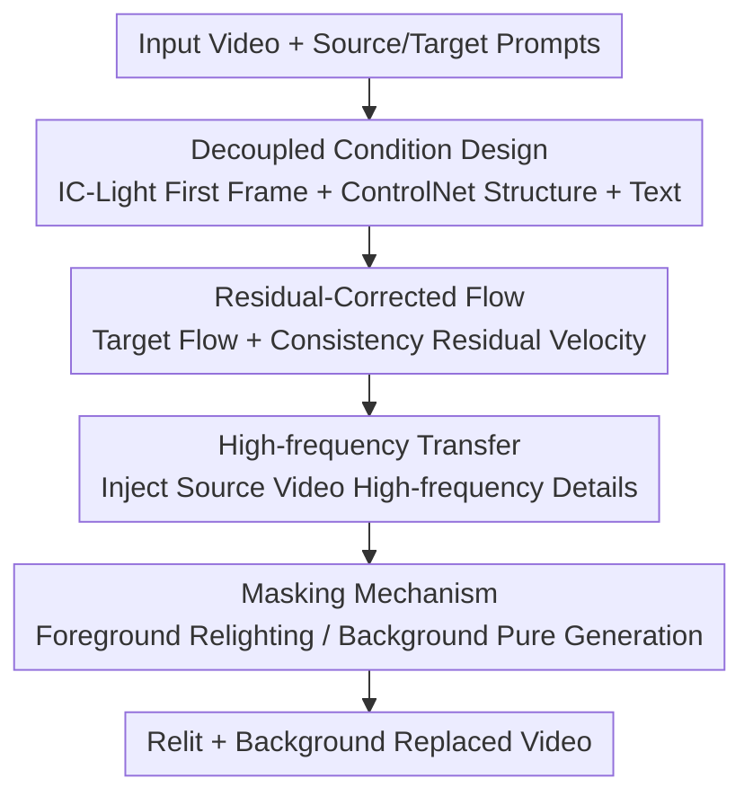

# FlowPortal: Residual-Corrected Flow for Training-Free Video Relighting and Background Replacement

**Conference**: CVPR 2026  
**Paper**: [CVF Open Access](https://openaccess.thecvf.com/content/CVPR2026/html/Gao_FlowPortal_Residual-Corrected_Flow_for_Training-Free_Video_Relighting_and_Background_Replacement_CVPR_2026_paper.html)  
**Code**: [Project Page](https://gaowenshuo.github.io/FlowPortalProject/) (Project page only, no open-source repository observed)  
**Area**: Video Generation / Diffusion Models  
**Keywords**: Video Relighting, Background Replacement, Training-free, Flow Editing, Residual Correction

## TL;DR
FlowPortal requires no model training. Instead, it utilizes "Residual-Corrected Flow" to transform off-the-shelf video diffusion flow models into editing models. By enforcing perfect reconstruction when source and target conditions are identical and specifically altering the lighting direction otherwise—supplemented by decoupled conditions, high-frequency transfer, and foreground masks—it achieves temporally coherent, structurally faithful, and naturally relit video editing and background replacement within 3–5 minutes.

## Background & Motivation
**Background**: Video relighting and background replacement are essential for film production and virtual shooting. Existing methods follow two paths: training-based methods (e.g., RelightVid, Lumen, TC-Light) that construct paired video datasets to train lighting-conditioned diffusion models, and training-free methods (e.g., AnyPortal, Light-A-Video) that combine image relighting models (IC-Light) with video diffusion models during inference.

**Limitations of Prior Work**: Training-based methods require the collection of large-scale paired videos of the same scene under different lighting, which is extremely costly. Furthermore, these models often struggle to balance lighting variety with foreground fidelity, frequently resulting in subtle lighting changes or detail collapse in complex conditions. Training-free methods suffer because IC-Light operates **frame-by-frame**, leading to inherent temporal discontinuities that video models struggle to correct. Combined with weak conditioning, this results in structural/motion misalignment and bloated pipelines taking 20–30 minutes per video.

**Key Challenge**: There is a fundamental conflict between temporal consistency, spatial fidelity, natural lighting, and efficiency. Frame-by-frame processing preserves lighting quality but ruins temporal consistency, while whole-video processing preserves consistency but struggles with precise light control. The authors argue the root cause is the **lack of a unified framework capable of systematically decomposing and independently controlling the three elements of video: structure, motion, and lighting**.

**Goal**: To achieve "altering only the lighting while preserving everything else" without training, ensuring the output is identical to the input when conditions remain unchanged.

**Key Insight**: The authors propose the principle of **Condition Consistency**: every change in the output should be driven solely by changes in the input conditions. This leads to two corollaries: (1) Directional Change: if conditions differ only in lighting, the output should differ only in lighting; (2) Stability under Identity: when source and target conditions are identical, the output must equal the input pixel-by-pixel. While existing flow models satisfy stability for synthetic videos, they fail for **real input videos** because model limitations and insufficient source condition information cause the reconstructed $z_0^{\text{src}}$ to deviate from the real $z_0$.

**Core Idea**: Instead of retraining, the "residual velocity" is constructed during inference to steer the model's predicted flow back to the reconstruction trajectory of the real input. This "rewrites" the generative model into an editing model that satisfies condition consistency—termed Residual-Corrected Flow.

## Method

### Overall Architecture
FlowPortal is based on a pre-trained I2V flow video diffusion model (implemented using Wan2.1). Inputs include a real video and source/target text prompts, while the output is a relit video with an optional background replacement. The pipeline is entirely training-free and inference-only: first, IC-Light edits the first frame as a visual anchor; ControlNet extracts structural conditions; and BiRefNet+MatAnyone extract foreground masks (**Decoupled Condition Design** provides stable directional guidance). Then, **Residual-Corrected Flow** adds a "target condition flow" to a "consistency residual velocity" that pulls the source reconstruction back to the real input. **High-frequency Transfer** injects source details at each generation step, and a **Masking Mechanism** separates foreground relighting from background generation. No parameters of the flow model are modified.

### Key Designs

**1. Residual-Corrected Flow: Steering Generative Flow to the Real Input Trajectory**

This is the core contribution addressing the breakdown of stability in real videos. In flow models, latent $z_t$ evolves between $t\in[0,1]$, where $t=1$ is noise $z_1\sim\mathcal{N}(0,I)$ and $t=0$ is clean data. The model predicts a velocity field $V_t^c(z_t)=F_\theta(z_t,t,c)$ and performs discrete iterative denoising via the ODE $\frac{dz_t}{dt}=V_t^c(z_t)$. Naive editing flow uses a fixed noise $\epsilon$ to denoise under source and target conditions to get $z_0^{\text{src}}$ and $z_0^{\text{tar}}$. For synthetic videos sharing $\epsilon$, $z_0^{\text{tar}}=z_0^{\text{src}}$ when source equals target. However, for real $z_0$, model reconstruction $z_0^{\text{src}} \neq z_0$.

The solution corrects $z_0^{\text{src}}$ and $z_0^{\text{tar}}$ by pulling the former to the real $z_0$. The ideal velocity for direct recovery from $\epsilon$ to $z_0$ is defined as:

$$V_0=\frac{z_0-\epsilon}{1-0},\qquad z_t=(1-t)z_0+t\epsilon$$

Since the actual predicted $V_t^{\text{src}}(z_t)\neq V_0$, a **consistency residual velocity** is constructed to compensate:

$$V_t^{\text{res}}(z_t)=V_0-V_t^{\text{src}}(z_t)$$

Thus, $V_t^{\text{src}}+V_t^{\text{res}}=V_0$. Denoising along this combined flow accurately reconstructs $z_0$. The final Residual-Corrected Flow adds this residual to the target condition flow:

$$V_t^{\text{edit}}(z_t^{\text{edit}})=V_t^{\text{tar}}(z_t^{\text{edit}})+V_t^{\text{res}}(z_t)$$

Starting from the same $\epsilon$, denoising via $V_t^{\text{edit}}$ yields the relit result $z_0^{\text{edit}}$. When target equals source, $V_t^{\text{edit}}=V_0$ and $z_0^{\text{tar}}=z_0$, satisfying stability. Lighting differences are manifested as directional changes via $V_t^{\text{tar}}$. By processing the entire video globally, it ensures temporal coherence. Furthermore, because $V_t^{\text{res}}$ is stable across steps, it can be **reused every $r$ steps**, reducing total steps from $2T$ to $(1+1/r)T$ with minimal quality loss (the paper uses $T{=}50, r{=}10$).

**2. Decoupled Condition Design: Separating "What to Change" from "What to Preserve"**

To strengthen directional changes, conditions are split into three paths, distinguishing **light-specific** and **light-agnostic** signals: ① Reference Frame Condition: using an I2V model, the source condition is the input first frame, while the target condition is the first frame edited by IC-Light. ② Structural Condition: Depth maps and edge maps (HED/depth/Canny fusion) are fed to ControlNet. Shared between source and target, these are **light-agnostic** skeletons. ③ Text Condition: Source and target prompts differ only in background and lighting descriptions, serving as **light-specific** directional signals. This "shared structure + separated lighting" setup provides the model with stable and directional guidance.

**3. High-frequency Transfer: Moving Source Details into the Target Generation**

While residual correction preserves macro-structure, texture-level details (skin grain, reflections) may still be lost. The authors use Fourier decomposition to split the video into high-frequency $\text{HF}(X)$ and low-frequency $\text{LF}(X)$. During each target generation step, a replacement is performed:

$$z_t^{\text{edit}}\gets \text{LF}(z_t^{\text{edit}})+\lambda\cdot\text{HF}(z_t)+(1-\lambda)\cdot\text{HF}(z_t^{\text{edit}})$$

where $z_t$ is the source state at that step, and $\lambda$ controls the injection ratio (typically $0.5$). Since transferring high-frequency components from $z_t$ back to $z_t$ itself does not change the identity during reconstruction, this **does not break stability**.

**4. Masking Mechanism: Separating Foreground Relighting and Background Generation**

Residual-Corrected Flow and High-frequency Transfer would normally bring source background details into the result. For background replacement, a foreground mask $M$ is used to isolate these effects:

$$V_t^{\text{edit}}=V_t^{\text{tar}}(z_t^{\text{edit}})+M\cdot V_t^{\text{res}}(z_t)$$
$$z_t^{\text{edit}}\gets \text{LF}(z_t^{\text{edit}})+\lambda M\cdot\text{HF}(z_t)+(1-\lambda M)\cdot\text{HF}(z_t^{\text{edit}})$$

Structural conditions are only applied to the foreground. This **intentionally allows the background region to violate stability** to gain flexibility for background replacement. Masks are extracted via BiRefNet and propagated using MatAnyone.

> Relationship to FlowEdit: The authors note their method is inversion-free. Unlike FlowEdit, which averages $n$ different Gaussian noises per step (causing background blur), this method uses a single fixed $\epsilon$ to avoid blur. Additionally, FlowEdit starts from $z_1^{\text{edit}}=z_0$, which interferes with new background generation; this method starts from noise $\epsilon$, naturally supporting background replacement. Fixed noise also allows residual velocity reuse.

## Key Experimental Results

Implementation uses Wan2.1 on an 80GB A100. The test set includes 69 real video pairs with relighting prompts.

### Main Results

| Method | Training-free | CLIP-T↑ | CLIP-I↑ | Struct Consist↑ | Motion Consist↑ | Detail Consist↑ | Identity↑ |
|------|:---:|------|------|------|------|------|------|
| AnyPortal | √ | 0.3196 | 0.9817 | 0.8530 | 0.8876 | 40.49 | 0.4310 |
| Light-A-Video (A) | √ | 0.2956 | 0.9684 | 0.8580 | 0.8869 | 40.87 | 0.5076 |
| Lumen (Training) | × | 0.3055 | 0.9746 | **0.8809** | 0.8914 | 40.42 | **0.7392** |
| **FlowPortal (Ours)** | √ | **0.3271** | **0.9828** | 0.8804 | **0.8944** | **41.20** | 0.7328 |

FlowPortal performs best in text alignment (CLIP-T), temporal smoothness (CLIP-I), motion, and detail consistency. While training-based Lumen is slightly higher in identity, the authors note Lumen **barely changes foreground lighting**, leading to "passive fidelity." FlowPortal's user study (24 people) shows a dominant preference with scores >52 across all four metrics. Efficiency-wise, FlowPortal takes **3–5 minutes**, compared to 20–30 minutes for prior training-free pipelines.

### Ablation Study

| Configuration | CLIP-T | CLIP-I | Struct Consist | Motion Consist | Detail Consist | Identity |
|------|------|------|------|------|------|------|
| w/o Mask | 0.2809 | 0.9792 | 0.8649 | 0.8923 | 40.44 | 0.7123 |
| w/o Res-Corr Flow | 0.3310 | 0.9825 | 0.8516 | 0.8933 | 38.50 | 0.4153 |
| w/o HF Transfer | 0.3290 | 0.9798 | 0.8688 | 0.8882 | 40.49 | 0.5527 |
| Full | 0.3271 | 0.9828 | **0.8804** | **0.8944** | **41.20** | **0.7328** |

### Key Findings
- **Residual-Corrected Flow is the lifeline for fidelity**: Without it, identity drops from 0.7328 to 0.4153, causing severe structural inconsistency.
- **Masking is essential for background replacement**: Removing the mask causes CLIP-T to drop to 0.2809, as the background remains trapped in the source video's structure.
- **High-frequency transfer recovers textures**: Without it, identity drops to 0.5527.
- **Residual velocity reuse provides efficiency**: Reusing $V_t^{\text{res}}$ every $r{=}10$ steps allows for near-real-time performance with virtually no quality loss.

## Highlights & Insights
- **Reformulating "editing" as "generation satisfying stability"**: The parsed residual velocity $V_t^{\text{res}}=V_0-V_t^{\text{src}}$ transforms a general flow model into a controllable editing model without inversion or training.
- **Efficiency through fixed-noise design**: Reusable residual velocity is a "free lunch" provided by the single fixed $\epsilon$ design, which also avoids the blurring issues found in multi-noise averaging methods like FlowEdit.
- **"Intentional violation of stability"**: Using masks to relax consistency constraints only in background regions provides an elegant way to resolve the conflict between foreground preservation and background replacement.
- **Condition Consistency as a design principle**: Formalizing editing into directional change and stability allow each module to be validated for logical consistency.

## Limitations & Future Work
- **Dependency on external components**: Performance relies on IC-Light for the anchor frame and BiRefNet/MatAnyone for masks. Any failure in these steps propagates.
- **Ambiguity in consistency metrics**: Metric scores can be misleading if a model simply performs minimal editing (like Lumen). User studies remain the more reliable judge.
- **First-frame driving**: Relying on the first frame as a visual anchor might limit the model's ability to handle scenes with dramatic lighting changes over time (e.g., sunsets or strobes).
- **Scale**: The test set of 69 videos is relatively small.

## Related Work & Insights
- **vs IC-Light**: While IC-Light is frame-by-frame SOTA, using it directly causes flicker. FlowPortal uses it only for a single-frame anchor, letting the video flow model handle temporal consistency.
- **vs AnyPortal / Light-A-Video**: These pipelines are bloated (20–30 min) and struggle with consistency; FlowPortal is faster (3–5 min) and more coherent.
- **vs FlowEdit**: FlowPortal adapts the inversion-free concept to video by using fixed noise to avoid blur and support background replacement through pure noise generation.

## Rating
- Novelty: ⭐⭐⭐⭐⭐ Transforming generative flow into an editing model via a provable residual velocity is a clean and original idea.
- Experimental Thoroughness: ⭐⭐⭐⭐ Comprehensive main results and user studies, though the test set scale is modest.
- Writing Quality: ⭐⭐⭐⭐⭐ Excellent derivation from principles to modules.
- Value: ⭐⭐⭐⭐⭐ Practical training-free high-efficiency solution with significant industry potential.

<!-- RELATED:START -->

## Related Papers

- [\[CVPR 2026\] RFDM: Residual Flow Diffusion Models for Video Editing](rfdm_residual_flow_diffusion_models_for_video_editing.md)
- [\[CVPR 2026\] FlowDirector: Training-Free Flow Steering for Precise Text-to-Video Editing](flowdirector_training-free_flow_steering_for_precise_text-to-video_editing.md)
- [\[CVPR 2026\] FlowMotion: Training-Free Flow Guidance for Video Motion Transfer](flowmotion_training-free_flow_guidance_for_video_motion_transfer.md)
- [\[CVPR 2026\] Training-free Motion Factorization for Compositional Video Generation](training-free_motion_factorization_for_compositional_video_generation.md)
- [\[CVPR 2026\] SwitchCraft: Training-Free Multi-Event Video Generation with Attention Controls](switchcraft_training-free_multi-event_video_generation_with_attention_controls.md)

<!-- RELATED:END -->
