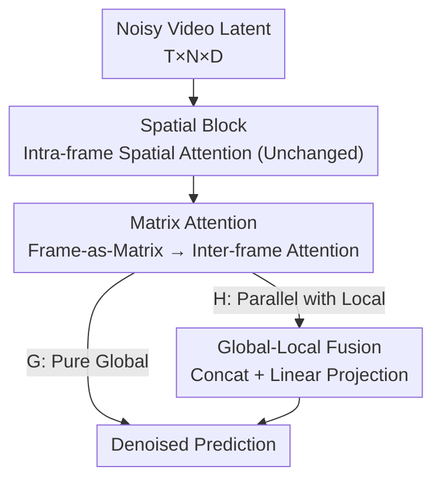

# FrameDiT: Diffusion Transformer with Matrix Attention for Efficient Video Generation

**Conference**: CVPR 2026  
**arXiv**: [2603.09721](https://arxiv.org/abs/2603.09721)  
**Code**: None (Repository not public)  
**Area**: Video Generation / Diffusion Models  
**Keywords**: Video Diffusion, DiT, Temporal Attention, Matrix Attention, Frame-level Modeling

## TL;DR
To address the dilemma between "expensive but expressive Full 3D attention" and "efficient but position-locked Local Factorized attention" in video DiT, this paper proposes **Matrix Attention**. By treating an entire frame as a matrix and performing matrix-native operations to generate Q/K/V for inter-frame attention, it achieves global spatio-temporal modeling with computational costs close to factorized attention. Its hybrid version, FrameDiT-H, achieves SOTA FVD/FVMD on multiple benchmarks including UCF-101, Taichi, and FaceForensics.

## Background & Motivation
**Background**: Current mainstream video diffusion models are primarily built upon Diffusion Transformers (DiT), flattening video into spatio-temporal token sequences for attention modeling. Attention mechanisms generally fall into two categories: Full 3D Attention (joint attention across $T \times N$ spatio-temporal tokens) and Local Factorized Attention (spatial attention within frames, followed by temporal attention across frames for each spatial position).

**Limitations of Prior Work**: Both approaches have significant drawbacks. Full 3D attention is highly expressive but has $O(T^2 N^2)$ complexity, making it nearly unaffordable for high-resolution or long videos. Local Factorized attention reduces complexity to $O(T^2 N + T N^2)$, but its temporal attention only connects tokens at the **same spatial position**. When objects undergo large displacements and are no longer aligned across frames, this "same-position connection" fails to maintain object-level consistency.

**Key Challenge**: There is a direct trade-off between expressive power and computational efficiency. Full 3D attention trades quadratic cost for global spatio-temporal relations; Factorized attention trades expressiveness for efficiency by assuming "aligned motion," a premise that fails in realistic scenarios with significant movement.

**Goal**: To design a DiT that captures global temporal consistency like Full 3D attention while remaining as efficient as Factorized attention.

**Key Insight**: The authors deviate from the convention of "temporal attention at the token granularity." They observe that temporal relationships can be established at the **frame granularity**. Instead of token-by-token pairing, an entire frame can be compressed into a compact matrix representation for inter-frame attention. This bypasses the $O(T^2 N^2)$ token pairing while removing the "same-position" constraint.

**Core Idea**: Replace "token-level temporal attention" with "frame-level matrix attention." By treating each frame as a matrix and using matrix operations to derive Q/K/V, inter-frame similarity is calculated via Frobenius inner product. This weights and aggregates frames to capture global spatio-temporal structures at a low cost.

## Method

### Overall Architecture
FrameDiT follows the DiT structure of interleaved spatial and temporal blocks. The input is a noisy video latent $z \in \mathbb{R}^{T \times N \times D}$ ($T$ frames, $N$ tokens per frame, dimension $D$), and the output is the denoised prediction. **Spatial blocks remain unchanged**; all critical modifications occur in the temporal blocks, where traditional local temporal attention is replaced by (or supplemented with) Matrix Attention. Two variants are proposed: FrameDiT-G uses only Matrix Attention (pure global), while FrameDiT-H runs local temporal attention and Matrix Attention in parallel before fusing them (global + local).

### Key Designs

**1. Matrix Attention: Inter-frame Attention via Frame-as-Matrix**

This is the core contribution addressing the failure of Local Factorized attention under large motion. For the $t$-th frame $z^t \in \mathbb{R}^{N \times D}$, treated as a matrix (rows as tokens, columns as embedding dimensions), **matrix-native operations** are used for linear transformations across both row and column directions to obtain Query/Key/Value:

$$q^t = U_q^\top z^t W_q + B_q,\quad k^t = U_k^\top z^t W_k + B_k,\quad v^t = U_v^\top z^t W_v + B_v$$

Here $U_\ast \in \mathbb{R}^{N \times N_\ast}$ is the **row weight matrix** (compressing/synthesizing $N$ spatial tokens into $N_{qk}$ or $N_v$ "frame-level rows"), and $W_\ast \in \mathbb{R}^{D \times D_\ast}$ is the column weight matrix. Thus, each row of $q^t$ and $k^t$ aggregates information from **all** tokens in that frame, forming a compact frame-level representation. Inter-frame similarity is computed using a scaled Frobenius inner product into a $T \times T$ matrix:

$$S^{t,t'} = \frac{\langle q^t, k^{t'}\rangle_{\text{F}}}{\sqrt{N_{qk} D_{qk}}}$$

Finally, $u = \text{Softmax}(S) \cdot v$. Since attention is performed across $T$ frames, the similarity matrix is only $T \times T$, completely avoiding $N \times N$ token pairings. This is effective because the frame-level matrix representation encodes the spatial content of the entire frame; thus, frame correlation no longer depends on whether an object stays in the same spatial position. A multi-head version splits $q, k, v$ along rows ($m$ parts) and columns ($n$ parts) to perform independent Matrix Attention.

**2. FrameDiT-H Hybrid Global-Local: Recovering Fine-grained Motion**

While FrameDiT-G excels at large motion and object-level consistency, experiments on UCF-101 and Sky-Timelapse show it lags behind in capturing pixel-level subtle movements. The "global representation naturally loses local details." FrameDiT-H employs two **parallel** temporal branches: a traditional spatially local temporal attention (for fine-grained motion and local consistency) and a Matrix Attention branch (for global frame-level information). Both outputs are concatenated and fused via a linear layer:

$$e = \text{MLP}\big(\text{concat}(e_{\text{local}}, e_{\text{global}})\big)$$

This balances both scales with negligible extra complexity. Computationally, FrameDiT-G is $O(TN^2 + T^2 N_{qk})$, while FrameDiT-H adds the local temporal term to become $O(TN^2 + T^2 N + T^2 N_{qk})$. Since $N_{qk} \ll N$, $T^2 N_{qk}$ is negligible, making the cost of FrameDiT-H nearly identical to Local Factorized attention while offering global expressiveness.

**3. Row Weight Matrix $U$ as a Learnable Lossy Compressor**

$U$ synthesizes $N$ spatial tokens into $N_{qk}$ (or $N_v$) frame-level rows, acting as a **tunable lossy compression** knob. Smaller $N_{qk}$ values yield higher compression and lower GFLOPs. Ablations show that even compressing 64 tokens into 1 row ($N_{qk}=1$) allows stable generation with only slight FVD degradation to 72.16, indicating $U$ filters redundant intra-frame spatial information while preserving sufficient temporal discriminative features. Normalization of $U$ is critical—Softmax normalization ensures synthesized frame representations stay within the original embedding manifold, leading to more stable temporal attention than $\ell_1/\ell_2$ normalization or no normalization.

### Loss & Training
The training objective uses the standard diffusion noise matching loss $\mathcal{L}_{\text{NM}}(\theta) = \mathbb{E}_{x,k,\epsilon}[\lVert\epsilon_\theta(x_k,k) - \epsilon\rVert^2]$. Optimization utilizes AdamW with a learning rate of $1e{-}4$, EMA (decay 0.999), gradient clipping, and noise clipping. When integrating Matrix Attention into pre-trained DiTs (e.g., Latte), the authors found that **fusion via softmax gating failed**: initialization assigned $\approx 0.97$ weight to the pre-trained local branch and $\approx 0.03$ to the Matrix branch, resulting in minimal gradients for the suppressed branch. Switching to concat + linear layer (Kaiming initialization, zero bias) balanced the gradient flow, leading to stable training and continuous quality improvement. Removing the pre-trained local branch entirely caused the video to degenerate into independent images, proving that the local branch encodes crucial motion priors.

## Key Experimental Results

### Main Results
Unconditional video generation at $256 \times 256$ resolution, 16 frames. Metric is FVD (lower is better). `*` indicates AR-Diffusion results reproduced using official checkpoints (original reported values were found to be abnormally biased).

| Model | Attention Type | UCF101 | Sky | Taichi-HD | Face |
|-------|----------------|--------|-----|-----------|------|
| StyleGAN-V | GAN | 1431.0 | 79.5 | 143.5 | 47.4 |
| Latte | Local Factorized | 202.2 | 42.7 | 97.1 | 27.1 |
| AR-Diffusion | Causal Full 3D | 186.6 | 40.8 | 66.3 | 71.9 |
| AR-Diffusion* | Causal Full 3D | 181.9 | 40.2 | 100.9 | 84.0 |
| **FrameDiT-G** | Matrix (Global) | 201.6 | 40.6 | 96.8 | 21.5 |
| **FrameDiT-H** | Matrix (Global+Local) | **170.1** | **39.5** | **95.5** | **16.6** |

FrameDiT-G consistently outperforms the factorized Latte. FrameDiT-H takes the lead across all datasets, improving UCF101 by ~9% over AR-Diffusion and FaceForensics by ~39% over Latte.

On T2V (VBench), FrameDiT-H (adding 314M Matrix Attention modules to a frozen 1B Latte) outperformed Latte in Quality Score (81.69 vs 79.72), Subject Consistency (95.10 vs 88.88), and Dynamic Degree (70.83 vs 68.89), with quality approaching the Full 3D LTX-Video (82.30).

### Ablation Study
Conducted on Taichi-HD, 16 frames, $128 \times 128$.

$U$ Normalization method (FrameDiT-G):

| $U$ Normalization | FVD↓ | FVMD↓ | FID↓ |
|-------------------|------|-------|------|
| No normalization | 70.31 | 990.00 | 14.44 |
| **Softmax** | **66.15** | **943.32** | 13.45 |
| $\ell_1$ | 66.79 | 987.43 | 13.83 |
| $\ell_2$ | 67.13 | 984.72 | 13.44 |

Impact of row dimension $N_{qk}$ ($N=64$):

| $N_{qk}$ | GFLOPs | FVD↓ | FVMD↓ | FID↓ |
|----------|--------|------|-------|------|
| 1 | 341.60 | 72.16 | 1042.76 | 14.47 |
| 8 | 344.62 | 69.41 | 1000.23 | 14.45 |
| 32 | 354.96 | 67.40 | 959.91 | 14.01 |
| 64 | 368.75 | 66.15 | 943.32 | 13.45 |

### Key Findings
- **Larger $N_{qk}$ improves quality at minimal cost**: Increasing from 1 to 64 reduced FVD from 72.16 to 66.15 and FVMD from 1042.76 to 943.32, while GFLOPs only increased by ~8%. This defines Matrix Attention as a high-efficiency "quality knob." FID remained stable, confirming that frame-level compression affects temporal coherence rather than single-frame quality.
- **Stable under extreme compression**: The model remains functional at $N_{qk}=1$, proving $U$ is an effective lossy compressor that discards redundant spatial information for temporal modeling.
- **Long-video scalability**: In 128-frame tests, Full 3D attention costs became prohibitive, whereas FrameDiT-G/H maintained latency and VRAM close to Local Factorized models while achieving FVD comparable to or better than Full 3D.
- **Gating mechanism is decisive**: Concat + linear fusion is necessary to avoid gradient starvation in new branches when building upon pre-trained models.

## Highlights & Insights
- **The shift from token to frame granularity** is the core "Aha!" moment. Compressing a frame into a matrix reduces the temporal similarity matrix from $N \times N$ to $T \times T$. This avoids Full 3D's quadratic explosion while removing spatial alignment constraints because frame-level representations are inherently global.
- **Frobenius inner product for inter-frame similarity** is elegant. It naturally quantifies the similarity of two matrices into a scalar, providing a differentiable attention score for "how related two frames are" without token-by-token alignment.
- **$U$ as a compression knob** provides a clean quality-cost curve. This low-rank projection strategy for controlling temporal token counts is transferable to other long-sequence tasks like long video understanding or audio.
- **Engineering lessons on hybrid branches**: The failure of softmax gating when adding modules to pre-trained models is a valuable practical insight; concatenation is a simple but robust alternative.

## Limitations & Future Work
- The design and parameterization of $U$ still have room for exploration; the authors plan to study row weight matrices further to enhance temporal representation.
- FrameDiT-H introduces extra branches and parameters (e.g., 314M parameters in T2V settings) compared to pure global/local versions, and the fusion method requires careful tuning.
- Comparisons were mostly on 16-frame, constrained datasets. There remains a gap in VBench scores compared to large-scale Full 3D models like Wan 2.1 (84.26 vs 79.12), which the authors attribute to data scale rather than architecture, though this lacks direct controlled verification ⚠️.
- Compressing frames into a few "frame-level rows" might lose information in scenarios requiring precise local details, explaining why the hybrid version outperforms the pure global version.

## Related Work & Insights
- **vs. Full 3D Attention (e.g., LTX-Video, Wan 2.1, AR-Diffusion)**: These treat videos as $T \times N$ tokens for joint attention. They are expressive but suffer from $O(T^2 N^2)$ scaling. FrameDiT reduces temporal similarity to $T \times T$, offering significantly lower latency and VRAM for long videos while matching or exceeding quality.
- **vs. Local Factorized Attention (e.g., Latte, OpenSora, Lavie)**: These assume spatial alignment and suffer from poor object consistency under large motion. FrameDiT's frame-level attention is independent of spatial alignment, outperforming Latte at a similar efficiency.
- **vs. Sparse/Linear Attention**: Sparse attention relies on local windows and often sacrifices global context. Linear attention reduces complexity but limits expressiveness or training stability. FrameDiT offers a third path via "granularity shift," maintaining a global view with low overhead.

## Rating
- Novelty: ⭐⭐⭐⭐⭐ Restructures the video DiT attention paradigm by moving from token-level to frame-level modeling using matrix-native operations.
- Experimental Thoroughness: ⭐⭐⭐⭐ Covers unconditional/T2V across 4 datasets + VBench, with scaling ablations, though more comparison with top-tier Full 3D models on equal data would be beneficial.
- Writing Quality: ⭐⭐⭐⭐ Clear motivation and trade-off analysis, complete formulas, and intuitive comparisons.
- Value: ⭐⭐⭐⭐⭐ Provides a practical "expressive + efficient" route for video diffusion that can be integrated into existing pre-trained DiTs.

<!-- RELATED:START -->

## Related Papers

- [\[CVPR 2026\] Attention Surgery: An Efficient Recipe to Linearize Your Video Diffusion Transformer](attention_surgery_an_efficient_recipe_to_linearize_your_video_diffusion_transfor.md)
- [\[CVPR 2026\] VMonarch: Efficient Video Diffusion Transformers with Structured Attention](vmonarch_efficient_video_diffusion_transformers_with_structured_attention.md)
- [\[CVPR 2026\] RAPID: Reusing Attention Sparsity with Inter-step Adaptation for Efficient Video Diffusion](rapid_reusing_attention_sparsity_with_inter-step_adaptation_for_efficient_video_.md)
- [\[CVPR 2026\] Efficient Long-Context Modeling in Diffusion Language Models via Block Approximate Sparse Attention](efficient_long-context_modeling_in_diffusion_language_models_via_block_approxima.md)
- [\[CVPR 2026\] LinVideo: A Post-Training Framework towards O(n) Attention in Efficient Video Generation](linvideo_a_post-training_framework_towards_on_attention_in_efficient_video_gener.md)

<!-- RELATED:END -->
