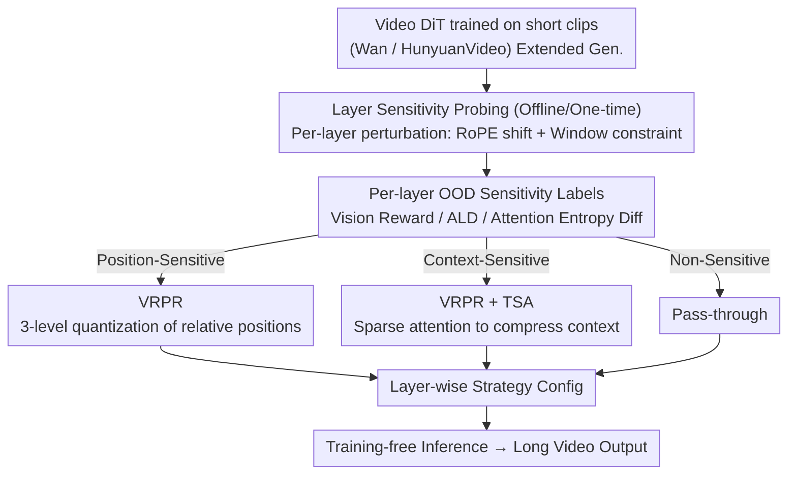

# Free-Lunch Long Video Generation via Layer-Adaptive O.O.D Correction

**Conference**: CVPR 2026  
**arXiv**: [2603.25209](https://arxiv.org/abs/2603.25209)  
**Code**: [https://github.com/Westlake-AGI-Lab/FreeLOC](https://github.com/Westlake-AGI-Lab/FreeLOC)  
**Area**: Video Generation / Diffusion Models  
**Keywords**: Long Video Generation, Training-free, Positional Encoding Extrapolation, Sparse Attention, Layer-adaptive

## TL;DR
FreeLOC introduces a training-free, layer-adaptive framework that identifies the varying sensitivities of different layers in Video DiTs to "frame-level relative position OOD" and "context length OOD." By selectively applying Multi-granularity Positional Recoding (VRPR) and Tiered Sparse Attention (TSA) to sensitive layers, it achieves SOTA long video generation quality without additional training costs.

## Background & Motivation

1.  **Background**: Video diffusion models (e.g., Wan, HunyuanVideo) generate high-quality short videos but are typically trained on short clips (~5 seconds). Directly using them for longer videos leads to severe quality degradation.
2.  **Limitations of Prior Work**: Training-based autoregressive methods are computationally expensive and struggle to match native short-video quality. Existing training-free methods fall into two categories: sliding window methods (e.g., FreeNoise) maintain local consistency but fail to capture long-range dependencies; global manipulation methods (e.g., FreeLong) improve quality via latent manipulation but still suffer from artifacts (identity shift, lighting inconsistency). Most are based on UNet, making them incompatible with SOTA DiT models.
3.  **Key Challenge**: Long video generation faces two OOD problems: (a) Frame-level relative position OOD: 3D RoPE positional encoding fails when extrapolating beyond training lengths; (b) Context length OOD: ultra-long token sequences cause softmax attention to become overly diffused, increasing attention entropy and weakening focus on local information.
4.  **Goal**: How to solve these two OOD problems without retraining while balancing local details and global consistency?
5.  **Key Insight**: The authors found that different Transformer layers in Video DiTs exhibit significantly different sensitivities to these two OOD problems—some are sensitive to positional shifts, while others to context expansion. Therefore, corrections should be targeted at the most sensitive layers rather than applied globally.
6.  **Core Idea**: Through automated layer sensitivity probing, selectively apply VRPR to position-sensitive layers and overlay TSA on context-sensitive layers.

## Method

### Overall Architecture
FreeLOC aims to prevent quality collapse and motion drift when extending video DiTs trained on 5-second clips to longer sequences. The authors decompose this degradation into two OOD sources: positional extrapolation failure and excessive attention diffusion. They perform a one-time offline probing to identify which layers are sensitive to which OOD source. During inference: VRPR is applied to position-sensitive layers (remapping out-of-bounds relative positions to the training domain); TSA is overlaid on VRPR for context-sensitive layers (using sparse attention to compress the effective context); others are left unchanged. No weights are modified.

### Key Designs

**1. VRPR: Quantizing out-of-bounds relative positions instead of hard truncation**

The first OOD is position extrapolation—3D RoPE fails beyond training length. Unlike simple clipping, VRPR recognizes the hierarchical nature of temporal dependencies: nearby frames need high precision for motion, while distant frames only need approximate ordering. VRPR uses three levels:
- Short-range ($|i-j| \leq W_1$): Exact relative positions.
- Mid-range ($W_1 < |i-j| \leq W_2$): Quantized with group size $G_1$ using:
$$P = \lfloor P_{ori}/G_1 \rfloor + \text{sign}(P_{ori})\left(W_1 - \lfloor W_1/G_1 \rfloor\right)$$
- Long-range ($|i-j| > W_2$): Coarse quantization with larger $G_2$.
This "fine-near, coarse-far" approach matches the decay of video attention over time.

**2. TSA: Compressing effective context without cutting long-range dependencies**

The second OOD is context length. TSA constructs a 4D attention mask $\tilde{M} \in \{0,1\}^{f \times f \times n \times n}$ across three tiers:
- Short-range: Standard dense window for local details.
- Mid-range: Striped attention—only tokens at similar spatial locations ($|k-l| < D_s$) interact, leveraging the observation that cross-frame attention is naturally higher for the same spatial coordinates.
- Long-range: Only the first frame (attention sink) is preserved as a global anchor.
This constrains the context length while maintaining a global temporal skeleton.

**3. Layer Sensitivity Probing: Quantifying per-layer OOD sensitivity**

Uniformly applying (TSA+VRPR) can degrade quality (e.g., Aesthetic Score drops to 56.34 vs. 61.21 for layer-adaptive). Probing identifies per-layer roles:
- Position OOD: Probed by shifting RoPE key indices ($\pm 20, \dots$) and measuring Vision Reward and Attention Logits Difference (ALD).
- Context OOD: Measured by the relative difference in attention entropy via:
$$S_i = \frac{\|H_i^{probing} - H_i^{original}\|}{\|H_i^{original}\|}$$
Layers are labeled as "Position-Sensitive" or "Context-Sensitive" to determine the inference strategy.

### Loss & Training
Ours is entirely training-free. VRPR and TSA are only active during inference. Probing is a one-time offline process.

## Key Experimental Results

### Main Results (Wan2.1-T2V-1.3B, 4× Extension = 321 frames)

| Method | Subject Consist.↑ | BG Consist.↑ | Motion Smooth.↑ | Imaging Quality↑ | Aesthetic↑ | Dynamic↑ |
|:---|:---:|:---:|:---:|:---:|:---:|:---:|
| Direct Sampling | 98.50 | 97.89 | 98.83 | 59.21 | 49.43 | 4.32 |
| Sliding Window | 96.15 | 95.92 | 98.54 | 65.64 | 54.04 | 39.81 |
| RIFLEx | 98.41 | 97.87 | 98.86 | 59.92 | 49.67 | 4.45 |
| FreeLong | 97.88 | 97.51 | 98.91 | 63.17 | 54.56 | 21.21 |
| FreeNoise | 97.31 | 97.25 | 98.84 | 66.32 | 56.01 | 35.11 |
| **FreeLOC** | **98.44** | **97.78** | **98.97** | **67.44** | **61.21** | **36.27** |

### Ablation Study

| Config | SC↑ | BC↑ | MS↑ | IQ↑ | AQ↑ | DD↑ |
|:---|:---:|:---:|:---:|:---:|:---:|:---:|
| Direct | 98.50 | 97.89 | 98.83 | 59.21 | 49.43 | 4.32 |
| Direct+TSA | 97.41 | 96.76 | 98.67 | 65.87 | 57.05 | 37.01 |
| Direct+VRPR | 98.42 | 97.81 | 98.89 | 61.88 | 54.13 | 15.32 |
| (TSA+VRPR)_uniform | 97.56 | 97.67 | 98.75 | 65.19 | 56.34 | 34.44 |
| **FreeLOC (layer-wise)** | **98.44** | **97.78** | **98.97** | **67.44** | **61.21** | **36.27** |

### Key Findings
- **Layer-adaptive strategy is critical**: Uniform application of (TSA+VRPR) drops AQ to 56.34, while the layer-wise strategy reaches 61.21 (+4.87).
- **VRPR primarily maintains consistency** whereas TSA boosts visual quality and dynamics (DD 4.32 → 37.01).
- Ours achieves the best balance between consistency and quality and generalizes across Wan and HunyuanVideo.

## Highlights & Insights
- **OOD Decomposition**: Analyzing long video degradation through position extrapolation vs. context expansion provides a clear and elegant framework.
- **Layer Sensitivity Probing**: Quantifying per-layer behavior via automated experiments instead of empirical guessing allows for a principled application of interventions.
- **Multi-granularity VRPR**: Designing position recoding based on attention decay characteristics is more suited for video than the simple truncation used in LLMs.

## Limitations & Future Work
- Probing requires an offline analysis step for each new model.
- Hyperparameters ($W, G, D$) may require tuning for different expansion ratios.
- Primarily validated on up to 4× extensions; performance on 10×+ is unknown.

## Related Work & Insights
- **vs RIFLEx**: RIFLEx suppresses frame repetition via frequency manipulation but treats layers uniformly and is limited to 2×. Ours is layer-adaptive and supports 4×.
- **vs FreeNoise**: FreeNoise focuses on noise rescheduling but sacrifices visual quality; Ours addresses the underlying attention diffusion problem.
- **vs LongDiff**: LongDiff is designed for UNet and relies on expensive re-computation; Ours is native to DiT and more efficient.

## Rating
- Novelty: ⭐⭐⭐⭐ (Original OOD framework and probing mechanism).
- Experimental Thoroughness: ⭐⭐⭐⭐⭐ (Dual-model validation, extensive ablations).
- Writing Quality: ⭐⭐⭐⭐ (Clear problem definition and logic).
- Value: ⭐⭐⭐⭐ (Practical training-free solution for the community).

<!-- RELATED:START -->

<!-- RELATED:END -->

## Related Papers

- [\[CVPR 2026\] AdaCluster: Adaptive Query-Key Clustering for Sparse Attention in Video Generation](adacluster_adaptive_query-key_clustering_for_sparse_attention_in_video_generatio.md)
- [\[CVPR 2026\] Training-free Motion Factorization for Compositional Video Generation](training-free_motion_factorization_for_compositional_video_generation.md)
- [\[ICML 2026\] Enhancing Train-Free Infinite-Frame Generation for Consistent Long Videos](../../ICML2026/video_generation/enhancing_train-free_infinite-frame_generation_for_consistent_long_videos.md)
- [\[CVPR 2026\] Endless World: Real-Time 3D-Aware Long Video Generation](endless_world_real-time_3d-aware_long_video_generation.md)
- [\[CVPR 2026\] TempoMaster: Efficient Long Video Generation via Next-Frame-Rate Prediction](tempomaster_efficient_long_video_generation_via_next-frame-rate_prediction.md)

<!-- RELATED:END -->
