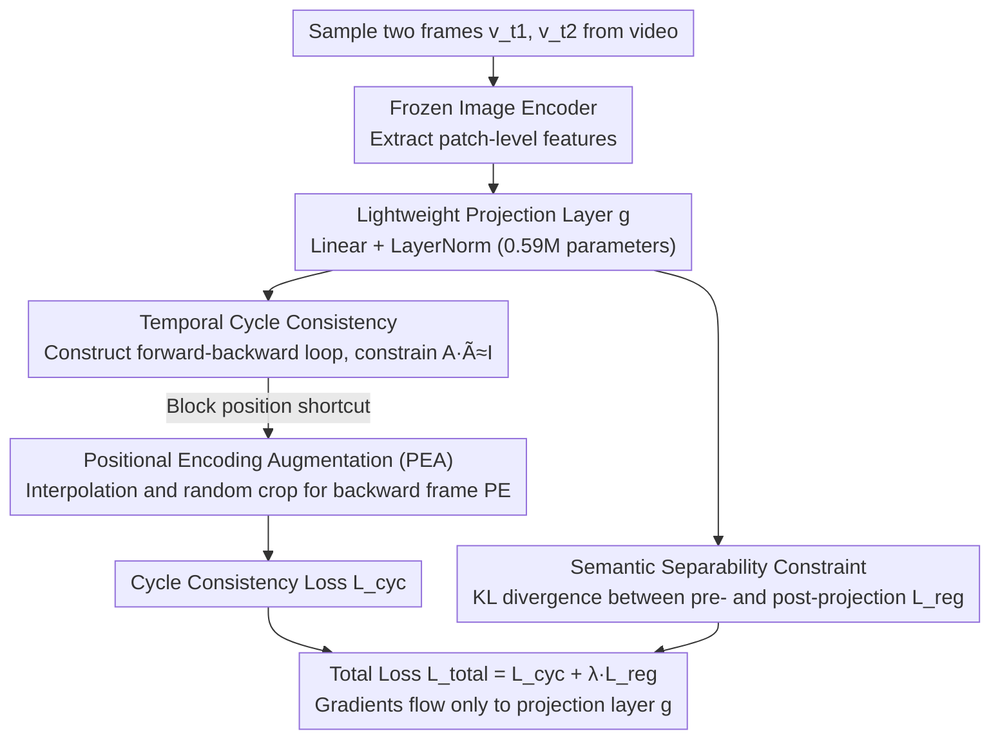

# From Static to Dynamic: Exploring Self-supervised Image-to-Video Representation Transfer Learning

**Conference**: CVPR 2026  
**arXiv**: [2603.26597](https://arxiv.org/abs/2603.26597)  
**Code**: [https://github.com/yafeng19/Co-Settle](https://github.com/yafeng19/Co-Settle)  
**Area**: Video Generation  
**Keywords**: Image-to-video transfer, Self-supervised learning, Temporal consistency, Semantic separability, Lightweight projection

## TL;DR

This paper proposes the Co-Settle framework, which trains a lightweight linear projection layer on a frozen image pre-trained encoder. By leveraging temporal cycle consistency loss and semantic separability constraints, it consistently enhances multi-granularity video downstream task performance across 8 image foundation models with only 5 epochs of self-supervised training.

## Background & Motivation

**Background**: Transferring image pre-trained models to video tasks has become the mainstream paradigm for video representation learning. Existing methods typically add temporal modeling modules (e.g., temporal attention, 3D convolutions, adapters) on top of pre-trained image encoders and then fine-tune them on video data.

**Limitations of Prior Work**: Fine-tuning heavy temporal modules compromises **inter-video semantic separability**—the ability to distinguish different objects across different videos—because limited category diversity in video datasets can trigger catastrophic forgetting. However, if adjustable parameters are restricted to preserve separability, **intra-video temporal consistency**—the stability of representations for the same object within a video—becomes insufficient.

**Key Challenge**: There is a **trade-off between temporal consistency and semantic separability** in image-to-video transfer. Existing methods either over-fine-tune and lose semantic discriminability, or use restricted parameters that fail to learn adequate temporal correspondences.

**Goal**: To find an efficient method that enhances temporal consistency while maintaining or even improving semantic separability.

**Key Insight**: The authors observe that image pre-trained models already possess approximate temporal consistency (due to geometric augmentations during pre-training) but lack modeling of real-world temporal dynamics. A very lightweight projection layer is sufficient to adjust the representation space to balance these two properties.

**Core Idea**: Freeze the image encoder and train only a linear projection layer. Use a cycle consistency objective to enhance temporal correspondence and a KL divergence constraint to maintain semantic separability, achieving efficient image-to-video representation transfer.

## Method

### Overall Architecture

Co-Settle aims for a restrained approach: instead of modifying the image foundation model, it attaches an extremely lightweight "translation layer" to slightly adjust the static image representation space. This ensures representations are stable for the same object in a single video (temporal consistency) and distinct for different objects across videos (semantic separability).

Specifically, two frames $\mathbf{v}_{t_1}$ and $\mathbf{v}_{t_2}$ are sampled from a video. Patch-level features are extracted using a **completely frozen** image encoder, then passed through a learnable projection layer $g$ (a linear layer with LayerNorm, totaling only 0.59M parameters). During training, two objectives are optimized in this new space: temporal correspondence via cycle consistency and semantic structure preservation via KL divergence. The total loss $\mathcal{L}_{total} = \mathcal{L}_{cyc} + \lambda \mathcal{L}_{reg}$ is used, with gradients backpropagating only to the linear layer.

### Key Designs

**1. Temporal Cycle Consistency: Learning correspondences via "returning to origin"**

Image-to-video transfer lacks modeling of how objects move across frames. The authors transform this into an optimization objective using cycle consistency: construct a forward-backward loop $\mathbf{v}_{t_1} \to \mathbf{v}_{t_2} \to \mathbf{v}_{t_1}$, compute the forward correlation matrix $\mathbf{A}_{t_1 t_2}$ and backward correlation matrix $\tilde{\mathbf{A}}_{t_2 t_1}$, and require their product $\mathbf{A}_{t_1 t_2}\tilde{\mathbf{A}}_{t_2 t_1}$ to approximate the identity matrix. This ensures each patch returns to its original position after a full cycle:

$$\mathcal{L}_{cyc} = -\sum_{i=1}^{N} \log P\big(X_d = \tilde{\mathbf{q}}_{t_1}^b(i) \mid X_s = \mathbf{q}_{t_1}^f(i)\big)$$

Unlike indirect auxiliary tasks like temporal attention, cycle consistency provides an explicit correspondence signal without needing labels, making it highly effective even with minimal training.

**2. Positional Encoding Augmentation (PEA): Blocking the "position shortcut"**

Cycle consistency has a vulnerability: ViT models use explicit positional encodings (PE), allowing patches to pair based on absolute coordinates rather than appearance. The authors confirmed this via control experiments—$\mathcal{L}_{cyc}$ converged even when using **unrelated videos** or **shuffled patches**, indicating the model was learning positions rather than visual correspondences.

PEA addresses this by perturbing only the backward frame's PE: through interpolation for scaling and random cropping, a disturbed PE $\tilde{\mathbf{E}}_{pos}$ is generated. This breaks precise absolute position matching while retaining local relative relationships. This asymmetric design forces the model to rely on actual semantic content. In ablation studies, this increased VIP mIoU from 16.2 to 33.3.

**3. Semantic Separability Constraint: Preserving discriminability via KL Divergence**

Optimizing only for consistency in video data can have side effects: limited category diversity in video datasets might lead the projection layer to collapse the representations of different objects to achieve alignment. The authors use a KL divergence term to anchor the feature distribution before and after projection:

$$\mathcal{L}_{reg} = \frac{1}{|\mathcal{S}|} \sum_{(\mathbf{p},\mathbf{z}) \in \mathcal{S}} \sum_{i=1}^{d} P(i)\,\log \frac{P(i)}{Z(i)},\quad P=\mathrm{softmax}(\mathbf{p}),\ Z=\mathrm{softmax}(\mathbf{z})$$

Here $\mathbf{z}$ represents original features and $\mathbf{p}$ represents projected features. This constraint forces the projection layer to maintain an approximate isometric mapping. Spectral analysis (Theorem 1-2) further demonstrates that the optimal linear projection naturally exhibits **soft thresholding** behavior: suppressing dimensions with high temporal variance and amplifying those with low variance, thereby increasing margins both inter-video and intra-video.

### Loss & Training

- Total loss $\mathcal{L}_{total} = \mathcal{L}_{cyc} + \lambda \mathcal{L}_{reg}$. Only the projection layer $g$ (0.59M parameters) is updated; the encoder remains frozen.
- Trained on Kinetics-400 for 5 epochs, batch size 512, 4x RTX4090 GPUs, AdamW optimizer, learning rate $1\times 10^{-4}$ with cosine decay. Total training time is approximately 1.2 RTX4090 GPU-days.

## Key Experimental Results

### Main Results (Dense-level tasks with ViT-B/16)

| Method | VIP mIoU | DAVIS J&F | JHMDB PCK@0.1 |
|------|----------|-----------|---------------|
| MAE (Original) | 29.3 | 52.4 | 41.6 |
| MAE + Co-Settle | **33.8** | **59.6** | **48.4** |
| CLIP (Original) | 38.1 | 54.9 | 36.9 |
| CLIP + Co-Settle | **39.2** | **58.3** | **40.6** |
| DINOv2 (Original) | 38.4 | 63.1 | 46.6 |
| DINOv2 + Co-Settle | **39.9** | **63.7** | **47.3** |

### Ablation Study

| Configuration | VIP mIoU | DAVIS J&F | JHMDB PCK | Description |
|------|----------|-----------|-----------|------|
| $\mathcal{L}_{cyc}$ only (no PEA) | 16.2 | 26.2 | 38.5 | Position shortcut causes degradation |
| $\mathcal{L}_{cyc}$ + PEA | 33.3 | 59.3 | 48.1 | PEA effectively inhibits shortcuts |
| $\mathcal{L}_{cyc}$ + $\mathcal{L}_{reg}$ + PEA | **33.8** | **59.6** | **48.4** | Full model |
| Linear layer (Default) | 33.8 | 59.6 | 47.9 | Simple linear layer is sufficient |
| MLP 2-layer | 33.2 | 59.2 | 47.5 | Complexity does not guarantee better results |
| MLP 3-layer | 32.6 | 58.4 | 47.4 | Excessive depth harms semantics |

### Key Findings

- **Consistent gains across 8 image pre-trained models**, covering masked modeling, contrastive learning, and self-distillation.
- Training requires only 5 epochs, 0.59M parameters, and 1.2 RTX4090 GPU-days, being about 13x faster than traditional methods.
- Linear layers perform as well as or better than MLPs, aligning with theoretical analysis (linear systems and MLPs exhibit similar soft thresholding behavior).
- Replacing DINOv2 features in the DINO-Tracker pipeline improved BADJA tracking accuracy from 62.73 to 70.52.

## Highlights & Insights

- **Extreme Simplicity**: Frozen encoder + one linear layer + 5 epochs results in consistent improvements across all models and tasks. This "less is more" design is impressive.
- **Inspirational Discovery of PEA**: The rigorous verification of positional shortcuts via control experiments (unrelated videos/shuffled patches) demonstrates excellent experimental design.
- **Solid Theoretical Support**: Beyond empirical success, the spectral analysis proves the soft thresholding mechanism, providing interpretability for why a simple linear layer works.

## Limitations & Future Work

- Training was conducted only on Kinetics-400; the impact of video content diversity on transfer effectiveness requires further exploration.
- Currently restricted to ViT architectures; applicability to CNNs or hybrid architectures is not yet verified.
- Whether frozen projection layer features conflict across different downstream tasks warrants further study.
- Expansion to multi-frame settings (current work uses only 2 frames) could capture more complex, long-range temporal correspondences.

## Related Work & Insights

- **vs AIM/ST-Adapter/ZeroI2V**: These CLIP-based methods require 11-14M parameters and significant GPU time for supervised adaptation, whereas Co-Settle outperforms them on dense tasks with only 0.59M parameters and unsupervised training.
- **vs SiamMAE/CropMAE**: These video pre-training methods require large-scale training (400-1600 epochs). Co-Settle achieves comparable performance at a fraction of the cost.
- The core insight of "explicitly modeling the trade-off" is transferable to other representation transfer scenarios, such as cross-modal or cross-resolution transfer.

## Rating

- Novelty: ⭐⭐⭐⭐ Explicitly modeling the trade-off with theoretical proof is a highlight, though lightweight projection is not a brand-new concept.
- Experimental Thoroughness: ⭐⭐⭐⭐⭐ 8 models, multi-granularity tasks, efficiency comparisons, and theoretical validation.
- Writing Quality: ⭐⭐⭐⭐⭐ Clear logical chain from motivation to method and theory.
- Value: ⭐⭐⭐⭐ Provides an efficient baseline and theoretical framework for image-to-video transfer, though the application scope is relatively vertical.

<!-- RELATED:START -->

## Related Papers

- [\[CVPR 2026\] VidPrism: Heterogeneous Mixture of Experts for Image-to-Video Transfer](vidprism_heterogeneous_mixture_of_experts_for_image-to-video_transfer.md)
- [\[CVPR 2026\] GT-SVJ: Generative-Transformer-Based Self-Supervised Video Judge For Efficient Video Reward Modeling](gt-svj_generative-transformer-based_self-supervised_video_judge.md)
- [\[CVPR 2026\] One-to-All Animation: Alignment-Free Character Animation and Image Pose Transfer](one-to-all_animation_alignment-free_character_animation_and_image_pose_transfer.md)
- [\[CVPR 2026\] Let Your Image Move with Your Motion! – Implicit Multi-Object Multi-Motion Transfer](let_your_image_move_with_your_motion_--_implicit_multi-object_multi-motion_trans.md)
- [\[CVPR 2026\] SMRABooth: Subject and Motion Representation Alignment for Customized Video Generation](smrabooth_subject_and_motion_representation_alignment_for_customized_video_gener.md)

<!-- RELATED:END -->
