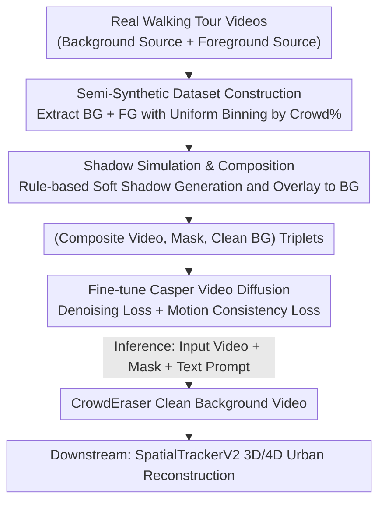

# Generating Humanless Environment Walkthroughs from Egocentric Walking Tour Videos

**Conference**: CVPR 2026  
**Paper**: [CVF Open Access](https://openaccess.thecvf.com/content/CVPR2026/html/Ham_Generating_Humanless_Environment_Walkthroughs_from_Egocentric_Walking_Tour_Videos_CVPR_2026_paper.html)  
**Code**: https://crowd-eraser.github.io/  
**Area**: Video Generation / Video Inpainting  
**Keywords**: Video De-humanization, Video Diffusion Inpainting, Semi-synthetic Dataset, Shadow Simulation, First-person Walking Video

## TL;DR
The authors utilize the vast amount of online first-person "city walking tour" videos as a source for urban environment modeling, which are typically crowded with pedestrians and their shadows. They construct a semi-synthetic dataset, EgoCrowds (consisting of 1000 pairs of "populated/empty" video clips), assembled from real-world footage. By fine-tuning the Casper video diffusion model on this dataset, they obtain CrowdEraser, which cleanly removes people and their accompanying shadows in dense crowds and complex background scenes. The resulting humanless videos can be directly used for 3D/4D urban reconstruction.

## Background & Motivation
**Background**: High-fidelity everyday urban environment models (streets, building lobbies, etc.) are fundamental assets for 3D neural rendering, robotics, and autonomous driving. Millions of hours of "walking tour" videos on YouTube—captured from an egocentric perspective of creators walking through cities worldwide—represent one of the richest, most diverse, and most accessible sources of urban imagery.

**Limitations of Prior Work**: These videos suffer from a critical flaw that prevents their direct use in static environment extraction: the scenes are heavily populated with pedestrians. Urban street views often feature large crowds of pedestrians blocking a substantial number of pixels (Fig. 1a). Additionally, because of the ground-level egocentric camera perspective, even a single person walking close to the camera can occupy a massive portion of the frame (Fig. 1b), severely obstructing the scene structure.

**Key Challenge**: The authors' experiments reveal that Casper (from GenOmnimatte), a powerful diffusion model designed for object-and-effect removal, performs acceptably when "people are few and far from the camera," but produces unnatural artifacts when encountering dense crowds + complex outdoor backgrounds. The key insight is that this performance gap **primarily stems from the domain shift between Casper's training data and walking tour videos, rather than inherent flaws in the diffusion model design**.

**Goal**: The problem therefore translates to: how to construct a sufficiently rich training dataset with supervisory signals for the task of inpainting humans (and their shadows) in walking videos. The core difficulty lies in the fact that it is virtually impossible to capture two real-world versions (populated and depopulated) of the same scene under identical lighting and camera movement.

**Key Insight**: Drawing inspiration from the success of using "semi-synthetic datasets" in tasks like optical flow estimation and image segmentation, the authors design a semi-synthetic video generation pipeline. This pipeline extracts "empty scene backgrounds" and "pedestrian foregrounds" separately from real walking videos, and then composites the pedestrians (along with rule-based simulated shadows) onto the backgrounds. This naturally yields paired supervision of "composed populated video $\leftrightarrow$ clean background video".

**Core Idea**: Bridge the domain shift using semi-synthetic data—by constructing the EgoCrowds dataset and fine-tuning Casper on it, thereby specializing a general-purpose object-removal model into CrowdEraser, which excels at removing crowds and shadows.

## Method

### Overall Architecture
The core contribution of this work lies in the **data** rather than the model architecture. Conceptually, it is split into two parts: **(1) EgoCrowds Semi-Synthetic Dataset Construction**: extracting background segments and foreground pedestrian segments from real walking tour videos, augmenting pedestrians with rule-based simulated shadows, and compositing them into (composite video, human mask, clean background) triplets; **(2) CrowdEraser Model Fine-tuning**: using these triplets to fine-tune the Casper video diffusion model so that it learns "given masked humans $\rightarrow$ generate a clean background." The input is an egocentric video clip along with the corresponding frame-by-frame human masks, while the output is a temporally consistent, clean background video with both humans and shadows erased.

Each video clip is standardized to 7 seconds (197 frames @ 16 fps). The top-down data construction pipeline is: real background videos $\rightarrow$ extract empty scene background clips (based on standard "few people" criteria); real foreground videos $\rightarrow$ extract pedestrian foreground clips and their masks (uniformly binned by Crowd%); followed by shadow simulation + compositing + quality filtering to obtain the training triplets; finally, feeding these into Casper for fine-tuning via joint losses.

### Key Designs

**1. EgoCrowds Semi-Synthetic Dataset: Assembling "Populated/Humanless" Paired Supervision from Real Assets**

This step directly addresses the core pain point—the lack of real-world "populated/humanless" pairs for the same scene. Rather than attempting to capture these physically, the authors decompose real videos into reusable components. **Background segments** are sourced from YouTube using keywords like "early morning," "deserted downtown," "lockdown street," and "empty street," standardized to a resolution of 720×1280 at $\leq30$ fps, covering 64 videos across 50 global cities (57 for training, 7 for testing). To identify "empty scenes," Grounded-SAM-2 is deployed with the text prompt "person" to count people, setting a threshold of $P=5$ (maximum of 5 people per frame) and a tolerance $\tau=10\%$ (retained only if the percentage of frames exceeding the threshold is $<10\%$). This soft tolerance accounts for detector noise and allows small, distant pedestrians. **Foreground segments** are extracted from 10 videos across 10 cities, pulling clips where humans appear in at least 70% of frames ($M=138$ frames) using the text prompt "person, bag, backpack." These clips are then categorized into five bins based on average frame mask area (Crowd%): 0–10%, 10–20%, 20–30%, 30–40%, and 40–50%. 200 segments are randomly sampled from each bin, totaling **1000 foreground clips uniformly distributed across crowd densities**. This uniform design across various Crowd% is later proven crucial in the ablation studies.

**2. Rule-Based Soft Shadow Simulation: Erasing Humans with Accompanying Shadows**

Simply pasting the extracted human mask onto the background results in a lack of accompanying illumination effects like shadows, preventing the model from learning that "the human and the shadow are integrated." The authors generate shadow geometry for each person using a rule-based approach: they first estimate the **pivot point** where the person contacts the ground, apply a horizontal flip to the mask (retained if the angle is $<90^\circ$, flipped horizontally if $\geq90^\circ$) + rotation around the pivot, and overlay a random horizontal shear $s_x\sim U(0.15,0.35)$ and vertical scale $s_y\sim U(0.8,0.95)$ to simulate variations in light direction. To maintain global illumination consistency, only **one** unified shadow direction is sampled per segment. Finally, Gaussian kernel convolution is applied to deliver realistic soft shadows. During composition, the background is first darkened by the shadow map with a random intensity $\alpha\in[0.2,0.8]$, and then the human foreground is overlaid with full opacity ($\alpha=1$). A key detail: in the paired triplets (input, mask, ground truth), **the mask only covers the human and excludes the shadow**. Consequently, the model is forced to *implicitly learn the relationship between a person and their projected shadow* during training, enabling it to erase unmasked shadows during inference.

**3. CrowdEraser: Target Fine-Tuning on Casper with Motion Consistency Loss**

Instead of redesigning the model architecture, the authors fine-tune Casper (based on the CogVideoX diffusion backbone), freezing its VAE and text encoder while updating only the 3D Transformer layers. Casper has been extensively pre-trained and is capable of capturing object-effect associations. Given a video and instance masks, it can produce a clean background alongside layered single-object videos—this task utilizes only its background output. For optimization, in addition to the standard denoising loss $L_{base}=\lVert\hat{\epsilon}_t-\epsilon_t\rVert_2^2$, the authors introduce a **motion sub-loss** to constrain the temporal difference of noise residuals between adjacent frames:

$$L_{sub}=\lVert(\hat{\epsilon}_{t+1}-\hat{\epsilon}_t)-(\epsilon_{t+1}-\epsilon_t)\rVert_2^2$$

It penalizes deviations in the temporal derivative of the predicted noise along the frame axis to encourage temporally smoother dynamics. The overall loss is formulated as $L=(1-\alpha)L_{base}+\alpha L_{sub}$, with the motion loss weight set to $\alpha=0.25$ (⚠️ Note: here $\alpha$ shares the same symbol but has a different meaning than the shadow intensity $\alpha$ described earlier, as per the original text). During inference, the input consists of: the original video clip, human-masked video, and a text prompt: "A video of a beautiful empty, human-free scene."

### Loss & Training
Based on the public implementation of Casper (CogVideoX backbone), the VAE and text encoder are frozen, and only the 3D Transformer is fine-tuned. The model is trained for 100 epochs on EgoCrowds, taking approximately 15 hours on 4 H200 GPUs. The loss is a weighted combination of the denoising loss and the motion consistency loss (weight $\alpha=0.25$).

## Key Experimental Results

### Main Results
The test set consists of the EgoCrowds test set (7 cities $\times$ 5 Crowd% intervals = 35 video segments) at an inference resolution of 720 $\times$ 1080, compared against three baselines: ProPainter, DiffuEraser, and Casper. Metrics include PSNR (higher is better), LPIPS (lower is better), and DreamSim (lower is better). The table below lists the performance of each method across different Crowd% levels alongside the average performance:

| Method | PSNR↑ (avg) | LPIPS↓ (avg) | DreamSim↓ (avg) |
|------|------|------|------|
| ProPainter | 25.82 | 0.141 | 0.067 |
| DiffuEraser | 25.95 | 0.120 | 0.037 |
| Casper | 24.64 | 0.130 | 0.029 |
| **Ours (CrowdEraser)** | **26.74** | **0.118** | **0.022** |

Evaluating across bins reveals a clearer trend (PSNR): in the high-occlusion 30–40% interval, Casper scores 19.88, ProPainter 21.98, and DiffuEraser 22.18, whereas Ours achieves 22.34; in the 40–50% interval, Ours scores 23.31, significantly outperforming Casper's 19.24. This demonstrates that **the higher the Crowd% (and the denser the crowd), the more pronounced CrowdEraser's advantage over the baselines becomes**, while baseline methods are only competitive under low Crowd% conditions. Qualitatively (Fig. 5): ProPainter and DiffuEraser tend to blur backgrounds or lose fine details when shadows are sharp. Casper is skilled at associating environmental effects, but under large masks, it tends to hallucinate objects or people inside the masked areas. In contrast, the proposed method remains robust under large masks, preserving background structures with fewer artifacts.

### Ablation Study
The ablation study investigates the contributions of two critical data construction decisions (Table 2, where the first row corresponds to the original, un-tuned Casper):

| Shadow | Full Crowd% | PSNR↑ | SSIM↑ | LPIPS↓ | DreamSim↓ | Description |
|--------|-------------|-------|-------|--------|-----------|------|
| ✗ | ✗ | 24.64 | 0.868 | 0.130 | 0.029 | Original Casper, un-tuned |
| ✗ | ✓ | 25.09 | 0.870 | 0.128 | 0.028 | Without shadow injection |
| ✓ | ✗ | 26.60 | 0.882 | 0.120 | 0.024 | Trained only with low-occlusion masks (Crowd% 0–10) |
| ✓ | ✓ | **26.74** | **0.881** | **0.118** | **0.022** | Full model |

### Key Findings
* **Shadow injection is the source of shadow correlation ability**: Without shadow injection (Shadow=✗), although the model can fill in large masks, it loses the ability to correctly associate and erase shadows, causing PSNR to drop from 26.74 to 25.09.
* **Uniform Crowd% coverage supports high-occlusion inpainting**: When trained only on low-occlusion masks (Full Crowd%=✗), failure cases occur where a crowd continually walks directly in front of the camera, occluding the center of the frame for prolonged periods (e.g., color bleeding caused by a person in a yellow jacket, as shown in Fig. 6). The uniformly distributed foreground data enhances the model's ability to reconstruct structural elements and prevents the blurriness/vignetting commonly observed under high Crowd% conditions.
* **De-humanization is a crucial prerequisite for 3D reconstruction**: Applying SpatialTrackerV2 for 4D reconstruction on raw (crowded) video clips leads to sparse reconstructions and large point trajectory drifts due to prolonged occlusions. Reconstruction using the CrowdEraser-cleaned videos is significantly more coherent, shows improved temporal consistency, and retains wealthier background structures (e.g., wall textures and denser point clouds).

## Highlights & Insights
* **Re-diagnosing "poor model performance" as "inadequate data"**: Instead of altering Casper's architecture, the authors successfully identified domain shift as the root cause of the performance gap and focused on meticulously crafting in-domain supervised data. This presents an elegant and highly reproducible research paradigm: when a powerful model fails in your target scenario, first investigate potential data distribution mismatches.
* **The clever detail of masking only humans, not shadows**: Since the masks omit shadows, the model is compelled to inherently learn human-shadow associations without requiring explicit, costly shadow annotations. This elegantly circumvents the need for expensive shadow segmentation labels while automating shadow removal during inference.
* **Semi-synthetic pairing utilizing real assets**: This retains realistic appearance, occlusion patterns, and camera motion while acquiring highly precise ground-truth supervision that is otherwise only available in entirely synthetic data, successfully balancing realism and supervisorial feasibility.
* **Uniform binning based on Crowd%**: Sampling foreground objects based on uniform crowd distribution serves as a general data-balancing technique directly transferable to other "unbalanced difficulty" inpainting/object removal tasks, ensuring the model is exposed to sufficient high-difficulty scenarios.

## Limitations & Future Work
* **Data remains semi-synthetic**: The foreground actors are "pasted" onto the scene. Although sourced from real video footage, the physical interactions between humans and backgrounds (e.g., precise contact shadow geometries, reflections, ground surface material responses) are approximated via rules, which may deviate from actual physical recordings.
* **Rule-based shadow simulation**: Pivot point estimation, affine transformation, and Gaussian softening represent a simplified model, offering limited realism under complex multi-source lighting, harsh directional light, or self-shadowing (⚠️ the paper does not quantify shadow realism, as per the original text).
* **Restricted to the "human" foreground category**: The methodology is designed specifically around pedestrians and their personal items (bags, accompanying shadows), leaving the generalization ability toward other dynamic occluders (e.g., vehicles, animals, cyclists) unassessed.
* **Partially qualitative downstream 3D evaluation**: The 3D/4D reconstruction section mainly relies on qualitative visualizations (point trajectory drift, point cloud density). It lacks quantitative metrics for reconstruction quality, which could further strengthen the claim that human removal benefits reconstruction.
* **Avenues for improvement**: Integrating more physically based shadow/lighting rendering, expanding the foreground to multiple dynamic object categories, and providing quantitative evaluations on 3D reconstruction tasks.

## Related Work & Insights
* **vs Generative Omnimatte / Casper [17]**: Casper serves as the fine-tuning baseline for this work; it excels at associating objects with their corresponding environmental effects, but is prone to hallucinations inside heavily occluded human regions when restoring backgrounds. The proposed method resolves this not by modifying the model, but by curating matched in-domain data to specialize Casper, yielding significant improvements over the original model under high Crowd% scenarios.
* **vs ProPainter [48]**: A Transformer specifically optimized for video inpainting (flow propagation + spatio-temporal Transformer), which tends to blur background details when faced with sharp shadows and large masks. On the contrary, the proposed method produces more stable results using generative priors and shadow supervision.
* **vs DiffuEraser [18]**: A video inpainting method built on Stable Diffusion using ProPainter as a prior. It performs comparably to the proposed method under low occlusion, but its performance drops significantly as Crowd% increases.
* **vs Omnimatte Family (Omnimatte3D / OmnimatteRF) [22, 25, 37]**: These methods rely on optical flow optimization, multi-view consistency, and radiance fields to build static backgrounds for video layering. The proposed work focuses on generative inpainting rather than layer separation, specifically targeting egocentric walking videos as a largely underutilized data source.

## Rating
* Novelty: ⭐⭐⭐⭐ The model relies on Casper, but the problem setting—diagnosing domain shift and solving it via a semi-synthetic paired dataset—is highly novel and practical.
* Experimental Thoroughness: ⭐⭐⭐⭐ The main experiments are meticulously segmented by Crowd%, and the ablation studies clearly substantiate the core data-driven design choices. Downstream 3D reconstruction validation is slightly qualitative.
* Writing Quality: ⭐⭐⭐⭐ The motivation is logically derived, the data pipeline is elaborately explained, and the figures map clearly to the text.
* Value: ⭐⭐⭐⭐ This work opens up massive walking tour video repositories to serve as valuable urban modeling assets, benefiting downstream areas like 3D vision, robotics, and autonomous driving. Both the dataset and code are open-sourced.

<!-- RELATED:START -->

## Related Papers

- [\[CVPR 2026\] Ego-InBetween: Generating Object State Transitions in Ego-Centric Videos](ego-inbetween_generating_object_state_transitions_in_ego-centric_videos.md)
- [\[CVPR 2026\] VSRELL: A Simple Baseline for Video Super-Resolution and Enhancement in Low-Light Environment](vsrell_a_simple_baseline_for_video_super-resolution_and_enhancement_in_low-light.md)
- [\[CVPR 2026\] OmniLottie: Generating Vector Animations via Parameterized Lottie Tokens](omnilottie_generating_vector_animations_via_parameterized_lottie_tokens.md)
- [\[CVPR 2026\] EgoX: Egocentric Video Generation from a Single Exocentric Video](egox_egocentric_video_generation_from_a_single_exocentric_video.md)
- [\[CVPR 2026\] EgoControl: Controllable Egocentric Video Generation via 3D Full-Body Poses](egocontrol_controllable_egocentric_video_generation_via_3d_full-body_poses.md)

<!-- RELATED:END -->
