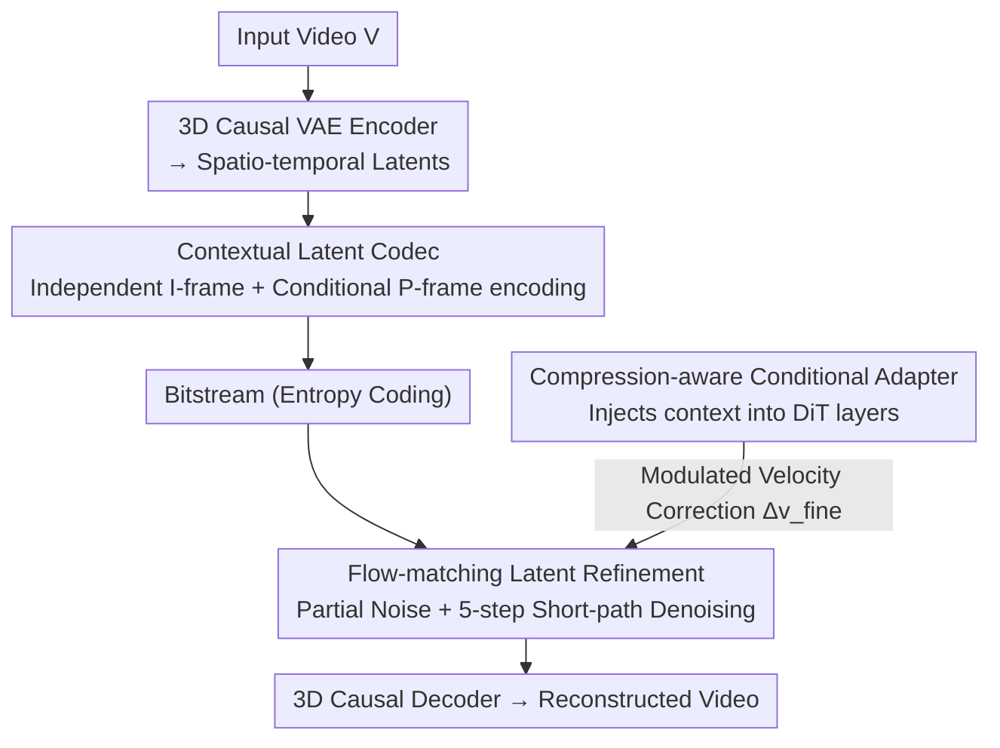

# Generative Neural Video Compression via Video Diffusion Prior

**Conference**: CVPR 2026  
**arXiv**: [2512.05016](https://arxiv.org/abs/2512.05016)  
**Code**: None  
**Area**: Video Generation  
**Keywords**: Video compression, video diffusion models, flow matching, perceptual quality, temporal consistency

## TL;DR

Ours proposes GNVC-VD, the first DiT-based generative neural video compression framework. By utilizing a video diffusion transformer as a video-native generative prior, it achieves spatio-temporal latent compression and sequence-level generative refinement within a unified codec. At ultra-low bitrates (<0.03 bpp), it significantly outperforms traditional and learned codecs in perceptual quality and substantially reduces flickering artifacts common in previous generative methods.

## Background & Motivation

1. **Background**: Neural video compression (NVC) has developed rapidly, with learned codecs like the DCVC series surpassing traditional standards such as HEVC and VVC in rate-distortion optimization. In the image domain, generative compression has successfully recovered high-frequency textures using pre-trained GANs or diffusion models, producing visually convincing reconstructions at extremely low bitrates.
2. **Limitations of Prior Work**: When bitrates drop to ultra-low levels (<0.03 bpp), distortion-driven objectives (like MSE) tend to over-smooth textures and erase fine structures. Crucially, existing perceptual video codecs (e.g., GLC-Video, DiffVC) integrate image-domain generative priors, which are inherently static and lack temporal modeling capabilities.
3. **Key Challenge**: Video requires strict temporal consistency. Codecs based on image generative priors struggle to capture long-range temporal structures, even when conditioned on adjacent frames. This causes reconstructed appearances to drift over time, resulting in significant perceptual flickering, which is particularly severe at ultra-low bitrates.
4. **Goal**: (a) How to introduce video-native generative priors into neural video compression? (b) How to perform sequence-level refinement in the spatio-temporal latent space instead of frame-by-frame enhancement? (c) How to adapt diffusion priors to degradations introduced by compression?
5. **Key Insight**: Video diffusion models (especially DiT architectures) learn spatio-temporal latent representations on large-scale video data, capturing appearance, motion, and long-range dependencies. This makes VDMs an ideal generative prior for video compression, redefining decoding as a sequence-level conditional denoising process.
6. **Core Idea**: Use a pre-trained VideoDiT (Wan2.1) as a video-native prior. Instead of denoising from pure Gaussian noise, the process starts from compressed spatio-temporal latent representations and performs flow-matching refinement, learning a correction term to adapt to compression degradations.

## Method

### Overall Architecture

GNVC-VD processes an input video $V \in \mathbb{R}^{(1+T) \times H \times W \times 3}$ as follows: (1) A 3D causal VAE encoder $\mathcal{E}$ (from Wan2.1) encodes the video into a spatio-temporal latent sequence $\boldsymbol{x}_1 = \{l_t\}_{t=1}^{1+T/4}$; (2) A **contextual latent codec** employs temporal conditional coding to compress the latent sequence into a motion-aware compact bitstream; (3) A VideoDiT-based **flow-matching latent refinement module** performs sequence-level generative denoising starting from the decoded (degraded) latents, where a **compression-aware conditional adapter** injects compression-domain context into the DiT to guide the correction of artifacts; (4) A 3D causal decoder $\mathcal{D}$ reconstructs the video. The entire pipeline tightly couples transform coding compression with diffusion generative refinement.

### Key Designs

**1. Contextual Latent Codec: Compressing latents into motion-aware bitstreams via temporal conditioning**

To save bits at ultra-low bitrates, it is essential to reduce redundancy between adjacent latent representations. This module splits the latent sequence along the temporal axis into two types: anchor latents $l_1$ (corresponding to I-frames) are compressed independently using a separate transform coding module, while subsequent predicted latents $\{l_t\}_{t>1}$ are conditioned on the previous decoded result $\hat{l}_{t-1}$ to encode only the "residual relative to the context." Specifically, $\hat{y}_t = \text{Quant}(g_a(l_t \mid f_{t-1}))$ and $\hat{l}_t = g_s(\hat{y}_t, f_{t-1})$, where $f_{t-1}$ is the temporal context feature extracted from $\hat{l}_{t-1}$. The quantized $\hat{y}_t$ is then entropy-coded. Following the logic of DCVC-RT, this ensures the output latents are compact, motion-aware, and temporally continuous, providing a starting point for refinement that is already "close to the data manifold."

**2. Flow-Matching Latent Refinement: Short-path denoising from compressed latents instead of pure noise**

Compression degrades latent representations. If $\boldsymbol{x}_c$ is a compressed latent, it can be seen as the original latent $\boldsymbol{x}_1$ plus a perturbation $\boldsymbol{e}$, i.e., $\boldsymbol{x}_c = \boldsymbol{x}_1 + \boldsymbol{e}$. Since $\boldsymbol{x}_c$ is already near clean data, full denoising from Gaussian noise is inefficient. Instead, partial noise is injected: $\boldsymbol{x}_{t_N} = t_N \boldsymbol{x}_c + (1-t_N)\boldsymbol{x}_0$ (with $t_N=0.7$), and refinement occurs only along the probability flow path from $t_N$ to 1. The target velocity field is decomposed into two terms:

$$\boldsymbol{v}_\tau = \underbrace{(\boldsymbol{x}_1 - \boldsymbol{x}_0)}_{\boldsymbol{v}_{\text{pre-train}}} - \underbrace{\frac{t_N}{1-t_N}(\boldsymbol{x}_c - \boldsymbol{x}_1)}_{\Delta \boldsymbol{v}_{\text{fine}}}$$

The first term $\boldsymbol{v}_{\text{pre-train}}$ is the velocity field learned by the pre-trained VideoDiT, which pulls the sample toward the video data manifold. The second term $\Delta \boldsymbol{v}_{\text{fine}}$ is a correction term specifically for compression degradations. Refinement is completed in $L=5$ steps of deterministic flow integration. This decomposition decouples "pre-trained general generative knowledge" from "compression-specific adaptation." Because VideoDiT is a video-native prior, refinement is performed jointly across the sequence, ensuring natural temporal consistency.

**3. Compression-aware Conditional Adapter: Injecting compressed context into DiT to recognize artifacts**

Directly using a pre-trained VideoDiT to refine compressed latents is sub-optimal because the distribution of compressed latents deviates from that of natural video latents. This adapter inserts conditional layers into the VideoDiT transformer blocks, feeding the context feature sequence $\{f_t\}_{t=1}^{1+T/4}$ to modulate internal representations. It essentially estimates the correction term $\Delta \boldsymbol{v}_{\text{fine}}$. This provides the diffusion model with "compression-domain prior knowledge," allowing it to understand the source of degradation and where to recover details, thereby aligning the generative prior with the compressed latent distribution.

### Loss & Training

A two-stage training strategy is adopted:

- **Stage I: Latent-level alignment**: $\mathcal{L}_{\text{latent}} = R(\hat{y}) + \lambda_r \|\tilde{\boldsymbol{x}}_1 - \boldsymbol{x}_1\|_2^2 + \mathcal{L}_{\text{CFM}}$, where $\mathcal{L}_{\text{CFM}}$ is the conditional flow matching loss. This ensures refined latents are consistent with ground truth latents on the diffusion manifold.
- **Stage II: Pixel-level fine-tuning**: $\mathcal{L}_{\text{pixel}} = R(\hat{y}) + \lambda_r(\|V - \tilde{V}\|_2^2 + \lambda_{\text{lpips}}\mathcal{L}_{\text{LPIPS}}(V,\tilde{V}) + \|\boldsymbol{x}_c - \boldsymbol{x}_1\|_2^2 + \|\tilde{\boldsymbol{x}}_1 - \boldsymbol{x}_1\|_2^2)$, incorporating LPIPS perceptual loss for end-to-end pixel-domain optimization.

This progressive strategy first bridges the gap between the codec latent space and the diffusion manifold before performing perceptual quality fine-tuning.

## Key Experimental Results

### Main Results

**Perceptual Quality Comparison (BD-Rate %, anchored to VVC, lower is better):**

| Method | HEVC-B LPIPS | MCL-JCV LPIPS | UVG LPIPS | UVG DISTS |
|------|-------------|--------------|----------|----------|
| GLC-Video | -79.1% | -74.8% | -60.0% | -10.3% |
| **GNVC-VD (Ours)** | **-89.4%** | **-90.8%** | **-86.5%** | **-96.1%** |

GNVC-VD achieves the best perceptual quality across all benchmarks and metrics, further reducing BD-Rate by 10-26 percentage points compared to GLC-Video.

**Temporal Consistency Comparison (HEVC-B):**

| Method | $E_{\text{warp}} \downarrow$ | CLIP-F $\uparrow$ |
|------|--------------------------|-------------------|
| GLC-Video | 86.5 | 0.979 |
| GNVC-VD (Ours) | 66.6 | 0.982 |
| HEVC | 23.3 | 0.982 |

### Ablation Study

| Configuration | HEVC-B BD-LPIPS | UVG BD-LPIPS | Description |
|------|----------------|-------------|------|
| Full model | 0 | 0 | Baseline |
| W/o Latent Refinement | +0.181 | +0.159 | Removed diffusion refinement, severe over-smoothing |
| W/o Stage I Loss | +0.016 | +0.016 | Removed latent alignment, worse detail recovery |
| W/o Stage II Loss | +0.252 | +0.242 | Removed pixel fine-tuning, most severe degradation |

### Key Findings

- **Diffusion refinement module provides the largest contribution**: Removing it leads to a +0.181 BD-LPIPS degradation and severe over-smoothing, proving that the video diffusion prior is core to perceptual quality.
- **Stage II pixel-level fine-tuning is indispensable**: Its removal causes the worst performance drop (+0.252), indicating that latent-space alignment alone is insufficient for optimal perceptual reconstruction.
- **Superior temporal consistency**: GNVC-VD’s $E_{\text{warp}}$ of 66.6 is significantly lower than GLC-Video’s 86.5. Texture drifting and flickering in GLC-Video are clearly visible in spatio-temporal visualizations.
- Traditional codecs (HEVC/VVC) have the lowest $E_{\text{warp}}$, but this is "false stability" caused by excessive smoothing.

## Highlights & Insights

- **First introduction of video-native diffusion priors to NVC**: By skipping the limited "image prior → video compression" path and using video diffusion models to capture spatio-temporal dependencies, the framework solves the flickering problem at its root. Using a sequence-level prior for a sequence-level problem is both natural and effective.
- **Partial denoising from compressed latents**: Utilizing compressed latents as initial points significantly reduces the number of denoising steps (only 5 needed) while maintaining the generative power to restore details. The formalization of the velocity field into pre-trained and correction terms is elegant.
- **Design of the two-stage training strategy**: Progressive alignment—first in the latent space and then in the pixel domain—addresses the distribution mismatch between the diffusion manifold and compressed latents, a scheme transferable to other tasks adapting pre-trained generative models.

## Limitations & Future Work

- **Computational Efficiency**: Diffusion refinement requires multiple steps (5), making decoding several times slower than traditional codecs and difficult for practical deployment.
- **Transform Coding Optimization**: The current contextual transform coding module could be further improved for higher efficiency.
- **Data and Sequence Length Constraints**: Training was limited to 13-frame Vimeo sequences; generalization to much longer videos is not fully verified.
- **Ultra-low Bitrate Focus**: Advantages at medium or high bitrates were not explicitly discussed.
- Accelerating diffusion refinement (e.g., via distillation or consistency models) is a vital future direction.

## Related Work & Insights

- **vs GLC-Video**: GLC-Video uses image diffusion priors for frame-by-frame enhancement, leading to texture drift. GNVC-VD uses video diffusion priors for sequence-level refinement, fundamentally addressing temporal inconsistency and leading in BD-Rate.
- **vs DCVC-RT**: DCVC-RT is a state-of-the-art learned codec but over-smooths at ultra-low bitrates. GNVC-VD adds diffusion refinement, improving BD-DISTS by 98% on UVG.
- This work demonstrates the immense value of video generative foundation models for compression, opening a new direction for "generative codecs."

## Rating

- Novelty: ⭐⭐⭐⭐⭐ First to bring video diffusion priors to NVC; elegant flow-matching refinement from compressed latents.
- Experimental Thoroughness: ⭐⭐⭐⭐ Comprehensive multi-benchmark comparison and ablations, though lacking analysis on medium bitrates or complex motion.
- Writing Quality: ⭐⭐⭐⭐ Clear technical path, rigorous derivations, and informative visualizations.
- Value: ⭐⭐⭐⭐⭐ Defines a new direction for next-generation perceptual video compression; the video-prior + codec paradigm is highly influential.

<!-- RELATED:START -->

## Related Papers

- [\[CVPR 2026\] DreamShot: Personalized Storyboard Synthesis with Video Diffusion Prior](dreamshot_storyboard_synthesis.md)
- [\[CVPR 2026\] LightMover: Generative Light Movement with Color and Intensity Controls](lightmover_generative_light_movement_with_color_and_intensity_controls.md)
- [\[CVPR 2026\] Real-Time Generation of Streamable Talking Portrait Video with Reference-Guided Deep Compression VAEs](real-time_generation_of_streamable_talking_portrait_video_with_reference-guided_.md)
- [\[CVPR 2026\] PropFly: Learning to Propagate via On-the-Fly Supervision from Pre-trained Video Diffusion Models](propfly_learning_to_propagate_via_on-the-fly_supervision_from_pre-trained_video_.md)
- [\[CVPR 2026\] PhysVid: Physics Aware Local Conditioning for Generative Video](physvid_physics_aware_local_conditioning_for_generative_video_models.md)

<!-- RELATED:END -->
