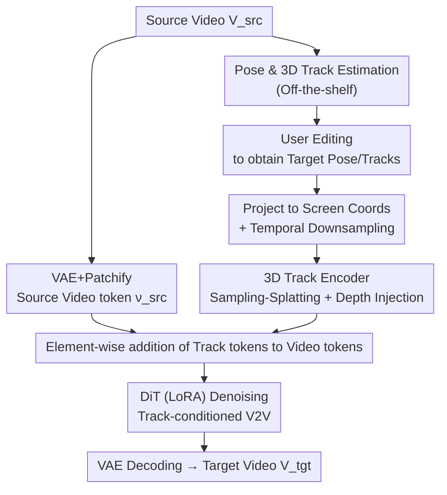

# Generative Video Motion Editing with 3D Point Tracks

**Conference**: CVPR 2026  
**Paper**: [CVF Open Access](https://openaccess.thecvf.com/content/CVPR2026/html/Lee_Generative_Video_Motion_Editing_with_3D_Point_Tracks_CVPR_2026_paper.html)  
**Code**: https://edit-by-track.github.io (Project Page)  
**Area**: Video Generation / Video Editing  
**Keywords**: Video Motion Editing, 3D Point Tracks, Video Diffusion, Video-to-Video, Camera and Object Motion

## TL;DR
This paper proposes **Edit-by-Track**: a V2V video diffusion model conditioned on a "source video + a pair of source/target 3D point tracks." By using 3D tracks to establish sparse correspondences between source and target, it enables simultaneous editing of camera perspective and object motion (including occlusion, depth ordering, and non-rigid deformation), outperforming existing I2V/inpaint-based methods on DyCheck and in-the-wild videos.

## Background & Motivation

**Background**: In controllable video generation, motion control generally follows two paths. One is camera-controllable V2V (e.g., ReCamMaster, GEN3C), which warps the input video according to the target camera pose and then uses a diffusion model for inpainting. The other is trajectory-conditioned I2V (e.g., ATI, DaS), which uses point tracks to represent both camera motion (background points) and object motion (foreground points), generating video starting from a single frame.

**Limitations of Prior Work**: Both approaches lack critical capabilities. Camera-controllable V2V is typically trained on "synchronized multi-view data," inherently assuming static object motion; attempts to modify object actions lead to incorrect secondary effects (e.g., changing a person's landing spot while splashes/shadows remain inconsistent with the new position, as shown in Fig. 2a). Conversely, trajectory-conditioned I2V uses only the **first frame** of the input video as a reference and discards subsequent frames, leading to a loss of context for the dynamic scene, which causes hallucinations and object distortions (Fig. 2b).

**Key Challenge**: Achieving precise joint "camera + object" editing requires both **complete scene context** (necessitating the full source video as a condition) and a motion representation that can **simultaneously express camera and object motion while being depth-aware** (to resolve occlusions and depth ordering). Existing methods favor one over the other.

**Goal**: Construct a V2V framework that takes the full source video and a pair of (source, target) 3D point tracks as input to generate a target video that faithfully preserves the original scene while modifying camera/object motion according to user intent.

**Key Insight**: The authors observe that 3D point tracks are a natural unified motion representation—they decouple scene-object motion from camera motion (background tracks encode the camera, foreground tracks encode objects). Compared to 2D tracks, they provide **explicit depth cues**, allowing the model to determine depth order and handle occlusions. By using "source track $\rightarrow$ target track" paired conditions, a sparse correspondence is established between the source and target videos, enabling the transfer of rich appearance context from the source video to the new motion.

**Core Idea**: Condition a V2V diffusion model with a pair of 3D point tracks (rather than a single frame or pure camera pose) and design a learnable "sampling-and-splatting" 3D track encoder to adaptively encode sparse 3D tracks into screen-space tokens aligned with video tokens.

## Method

### Overall Architecture
The goal is to generate a target video $V_{tgt}$ from a source video $V_{src}\in\mathbb{R}^{F\times H\times W\times3}$ reflecting user editing intent. The pipeline is as follows: first, off-the-shelf models estimate camera parameters $P_{src}$ and $N$ 3D point tracks $T_{src}\in\mathbb{R}^{F\times N\times3}$ for each frame of the source video. Users edit camera/object motion to obtain target parameters $(P_{tgt},T_{tgt})$. The source video is encoded into tokens $\nu_{src}$ via VAE+patchify and **concatenated** with noisy target tokens $\nu_{tgt}$ (providing full scene context). Simultaneously, the paired tracks are projected to screen coordinates, temporally downsampled, and fed into a **3D track encoder** to generate track tokens $[\tau_{src},\tau_{tgt}]$, which are **added element-wise** to the video tokens before entering a DiT for denoising. The model is fine-tuned using LoRA on the pretrained T2V model Wan-2.1 (1.3B, Rectified Flow, generating 81 frames).

### Key Designs

**1. 3D Track Encoder: Encoding Sparse 3D Tracks into Screen-Aligned Tokens via Learnable "Sampling-and-Splatting"**

This is the core contribution. Traditional methods either manually draw tracks into 2D screen space (intuitive but fails with high density or frequent occlusions) or encode motion values directly as features without screen alignment (handles many tracks but lacks precision and has scale ambiguity). The authors aim for a learnable, screen-aligned approach.

The mechanism consists of two cross-attention steps. **First step: Sampling**: 3D track $xyz$ coordinates are mapped to embeddings $\rho^{xyz}_{src}\in\mathbb{R}^{fN\times d}$ via positional encoding. Using source coordinate embeddings as queries, the model **samples** corresponding visual context for each track from source video tokens $\nu_{src}$, then performs temporal aggregation within each track using a Transformer:

$$\tau^{sampled}_{src}=\mathrm{Transformer}\big(\mathrm{Attn}(\rho^{xyz}_{src},\,G,\,\nu_{src})\big)$$

where the key $G\in\mathbb{R}^{fhw\times d}$ represents $xy$ grid coordinate positional encodings at $z=0$. **Second step: Splatting**: The sampled tokens carrying source appearance are "splatted" back into source and target frame spaces using source/target coordinate embeddings, resulting in aligned video tokens $[\tau_{src},\tau_{tgt}]\in\mathbb{R}^{2fhw\times d}$ (the inverse of sampling, where queries and keys are swapped):

$$\tau_{\{src,tgt\}}=\mathrm{Attn}\big(G,\,\rho^{xyz}_{\{src,tgt\}},\,\tau^{sampled}_{src}\big)$$

Cross-attention is selected over fixed nearest-neighbor methods (like TrajAttn) because it is robust to noisy and occluded 3D tracks and can handle a variable number of tracks. The attention bias from Tracktention was **removed** due to its sensitivity to noisy tracks. Additionally, since splatting only considers $xy$ positions, depth is not explicitly splatted. The authors inject 3D awareness by adding positional encodings of depth $\sigma^z_{\{src,tgt\}}$ to the sampled tokens before splatting (ablation shows this reduces End-Point Error, EPE). Notably, the model **does not use** visibility labels; it implicitly reasons about visibility and occlusion from the 3D tracks.

**2. Track-Conditioned V2V Architecture: Preserving Full Scene Context by Concatenating Source Video Tokens**

To address the limitation where I2V only "sees" the first frame, the authors encode the entire source video $V_{src}$ into latents $z_{src}$ and patchify them into source tokens $\nu_{src}$. These are concatenated with noisy target tokens $\nu_{tgt}$ as $[\nu_{src},\nu_{tgt}]\in\mathbb{R}^{2fhw\times d}$ for the DiT. This allows the model to access appearance and dynamics from the entire source video during denoising. Combined with paired tracks, the model establishes correspondences to move content from the source video to new positions, enabling the correct synthesis of causal secondary effects (e.g., shadows, splashes) that inpaint-based methods often fail to modify.

**3. Two-stage Training: Building Control via Synthetic Data and Generalizing via Real Monocular Videos**

Ideal training data (pairs of videos with identical content but different motions and ground-truth 3D tracks) is scarce. The authors use a two-stage approach. **Stage 1 (Synthetic Bootstrap)**: Pairs of videos with different actions/camera trajectories are rendered in Blender using Mixamo characters and Kubric backgrounds. Ground-truth 3D tracks are extracted from mesh vertices. This stage teaches the core capability of "motion control via tracks." **Stage 2 (Real Fine-tuning)**: To bridge the domain gap, **non-consecutive clips** (1–5 seconds apart) from the same monocular video are sampled as pairs. The natural motion within the video simulates joint camera-object changes and is highly scalable. 2,000 tracks are estimated as correspondences. Data includes 24K internal dynamic videos, DL3DV (static scenes with large camera motion), and object removal pairs. Training uses LoRA (rank=64) on Wan2.1-T2V-1.3B at $384\times672$ resolution.

## Key Experimental Results

### Main Results

On the DyCheck iPhone dataset (12 scenes, joint camera+object motion), reporting full-frame and masked (co-visible region) metrics:

| Method | Type | Privileged Info | PSNR↑ | SSIM↑ | LPIPS↓ | mLPIPS↓ |
|------|------|---------|-------|-------|--------|---------|
| ATI | I2V+track | GT First Frame | 13.67 | .371 | .468 | .312 |
| GEN3C* | V2V+inpaint | GT First Frame + Flow | 13.61 | .406 | .517 | .339 |
| TrajAttn+NVS* | IV2V+track+inpaint | GT First Frame + Flow | 13.94 | .416 | .549 | .351 |
| **Ours** | V2V+track | **None** | **14.80** | **.424** | **.406** | **.247** |

On in-the-wild videos (MiraData random 100), reporting FVD (visual quality) and EPE (track control error):

| Method | Base | Params | PSNR↑ | LPIPS↓ | FVD↓ | EPE↓ |
|------|------|-------|-------|--------|------|------|
| ATI | Wan | 14B | 19.07 | .244 | **268.80** | 11.44 |
| DaS | CogVX | 5B | 18.15 | .315 | 393.32 | 17.92 |
| **Ours** | Wan | **1.3B** | **19.55** | **.236** | 306.44 | **6.12** |

Notably, the **1.3B model outperforms the 14B ATI in visual quality and motion control**. ATI achieves lower FVD due to GT first frames and a larger base, but fails to maintain context or follow tracks precisely (EPE 11.44 vs. Ours 6.12).

### Ablation Study

**3D Track Encoding (Table 3, DyCheck / In-the-wild)**:

| Sampling Type | 2D/3D | Depth Injection | PSNR↑(DyCheck) | LPIPS↓ | EPE↓(wild) |
|----------|-------|---------|------|------|------|
| Naïve (Fixed Gaussian) | 2D | | 13.42 | .489 | 16.18 |
| Cross-Attention | 2D | | 13.88 | .415 | 7.03 |
| Cross-Attention | 3D | | 14.82 | .395 | 7.44 |
| Cross-Attention | 3D | ✓ | 14.80 | .406 | **6.12** |

**Training Strategy (Table 4)**:

| Synthetic | Real | Two-stage | PSNR↑(DyCheck) | LPIPS↓ | EPE↓(wild) |
|------|------|--------|------|------|------|
| ✓ | | | 9.61 | .706 | 24.64 |
| | ✓ | | 10.62 | .669 | 63.98 |
| ✓ | ✓ | (Single-stage) | 13.34 | .483 | 6.93 |
| ✓ | ✓ | ✓ | **14.80** | **.406** | **6.12** |

### Key Findings
- **Switching from Naïve Gaussian to adaptive cross-attention** provides the largest single-point improvement (DyCheck PSNR 13.42→13.88, EPE 16.18→7.03), confirming the necessity of adaptive sampling for noisy/occluded tracks.
- **2D to 3D tracks** primarily improves scores on DyCheck (large viewpoint changes), as depth cues help resolve occlusions. **Depth $z$ embedding injection** primarily reduces control error (EPE 7.44→6.12).
- **Two-stage training is indispensable**: Synthetic-only training collapses due to domain gap; real-only training fails to learn track control. Even single-stage mixed training is inferior to the sequential approach.

## Highlights & Insights
- **The "sampling-splatting" paradigm is elegant**: Explicitly splitting "appearance extraction" from "re-projection" into two cross-attention steps effectively performs a learnable, differentiable sparse warp in latent space.
- **Using non-consecutive clips from monocular videos as training pairs** is a clever solution to the lack of paired editing data, providing scalable joint camera-object variations.
- **Implicitly reasoning about occlusion** by omitting visibility labels bypasses the difficulty of defining visibility after 3D transformations.
- **Better conditioning beats larger models**: A 1.3B model outperforming a 14B model suggests that the completeness and precision of conditional information is often more efficient than parameter scaling in controllable generation.

## Limitations & Future Work
- Visual context extraction and motion control degrade when point tracks are **densely clustered** (especially for small objects).
- The model struggles to synthesize **complex physical phenomena** (secondary effects) triggered by edited motions, reflecting limited physical grounding in current diffusion priors.
- Evaluation relies on pseudo-GT pairs from monocular clips; absolute PSNR (~19.5 on wild data) suggests room for improvement in pixel-level fidelity.

## Related Work & Insights
- **vs ATI / DaS (Trajectory-conditioned I2V)**: These generate from a single frame; Ours uses the full source video to preserve context and achieves lower EPE with a smaller backbone.
- **vs GEN3C / TrajCrafter (Camera-controllable V2V + inpaint)**: These only edit perspective and fail to modify object-related secondary effects; Ours enables joint editing.
- **vs Tracktention / TrajAttn**: Ours adapts coordinate cross-attention for noisy tracks and extends it to 3D with depth injection.

## Rating
- Novelty: ⭐⭐⭐⭐⭐ First V2V framework for joint camera+object editing using paired 3D tracks; novel "sampling-splatting" design.
- Experimental Thoroughness: ⭐⭐⭐⭐ Solid results on DyCheck and in-the-wild data, though limited by the lack of real paired GT.
- Writing Quality: ⭐⭐⭐⭐⭐ Clear progression of motivations and excellent visual explanations of mechanisms.
- Value: ⭐⭐⭐⭐⭐ Unlocks complex editing tasks beyond current methods; demonstrates high efficiency with a 1.3B parameter model.

<!-- RELATED:START -->

## Related Papers

- [\[CVPR 2026\] MotionV2V: Editing Motion in a Video](motionv2v_editing_motion_in_a_video.md)
- [\[CVPR 2026\] 3D-Aware Implicit Motion Control for View-Adaptive Human Video Generation](3d-aware_implicit_motion_control_for_view-adaptive_human_video_generation.md)
- [\[CVPR 2026\] EditCtrl: Disentangled Local and Global Control for Real-Time Generative Video Editing](editctrl_disentangled_local_and_global_control_for_real-time_generative_video_ed.md)
- [\[CVPR 2026\] RecEdit-Drive: 3D Reconstruction-Guided Spatiotemporal Video Editing for Autonomous Driving Scenes](recedit-drive_3d_reconstruction-guided_spatiotemporal_video_editing_for_autonomo.md)
- [\[CVPR 2026\] FlexTraj: Image-to-Video Generation with Flexible Point Trajectory Control](flextraj_image-to-video_generation_with_flexible_point_trajectory_control.md)

<!-- RELATED:END -->
